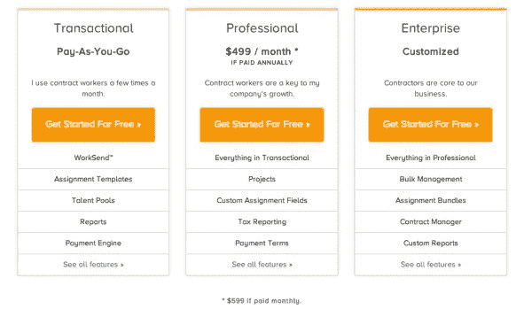

# 透视企业软件的未来——AVC

> 原文：<http://avc.com/2015/01/a-lens-into-the-future-of-enterprise-software/?utm_source=wanqu.co&utm_campaign=Wanqu+Daily&utm_medium=website>

我已经在我们的投资组合公司工作了四年。作为企业，这是我真正的学习经历，而 SAAS 从来都不是我的强项。我们被劳动力市场所吸引，因为顾名思义，他们使用市场模式来帮助企业完成工作。具体来说，他们创造了[自由职业者管理系统市场](http://workforce-solutions.workmarket.com/SIA-FMS-Freelancer-Management-System-Report.html)，并且是该市场的领导者。我们喜欢内置网络效应的软件，因为[更难商品化](https://avc.com/2014/07/the-dentist-office-software-story/)。在我们看来，企业软件应用程序中的自由工作者市场正是如此。这是真的。但是在这个过程中，我们学到了很多其他的东西:

1)移动很重要。我在我的[刚刚发生的事情](https://avc.com/2014/12/what-just-happened/)帖子中提到，移动开始真正影响企业软件业务。

在就业市场，自由职业者希望在手机上找到工作，接受工作，并完成工作。因此，移动应用程序开发已经成为工作市场工程团队工作的一个重要部分。在某种程度上，企业可能也想在他们的手机上发布工作指令。

2)免费增值和交易业务模式在企业中的效果与在消费者中的效果一样好。工作市场有一个免费层,为那些想要尝试该系统或计划成为临时用户的企业提供交易收入模式。

[T2】](https://avc.com/wp-content/uploads/2015/01/WM-pricing.jpg)

我们知道“免费增值 SAAS”适用于 Dropbox、Slack、Google Apps 等横向企业应用，我相信我们将开始看到免费增值 SAAS 模式也适用于纵向应用。我们已经是了。

3)企业应用如果想扩展到最大的企业，也必须是平台。Salesforce 是这一趋势的典型代表。他们已经成为 SAAS 应用程序的一个非常强大的平台和分发合作伙伴。但是每个 SAAS 应用程序都应该有 API，允许它们的用户将企业软件连接在一起。劳动力市场可以与企业用于管理人才的其他大型应用程序(人力资源、虚拟机等)进行对话，这是最大交易的一项要求。这将很快成为所有交易的要求。

我看到一批新的 SAAS 公司开始起步，他们的整个价值主张都建立在过去几年中大多数企业 SAAS 产品发布的开放 API 之上。如果您在财务、人力资源、市场营销或销售部门，您现在正在使用大量 SAAS 应用程序来完成工作，市场上的一个大趋势是新应用程序将所有这些应用程序(通过 API)结合在一起，以便您可以通过单一视图了解您的工作流程。这就是 SAAS 的“平台化”,它就在我们面前。

对我来说，最大的收获是，我们在消费者网络和移动软件中看到的所有事情都发生在企业中，并且已经感受到了其影响。我在工作市场上看到了这一点，幸运的是，他们最近才开始起步，他们已经能够在走向市场和建立业务时利用所有这些趋势(市场、移动、云、免费增值、平台)。这就是为什么[我们最近领导了一轮增长](http://www.marketwired.com/press-release/Work-Market-Closes-20-Million-in-Growth-Capital-1984731.htm)来帮助 Work Market 的新任首席执行官 [Stephen DeWitt](https://twitter.com/swdoutloud) 进入他们几年前创造的自由职业管理系统市场机会。