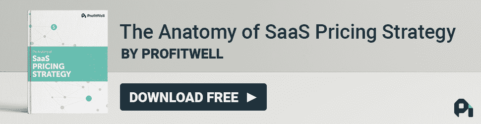
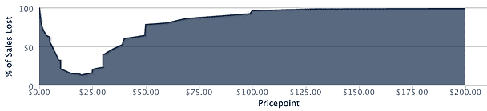
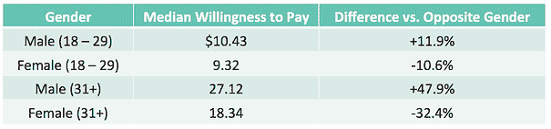

# 为什么 Tinder 对老年用户收费更高，为什么这很有意义

> 原文：<http://www.priceintelligently.com/blog/why-tinders-charging-older-users-more-and-why-it-makes-perfect-sense?utm_source=wanqu.co&utm_campaign=Wanqu+Daily&utm_medium=website>

 上周，著名的约会应用 Tinder 大张旗鼓地首次涉足高级计划。现在，这个合法撮合的天堂，以及我们在 Price 聪明地喜欢称之为“亲密定价会议”的地方，允许你在世界各地的任何人身上向左或向右滑动，甚至改变你的想法——所有这些都是收费的。

如果你不知道我在说什么，没关系。本质上，一款风靡 30 岁及以下人群的免费约会应用推出了一些高级功能。但这一备受期待的推出遇到了一些反感，因为用户发现 Tinder 根据年龄收取不同的价格:30 岁以下的人每月收费 9.99 美元，30 岁以上的人每月收费 19.99 美元。

T2】

对该公司举措的批评者大声疾呼这是犯规的(并对这一想法大打出手——好的...我们将停止刷卡双关语)，声称该公司违反了价格歧视法。然而，正如我们在[上一篇关于价格歧视的文章](//www.priceintelligently.com/blog/bid/198355/How-to-Implement-a-Dynamic-Pricing-Strategy-Without-the-PR-Backlash)中所写的，当涉及到网上交易的价格歧视时，这条线显得有些灰暗。虽然我们不是律师，但我们确实发现基于年龄收费的做法很有趣，尤其是因为我们过去的研究明确显示，年龄较大和较年轻的消费者愿意以不同的水平付费。

我们的兴趣引导我们做我们擅长的一件事——收集一些数据并分析 Tinder 是否做出了明智的举动(我们发现他们 非常 非常多， ***因为他们在可量化的层面上了解他们的买家角色*** )。让我们浏览这些数据，说明为什么这对 Tinder 来说是一笔潜在的横财，同时为你自己的[定价策略](/blog/bid/163986/a-complete-guide-to-pricing-strategy)总结经验。

[T2】](https://www.priceintelligently.com/developing-your-saas-pricing-strategy?utm_campaign=content_recommend_static&utm_content=banner_static_ebook_pricing)

# 让我们在获取 Tinder 的价格

因为 Tinder 是增长最快的应用之一，所以为我们的算法寻找回答者并不困难。为了让任何 价格跟上英特尔博客处女 的速度，我们的软件会询问范围广泛的定价问题，随后在一个样本中处理这些答案，以查看该特定群体的[价格弹性](/blog/bid/154374/price-elasticity-101-the-necessities-and-your-pricing-strategy)。迄今为止，我们已经在数百万份回复中验证了这一点，所以我们知道，只要我们有足够多的受访者，我们就相当准确(更多关于衡量价格敏感度的，以防你好奇)。

这是我们发给全美数百名 Tinder 用户的实际调查，我们询问了他们的年龄、性别和定价问题。

我们的发现非常有趣。在对数据进行分析后，我们发现 Tinder 对这两个用户群进行不同的定价是完全合理的，并且可能会给他们的定价结构增加更多的差异。

年龄在 18 至 29 岁之间的人愿意每月支付 8.44 至 10.36 美元，中间价位接近 10 美元。关于这些愿意支付的数字，有趣的是，其中一些人愿意支付更多的钱，高达每月 20 美元。

我们的老一代人愿意支付更宽、更高的价格范围，大约是每月 25 美元。这个数据特别有趣的是，有些人愿意每月支付 50 美元来购买该产品。

T2】

我们还根据性别划分了数据，我们发现男性的支付意愿远高于女性，年轻和年长群体的支付意愿中位数分别高出 11.9%和 47.9%。这不应该是一个巨大的惊喜，因为 Tinder 的一个重要角色是 Hank，他可能会在旅行前寻找特别的人(你通常只能在你 50 英里内的人身上左右滑动)。

酷毙了。Tinder 的这种差异化定价并没有完全失控，但为什么这对你和 Tinder 的整体定价策略很重要？嗯，这归结为两件大事:(1)扩展到多价格思维的机会，以及(2)利用同一角色的差异。

## 你有不止一种类型的客户；您应该有不止一种定价类型

我们以前写过关于多价格思维的文章，但基本前提是，如果你只有一个价格，你很可能会损失一大笔钱，尤其是像 Tinder 这样有数百万用户的情况下。这是因为你会注意到，在这些弹性曲线上，并不是每个人都只愿意支付一个价格。事实上，很大一部分市场愿意支付两倍于中间价位的价格。

利用这一点意味着 Tinder 不仅有机会根据年龄、性别、地点等进行价格歧视。，但也可以[添加具有不同功能的附加层](//www.priceintelligently.com/blog/move-to-tiers)从用户那里获取更大份额的钱包，特别是那些愿意为 Tinder 提供的任何东西付费的个人，可能包括基本的免费应用程序。

这种做法的不利之处在于，Tinder 希望让用户升级的事情尽可能简单，但这受到了多层的阻碍，这就是为什么潜在违反灰色价格歧视法可能是他们的最佳选择(下文将详细介绍)。

***长话短说——除非您的每一个客户都完全相同，否则您需要使用多个层级来尽可能多地满足需求。**T3】*

# 甚至同一个角色也可能有不同的价格敏感度

除了为人物角色提供[一系列与众不同的功能选项，你会发现你的许多相同的客户人物角色很可能愿意支付不同的金额。例如，一个刚刚起步的非常小的创业公司比一个在相同水平上使用该产品的企业公司有不同的支付意愿。](//www.priceintelligently.com/blog/bid/194501/The-Crucial-Steps-to-Actually-Quantifying-Your-Customer-Personas)

这是一个非常令人沮丧的问题，因为如果你的人物角色之间的唯一区别是他们的预算，那么通常你必须选择一个或另一个来关注。另一种方法是尝试找到一种特性、价值衡量标准或附加产品，使您能够与更愿意付费的客户区分开来(如上所述)，但这可能非常困难。

Tinder 通过直接向这些群体收取不同的费用来解决这个问题。通常情况下，当公众发现这一点时，它会变成非常糟糕的公关，Tinder 在过去的一周里变得有点糟糕。这主要是因为即使年长的人愿意支付更多，他们也不愿意 知道 他们愿意支付更多。

最终，我们为大多数应用解决这一问题的方法是，出于特定的原因，迫使这些特定的组进入更高的层，例如，“我们所有的企业客户都需要这一 SLA。没有例外”或“30 岁以上的人群需要付更多的钱，这样我们就能找到更多 30 岁以上的人。”虽然不是每个人都会喜欢这些理由，但这种透明度是值得赞赏的，并且避免了亚马逊、Orbitz 和现在的 Tinder 所经历的反弹。

***底线:相同的人物角色会愿意支付不同的金额，但你应该谨慎行事，不要在没有利用特色差异的情况下进行价格歧视。**T3】*

# 然而，Tinder 很大，所以也许没人会在意

消费者从未在网上价格歧视案件中胜诉，主要是因为证明“歧视”毫无疑问是极其困难的。虽然没有像 Tinder 这样明目张胆的案例，但我相信如果需要的话，他们的公司律师都准备好了，特别是因为有很多跨国定价的先例。

虽然在选择价格歧视之前，在定价方面还有更多基本问题需要解决，但一定要确保你用直接来自客户的数据来支持你的决策。这是一个决定，我们肯定可以“向右滑动”(抱歉，忍不住#dadjoke)。

[T2】](https://www.priceintelligently.com/developing-your-saas-pricing-strategy?utm_campaign=content_recommend_static&utm_content=banner_static_ebook_pricing)