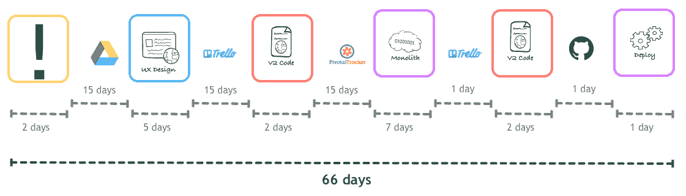
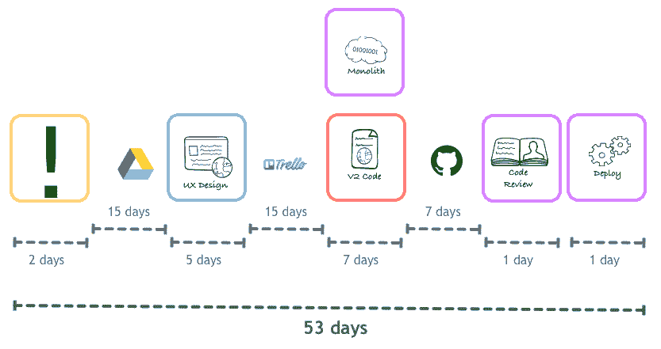
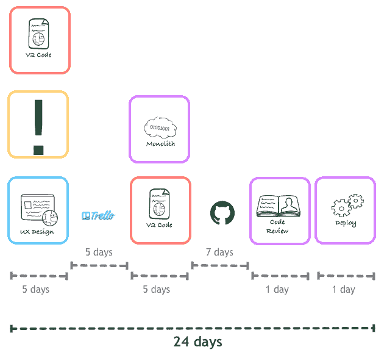
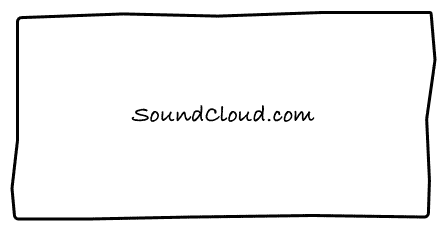
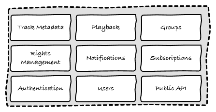
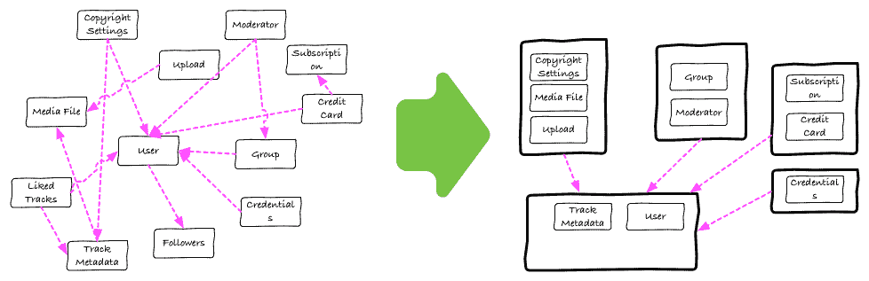
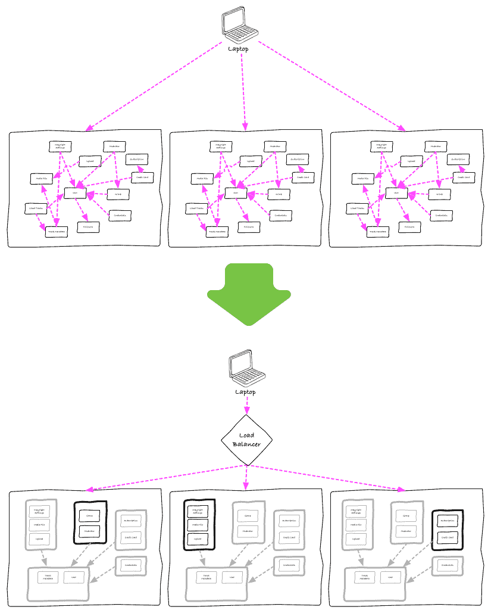
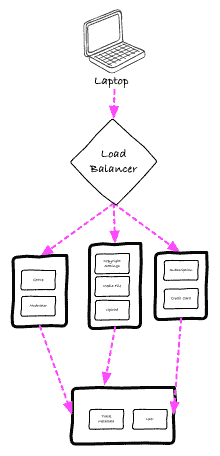
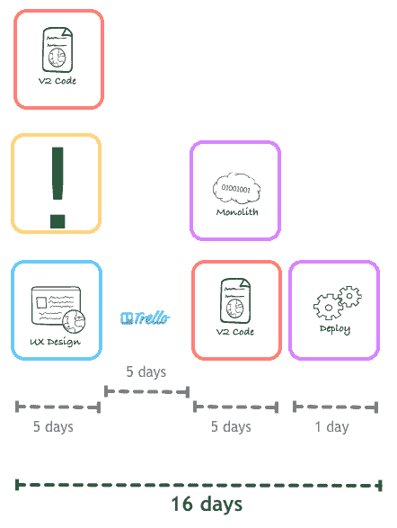

# 我们如何结束微服务。

> 原文：<http://philcalcado.com/2015/09/08/how_we_ended_up_with_microservices.html?utm_source=wanqu.co&utm_campaign=Wanqu+Daily&utm_medium=website>

微服务是这年头的事了。

当我在 SoundCloud 的时候，我负责从一个单一的 Ruby on Rails 应用程序到一系列微服务的迁移。我已经多次讲述了这个故事的技术方面，既有《T2》的演示文稿，也有《T4》作为 SoundCloud 的工程博客的多部分系列。这些工程细节是人们最感兴趣听到的，但最近我意识到我从未向更广泛的观众解释过我们是如何开始使用微服务的。

我很抱歉让我的技术伙伴们失望了，但是我们迁移到微服务的原因不仅仅是纯粹的技术问题，更多的是生产力问题。我会解释的。

**注意:**这篇帖子绝对有很多[修正主义](https://en.wikipedia.org/wiki/Historical_revisionism)，而且，为了让它更容易理解，把一系列相当混乱的事件简化成了一条线性时间线。然而，我相信它描绘了我在 SoundCloud 最初几年的美好画面。

## 下一个项目

 *当我刚加入公司时，我们最重要的项目是我们内部称之为 *v2* 的项目。这是对我们网站的一次彻底改造，它以品牌名 [*发布，下一个音云*](https://blog.soundcloud.com/2012/05/09/next/) 。

我先加入后端团队， *App 团队*。我们负责我们的单片 Ruby on Rails 应用程序。那时候我们不叫它遗产，我们只叫它*母舰*。应用团队拥有 Rails 应用中的一切，包括旧的用户界面。*接下来的*是[一个单页 JavaScript web 应用](https://developers.soundcloud.com/blog/building-the-next-soundcloud)，我们遵循了[当时的标准实践](https://blog.twitter.com/2010/tech-behind-new-twittercom)并将其构建为[我们的公共 API](http://www.slideshare.net/pcalcado/pcalcado-gotoberlin2013-27296652) 的常规客户端，该 API 在 Rails monolith 中实现。

这两个团队，App 和 Web，实际上是孤立的——我们甚至住在柏林的不同建筑里。我们几乎只在全体会议上见过面，我们的主要交流工具是问题跟踪器和 IRC。然而，如果你问任何团队的任何人我们的开发过程是如何工作的，他们会这样描述:

1.  有人对某个功能有了想法，他们写了几段文字，画了一些模型。然后我们作为一个团队来讨论它。
2.  设计师塑造用户体验。
3.  我们写代码。
4.  经过一点测试，我们部署。

但不知何故，空气中弥漫着一股挫败感。工程师和设计师抱怨他们工作过度，但同时产品经理和合作伙伴抱怨他们永远不能按时完成任何事情。

作为一家小型消费者企业，我们真的需要确保我们是尽可能多的公司的发布合作伙伴(你知道，苹果和谷歌在发布新产品时会在幻灯片上展示这些合作伙伴)，因为这意味着自由的媒体和增长。我们也真的需要在圣诞节前发布 *Next* 的私人测试版，否则假期季节会将我们所有的计划推迟到新年的第二季度，因为我们不希望在新网站上线之前发布任何新功能。为了赶上主题演讲幻灯片，并确保我们不会浪费整整一个季度的功能发布时间，我们需要开始在一些截止日期前做出改变。

这是我们决定尝试并确切理解我们的有机生长过程已经变成什么的时候了。

## 进程黑客

在加入 SoundCloud 之前，我已经做了很多年的顾问，我从这段黑暗的过去中获得的最有价值的工具之一就是创建*价值流图*的概念。我不会用这个技术的*为什么*和*如何*来烦你，但是如果下面描述的过程听起来很有趣，至少现在你知道谷歌搜索什么了。

通过与不同工程师的非正式访谈以及从我们的多个自动化系统中收集数据，我们能够绘制出我们的*实际流程*的地图，这与我们自认为拥有的流程相反。我不能向您展示实际的文档，但它与下面的虚构示例相差不远:

*实际的*流程是这样的:

1.  有人想出了一个创意。然后，他们编写一个相当轻量级的规范，带有一些屏幕模型，并将其存储在 Google Drive 文档中。
2.  在有人有时间对其进行实际操作之前，该规范将保留在文档中。
3.  非常小的设计团队会得到规范并为其设计用户体验。这将成为网络团队拥有的 Trello 板上的一张卡片。
4.  这张卡会在 Trello 板上放置一段时间，至少 2 周一次，直到工程师有空拿起它。
5.  工程师将开始着手这项工作。在使用假/静态数据将设计转换为基于浏览器的适当体验之后，工程师将写下他们需要在 Rails API 中进行哪些更改才能让这种体验发挥作用。这将进入 Pivotal Tracker，这是应用程序团队的首选工具。
6.  这张卡片会放在 Pivotal 上，直到应用团队中的某个人有空查看它，这通常需要另一个两周的迭代。
7.  应用团队成员将编写代码、集成测试和 API 上线所需的一切。然后他们会更新 Trello 的问题，让网络团队知道他们的部分已经完成。
8.  更新后的 Trello 卡会在 backlog 中多待一段时间，等待 Web 团队中的工程师完成他们开始做的事情，同时等待后端工作。
9.  Web 团队开发人员将使他们的客户端代码与后端实现的任何缺陷相匹配，并为部署开绿灯。
10.  由于部署是有风险的、缓慢的和痛苦的，应用程序团队在将它部署到生产之前，会等待几个特性进入主分支。这意味着特性会在源代码控制中停留几天，而且你的特性经常会因为一个完全不相关的代码部分的问题而被回滚。
11.  在某种程度上，该特性最终被部署到生产中。

当人们需要澄清或提出更好的想法时，这些步骤之间会有大量的来回，但现在让我们忽略这一点。

总的来说，一个功能大约需要两个月才能上线。更糟糕的是:这段时间的一半以上都花在了等待时间上，也就是说，一些正在进行的工作等待着工程师来处理。

像上面的地图这样的工具可以很容易地发现一个人的过程中明显怪异的步骤。通过观察，我们发现了一个唾手可得的果实，那就是我们应该为巨石柱采用一个*释放系统*。我们不会等到有了足够的特性来进行部署，而是每天在 standup 之后就开始部署，不管 master 中有多少特性。这离持续部署还很远，但是稍微缩短了我们的周期:

唾手可得的果实是巨大的动力驱动，但是在我们的案例中，房间里的主要大象显然是前端和后端开发之间的所有舞蹈。

我们在 Web 和应用程序团队之间分工的方式完全让后端开发人员脱离了实际的产品。他们会感到沮丧，觉得自己对产品根本没有发言权。人们的感觉是，他们只是“被像素推手”告知要做什么。在一个有经验的开发人员供不应求的市场上，这样对待你的团队并不明智。

但是我们今天要关注的问题是，在花在工程上的 47 天中，只有 11 天在做实际工作。其余的浪费在排队和一般的等待时间。

关于等待一个新的迭代所导致的等待时间有多少值得一提，但是即使转移到一个无迭代的过程，比如看板的变体，也不能帮助减少这么多。

然后，我们决定做一些有争议的事情:将后端和前端开发人员配对，并让这一对完全致力于某个功能，直到它完成。我们只有 8 个后端到 11 个前端工程师，所以围绕这个策略的争论是由于我们需要让前端开发人员在前端做尽可能多的工作，以便后端人员在每个特性上花费尽可能少的时间。这种设置很直观，但是流程图告诉我们，它实际上是非常反生产的。即使不考虑前端和后端开发人员之间的来回交流，我们仍然有太长的等待时间，直到某些东西真正投入生产！

我们决定先用一双鞋试一下，随着时间的推移扩展到其他鞋上。新流程是这样的:

就个人而言，每个人最终在每个功能上花费更多的时间。不过，这是不相关的，因为他们同时工作，他们能够在比以前少得多的时间内完成端到端的编码。这里的警告是，考虑到后端开发人员不像以前那样接近应用团队的其他成员，有一个强制性的代码审查(又名。 *Pull Request* 变更落地到 Rails app 主分支之前所需的流程。

这种减少是相当了不起的，我们决定在这个过程的其他步骤中尝试做同样的事情。我们让设计师、产品经理和前端开发人员在一个特性的概念上紧密合作，周期时间减少得更多:

相当坚实的削减在这里。有了更短的工作流程，我们可以轻松地在最后期限之前[发布*下一个*的第一个版本。我们不断迭代来自不同学科的人的组合，最终形成了今天 SoundCloud 应用的*功能团队*结构。但这是另一天的主题，现在我们需要关注长拉请求队列是怎么回事。](http://techcrunch.com/2012/12/04/soundcloud-revamps-site-announces-new-numbers-180m-users-and-counting/)

## 从母舰到遗产

加入 SoundCloud 最让我兴奋的事情之一是工程文化。大部分听起来和我在 ThoughtWorks 项目中使用的非常相似，但是有一个方面对我来说是全新的:*强制代码审查*。

这是 2011 年，所有的初创公司都试图复制 GitHub 模式，扎克·霍尔曼的 [*演讲很好地总结了 GitHub 如何使用 Github 来构建 GitHub*](http://zachholman.com/talk/how-github-uses-github-to-build-github/) 的方式。在使用和提倡基于主干的开发*这么多年后，我迫不及待地想看看像 SoundCloud 和 Github 这样成功的公司是如何使用这种非常不同的方法的。*

 *那时，应用团队中的所有工程师都会围坐在同一张桌子旁，分担相同的积压任务，并且通常彼此非常亲近。这个庞然大物的代码基础已经陈旧、成熟、乏味。在整个代码库中，我们都遵循相同的原则和模式，提交只是推断现有的设计，不会带来任何惊喜。这使得拉取请求过程基本上成了一种形式，人们会花不到一个小时来审查提交。

随着越来越多的人离开这个紧密结合的团队，与来自 Web 团队的人一起开发 *Next* 特性，非正式的交流渠道被打破了。由于对正在部署的内容或某些功能是如何设计的误解而导致的有问题的部署变得频繁起来。正如人类经常发生的那样，在经历了太多这样的情况后，我们决定解决方案是围绕合并变更执行一个更严格的过程。从现在开始，在提交到主分支并最终部署之前，所有的更改都必须得到第二个工程师的“正式”批准。

如上图所示，这导致了对生产的拉取请求的长时间等待。为了解决这个问题，我们采取的第一步是让每个人每天至少花一个小时来审查来自团队外部的拉请求——也就是说，来自处理下一个的*的人。这并没有减少太多的队列，最终我们意识到一些较小的拉动请求被许多人审查，而最大的拉动请求(以及来自下一个*的*的拉动请求通常很大)没有被任何人审查，直到一个产品经理对团队大喊大叫。较大的更改需要大量的时间来审核，而且由于我们的 Rails 代码的意大利面条性质，风险很大。人们像躲避瘟疫一样躲避这些大的拉取请求。*

我们聚在一起，决定开发 *Next* 特性的开发人员将他们的工作分成更小的、更易管理的拉请求。这样做很好，因为每个 Pull 请求都会被快速地审查和合并，但同时，将单个特性人为地分解成更小的 Pull 请求会使审查者只见树木不见森林:有时一连串良好的提交隐藏了一个危险的架构错误。我们认识到需要更好的用户故事，但培训我们的员工需要一段时间，我们需要一个短期的解决方案来维持业务。

决定采用书中最古老的技巧:*配对*。看，我们的要求是代码应该由另一个开发人员审查。通过结对编程，我们可以随时进行实时审查，这意味着每次提交都是自动的 *+1* 。大多数人对结对感到满意，那些不满意的人可以选择继续自己工作，但只能做与*下一个*项目无关的任务。

我们开始用几双鞋来尝试，但是一个有趣的问题阻止了我们。事实证明，我们拥有的单片代码库是如此之大，如此之广，没有人知道它的全部。人们围绕应用程序的子模块开发了他们自己的专业知识和监管领域。当一对搭档拿起一张牌来玩时，很可能这对搭档没有足够的关于那部分代码库的知识，所以他们必须要么等专家有空的时候和他们交换一对，要么选择另一张通常优先级较低的牌。两种选择都不好。

该公司的一个迷因是*“一切都是有趣的游戏，直到有人不得不触摸这块巨石”*。

## 整块巨石不可简化的复杂性

为了将我们的交付周期缩短 8 天，我们需要后退一步，问自己为什么一开始就需要这些拉动式请求。随着我们对自己的过程了解得越来越多，我们的思维进化成这样:

1.  为什么我们需要拉取请求？因为我们从多年的经验中知道，经常有足够多的人犯愚蠢的错误，推动变革，并使整个平台停机几个小时。
2.  为什么人们会经常犯错？因为代码库太复杂。很难把所有事情都记在脑子里。
3.  *为什么代码库这么复杂？*因为 SoundCloud 一开始是一个非常简单的网站，但随着时间的推移，它成长为一个大型平台。我们有许多功能、各种不同的客户端应用程序、非常不同的用户类型、同步和异步工作流以及巨大的规模。代码库实现并反映了一个复杂平台的许多组件。
4.  为什么我们需要一个代码库来实现众多组件？因为[范围经济](https://en.wikipedia.org/wiki/Economies_of_scope)。母舰已经有一个很好的部署流程和工具，有一个经过战斗考验的架构来对抗峰值性能和 DDOS，易于水平扩展，等等。如果我们构建新系统，我们将不得不为每个新系统构建所有这些。
5.  为什么我们不能为多个更小的系统实现规模经济？嗯…

第五个问题花了一点时间来回答。我们的集体经验和对同行的调查表明，可能有两种选择:

*   (A) *为什么我们不能为多个更小的系统实现规模经济？*不是我们不行，只是不会像把所有东西都放在一个代码库中那么高效。相反，我们应该围绕 monolith 和它的开发者可用性构建更好的工具和测试。这就是脸书和伊茨所做的。
*   (B) *为什么我们不能为多个更小的系统实现规模经济？*我们可以。我们需要做一些实验来找出我们需要什么工具和支持。此外，根据我们构建的独立系统的数量，我们还需要考虑[的规模经济](https://en.wikipedia.org/wiki/Economies_of_scale)，但这就是网飞、Twitter 和其他公司构建系统的方式。

每种方法都有其支持者，听起来没有明显的对错。最大的问题是每种方法需要多少努力。资金和资源不是问题，但我们没有足够的人或时间投资任何大项目。我们需要一个可以逐步实施的战略，但要从一开始就提供价值。

我们又看了看手中的东西。我们总是认为我们的后端系统非常简单:

这种思维方式使得将这个大盒子作为一个整体来实现变得显而易见。然而，正如我们在自我反省中发现的，事情并不像上面的图片让你相信的那么简单。实际上，如果你打开那个黑盒，你会发现我们的系统更像下图(非常简单):

我们没有单一的网站，我们有一个包含多个组件的平台。每个组件都有自己的所有者和利益相关者，以及独立的生命周期。

例如， *subscriptions* 模块只构建过一次，只有当我们的支付网关要求我们更改流程中的某些内容时才会被修改。另一方面,*通知*和其他与增长和保持相关的模块将遭受日常变化，因为我们年轻的初创公司试图获得更多的用户和内容。

他们对服务水平的期望也大相径庭。如果我们一个小时没有通知，没有人会死，但是回放模块中五分钟的中断已经足以严重影响我们的指标。

在探索选项(A) 时，我们得出的结论是，让 monolith 为我们工作的唯一方法是在我们的代码和部署架构中明确这些组件。

在代码级别，我们需要确保对单个特性的更改可以在相对独立的环境中开发，不需要我们接触其他组件的代码。我们需要合理地确定这种改变不会引入 bug 或者改变系统中不相关部分的运行时行为。这是行业中的一个老问题，我们知道我们必须做的是使我们的隐式组件显式化[有界上下文](http://martinfowler.com/bliki/BoundedContext.html)，并确保我们注意到什么模块可以依赖于其他模块。

我们讨论了使用 Rails *引擎*和各种其他工具来实现这一点，它看起来有点像这样:

在部署方面，我们需要确保一个特性可以独立部署。将对模块的更改推向生产不应该要求对不相关的模块进行新的部署，并且如果这样的部署变坏并且生产中断，唯一受影响的特性应该是遭受更改的那个特性。

为了实现这一点，我们考虑仍然将相同的工件部署到所有的服务器，但是使用负载平衡器来确保一组服务器只负责一个特性，将这个特性和服务器的任何问题与其他特性和服务器隔离开来:

完成这些任务的工作不会是微不足道的。即使以上所述并不需要任何偏离我们一直使用的技术堆栈和工具，这些变化也会带来它们自己的问题和风险。

但是，即使一切进展顺利，我们知道无论如何都必须重构 monolith 的当前代码。代码在过去的几年里遭受了很多，到处都是技术债务。除了我们自己制造的混乱之外，我们还必须将它从 Rails 2.x 更新到 3，这本身就是一项巨大的迁移工作。

这些考虑促使我们重新考虑选项(B) 。我们认为它看起来不会太不同:

但至少我们能够从第一天开始就从这种方法中受益。我们要构建的任何新东西都将成为一个绿地项目，由拉取请求引入的延迟是不必要的。

我们决定试一试，并最终将我们第一个商业化项目所需的一切都建成了服务，与 monolith 分离。该项目引入了几个大的特性，并对我们的订阅模式进行了彻底的改进，并且由两个各有两名工程师的团队提前完成。

这种体验非常好，我们决定继续将这种架构应用于我们构建的任何新东西。我们的第一批服务是用 Clojure 和 JRuby 构建的，最终转移到 Scala 和 Finagle。

## 必须参考康威定律

公平地说，自 2013 年以来，几乎所有基于 SoundCloud 构建的新东西都使用了服务。从那时到现在的某个时候，我们开始使用单词*微服务*来指代它们，但当我们第一次开始构建这个架构时，我们并没有真正记住它(在 SoundCloud 的电子邮件中第一次使用单词“微服务”是在 2013 年，第一批服务是在 2012 年实现的)。

有了新的架构框架，我们能够缩短新功能的开发时间，虽然仍然远离*过去的美好时光*，但对于一家试图在竞争激烈的音乐行业中竞争的公司来说，这更容易被接受:

到目前为止还不错，但这是全新的功能。每当我们需要发展现有的特性，那些在 monolith 中实现的特性，我们就回到了旧的周期。更糟糕的是，如此多的人在这些新的微服务上花费的时间比在 monolith 上花费的时间还多，以至于可用的审查者的数量在减少，而拉请求队列在变大。

每次有人提出一些更大的改变，我们都确保有足够的时间将旧系统从整体中提取出来。然而，不知何故这从未发生过。人们仍然会在旧的代码库中实现更改，或者创建一些奇怪的混合代码，这些更改将在一个微服务中实现，这个微服务与 monolith 耦合得如此紧密，以至于它可能是同一个系统。

在这个阶段，应用程序“团队”的作用很大程度上就像一群后端开发人员，他们将与来自 Web 团队、设计师和产品经理的人一起工作一段时间。人们会一直从一个功能跳到另一个功能，我们意识到我们没有对系统的任何部分产生一种所有权或自主权的感觉。如果不觉得自己有责任，没有人愿意冒险提取一些古老的代码。这是一个古老谚语的例子:*人人有责就是无人负责*。

我们考虑将人才库分成更小的团队，专注于特定的领域。在花了很多时间试图找到良好的逻辑分组来组建团队后，我们无法在任何事情上达成一致。这是一个令人沮丧的练习，在某个时候，我只是将小组分成 3-4 人一组，半随机地让他们负责各个模块。

这些团队被明确告知，他们对自己拥有的模块拥有完全的所有权。这意味着他们将随时待命应对与此相关的任何停机，但也可以自由地以他们认为合理的任何方式发展这些停机。如果他们决定在巨石柱中保留一些东西，那将是他们的决定。反正他们是维护代码的人。

正如你可能猜到的，我们看到了从巨石柱上的大批人。[消息](https://blog.soundcloud.com/2014/01/13/hear-whats-happening-new-messaging/)、[统计](https://blog.soundcloud.com/2014/03/04/new-soundcloud-stats/)，以及大部分[我们需要的新 iOS 应用](https://blog.soundcloud.com/2014/06/26/the-new-soundcloud-iphone-app/)的改进功能都是从主要代码库中提取出来的。

一切都很顺利，但我的半随机团队划分方式有一个大问题:一个团队负责生态系统中大多数真正基本的功能和对象，如跟踪和用户元数据以及社交图。该团队处于持续的救火模式，没有动力将他们的模块迁移到微服务，因为这将引入更多的风险和潜在的停机。

这个问题最近才得到解决。我们仍然保持一个团队负责这些对象，但是现在我们的架构更加稳定，减少了救火所需的时间。我们终于可以让这些人面对从整块石头中提取模块本身作为一个项目。

截至今天，SoundCloud 仍然有 monolith 代码，但它的重要性每天都在下降。它仍处于许多功能的关键阶段，但由于一个由[扼杀者](http://www.martinfowler.com/bliki/StranglerApplication.html)组成的系统，它甚至不再面向互联网。我不确定它是否会消失，它提供的一些功能非常小而且稳定，让它们永远存在可能会更便宜，但我给它一年时间，直到 monolith 不再处于任何关键路径上。

## 今后

正如帖子开头提到的，这是我们微服务之旅的一个过于简化的版本。

我在公司的最后 12 个月真的专注于我们想要利用的范围经济和规模经济。虽然我一直在重复微服务这个词没有多大意义，但当有人用这个词来描述他们的架构时，你可以肯定的一件事是，将会有很多服务。随着组织的成长，他们需要留意每项服务的固定成本。

我和我的团队花了很多时间思考如何利用我们的限制，并确保运行这个架构比运行 monolith 更便宜和复杂。希望有些工作可以开源，所以请确保你订阅了他们的工程博客。我还会在以后的文章中多写一些这方面的内容。

这些年来，我们学到了很多东西，当我离开 SoundCloud 时，我相当肯定的是，总体架构和团队组织(这些事情齐头并进)将在未来几年内使公司能够实现他们的登月计划——也许直到*单核*和*纳米服务*成为现实？** 