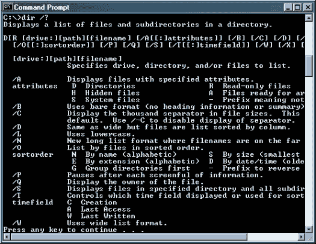

# 命令行界面的回归- AVC

> 原文：<http://avc.com/2015/09/the-return-of-the-command-line-interface/?utm_source=wanqu.co&utm_campaign=Wanqu+Daily&utm_medium=website>

我是在“命令行界面”时代学会使用电脑的。它看起来像这样:

我在大型机和微型计算机时代开始使用计算机，我的第一台台式机运行 MS-DOS，这是一个命令行驱动的操作系统。当 Mac 和 Windows 到来时，命令行或多或少地离开了我的生活，除了偶尔需要在计算机和/或网络内部瞎折腾。

但我感觉命令行界面正在回归，这主要是由文本消息和利用 messengers 中的机器人的能力不断增强所驱动的。看看这份自电报机器人平台几周前推出以来编写的电报机器人列表。我正在为我可以这样点咖啡的时刻做准备:

@bluebottle /cortado /tostay

你也可以在 Twitter 的 140 个字符限制中看到这一点。这条推文比英语更接近编码语法:

我刚才在 duckduckgo 上使用了这串代码来获取我放在本文开头的照片:

命令行界面！镀锌铁

我们正在重新学习如何在短时间内编码和发送指令，这些信息在本质上肯定不是对话。但现在，这种事情在青少年得到第一部智能手机几周后就开始做了，就像整天生活在命令行界面中的工程师一样。

这是一个转变，也许在我们等待人工智能和语音识别改善的时候是暂时的，但对现在来说是重要的。