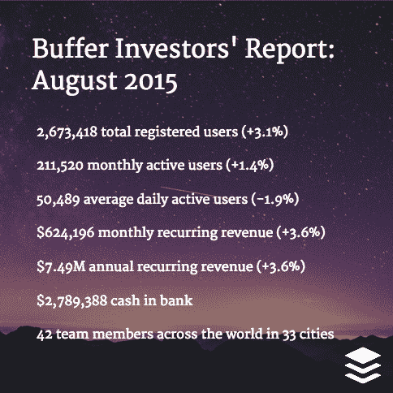

# 8 月缓冲:749 万美元 ARR，视频缓冲，持续增长

> 原文：<https://open.bufferapp.com/investors-report-august-2015/?utm_source=wanqu.co&utm_campaign=Wanqu+Daily&utm_medium=website>

我们很高兴达到近 750 万美元的年度经常性收入，并正在快速迈向 1000 万美元的 ARR 里程碑。

作为一家公司，我们开始感觉到过去几个月中我们最近的一些团队成长和结构调整开始生效。

这里是所有最新的数字和更新，从各个角落发生的事情，在缓冲队！

## 八月份的主要指标

*   注册用户总数为 2，673，418 人(+3.1%)
*   211，520 名月活跃用户(+1.4%)
*   50，489 名平均每日活跃用户(-1.9%)
*   每月经常性收入 624，196 美元(+3.6%)
*   749 万美元的年度经常性收入(+3.6%)
*   银行存款 2 789 388 美元
*   遍布全球 33 个城市的 42 名团队成员

## 团队和招聘:14 个空缺职位

我们仍在快速发展团队，我们为招聘了 [14 个空缺职位，包括一个新职位:我们已经开始寻找一名内部财务人员。](https://buffer.com/journey)

八月份我们收到了大约 1，500 份申请。(就申请而言，7 月和 8 月往往较慢，我们对 9 月感到兴奋。)

下次更新时我们将超过 50 人！

*   总共 42 名团队成员
*   8 月份有 5 名新团队成员
*   8 更多的人将在 9 月开始或已经开始

## 产品:视频和结构变化的缓冲器

在过去的几个月里，我们已经真正塑造了我们的产品和工程组织，使我们能够更快地前进。我们已经成功地将这个大团队分成 4-6 人的小团队，这些小团队能够自主工作并快速行动。

我们仍然有一些角色，其中一个人需要跨几个团队工作，我们的一个关键招聘目标是达到一个点，即 Buffer 的每个产品工作人员都专注于一个领域。这将有助于我们在未来走得更快。所有这些变化和我们加快的步伐开始被注意到。这是我们最近从一位客户那里收到的一封很棒的短信:

> “我很惊讶！在过去的 5 天里，你给 Buffer 添加了两个很棒的特性。首先，我们可以将视频同时发布到不同的账户，其次，我们现在可以将缩略图上传到我们在脸书和 LinkedIn 通过 Buffer 共享的链接中。我只想说谢谢，因为我感觉被听到了。我希望你能继续倾听我们。”

## 快乐:团队成长和新的关注领域

三个新的快乐英雄在八月开始缓冲训练营，这让我们可以完全投入到几个小团队在不同的区域工作。(这些区域对应不同的 Buffer 计划和平台，像付费客户，使用 Buffer 免费计划的客户，或者从移动应用程序伸出手的客户。)

我们正在努力通过降低 9 月份的平均响应时间来提高我们的数字。我们还开始为我们的企业客户探索客户成功焦点。

*   对话:9，063 次(+22%)
*   客户满意度:94%
*   34%的邮件在 1 小时内得到回复
*   55%的邮件在 6 小时内得到回复
*   55%的推文在 15 分钟内得到回复

## 提问:分享我们的财务状况

我们正在寻找一名内部财务人员，以帮助我们更好地管理我们的财务，并更好地了解公司所有领域的数据。我们希望你能帮忙在工作列表上传播这个消息！[推文](https://twitter.com/intent/tweet?original_referer=https%3A%2F%2Fabout.twitter.com%2Fresources%2Fbuttons&ref_src=twsrc%5Etfw&text=As%20%40buffer%20approaches%2050%20people%2C%20they%27re%20looking%20for%20an%20in-house%20Finance%20Planner.%20Full%20details%20here%3A&tw_p=tweetbutton&url=https%3A%2F%2Fbuffer.com%2Fjourney%2Ffinance-planner)或[缓冲](https://buffer.com/add/?id=4ea2549febf4321f&url=https%3A%2F%2Fbuffer.com%2Fjourney%2Ffinance-planner&text=As%20%40buffer%20approaches%2050%20people%2C%20they%27re%20looking%20for%20an%20in-house%20Finance%20Planner.%20Full%20details%20here%3A&count=vertical&placement=button)。

感谢您的帮助和支持:-)

乔尔·加斯科因