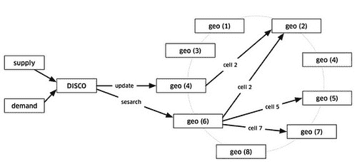

# 优步如何扩展他们的实时市场平台-高可扩展性-

> 原文：<http://highscalability.com/blog/2015/9/14/how-uber-scales-their-real-time-market-platform.html?utm_source=wanqu.co&utm_campaign=Wanqu+Daily&utm_medium=website>

据报道，优步在短短四年内已经惊人地增长了 T2 的 38 倍。现在，我想这是第一次，[马特·兰尼](https://twitter.com/mranney)，优步的首席系统架构师，在一个非常有趣和详细的演讲中——[扩展优步的实时市场平台](http://www.infoq.com/presentations/uber-market-platform)——告诉我们很多关于优步的软件是如何工作的。

如果你对激增定价感兴趣，这不是我们的话题。我们确实了解了优步的调度系统，他们如何实施地理空间索引，他们如何扩展他们的系统，他们如何实施高可用性，以及他们如何处理故障，包括他们使用司机电话作为外部分布式存储系统进行恢复来处理数据中心故障的令人惊讶的方式。

这次谈话给人的总体印象是增长非常迅速。他们做出的许多架构选择都是快速发展的结果，并试图让最近组建的团队尽快行动。后端使用了很多技术，因为他们的主要目标是让团队获得尽可能高的工程速度。

在经历了一个可以理解的混乱(但非常成功)的开始后，优步似乎对他们的业务以及他们真正需要的成功有了更多的了解。他们早期的调度系统是一个典型的 just make it work 类型的事务，在深层次上假设它只移动人。现在，优步的任务已经扩展到处理箱子和杂货以及人员，他们的调度系统已经被抽象化，并建立在非常坚实和智能的架构基础上。

虽然 Matt 认为他们的架构可能有点疯狂，但使用带有 gossip 协议的一致散列环的想法似乎非常适合他们的用例。

很难不被 Matt 对自己工作的真正热情所吸引。当谈到他们的调度系统 DISCO 时，他用激动的语气说，这就像学校里的旅行推销员问题。这是很酷的计算机科学。尽管该解决方案不是最优的，但它是一个有趣规模的旅行推销员，在实时、真实的世界中，由容错的可扩展组件构建而成。多酷啊。

让我们看看优步在内线是如何工作的。下面是我对马特的 [谈](http://www.infoq.com/presentations/uber-market-platform) : 的注解

## 统计数据

## 平台

*   Node.js

*   Python

*   Java

*   出发

*   iOS 和 Android 上的原生应用

*   微服务

*   再说一遍

*   Postgres

*   MySQL 的实现

*   [Riak](http://basho.com/)

*   推特的[T3】twimproyT5为 Redis](https://github.com/twitter/twemproxy)

*   谷歌的 [的 S2 几何图书馆的的](https://code.google.com/p/s2-geometry-library/)

*   [ringpop](https://github.com/uber/ringpop-node) -一致哈希环

*   [t 通道](https://github.com/uber/tchannel)-RPC 的网络复用和成帧协议

*   节俭

## 通用

*   优步是一个连接车手和车手伙伴的交通平台。

*   挑战:**实时匹配动态需求和动态供应**。在供应方面，司机可以随心所欲。在需求方面，乘客需要交通工具。

*   优步的调度系统是一个实时市场平台，通过手机为司机和乘客牵线搭桥。

*   除夕是优步一年中最忙的时候。

*   人们很容易忘记这个行业取得如此巨大的进步有多快。技术发展得如此之快，以至于最近令人惊叹的东西很快就退居幕后了。二十年前，手机、互联网和全球定位系统几乎是科幻小说，现在我们几乎没有注意到它。

## 架构概述

*   驱动这一切的是手机上运行本地应用程序的乘客和司机。

*   后端主要服务于手机流量。客户端通过移动数据和互联网与后端对话。你能想象 10 年前基于移动数据的业务吗？我们现在能做这种事情真是太棒了。没有使用私有网络，没有花哨的 QoS(服务质量)，只有开放的互联网。

*   客户连接到匹配司机和乘客的调度系统，**供需**。

*   Dispatch 几乎全部用 node.js 编写

    *   计划将其移至 [io.js](https://iojs.org/en/index.html) ，但此后 io.js 与 node.js [合并](http://www.infoworld.com/article/2923081/javascript/reunited-io-js-rejoins-with-node-js.html) 。

    *   你可以用 javascript 做有趣的分布式系统工作。

    *   很难低估**热情的生产力，节点开发者**非常热情。他们可以很快完成很多工作。

*   整个优步系统可能看起来很简单。为什么你需要所有这些子系统和所有这些人？只要看起来是这样，那就是成功的标志。有很多事情要做，只要看起来简单，他们就已经完成了他们的工作。

*   **地图/ETA** (预计到达时间)。为了让调度做出明智的选择，有必要获取地图和路线信息。

    *   街道地图和历史行程时间用于估计当前行程时间。

    *   语言在很大程度上取决于正在集成的系统。所以有 Python、C++和 Java

*   **服务**。有大量的业务逻辑服务。

*   **数据库**。使用了许多不同的数据库。

    *   最古老的系统是用 Postgres 写的。

    *   Redis 用的很多。有些是 Twemproxy 背后的。有些是在一个定制的集群系统后面。

    *   MySQL 的实现

    *   优步正在构建他们自己的分布式列存储，它编排了一堆 MySQL 实例。

    *   一些调度服务正在保持 Riak 的状态。

*   **起下钻后管线**。旅行结束后，必须进行大量的处理。

    *   收集评分。

    *   发送电子邮件。

    *   更新数据库。

    *   安排付款。

    *   用 Python 写的。

*   **钱**。优步集成了许多支付系统。

## 旧的调度系统

*   最初的调度系统的局限性开始限制公司的发展，所以它必须改变。

*   大部分都改写了整件事，尽管有什么 [乔尔·斯波尔斯基说的](http://www.joelonsoftware.com/articles/fog0000000069.html) 。所有其他系统都没有受到影响，甚至调度系统中的一些服务也幸存了下来。

*   旧系统是为私人运输设计的，做了很多假设:

    *   一车一骑，这对 [【优步】](https://get.uber.com/cl/uberpool/) 来说是不行的。

    *   移动人员的想法已经深入到数据模型和界面中。这限制了向新市场和新产品的转移，比如转移食品和箱子。

    *   最初的版本是由城市切分的。这对可伸缩性有好处，因为每个城市都可以独立运行。随着越来越多的城市加入，管理变得越来越困难。有些城市很大，有些很小。一些城市有很大的负荷高峰，而另一些没有。

*   由于建设速度如此之快，他们没有单点故障，而是有多点故障。

## 新的调度系统

*   为了修复城市分割并支持更多的产品，必须推广供应和需求的概念，因此创建了**供应服务和**需求服务。

*   供应服务跟踪所有供应的能力和状态机。

    *   要跟踪车辆，有许多属性需要建模:座位数量、车辆类型、是否有儿童汽车座椅、是否适合轮椅等等。

    *   分配需要被跟踪。例如，一辆汽车可能有三个座位，但其中两个被占了。

*   需求服务跟踪需求、订单和需求的所有方面。

    *   如果乘客需要汽车座椅，该需求必须与库存相匹配。

    *   如果乘客不介意以更低的价格拼车，那就必须建立模型。

    *   如果需要搬箱子或送食物怎么办？

*   匹配所有供应和需求的逻辑是一个名为 DISCO(调度优化)的服务

    *   旧系统只能匹配当前可用的供应，也就是说在路上等待工作的汽车。

    *   DISCO 支持对未来进行规划，并在信息可用时加以利用。例如，在进行中的旅行中修改路线。

    *   **按供应的地理位置**。DISCO 需要地理空间索引来根据所有供应的位置和预期位置做出决策。

    *   **按需求的地理位置**。需求还需要地理索引

    *   需要一个更好的路由引擎来利用所有这些信息。

### 调度

*   随着车辆的移动，供应部将位置更新发送给 geo。为了匹配乘客和司机，或者只是在地图上显示汽车，DISCO 向 geo by supply 发送请求。

*   Geo by supplier 进行粗第一遍过滤，以获得满足要求的邻近候选。

*   然后，列表和需求被发送到 routing / ETA，以计算它们在地理上而不是在道路系统附近的 ETA。

*   按 ETA 分类，然后送回供应站提供给司机。

*   在机场，他们必须模拟一个虚拟的出租车队列。供应品必须排队，以便考虑到它们到达的顺序。

### 地理空间索引

*   必须超级可扩展。设计目标是**每秒处理一百万次写入**。写入速率来自于驱动程序在移动时每 4 秒发送一次更新。

*   读取的目标是每秒读取次数远多于写入次数，因为每个打开应用的人都在读取。

*   旧的地理空间索引通过一个简化的假设运行良好，它只跟踪可调度的供应。大部分供应都忙于做一些事情，所以可用供应的子集很容易支持。有一个全局索引存储在少数进程的内存中。很容易进行非常简单的匹配。

*   在新的世界里，每个州的所有供应都必须被追踪。此外，还必须跟踪他们的计划路线。这是更多的数据。

*   新服务**运行在数百个进程**上。

*   地球是一个球体。单纯基于经纬度很难做总结和近似。因此，优步使用谷歌 S2 图书馆将地球划分成微小的单元。每个单元都有唯一的单元 ID。

*   使用 int64 可以表示地球上的每一平方厘米。优步使用 12 级牢房，根据你在地球上的位置，12 级牢房有 3.31 公里(2)到 6.38 公里(2)。这些盒子根据它们在球体上的位置改变形状和大小。

*   S2 可以给出一个形状的覆盖范围。如果你想画一个以伦敦为中心，半径为 1 公里的圆，S2 可以告诉你需要什么样的细胞才能完全覆盖这个形状。

*   由于每个单元格都有一个 ID，该 ID 被用作分片键。当一个位置来自 supply 时，该位置的单元 ID 被确定。使用小区 ID 作为分片密钥，更新供应的位置。然后将它发送给几个副本。

*   当迪斯科需要找到某个地点附近的供应时，以骑手所在的位置为中心计算一圈的覆盖范围。使用圆圈区域中的单元 id，所有相关的碎片被联系以返回供应数据。

*   所有这些都是可扩展的。尽管它不如您希望的那样高效，而且由于 fanout 相对便宜，写入负载总是可以通过添加更多节点来扩展。通过使用副本来扩展读取负载。如果需要更大的读取容量，可以增加复制因子。

*   一个限制是单元格大小固定在 12 级大小。将来可能会支持动态单元大小。这是一种折衷，因为单元越小，查询的扇出就越大。

### 路由

*   从地理空间得到答案后，必须对选项进行排序。

*   有几个高级目标:

    *   **减少额外驾驶**。驾驶是人们的工作，所以人们希望他们更有效率。他们会因为额外开车而得到报酬。理想情况下，司机会连续出行。一堆工作会排着队，他们会因此得到报酬。

    *   **减少等待**。骑手应该尽可能少地等待。

    *   **最低总 ETA** 。

*   旧的系统是让需求搜索当前可用的供应，匹配并完成它。这很容易实现，也很容易理解。这对于私人交通来说非常有效。

*   只看当前的可用性是无法做出好的选择的。

*   这个想法是，对于要求搭车的顾客来说，当前运送乘客的司机可能比远处当前空闲的司机更合适。选择在旅途中的司机可以最大限度地减少客户的等待时间，并最大限度地减少远程司机的额外驾驶时间。

*   这种试图预见未来的模式能更好地处理动态情况。

    *   例如，如果一名司机在客户附近上线，但另一名司机已经从更远的地方被派遣，则没有办法改变派遣决定。

    *   另一个例子涉及到愿意共乘一辆车的顾客。通过尝试在非常复杂的场景中预测未来，有可能进行更多的优化。

*   当考虑送盒子或食物时，所有这些决定都变得更有趣了。在这种情况下，人们通常有其他事情要做，所以会有不同的权衡。

## 缩放调度

*   使用 node.js 建立调度

*   他们正在构建一个有状态的服务，所以无状态的扩展方法是行不通的。

*   Node 在单个进程中运行，因此必须设计一些方法在同一台机器上的多个 CPU 上运行 Node，并运行到多台机器上。

*   有一个关于用 Javascript 重新实现所有 Erlang 的笑话。

*   扩展节点的解决方案是 *ringpop* ，这是一个具有 gossip 协议的一致哈希环，实现了可扩展的容错应用层分片。

*   在 CAP 术语中，ringpop 是一个 **AP 系统**，用一致性换取可用性。解释一些不一致的地方比提供羽绒服务要好。最好是向上，偶尔出错。

*   ringpop 是一个嵌入模块，包含在每个节点流程中。

*   节点实例围绕成员集八卦。一旦所有节点都同意彼此是谁，它们就可以独立有效地做出查找和转发决定。

*   这确实是可扩展的。增加更多流程，完成更多工作。它可以用来共享数据，或者作为分布式锁定系统，或者协调发布/订阅或长轮询套接字的集合点。

*   八卦协议的基础是 [游](https://www.cs.cornell.edu/~asdas/research/dsn02-swim.pdf) 。已经做了一些改进来缩短收敛时间。

*   一份名单上的成员被传来传去。随着更多节点的添加，它是可扩展的。SWIM 中的“S”代表可伸缩性，而且确实有效。到目前为止，它已经扩展到数千个节点。

*   作为同一协议的一部分，SWIM 将健康检查与会员变更相结合。

*   在 ringpop 系统中，所有这些节点进程都包含 ringpop 模块。他们围绕当前的成员说长道短。

*   对外，DISCO 要消费地理空间，每个节点都是等价的。选择一个随机的健康节点。无论请求到达何处，都负责通过使用哈希环查找将请求转发到正确的节点。看起来像:

T2】

*   让所有这些跃点和对等点相互对话听起来可能很疯狂，但它产生了一些非常好的属性，比如服务可以通过在任何机器上添加实例来扩展。

*   ringpop 是建立在优步自己的名为 *TChannel* 的 RPC 机制之上的。

    *   这是一个双向请求/响应协议，灵感来自 Twitter 的。

    *   一个重要的目标是控制许多不同语言的性能。尤其是在 Node 和 Python 中，许多现有的 RPC 机制都不能很好地工作。想要 redis 级别的性能。TChannel 已经比 HTTP 快了 20 倍。

    *   想要一条高性能的转发路径，以便中介可以非常轻松地做出转发决定，而无需了解全部有效负载。

    *   想要适当的管道，这样就不会出现行首阻塞，请求和响应可以在任何时候向两个方向发送，而且每个客户端也是服务器。

    *   想把有效载荷校验和、追踪和一流的特性结合起来。每个请求在通过系统时都应该是可追踪的。

    *   想要一个干净的 HTTP 迁移路径。HTTP 可以非常自然地封装在 TChannel 中。

    *   优步正在退出 HTTP 和 Json 业务。Channel 的一切都变得节俭了。

*   ringpop 通过基于持续连接的频道进行八卦。这些相同的持久连接用于扇出或转发应用流量。TChannel 也用于服务之间的对话。

## 调度可用性

*   可用性非常重要。优步有竞争对手，转换成本非常低。如果优步经济下滑，哪怕只是短暂的下滑，这些钱都会流向其他人。其他产品更具粘性，客户稍后会再次尝试。优步就不一定了。

*   让一切都变得可重试。如果有些东西不工作，它必须是可重试的。这就是如何避开失败的方法。这要求所有请求都是幂等的。例如，重试派单不能派单两次，也不能从某人的信用卡上扣两次钱。

*   让一切都变得可杀。失败是常有的事。随机杀死进程不会造成伤害。

*   **仅崩溃**。没有优雅的关机。优雅的关机不需要练习。需要练习的是当意想不到的事情发生时。

*   **小件**。为了减少失败的代价，把它们分成更小的部分。在一个实例中处理全局流量也许是可能的，但是当它消失时会发生什么呢？如果有一对，其中一个出现故障，容量就会减半。所以服务需要被拆分。这听起来像是一个技术问题，但更像是一个文化问题。有一对数据库会更容易。这是很自然的事情，但是对子是不好的。如果您能够自动升级一个并重新启动新的辅助服务器，那么随机杀死它们是非常危险的。

*   **杀光一切**。甚至杀死所有的数据库，以确保有可能在这种故障中幸存下来。这需要改变使用什么数据库的决定。他们选择了 Riak 而不是 MySQL。这也意味着使用 ringpop 而不是 redis。杀死一个 redis 实例是一个昂贵的操作，它们通常都很大，而且很昂贵。

*   把它分成更小的块。谈论文化变迁。通常，服务 A 会通过负载均衡器与服务 B 对话。负载均衡器死机怎么办？你打算怎么处理？如果你不走这条路，你永远不会知道。所以你必须杀死负载平衡器。如何绕过负载均衡器？负载平衡逻辑必须放在服务本身中。客户需要有一定的智慧，知道如何解决问题。这在哲学上类似于欺骗的工作方式。

*   为了使整个系统能够扩展并处理反压力，一个服务发现和路由系统已经从一个 ringpop 节点集群中创建出来。

## 数据中心总体故障

*   这种情况不常发生，但可能会出现意外的级联故障，或者上游网络提供商可能会出现故障。

*   优步维护着一个备份数据中心，交换机已经就位，可以将所有数据传送到备份数据中心。

*   问题是正在进行的旅行的数据可能不在备份数据中心。他们没有复制数据，而是使用司机手机作为出行数据的来源。

*   所发生的是调度系统**周期性地向司机手机**发送加密的状态摘要。现在，假设有一个数据中心故障转移。下次司机电话向调度系统发送位置更新时，调度系统将检测到它不知道此行程，并向请求状态摘要。然后，调度系统根据状态摘要进行自我更新，旅程继续进行，就像什么都没发生一样。

## 不利的一面

*   优步解决可扩展性和可用性问题的方法的缺点是潜在的高延迟，节点进程相互转发请求并以大扇出发送消息。

*   在扇出系统中，微小的波动和故障会产生惊人的巨大影响。系统中的扇出越高，出现高延迟请求的机会就越大。

*   一个好的解决方案是让**备份请求跨服务器取消**。这是 TChannel 固有的一流特性。一个请求被发送到服务 B(1 ),同时还有一个信息，即该请求也被发送到服务 B(2)。在延迟一段时间后，请求被发送到服务 B(2)。当 B(1)完成请求时，它取消 B(2)上的请求。延迟意味着在通常情况下 B(2)没有做任何工作。但是，如果 B(1)确实失败了，那么 B(2)将处理请求并以比首先尝试 B(1)、发生超时、然后尝试 B(2)更低的延迟返回应答。

*   参见 [谷歌延迟容忍系统:从不可预测的部分中创造可预测的整体](http://highscalability.com/blog/2012/6/18/google-on-latency-tolerant-systems-making-a-predictable-whol.html) 了解更多这方面的背景知识。

## 相关文章