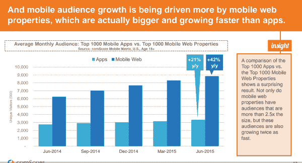
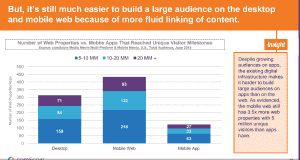
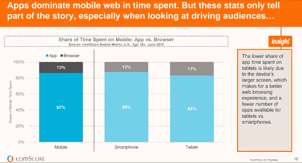

# 移动网络是漏斗的顶部，移动应用是漏斗的底部- AVC

> 原文：<http://avc.com/2015/09/mobile-web-is-top-of-funnel-mobile-app-is-bottom-of-funnel/?utm_source=wanqu.co&utm_campaign=Wanqu+Daily&utm_medium=website>

comScore 上周发布了一份非常有见地的移动网络/应用报告。这些数据仅仅是美国的，因此在这方面是有偏差的，许多有趣的事情正在美国以外发生，而这份报告错过了它们。但不管怎样，报告中有一些重要的结论，这篇博文的标题是其中最重要的。如果你愿意给他们一些你的个人信息，你可以[在这里](https://www.comscore.com/Insights/Presentations-and-Whitepapers/2015/The-2015-US-Mobile-App-Report)下载 comScore 的报告。

重要的事情先来。移动网络独立访客的增长速度快于移动应用程序访客的增长速度，两者之间的界限正在发生分化。

[T2】](https://avc.com/wp-content/uploads/2015/09/mobile-web-growing-faster.png)

这是因为你的手机网站是你在手机上获取用户的漏斗顶端。这是人们通过搜索、电子邮件、社交媒体、文本链接等方式登陆的地方。

移动网络的伸缩性更好。比起通过移动应用程序，你可以更容易地在移动网络上获得大量受众。

[T2】](https://avc.com/wp-content/uploads/2015/09/mobile-web-scales-better.png)

在桌面世界有效的东西往往在移动网络世界也有效，但在移动应用程序世界就无效了。所以你必须在手机上使用两个步骤。移动网络是漏斗的顶部，移动应用是漏斗的底部。

但如果你想让用户长时间逗留，并定期回来，你必须让他们使用你的手机应用。原因如下:

[T2】](https://avc.com/wp-content/uploads/2015/09/app-dominate-time-spent.png)

我喜欢这样想。移动网络是你商店的窗口。用户在你的手机网站上浏览购物。让他们下载、安装并使用你的移动应用就像让他们来到商店一样。这是一个长期的行动。

披露:我在 90 年代末是 comScore 的种子投资者，在他们的董事会服务了大约八年，我仍然持有一些 comScore 的股票。