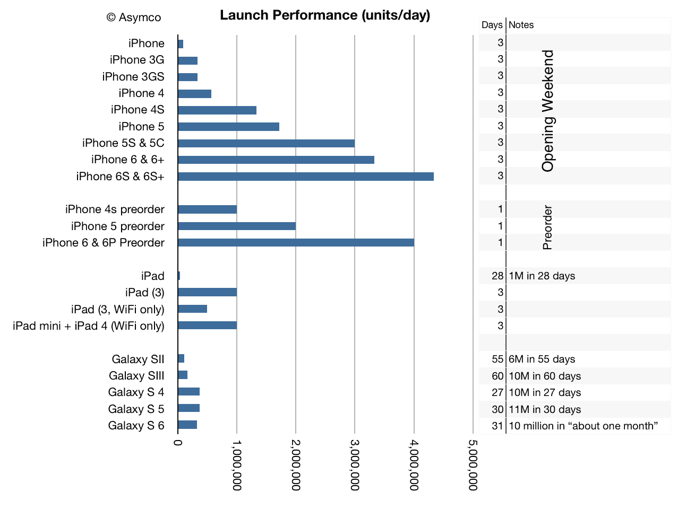

# 伟大意味着什么——asym co

> 原文：<http://www.asymco.com/2015/09/29/what-it-means-to-be-great/?utm_source=wanqu.co&utm_campaign=Wanqu+Daily&utm_medium=website>

是什么让一个产品变得伟大？我纠结于这个问题，因为伟大不仅仅是比优秀更好。伟大之于善良，犹如智慧之于聪明。就像变得越来越聪明可能永远不会让你变得聪明，变得越来越好并不意味着变得伟大。

伟大是超越的。很难确定。它引发了辩论。它分裂和团结一样多。它创造了思想也创造了情感。它创造传奇。它参与并坚持。它活在记忆里，渗透文化。它持续地植入我们的意识中，当我们被刺激轰炸时，它在我们的头脑中徘徊和停留。

我们用“标志性的”或“史诗般的”这样的词来捕捉我们从伟大中获得的这种永久的“精神纹身”。尽管这个概念很重要，但我们仍在努力定义它。我们甚至没有一个合适的词来形容它。也许这就是艺术试图成为的样子，或者是驱使我们超越生存的力量。尽管这是一个模糊的概念，但它是我能想到的最重要的概念之一。伟大也许是我们上升的原因。

在没有任何衡量伟大的标准的情况下，我们如何发现它呢？这可能只是归结于“当我们看到它时就知道了”。但不是每个人都这样。

当看到最新款 iPhone 6S 的性能时，我想到了这个困惑。仔细观察，我们看不见它。我们只看到不同版本之间微小的变化；无法衡量的微小变化。然而这些变化有一个更重要的属性:它们是可吸收的。被忽视的改变不仅是没有价值的，它实际上可能会破坏对价值的理解。它会造成混乱和困惑。可吸收的改变是有价值的。很有意义。

看看 3D Touch、Live Photos 和更好的相机等新功能，人们可以观察到它们对于第一次看到它们的人来说是多么容易被接受和渴望。正如 Siri、FaceTime、触控 ID 和 iCloud 一样，让一些东西变得更好是持续创新的标志，而不是过度服务。

矛盾的是，这些改进通常不是用户所要求的。调查总是显示，消费者想要“更长的电池寿命”或“更大的屏幕”，但完全交付其他东西仍然会导致大规模采用，这表明了对真正重要的东西的不可思议的洞察力。事实上，那些只提供客户要求的产品的公司最终会被边缘化，失去利润。

看到年复一年的改进导致市场上不断增加的成功，证明这不是一个短暂的事件。这不是昙花一现。这不是什么天才之举。这是一个流程，一个工厂，一台机器。成功的持续性和不屈不挠证明了某种更持久的东西在起作用。

[T2】](http://www.asymco.com/wp-content/uploads/2015/09/Screen-Shot-2015-09-29-at-6.55.09-AM.png)

产品的伟大定义就变得更容易定义了:

没有被要求但改变了行为的改进表明产品是有价值的，因为它改变了购买者。我相信这是让我们停下来欣赏它们的原因。我们觉得我们已经被我们买的东西提高了，尽管我们并没有要求通过它变得更好。总的来说，乘以数百万，我们感觉到的改进迫使我们把产品涂成伟大的。

苹果是一家成就卓越的公司，因为他们建立了一套让客户变得更好的流程。他们这样做没有得到许可，他们这样做没有冒犯。但是当购买者察觉到这种变化时，他们觉得自己欠了这件物品的债。得到报恩的回报是苹果的回报。