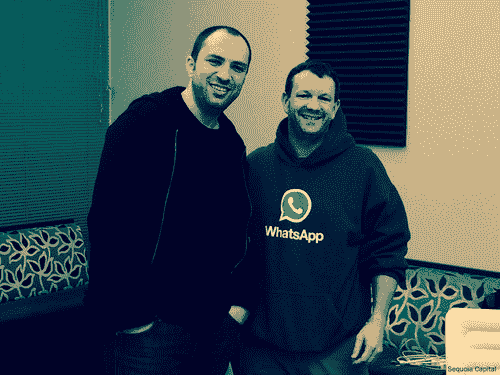

# 红杉资本——解释脸书为何收购的四个数字...

> 原文：<http://sequoiacapital.tumblr.com/post/77211282835/four-numbers-that-explain-why-facebook-acquired?utm_source=wanqu.co&utm_campaign=Wanqu+Daily&utm_medium=website>

*WhatsApp 联合创始人简·库姆和布莱恩·阿克顿*

今天早些时候，脸书宣布以 160 亿美元收购 WhatsApp。对于公司的联合创始人简·库姆和布莱恩·阿克顿以及他们卓越的团队来说，这是一个引人注目的里程碑。

从打开 WhatsApp 大门的那一刻起，简和布莱恩就想要一个不同类型的公司。当其他人寻求关注时，简和布莱恩避开了聚光灯，甚至拒绝在山景城的 WhatsApp 办公室外面挂一个牌子。当竞争对手推销游戏、匆忙搭建平台时，简和布莱恩仍然致力于一种干净、快速、完美的通信服务。

这种方法很好地服务了 WhatsApp 及其用户。WhatsApp 在即时通讯方面的成就堪比 Skype 在语音和视频通话方面的成就。通过使用互联网作为其通信骨干，WhatsApp 彻底改变了个人通信，而此前个人通信由全球最大的无线运营商主导。

在过去的三年里，我们有幸与 Jan 和 Brian 并肩工作，成为他们的亲密商业伙伴和投资者。这是一段非凡的旅程，我们为这些才华横溢的失败者感到无比高兴，他们不可动摇的信念和特立独行的天性是硅谷精神的缩影。

那些不太熟悉 WhatsApp 及其出色产品的人会惊叹，一家年轻的公司怎么会如此有价值。其中许多人会在美国，因为没有其他本土科技公司在海外如此受欢迎，在国内却如此不受重视。WhatsApp 让我们想起了我们合作过的其他公司，比如 PayPal 和 YouTube，它们的创始人选择了与 Jan 和 Brian 相似的道路。今天，PayPal 和 YouTube 都是全世界家喻户晓的名字。明天，WhatsApp 也将面临同样的情况。

这里有四个数字可以讲述 WhatsApp 的故事:450、32、1 和 0。

**450。WhatsApp 拥有超过 4.5 亿<u>的活跃用户</u>，比历史上任何一家公司都要快。就在 9 个月前，WhatsApp 宣布活跃用户达到 2 亿，已经超过 Twitter。每天，超过 100 万人安装该应用并开始聊天，他们在 WhatsApp 上的参与度高于其他任何服务。令人难以置信的是，WhatsApp 的日活跃用户数(相对于每月登录的人数)已经攀升至 72%。相比之下，行业标准在 10%到 20%之间，只有少数公司超过 50%。**

WhatsApp 利用了我们对个人交流无法满足的胃口。它是过去 150 年来从驿马快信、电报和航空信件到电话和电子邮件的链条的一部分。WhatsApp 已经成为今天个人通讯的旗手。

简和布莱恩的产品迎合了你最关心的人:你手机通讯录里的人。WhatsApp 简单、安全、快速。它不要求你花时间建立一个新的人际关系图；相反，它会点击已经存在的那个。简和布赖恩的决定是由让人们不受干扰地交流的愿望推动的。

32。即使按照世界上最好的科技公司的标准，WhatsApp 也是精益运营。在只有 32 名工程师的情况下，一名 WhatsApp 开发者支持 1400 万活跃用户，这是业内前所未闻的比例。(WhatsApp 的支持团队更小。)这个 L . E . G . N . D . A . R . Y 团队使用 Erlang 构建了一个可靠的、低延迟的服务，每天在七个平台上处理 500 亿条消息，这是一个不寻常但特别适合的选择。所有这些，同时保持超过 99.9%的正常运行时间，因此用户可以像依赖拨号音一样依赖 WhatsApp。

简桌子上的纸条

**1。Jan 把 Brian 的一张纸条贴在他的桌子上，上面写着“禁止广告！没有游戏！没有噱头！”它每天都在提醒他们致力于打造纯粹的消息传递体验。**

这种纪律反映在 WhatsApp 非常规的商业方式中。免费使用一年后，这项服务每年收费 1 美元，不收短信费。这可以为陷入昂贵数据计划的用户每年节省高达 150 美元。

很容易把这种新奇的模式想当然。当我们在 2011 年 1 月与 WhatsApp 首次合作时，它有十几个直接竞争对手，而且都是靠广告支撑的。(仅在博茨瓦纳，就有 16 个社交消息应用程序)。简和布赖恩无视传统智慧。他们没有用广告瞄准用户——这是他们在雅虎工作期间已经变得不喜欢的方法——而是选择了相反的策略，对一个基于尽可能不了解你的产品收取 1 美元的费用。WhatsApp 不会收集您的姓名、性别、地址或年龄等个人信息。注册使用电话号码进行认证，这是一项重大创新，消除了记住用户名和密码的困扰。一旦发送出去，信息就会从 WhatsApp 的服务器上删除。

简在一个有秘密警察的共产主义国家长大，这是一种明显的逆向思维方式。简的童年让他欣赏没有窃听或录音的交流。当他 16 岁以靠食品券生活的移民身份抵达美国时，他有了额外的动力，想与俄罗斯和乌克兰的家人保持联系。当 Jan 在雅虎与他的导师 Brian 一起工作多年后，开始创建 WhatsApp 时，所有这些都是他最关心的问题。

脸书向简和布莱恩保证，WhatsApp 将保持广告免费，他们不会在原则上妥协。我们知道，作为脸书董事会的新成员，简将继续捍卫 WhatsApp 用户的权利。

0。最能证明 WhatsApp 的病毒性质的莫过于该公司在没有投入一分钱进行营销的情况下实现了这一切。与规模较小的竞争对手不同，它没有在用户获取上花任何钱。该公司甚至没有雇佣营销人员或公关人员。然而，就像世界上最伟大的品牌一样，它与消费者建立了强烈的情感联系。WhatsApp 的所有增长都来自于快乐的客户鼓励他们的朋友尝试这项服务。

***

有很多理由对 WhatsApp 的下一阶段发展感到兴奋。马克·扎克伯格为脸书和 WhatsApp 如何紧密结合做了一个令人信服的案例，就像他对 Instagram 所做的一样，insta gram 已经成为脸书的一部分。与 Instagram 一样，我们很幸运地得到了其他人的支持，对我们来说，今天的公告是苦乐参半。我们对 WhatsApp 和脸书未来的机遇感到兴奋，但也带着些许悲伤和许多怀旧情绪，因为我们红杉的所有人在过去三年里都感受到了与该公司合作的快乐和满足。

从 WhatsApp 只有不到 10 个用户的时候起，Jan 和 Brian 就一直致力于建立一个持久的服务。现在，在迈向 10 亿的路上，他们才刚刚起步。

–[Jim Goetz](https://href.li/?http://www.sequoiacap.com/us/jim-goetz)，代表红杉