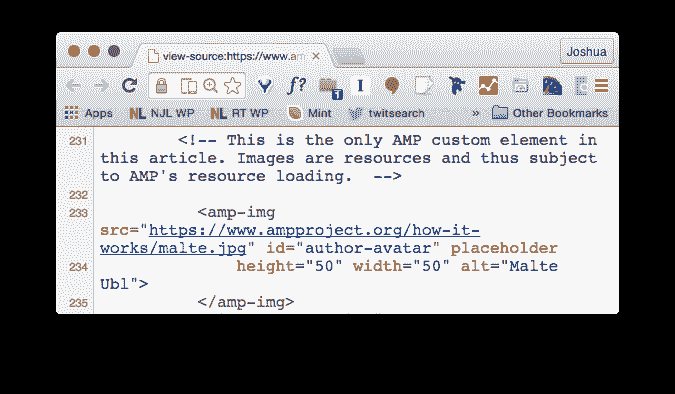

# 获取 AMP'd:以下是出版商需要了解的谷歌加速网站的新计划

> 原文：<http://www.niemanlab.org/2015/10/get-ampd-heres-what-publishers-need-to-know-about-googles-new-plan-to-speed-up-your-website/?utm_source=wanqu.co&utm_campaign=Wanqu+Daily&utm_medium=website>

谷歌今天公布了加快移动网络速度的新计划——加速移动网页，简称 AMP——这是一家技术公司为解决移动网络速度慢的问题所做的最新尝试。脸书有即时文章，可以让某些新闻故事在应用程序中加载得更快；苹果想让你进入它新的苹果新闻应用。谷歌的努力更多的是改变移动网络，而不是建立自己的应用程序或环境，这就是为什么 AMP 与技术(Twitter、Pinterest、LinkedIn、Chartbeat、Parsely)和出版(纽约时报、Vox Media、金融时报、Gannett、Hearst、华盛顿邮报和赫芬顿邮报)的大量合作伙伴一起首次亮相。

AMP 中有许多聪明的想法。它*起作用了*——极大地减少了文章页面的加载时间。

但我不得不说我对此有点矛盾。谷歌指出，AMP 不像即时通讯和苹果新闻那样是商业伙伴关系；没有广告收入份额需要考虑。但是 AMP 试图做一些可能更有意义的事情:改变网络的构建方式，扼杀一些技术，让其他技术受益。在一个受控平台和有围墙的应用程序花园的世界里，网络是最后一个屹立不倒的开放空间，建立了 20 多年，一些谷歌工程师决定禁止哪些部分有些令人恼火。

是的，出版商不必采用它，是的，这是一个开源项目，是的，性能收益是非常真实和非常可观的。但是出版商也可以选择采用 Facebook 即时文章和苹果新闻。关键是，这是出版商走向无能为力之路的又一站——科技公司制定规则的又一个例子。

需要时间和证据来证明我的反应有多少是情绪化的——一个还记得浏览器战争和 ActiveX 以及开放网络标准之争的老网虫的恐惧——以及有多少是战略性的。因为也许真的需要像谷歌这样的巨头来拯救出版业。

### 有什么渊源故事？

谷歌的动机是显而易见的:它靠广告赚钱，而且绝大多数广告都是在公开网络上。如果脸书(或其他平台，但说真的，脸书)提供了比开放网络明显更好的移动体验，那些广告机会(和用户数据)就会消失在扎克伯格的尘世快乐的围墙花园里。

AMP 是在最近的 Newsgeist 上的一次讨论中发展起来的，这是 Google 和 Knight 偶尔发起的新闻和技术人员的无拘无束的会议。如果你看看[奥地利新闻主管 Gerold Riedmann 对 5 月事件](http://www.inma.org/blogs/media-leaders/post.cfm/facebook-instant-articles-top-talk-at-google-s-newsgeist-un-conference)的报道，很明显你首先想到的是什么:

> 我很高兴地分享#newsgeist 上的大讨论是关于 Facebook Instant Articles 的…参与者认为这是一个明确的信号，在谷歌长期忽视新闻出版商的困难后，脸书希望在欧洲交朋友。参与的媒体高管将此视为一项实验，一种学习的方式。
> 
> 没有关于产品质量的讨论。每个人都喜欢 Facebook 即时文章为顾客提供的外观和感觉、加载速度以及所有其他优势。
> 
> 但是新闻出版商在与脸书签署协议的问题上有很多争议(在我之前的文章中也有描述)。众所周知，Facebook 的即时文章功能是一块地盘，它帮助脸书成为“互联网”
> 
> 邪恶的提议是，你保留你销售广告的所有收入，另外你还能得到数据。对一些人来说，这似乎好得难以置信。老实说，这树立了新的标准，并让谷歌思考其对出版商的报价可以/应该有多有吸引力。

你也可以在 Jeff Jarvis 同时发表的这篇文章中看到 AMP 的种子:

> 在其他话题中，我们选择谈论谷歌可以为新闻做些什么，脸书作为新闻的新发行人——有时是编辑——以及至少一个利用这一新现实的想法。
> 
> 这个想法是我和谷歌新闻主管理查德·金格拉斯(Richard Gingras)在美国举行的上一届 Newsgeist 上倡导的，也是我多年来一直致力于的事情:**一篇容器化的、可嵌入的文章，它可以通过品牌、收入、分析和链接传播到任何网站。**换句话说，让我们借鉴脸书在即时文章上的成就，向任何创作者和嵌入者开放。我很高兴在这次新闻大会上听到对这一概念的严肃讨论，这打开了重新想象新闻传播的大门，这样我们就可以把我们的新闻带给他们，而不是总是要求和依赖我们的用户来找我们。

### 那么 AMP 是什么呢？

AMP 集多种技术于一身。第一个也是最重要的一个，我们可以称之为**代码子集**。HTML 是网页内置的语言，包括一些加载快速的内容和一些加载缓慢的内容。AMP 的目标是杀死慢的部分，最明显的是 JavaScript。[这里是](https://www.ampproject.org/how-it-works/) [Malte Ubl](https://twitter.com/cramforce) ，AMP 项目技术负责人:

> 今天的网络有很多东西:应用平台、电子商务平台、内容平台、游戏平台等等。我们决定完全专注于静态内容，因为它有助于更彻底的优化方法，更容易全面应用。
> 
> 我们开始尝试一个想法:我们能不能从 HTML 中开发一个我们要用的东西的有限子集，既快速又富于表现力，这样文档就能一直以可靠的性能加载和呈现？…
> 
> 我们很早就意识到，许多性能问题是由多个 JavaScript 库、工具、嵌入等的集成引起的。变成一页。这并不是说 JavaScript 会立即导致糟糕的性能，但是一旦任意使用 JavaScript，大多数赌注都将落空，因为任何事情都可能在任何时候发生，并且很难做出任何类型的性能保证。考虑到这一点，我们做出了艰难的决定，AMP HTML 文档将不包含任何作者编写的 JavaScript，也不包含任何第三方脚本。

没有第三方脚本！这里有一些使用第三方脚本的东西:基本上每个广告，基本上每个分析包。当你看到一个充满追踪器的页面时，这些几乎都是第三方脚本。

某些 HTML 标签[也被禁止](https://github.com/ampproject/amphtml/blob/master/spec/amp-html-format.md#ampd) : `iframe`、`embed`、`object`，以及除 JSON 以外的所有`script`(以及首先加载 AMP 的`script`)。主 HTML5 多媒体标签`img`、`video`和`audio`被替换为定制元素`amp-img`、`amp-video`和`amp-audio`。

通过创建这些新元素，AMP HTML 可以将图像和视频视为资产，出于性能原因，可以随意约束这些资产:

> 我们称它们为托管资源，因为它们是否以及何时被加载并显示给用户是由 AMP 运行时决定的。运行时应该优先考虑当前在视口中的资源，并尝试预测视口的变化，并相应地预加载资源。
> 
> AMP 运行时可以随时决定卸载当前不在 viewport 中的资源，或者重用 iframes 之类的资源容器来减少总的 RAM 消耗。

CSS 在 AMP HTML 中也有严格的限制(“这种限制是为了使整体性能更容易推理。以后可能会开放”)。被禁止的包括用于动画的常见 CSS 属性。自定义字体是允许的，但在某些方面受到限制。

通过从本质上取代移动浏览器中的原生渲染引擎，AMP 可以随意加载或卸载资产——例如，在图像接近视图之前不用担心图像，或者先加载编辑文本内容，再加载广告。

<iframe loading="lazy" src="https://www.youtube.com/embed/i2_lAEzmOPo?rel=0&amp;showinfo=0" frameborder="0" allowfullscreen="">视频</iframe>

这里有很多聪明的想法，可以理解为什么这些约束会有助于提高性能。不管是好是坏，这本质上是 HTML 和 web 技术在过去十年中发展的倒退。有点不协调的是，今天早上展示的这么多 AMP 样本页面看起来很像 2002 年的网页，缩小到手机屏幕上。比如 IE 5.5 模拟器。我的意思是，这个来自推特的[样本图片是*丑陋的*:](https://blog.twitter.com/2015/introducing-accelerated-mobile-pages-0)

(没有什么特别的技术原因让你不能在 AMP 中创建漂亮的移动网页，即使第一个例子做得不够好。)

但是这种去掉标签的做法也加强了一个有围墙的花园。AMP 是一个开源项目，但是像`amp-img`这样的标签正在扼杀和取代已经成为开放网络一部分几十年的元素。它正在分叉 HTML。

在网络的早期，浏览器制造商(最著名的是微软)试图塑造 HTML，使它只能在“在 Internet Explorer 中最佳浏览”的时代正常工作 web 标准运动多年来一直在努力让浏览器和开发者使用公认的开放标准来构建和呈现 web。

现在，AMP 实质上要求你建立一个平行宇宙版本的网站，不仅去掉任何慢的东西，而且去掉任何*可能*慢的东西。你知道广告拦截器是如何拦截所有广告的吗，不管它们是完全合理的还是极端糟糕的？AMP HTML 杀死*所有* JavaScript，不仅仅是坏的 JavaScript。

你*可以*在一个 AMP 页面中嵌入东西，使用预先批准的扩展，比如 [`amp-youtube`](https://github.com/ampproject/amphtml/blob/master/extensions/amp-youtube/0.1/amp-youtube.js) 和 [`amp-twitter`](https://github.com/ampproject/amphtml/blob/master/extensions/amp-twitter/amp-twitter.md) 。但这有利于那些能够构建这种嵌入并将其添加到规范中的公司。任何人、任何地方——任何初创公司、任何出版商——都可以使用被取消的开放 HTML 标签。

公平地说，Ubl 承认 AMP 不会对每个网页都有意义:

> JavaScript 是高级 web 应用程序的核心构建块，但对于静态内容，它可能并不总是必需的:对于标题、一些文本和图像，你不需要 JS。然而，深入研究当今网络上正在创建的内容，有一些东西，如灯箱、各种嵌入、投票、测验和其他交互式功能，如果没有 JavaScript，是无法轻松实现的。

您将无法在 AMP 中构建漂亮的交互式地图或数据可视化。你可能不会尝试在 AMP 中构建[降雪](http://www.nytimes.com/projects/2012/snow-fall/)。但是对于那些构成大多数出版商大部分新闻作品的日常文章来说，这可能是有意义的。

AMP 允许您维护两个不同版本的网页(HTML 和 AMP HTML) *或*只需完全转换为 AMP。比如，The Verge 关于今天公告的文章是[这里](http://www.theverge.com/2015/10/7/9467149/google-accelerated-mobile-pages-caching-preview)，网址*http://www . The Verge . com/2015/10/7/9467149/Google-accelerated-mobile-pages-caching-preview*。但是该页面的代码也包括这一行，告诉浏览器该页面有一个 AMP 版本:

> <link rel="amphtml" href="http://www.theverge.com/<strong>平台/放大器</strong>/2015/10/7/9467149/谷歌-加速-移动-页面-缓存-预览">

[那一页](http://www.theverge.com/platform/amp/2015/10/7/9467149/google-accelerated-mobile-pages-caching-preview)被剥离下来。

在我的 iMac 上，完整版的重量为 1.3 兆字节，在 2.60 秒内呈现可视内容，在 5.80 秒内完全加载。AMP 版本大约是一半大小(777 千字节)，在 *0.47 秒*渲染，在 *1.34 秒*完全加载。

这就是我们所说的巨大的速度增益。但是……该页面还包括一个 SoundCloud 嵌入——在 AMP 版本中刚刚被破坏，大概是因为没有`amp-soundcloud`，或者 The Verge 没有实现让它工作所需的任何东西。而且……The Verge 正在放弃他们从所有这些广告追踪器和分析追踪器等工具中获得的任何好处。

人们可能会相信:*和*( a)有太多的广告技术公司和太多草率的广告网络和太多重复的分析包，网络是一个巨大的混乱，*和* (b)出版商不会纯粹为了惹恼用户而在他们的页面上添加这些东西，他们会从中获得某种形式的(金融、分析、编辑)价值。AMP 为他们做出这些选择。

Ubl 说在 AMP 页面上没有脚本仍然有一些交互性的空间。我不具备评估这一点的技术能力，但是如果你是一名新闻开发人员，已经构建了各种依赖于 JavaScript 库(无论是开源的还是你自己的)的东西，那么当你听说一种格式不能工作时，一定会感到有点迷惑。

广告呢？基本上所有的广告网络都使用第三方 JavaScript，这在 AMP 中是被禁止的。所以有一种叫做`amp-ad`到[的东西取代了它的位置](https://github.com/ampproject/amphtml/blob/master/builtins/amp-ad.md):

> 广告像所有其他资源一样加载到 AMP 文档中，带有一个名为<amp-ad>的特殊定制元素。广告网络提供的 JavaScript 不允许在 AMP 文档中运行。相反，AMP 运行时从不同的来源(通过 iframe 沙箱)加载 iframe 作为 AMP 文档，并在 iframe 沙箱内执行广告网络的 JS。</amp-ad>

最初只支持五个广告网络，其中四个由谷歌、亚马逊和美国在线所有。谷歌表示，任何广告网络都可以加入，但还是那句话，大家伙在起跑线上有优势。这里有更多的发展要做，比我有更多广告技术知识的人可以更好地评估其影响。

### 好吧，我脑子有点疼。AMP 里还有什么？

所以编码约束是 AMP 的主要部分。另一个是什么？**缓存**。这是 AMP 的一个可选部分，但谷歌会在它的服务器上为你缓存一份 AMP 网页的副本，并将它的副本发送给你的用户，而不是你的用户。我认为，我们可以有把握地假设，谷歌比你的 IT 团队更懂得如何运行服务器，它的分布式服务器群网络应该会大大加快缓存交付的速度。(谷歌指出，其他公司可以自由建立与 AMP 一起使用的缓存系统，但考虑到谷歌的将是免费的，而且可以想象，相当不错，这里的广泛竞争似乎不太可能。)

目前还不清楚这将如何实现，因为 AMP 仍然是一项正在进行中的工作(特别是在广告和分析方面)。但这是可选的。您可以在没有任何缓存的情况下运行 AMP。

另一个问题是:谷歌将如何对待 AMP-d 页面？谷歌在搜索结果中展示了一系列新的新闻报道:

但是需要注意的是，Google 明确表示这只是一个演示，并不一定是真正的实现。

谷歌表示，它不会在搜索中优先选择 AMP 页面，而不是非 AMP 页面……但提醒我们，页面速度已经是谷歌结果中的一个因素，更快的页面会得到优先考虑。非常类似于脸书所说的即时文章不会在它的算法中得到任何好处，但注意到更快的加载时间和更好的用户体验会得到好处。当网站仍然有大约 30%的流量来自谷歌搜索时，一个真正提升搜索引擎优化的技术实现就变得很有吸引力。

最后，这如何与出版*黑色日报*互动，广告拦截？AMP 承诺让广告变得更好(主要是通过消灭所有的脚本广告)，但它不能阻止广告拦截器。

你可以提出一个论点，一个更快更流畅的移动网络会导致更多的人关闭他们的广告拦截器或白名单。但这感觉像是三倍击球，我怀疑用户行为在这里很难改变。

### 这对出版商来说意味着什么？

正如我所说，AMP 充满了绝妙的想法。它确实加快了加载速度。

但是这种成功是有代价的。对于大多数出版商来说，他们会要求你建立两个平行版本的故事。(除非你真的认为你不需要在任何页面上做 AMP 允许之外的事情，这对大多数人来说是不现实的。)这需要大量的时间和资源。你被要求把你使用的大部分或全部广告技术和分析放在一边。你在用开放的网络标准来交换谷歌工程师构建的东西，尽管我不怀疑他们是出于好意，但他们的动机与你的动机并不完全一致。在硅谷一场更大的广告技术争夺战中，你将成为一名无能为力的演员。(谷歌倡导屏蔽大量当代广告技术的做法，不能脱离这样一个事实来看待，即谷歌是在线广告领域的主导力量，而且和任何公司一样，对扩大自己的权力感兴趣。)

这是科技公司承诺为用户提供更好体验的又一个例子，从出版商手中夺走了一点权力。对于科技公司来说，这当然是一件合情合理的好事！Blogger 和 WordPress 让任何人都可以在网上发表文章；这伤害了专业出版商，但对用户来说却是一种净收益。谷歌、脸书和推特为发现有趣的内容创造了惊人的平台；这伤害了专业出版商，但对用户来说却是一种净收益。苹果公司创建了一个应用程序平台，承诺为拥有 iPhones 和 iPads 的人提供惊人的体验；这伤害了专业出版商，但对用户来说却是一种净收益。

如果 AMP 或类似的东西被广泛采用，我们这些用手机阅读的人会过得更好。但这与它对出版商是否有意义是两码事。所以我很矛盾。