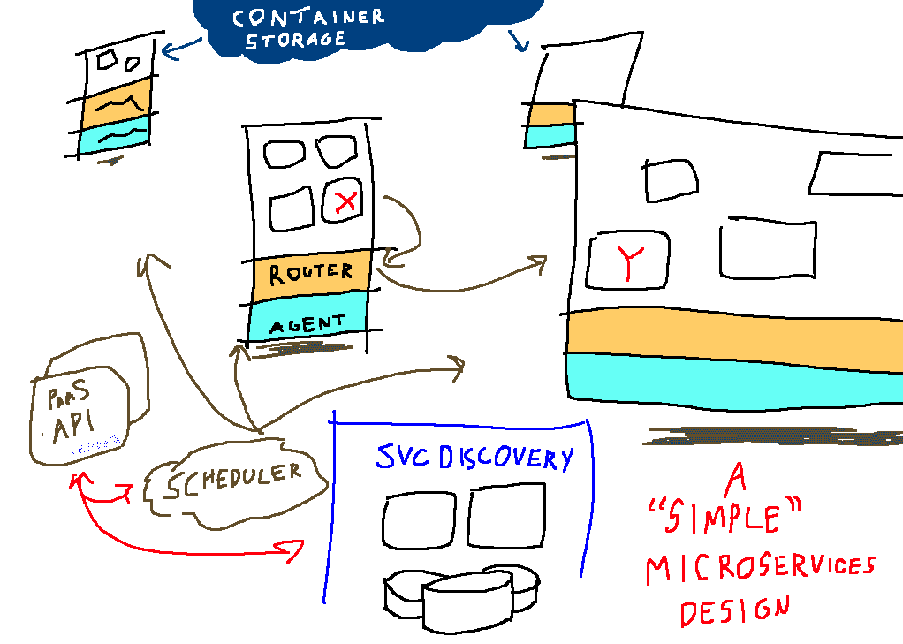
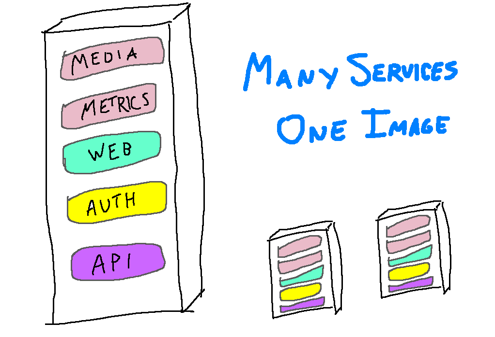
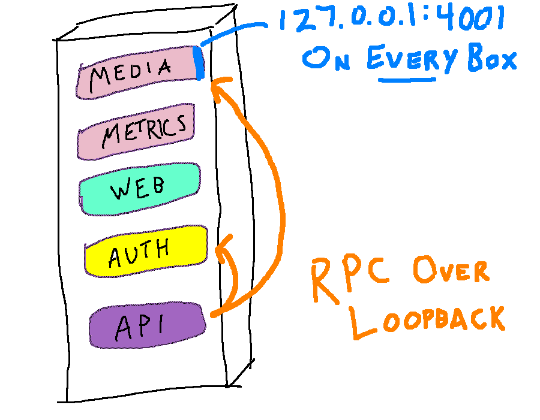
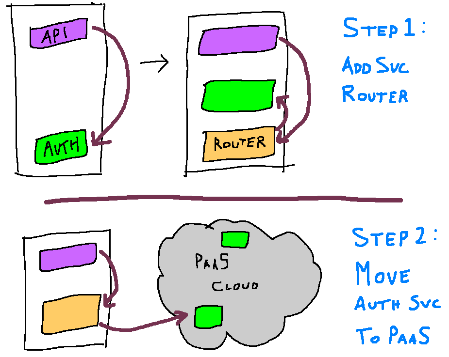

# 新巨石——不死之身

> 原文：<https://inconshreveable.com/10-07-2015/the-neomonolith/?utm_source=wanqu.co&utm_campaign=Wanqu+Daily&utm_medium=website>

# 新巨石柱

##### 艾伦·史瑞夫

## 整体还是微服务？

在现代硅谷初创企业的时代精神中，一家成长中的软件公司的首席技术官面临着一个关键的决定。羽翼未丰的软件服务会是一个整体还是微服务？风险很高:重写是以人-年来衡量的。

对于这两种方法到底孰优孰劣，业界并没有达成共识。尽管有这种矛盾心理，但有两点是普遍一致的:

1.  超过某个门槛的巨石最终会被打碎。在足够大的范围内，只有面向服务的设计才是可行的。
2.  只有两个选择。要么面向服务，要么独一无二，你必须做出选择。

## 问题是

已经有很多文章从总体上对比了整体式和微维护式设计的优缺点。这个领域已经被广泛覆盖，所以我在这里省略了对它的讨论。相反，我们将更关注业务的初始阶段。neomonolith 最适合这个形成期:规模小，代码以极快的速度变化。

你可以从一整块开始。有时这被称为牺牲性架构，因为不可避免地要大规模过渡到服务。它会使你立即快速地进步，但不可避免地会使你的代码库僵化在破碎界面的卡夫卡式的纠缠中。这可能是一个合理的权衡:如果企业失败，技术债务就无关紧要了。

或者，您可以从一开始就构建微服务架构。这样的设计有很高的溢价。您必须站起来操作新基础设施，其中大部分是非标准化，阿尔法质量和快速变化。此外，使用 monolith，监控、警报、配置和本地开发工作只需支付一次费用。但是对于微服务设计，必须为每个服务支付成本。对于一家初创公司来说，从微服务开始是一个如此冒险的提议，以至于许多设计的支持者建议首先构建 monolith。

## 错误的建筑二分法

这个架构问题是一个错误的二分法:有一个中间的混合选项。我称之为新巨石。neomonolith 是初创公司构建的新生系统的卓越设计。它结合了两种方法的优点和一系列不太麻烦的缺点。我已经非常成功地应用这种模式建造了 ngrok.com 的[和 T4 的【equinox . io】](https://ngrok.com)。

这里描述的想法不是新的。甚至这种重新包装也不是真正的新颖。其他努力也促进了类似的架构设计，但大多数都是在特定语言或框架的上下文中表达的。neomonolith 模式并不局限于特定的语言或框架——事实上，它的优势之一就是能够容忍实现语言中的异构性！

## 什么是 Neomonolith？

neomonolith 可以被概念化为微服务架构的特例部署。

像微服务架构一样，neomonolith 由小型独立服务组成，这些服务通过定义良好的 RPC 接口进行通信。但就像一块巨石，每台机器运行相同的代码集。每台服务器都是一个完全相同的镜像，运行*所有*单独的服务。所有服务在主机启动时启动，在主机关闭时停止。

服务通过环回接口上绑定的端口相互通信。一个服务监听同一个端口，而不管它运行在哪个主机上，这样就不需要任何服务发现系统。

容器是可选的。如果您正在努力解决行为不当的服务之间的资源争用问题，它们可能会有所帮助，但是如果您不准备预先支付它们的运营成本，它们很容易在以后添加。

## 两全其美

neomonolith 集两者之长，结合了整体式和微维修式的优点:

### 微服务优势

*   **开发的独立性** -服务可以独立开发，甚至在不同的代码库中
*   **部署的独立性** -可以部署服务而不影响其他服务
*   **故障的独立性** -例如，一个进程中的文件描述符泄漏不会影响同一主机上的其他进程
*   **强制接口和单一责任原则** -服务很小，必须通过定义良好的接口进行通信
*   语言/框架的异构性——服务通过 API 进行通信，如果效率更高的话，允许团队“使用合适的工具”

### 整体优势

*   **没有编排复杂性** -所有机器运行一组相同的代码和流程
*   **无动态服务调度** -服务启动时启动，关闭时停止
*   **无服务发现** -服务监听所有主机上的同一个端口
*   **轻松扩展** -可以通过在负载平衡器后部署具有相同映像的额外机器来增加容量
*   **推迟分布式系统问题** -使用回环使您能够推迟由不可靠网络引起的不常见故障的稳健处理[【3】](#3)

列出的三个好处都是以“不”开头的。任何操作过大型系统的人都明白这是为什么。您运行的每一个额外的基础设施都是运营负担；每增加一个失败点。必须建立机构知识和软件来配置、监测和预警这些新的部分。

但除此之外，典型微服务 PaaS 部署的基础设施还承担着另一项经常被忽视的成本。生产基础设施的复杂化使得软件系统更难推理。建立整个系统如何运作的心理模型变得更加困难。这使得生产事件更难调试:“这是我们的代码，还是 PaaS 的问题？”它还增加了开发所需的知识和工具，提高了新程序员的门槛。

neomonolith 消除了所有这些复杂性，极大地简化了软件系统。仍然困扰微服务 PaaS 安装的问题通常不是问题。部署只需要在过去 10 年中从事过运营的人熟悉的久经考验的工具。

## 缺点

*   **无扩展独立性** -您必须横向扩展所有服务，以满足资源最密集的服务的需求
*   **需要在操作工具**上投资——对于每项服务，监控、警报和本地开发必须重复或可重用
*   跨 RPC 接口重构 -这仍然比重构一个整体的功能更困难
*   **有限的故障隔离** -如果一个服务终止，它的消费者就不能与另一个运行在不同主机上的服务对话

neomonolith 不是万能药。它既有整体系统的缺点，也有面向服务系统的缺点。这比开始 monolith-first 需要更多的努力，而且它不会像亚马逊或谷歌的面向服务的系统那样永远向外扩展。另一方面，我们中的大多数人不会在那个范围内跑步。重要的是要记住，不运行成千上万的机器*是一个优势*,你应该利用它。

## 过渡到完整的微服务设计

一旦工具改进和成熟，你是否先从一个献祭的巨石开始就没有问题了。但是现在，[还不是未来](http://blog.circleci.com/it-really-is-the-future/)。

**neo monolith 最重要的一个好处是为全面部署微服务平台即服务铺平了道路**。在定义 RPC 接口和确定服务范围方面的前期投资意味着，当您准备好在 Mesos/CoreOS/Kubernetes 集群上部署时，不需要对架构进行重大更改。切换到服务发现或集群代理而不是使用环回是一项以周而不是年来衡量的任务。此外，PaaS 元素可以逐步添加，以实现平稳过渡。例如，画出一个假想开关的前两步:

简而言之，今天从 neomonolith 开始不仅为您提供了一大堆开发优势，而且如果您必须升级到更传统的面向服务的设计，它还可以让您的工程团队在未来轻松过渡。

## 录像

我在 GopherCon 2015 上做了一个闪电演讲，这是这件作品的精神先驱，我把这个设计称为“乐高积木”。

<iframe src="https://www.youtube.com/embed/3Mvk3XkKiak?list=PL2ntRZ1ySWBeHqlHM8DmvS8axgbrpvF9b" frameborder="0" allowfullscreen="true">VIDEO</iframe>

1.  微服务/整体材料权衡
2.  现有技术
3.  是的，当你溢出内核缓冲区时，回送可能会失败，尽管我还没有观察到这种情况在生产中发生过。对于网络问题，您是否选择推迟错误处理和重试当然取决于您对该特定操作的容错能力。