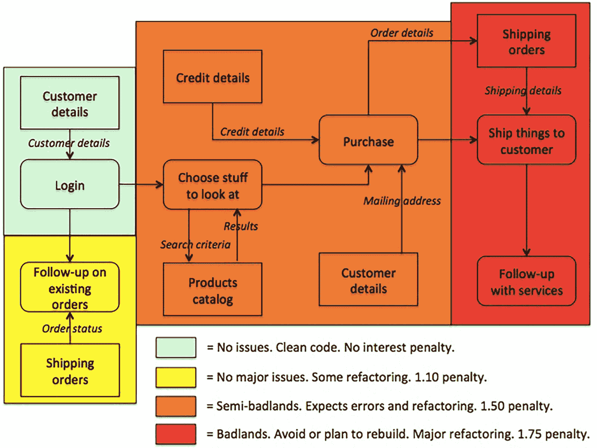

# 18F:数字服务交付|管理技术债务

> 原文：<https://18f.gsa.gov/2015/10/05/managing-technical-debt/?utm_source=wanqu.co&utm_campaign=Wanqu+Daily&utm_medium=website>

在[上一篇文章](https://18f.gsa.gov/2015/09/04/what-is-technical-debt/)中，我们谈到了拥有大量技术债务的潜在后果。现在，我们将为您提供具体的步骤来识别并管理技术债务，使其不会失控。

为了有效地管理它，您需要:

*   确定你有什么债务
*   使其在决策时可见
*   决定如何处理这件事(例如，还清债务，接受现实)
*   实施变革以减少或消除 it 的影响

## 识别技术债务

通过查看你的各种账户报表(抵押贷款、信用卡等),很容易知道你欠了多少金融债务。).另一方面，技术债务并不那么明显，这使得识别它成为一个挑战。令人欣慰的是，有许多指标(或警告，以便更深入地研究)可以帮助您和您的开发人员认识到这一点。

*   **速度减慢的速率。**速度是对开发团队在特定时间间隔(例如，两周)内可以完成多少工作的度量。假设所有其他的事情都是相同的(例如，团队组成没有改变)，如果速度在几个迭代的过程中开始变慢，这可能是太多技术债务已经堆积并且现在正在损害开发生产力的迹象。

*   压力释放。如果开发团队在发布周期结束时处于极度压力之下，技术债务可能是根本原因。如果发布过程要求开发团队进入“[紧缩模式](http://chadfowler.com/blog/2014/01/22/the-crunch-mode-antipattern/)”来修复不可预见的问题，比如不完整的集成构建和软件崩溃，那么你就会知道代码库有问题。

*   **老龄化图书馆。如果你的软件使用了新版本的库，这代表了技术债务。当那些库是落后的“主要版本”(例如，EJB 2 对 EJB 3，设计 1 对设计 3)，或者更糟，不再被维护，那么你的项目深陷技术债务。**

*   **缺陷。缺陷或 bug 可以告诉你很多关于产品质量的信息。高功能的敏捷团队在发现错误时就修复它们，不要让它们累积。例如，如果[打开的缺陷](https://help.rallydev.com/sites/default/files/multimedia/Defect%20Trend%20Chart.png)或[逃脱的缺陷](http://www.agilebok.org/index.php?title=Escaped_Defects)的数量随着时间的推移呈上升趋势，这是技术债务的一个强有力的指标。**

*   自动化测试代码覆盖率低。 [代码覆盖工具](http://stackoverflow.com/questions/195008/what-is-code-coverage-and-how-do-you-measure-it)可以自动告诉你你的软件有多少代码被一组[自动化测试用例](https://en.wikipedia.org/wiki/Test_automation)覆盖，这些用例是使用测试框架编写的，比如 [JUnit](http://junit.org/) (针对 Java)和 [RSpec](http://rspec.info/) (针对 Ruby)。开发人员经常查看[单元测试](http://martinfowler.com/bliki/UnitTest.html)覆盖了多少百分比的代码，以试探性地衡量其质量，至少在可维护性方面。对于单元测试代码覆盖率的目标度量的意义，开发社区中有[的争论](http://stackoverflow.com/questions/90002/what-is-a-reasonable-code-coverage-for-unit-tests-and-why)，但是他们似乎普遍同意覆盖率超过 90%是一个好的迹象，任何低于这个数字的都是潜在的担忧。例如，覆盖率低于 75%可能表明存在严重问题。

*   **其他软件质量测量。**除了代码覆盖率之外，还有许多其他有用的软件质量度量标准，可以使用诸如 [SonarQube](http://www.sonarqube.org/) 之类的工具来自动测量。例如，[编码标准违反](https://en.wikipedia.org/wiki/Coding_conventions)、[循环依赖](https://en.wikipedia.org/wiki/Circular_dependency)、[圈复杂度](https://en.wikipedia.org/wiki/Cyclomatic_complexity)、[重码](https://en.wikipedia.org/wiki/Duplicate_code)。对于这些示例指标中的每一个，测量值越低，质量越好。

*   **热图。**热图是了解您的技术债务所在的重要工具。要创建热图，请开发团队对软件的组件进行建模，并对每个组件进行着色，以表示添加新功能或对系统部分进行更改的相对复杂性。换句话说，哪里有平稳的航行或汹涌的波涛。像意大利面条式的代码，缺乏自动化测试代码覆盖等等。这可能是为什么地图上的一些地区比其他地区更具挑战性。请参见下面的热图示例。

*   **通用代码气味。** [代码气味](https://en.wikipedia.org/?title=Code_smell)表明软件设计中的潜在弱点。它们通常不是妨碍软件正常运行的错误，而是“代码中的某些结构，表明违反了基本设计原则，并对设计质量产生了负面影响”([维基百科](https://en.wikipedia.org/wiki/Code_smell))。例子包括重复的代码、长方法和有太多实例变量的类。这样的设计弱点可能会减缓开发速度，或者增加将来出现错误或失败的风险。鼓励你的开发人员注意代码的味道，当他们“闻到”一些东西时，让他们检查一下，以确定是否真的有问题。

## 让技术债务变得可见

在您确定了技术债务在您的代码库中的位置之后，下一步是让它对整个团队可见，包括管理层，用于决策目的。这里的挑战是提供关于需要做什么工作的足够信息，以及相关的成本、收益和风险，以便团队可以在修复技术债务或构建新功能之间做出明智的权衡决策。非技术利益相关者倾向于后者，这可能很快导致系统失控。这里有三种方法可以帮助克服这种偏见。

[第一种方法](http://kingsinsight.com/2010/07/31/estimating-the-impact-of-technical-debt-on-stories-heat-maps/)是将技术债务纳入开发成本，这可以更好地理解偿还或不偿还技术债务的价值。你可以使用我们的朋友热图来做这件事，如下图所示。

 *来源:[修改自詹姆斯·金](http://kingsinsight.com/2010/07/31/estimating-the-impact-of-technical-debt-on-stories-heat-maps/)* 的一篇帖子

正如您所看到的，每个软件组件都被涂上了颜色，以表明处理该部分代码的相对复杂性。每种颜色都有一个数字因子。这代表了开发人员在评估任务时应该考虑的额外工作或利息损失。例如，最初估计为四小时的红色组件的更改应该修改为七小时(四小时乘以系数 1.75)，或三小时的额外工作。这是揭示背负过多技术债务的利息惩罚是什么的绝佳方式。

第二种方法是[维护定义技术工作包](http://www.infoq.com/articles/managing-technical-debt)的技术待办事项清单。每个包装应传达以下信息:

1.  对需要完成的工作的简要描述(例如，通过将认证代码移动到自己的*认证*类中，在*用户*类中重新构建认证代码)

2.  估计解决债务需要多长时间(例如，三个小时，两个故事点)

3.  对代码中固有的债务金额的估计，不需要很精确，因此可以使用序数尺度来表示(例如，“低”、“中”或“高”)

4.  对代码段将来被读取或更改的概率的估计，也可以用序数标度来表示

第三种方法是使用诸如 [SonarQube](http://www.sonarqube.org/) 之类的工具将技术债务货币化。这些工具计算修复产品中累积的技术债务的成本。例如，他们可能在一个有 50 万行代码的应用程序中报告 200 万美元的应计债务，这将需要每行代码花费 4 美元来偿还债务。这些工具不仅可以报告宏观层面的技术债务，还可以报告微观层面的技术债务。例如，检测特定的重复代码块以及修复它的相关成本。

无论您使用哪种方法让决策者看到技术债务，用量化术语(例如，美元、劳动时间或故事点)表达它的成本允许您[建立关于产品可以累积多少债务的信用限制](http://theagileexecutive.com/2009/09/29/technical-debt-on-your-balance-sheet/)。例如，当技术债务达到一定水平时(例如每行代码 25 美分)，所有新功能都被搁置，直到债务减少到可接受的水平。这迫使产品团队在事情失去控制之前投资控制债务。

## 决定如何处理技术债务

在你让所有人都看到你的技术债务后，下一步是决定如何处理它。Frank Buschmann [描述了三种债务支付策略](http://www.computer.org/csdl/mags/so/2011/06/mso2011060029-abs.html):

*   **债务偿还**。重构或替换被认为是技术债务并让你头疼的代码、框架或平台。(对于那些不熟悉技术术语的人来说，[重构](https://en.wikipedia.org/wiki/Code_refactoring)是在不改变功能的情况下改进或简化代码的过程。)

*   **债务转换**。用一个“好的，但不完美的”替代方案取代当前的解决方案。新的解决方案利率较低。如果构建一个完美的解决方案非常昂贵，这可能是一个不错的选择。

*   **只需支付利息**。活在代码中。这可能是一个好的选择，如果:(a)重构比处理不太正确的代码更昂贵；(b)代码很少或从未被阅读或更改；(c)代码没有实现重要的需求，因此不需要优雅的解决方案；或者(d)系统是否已经达到其寿命终点或者将被重新开发。

作为决定使用哪种支付策略的一般原则，您希望确保代码的重要部分尽可能的干净(经济)。

## 解决技术债务

在决定支付策略后，下一步是对你的产品进行修正。这需要将工作融入您的开发周期:

*   对每个特性或修复进行重构。每当有一个新特性依赖于脆弱或充满 bug 的代码时，都要花额外的时间为新的改进创造一个良好的基础。

*   每次迭代或发布的质量改进。产品开发团队为每次迭代或发布留出一定比例的时间(例如，10 %)来偿还技术债务。如果由于任何原因，没有任何优先的 bug 修复，团队可以致力于提高测试覆盖率和代码库的重构区域，这可能是即将到来的 sprints 所需要的。

*   注重质量的发布。团队为一个专门致力于修复大量错误、清理代码库和改造架构的发布预算时间。这对于需要大规模改变的时候非常有用。

*   管理产品积压。如果你正在使用敏捷方法，比如 [Scrum](https://en.wikipedia.org/wiki/Scrum_(software_development)) ，你可以捕获技术工作包(如上所述)作为用户故事，并将它们包含在[产品待办事项](https://www.mountaingoatsoftware.com/agile/scrum/product-backlog)中。然后，您可以为即将到来的迭代周期中的实现区分这些用户故事的优先级。

在我们的下一篇文章中，我们将回顾[防止你的下一个项目积累技术债务](https://18f.gsa.gov/2015/10/22/preventing-technical-debt/)的方法。