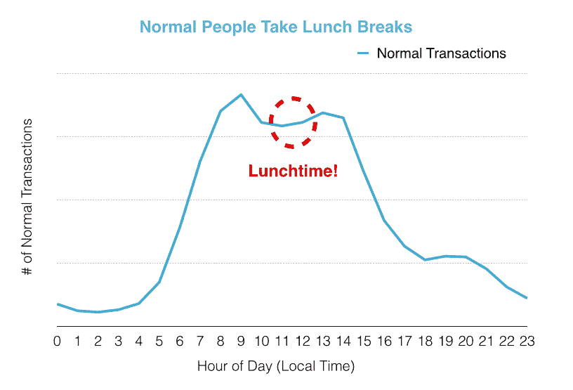
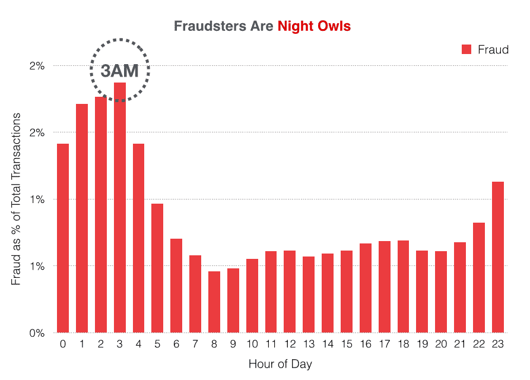
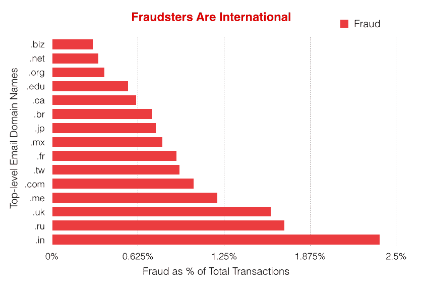
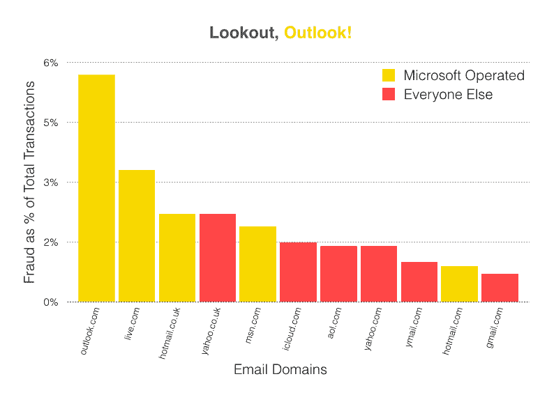
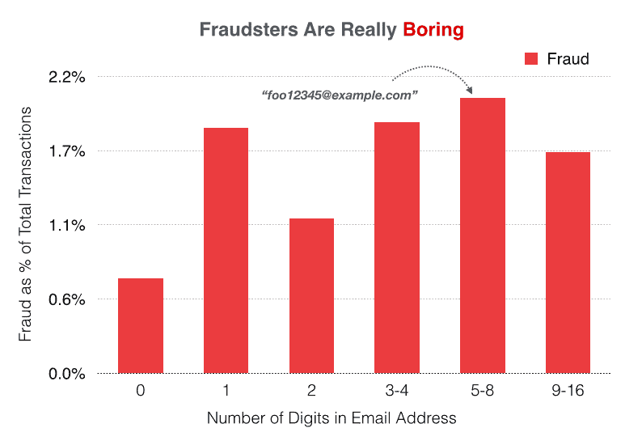
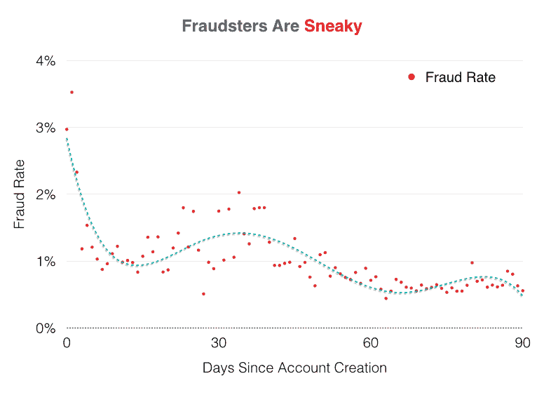

# 高度欺诈用户的七个习惯

> 原文：<http://blog.siftscience.com/blog/seven-habits-of-highly-fraudulent-users?utm_source=wanqu.co&utm_campaign=Wanqu+Daily&utm_medium=website>

在 Sift Science，我们分析大量数据。我们每月从万亿字节的数据和超过 10 亿次的全球事件中实时提取欺诈信号。之前，我们发现[美国比尼日利亚](/global-e-commerce-fraud)有更多的欺诈行为，并解开了[佛罗里达州多拉尔](/behind-the-signal-doral-fl)的谜团。在上周的“猫的黑客”黑客马拉松上，我决定测试一下我们的一些欺诈信号。通过与我们的[机器学习](http://siftsciblog.wpengine.com/what-is-machine-learning-intro/)工程师 Keren Gu 合作，我们发现了一些有趣的欺诈模式[1]:

## **习惯 1:欺诈者挨饿**

<noscript></noscript>

当我们按小时查看非欺诈性(正常)交易总量时，正常用户早上起床很慢。我们注意到午餐时间交易量略有下降，怀疑这是因为人们正在午休！吃饱后，它们在下午恢复活动，随着用户回家，活动逐渐停止。

诈骗犯呢？

<noscript>T3】</noscript>

然而，诈骗犯会在午餐时间工作。在欺诈样本中，我们没有看到午餐时间活动的同样下降。欺诈者似乎正忙于策划他们的下一步行动。

## **习惯 2:欺诈者是夜猫子**

<noscript>T3】</noscript>

当我们分析欺诈性交易占所有交易的百分比时，**凌晨 3 点**是一天中欺诈性最强的时间，通常夜间是更危险的时间。这一发现与我们的历史发现是一致的，也是有意义的:当员工不在身边监督欺诈时，欺诈者更有可能在正常工作时间之外实施攻击。

## **习惯 3:欺诈者是国际性的**

<noscript>T3】</noscript>

与其他顶级域名相比，印度电子邮件地址域名的欺诈率最高。然而，不要放弃那些伟大的宝莱坞电影！我们只看过去三个月的数据。我们已经看到，根据欺诈者使用的新策略，这个列表会有很大的波动。

## **习惯 4:诈骗者拥有多重身份**

<noscript></noscript>

欺诈者倾向于在他们的笔记本电脑或手机上创建多个帐户来实施欺诈。当多个帐户与同一设备相关联时，欺诈的可能性就越大。上图显示了在给定与用户设备相关联的账户数量的情况下，用户被欺诈的可能性增加了多少倍。唷，那是一口！换句话说，一个笔记本电脑上有 6 个账户的用户比普通人更有可能欺诈。然而，只有一个帐户的用户不太可能是欺诈性的。

## **习惯 5:欺诈者仍然使用微软**

<noscript>T3】</noscript>

一些最具欺诈性的电子邮件域是由微软运营的。为什么会这样？两个可能的原因是:1)微软已经存在了很长时间，2)电子邮件地址在当时更容易创建。如今，网站使用挑战响应，如[图像验证](http://en.wikipedia.org/wiki/CAPTCHA)或[双因素认证](http://en.wikipedia.org/wiki/Multi-factor_authentication)来验证您的[tooltip tip="and innocent！"]合法的[/tooltip]身份。

## **习惯 6:骗子真的很无聊**

<noscript>T3】</noscript>

最广为人知的欺诈预测指标之一是电子邮件地址中的位数。数字越多，越有可能是欺诈。为什么？因为诈骗犯很无聊(也很懒)。他们使用计算机程序依次生成电子邮件地址，这样他们就不必考虑新的地址。“foo1234@test.com”或“foo1234568@testing.com”之类的邮件高度可疑。然而，仅使用电子邮件地址来检测欺诈可能非常困难。真正擅长检测欺诈的唯一方法是查看数百个信号，有时是数千个信号(这是机器学习可以帮助的地方)。

## **习惯 7:诈骗者[狡猾](http://www.wired.com/2014/07/how-hackers-hid-a-money-mining-botnet-in-amazons-cloud/)T3】**

<noscript>T3】</noscript>

欺诈者喜欢创建短期的一次性账户。在分析欺诈用户帐户的年龄(即帐户创建和欺诈交易之间的时间)时，我们发现他们在网站上注册，然后迅速实施欺诈。帐户年龄越长，用户实施欺诈的可能性就越小。尽管如此，有经验的欺诈者知道欺诈检测公司会跟踪这种类型的信号。在上图中，我们注意到“潜伏”欺诈代理在账户创建 30 天和 60 天后开始活跃。诈骗犯都是偷偷摸摸的！

显然，以上并不是一个确定的样本集。数据可以帮助我们找到欺诈者行为方式的潜在答案，但正如统计学家所说，“相关性不是因果关系”！在应对欺诈时，运用常识和人类直觉非常重要。

这些见解由以下内容带给您:

<noscript>T3】</noscript>

你喜欢阅读这些见解和模式吗？您对其他哪些欺诈信号感兴趣？请在评论中告诉我们，我们将挑选一些在下一期文章中讨论！

[1] *数据是从过去三个月的整个网络中收集的。从那段时间我们处理的上亿笔交易中，我们分析了大概 600 万笔。我们的“欺诈”样本包括被我们的客户确认为欺诈的交易；我们的“正常”样本包括被我们的客户确认为非欺诈性的交易，以及未标记的***交易的子集。请记住，每个公司都面临不同类型的欺诈，我们的调查结果可能不代表您所看到的情况。所有事务时间戳对用户来说都是本地的。**

 *### *相关**