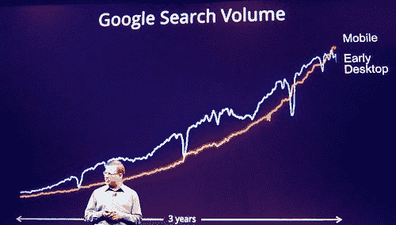
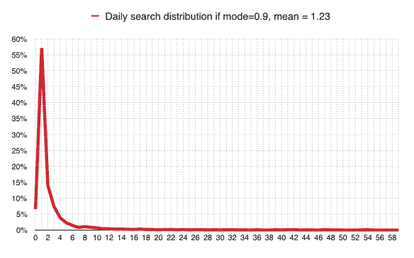

# 谷歌越来越大的问题:50%的人每天在移动设备上进行零搜索

> 原文：<https://theoverspill.wordpress.com/2015/10/19/searches-average-mobile-google-problem/?utm_source=wanqu.co&utm_campaign=Wanqu+Daily&utm_medium=website>

 
*】阿密特·辛格哈尔 2011 年展示了移动搜索量与“早期桌面时代”的比较。尼尔·肯尼迪在 Flickr 上的照片。*

谷歌搜索业务负责人阿密特·辛格哈尔在 Re/Code 大会上透露了几个有趣的统计数据——最有意思的是[每个月谷歌收到的所有搜索中有超过一半来自手机](http://blogs.wsj.com/digits/2015/10/08/google-says-mobile-searches-surpass-those-on-pcs/)。(这不包括平板电脑。)

这相当于**每部智能手机每天不到一次搜索**。我们一会儿就知道为什么了。

首先，让我们加入一些更公开的数据。每月谷歌搜索量超过 1000 亿次(桌面/平板/移动搜索总量)。
·每月约有 14 亿活跃的谷歌 Android 设备。(资料来源:桑德尔·皮帅，Nexus launch。)
Google Play 月活跃用户约 10 亿。(资料来源:桑德尔·皮帅，Nexus launch。)
全球约有 15 亿台电脑在使用。
全球约有 4 亿部 iPhones 在使用。其中大约有 1 亿人在中国。(分析师估计。)
、约 1 亿部其他智能手机在使用中(7000 万部 Windows 手机，3000 万部黑莓手机)
、移动搜索市场的收入仅为桌面搜索市场的三分之一。(资料来源:[罗伯·莱瑟恩](http://twitter.com/robleathern/status/652560800842813440)，转自 IAB 2014 年报告。)

Singhal 已经在 7 月份表示，在 10 个国家，手机的销量已经超过了台式机；现在是面向全世界。当然，谷歌的数据实际上不包括中国，因为谷歌在中国没有任何业务。(安卓手机和 iPhones 都默认使用本地搜索引擎百度；谷歌在中国大陆被禁止使用，尽管人们可以使用它，但绝大多数人都不使用。)

所以让我们把这些数字放在一起。总共有 1400 部谷歌 Android + 400 部 iphone——100 部 iphone 在中国境内+ 100 部其他= 18 亿部智能手机在中国境外使用。
每月 500 亿次移动搜索=每 30 天 500 亿次

## 今天不是搜查的日子

算算！500 亿/(1.8 亿* 30) =每天 0.925 次移动搜索。(即使排除 Windows 手机和黑莓手机，你每天仍能获得 0.98 次移动搜索。)

没错——普通人每天在手机上进行的谷歌搜索不到一次。众数(最常见的数字)也会低于这个数字。在 30 天的时间里，手机谷歌搜索的平均次数是 27.8 次。

对于台式机+平板电脑搜索，你会得到大致相同的数字——假设 15 亿台个人电脑和 3 亿台平板电脑。但并非所有这些设备都可以用来进行搜索:许多个人电脑放在企业环境中，它们没有连接到互联网，或者不能用来进行谷歌搜索:想想呼叫中心、商店收银台或工厂中的所有机器。它们减少了可用于查询的潜在基数，因此提高了每个活跃 PC/平板电脑每月查询的实际平均值。

基于
全球个人电脑用户中，企业用户和个人用户的比例大约是 60:40，因此 9 亿和 6 亿
猜测其中 50%的企业电脑，即 4.5 亿台不能进行谷歌搜索

那么，可供谷歌查询的个人电脑/平板电脑总数为 6 亿台个人电脑+4.5 亿台企业电脑+ 3 亿台平板电脑，即 13.5 亿台设备。

对 13.5 亿台设备每月 30 天的 500 亿次搜索进行计算，你会得到每月 37 次搜索，即平均每天 1.23 次搜索。众数(最常见的数字)很可能是 1，但中位数(后面的人数是前面的一半的点)会更高。可能不会高太多——这将是一个非对称分布，其中大部分(入)行为位于低端，因此它可能看起来像一个[泊松](https://en.wikipedia.org/wiki/Poisson_distribution)或[帕累托](https://en.wikipedia.org/wiki/Pareto_distribution)函数。

## 桌面:她走得很稳

这是我对搜索分布的粗略模型，通过将我们知道的数字插入到一个[帕累托生成器](http://www.had2know.com/academics/pareto-power-distribution-random-generator.html)中，然后对每天的搜索次数 N =整数做一个分布函数。

这是它在桌面上的样子，使用的模式(最常见)是每天 0.9 次搜索，平均值是 1.23 次:

谷歌桌面上每人每天搜索次数的估计概况。

这就是说，在任何一天，大约 55%的人只进行一次搜索，不到 15%的人进行两次搜索，不到 5%的人进行四次搜索，等等。比例很小，但绝对数字很大。谁做什么搜索并不固定；所以昨天搜索 0 次的人明天可能会搜索 10 次。但同样，昨天搜索 10 次的人今天什么也没做，或者只做了一次或四次。诸如此类。

(得到这个形状需要一些实验；使用更高的模式意味着进行零搜索的数量本身就是零，这没有意义:肯定有一些人偶然或故意没有在一天内访问过谷歌。在这里，每天做零搜索的用户比例是 6.5%，这似乎是合理的。)

当你看累积百分比时，它是如何分解的:

我的模型表明，大多数人不做很多搜索，但几乎每个人都做一些。

请注意，很多人不会做很多搜索，但是很多人会做一些 T2 搜索。进一步证实:美国在线在 2006 年发布的数据(仅针对桌面用户)是“三个月内来自约 65 万用户的约 2000 万条记录”，也就是说在那 90 天内平均每人有 31 条记录，或者说每天有三分之一的查询。2006 年的 AOL 用户可能无法与今天的 Google 用户相提并论，但这是一个有用的检验，证明这里的数字可能大体上是正确的。

顺便说一句，现在的很多搜索都是非常简单的。观察人们使用桌面。最常见的谷歌查询是“脸书”。可能是下一个最常见的？“雅虎”、“Gmail”和“Hotmail”。人们在谷歌搜索框或浏览器搜索栏中输入这些内容，就可以访问这些网站。对于技术观众来说，这是令人震惊的——*为什么有人会这样做？*——但这是可以观察到的行为。还记得 2006 年的 [AOL 数据泄露事件吗？那里的数据显示，当文本框为空时，一些人习惯于点击“搜索”*，这反过来意味着一些广告商在短语“搜索词”(过去是框中的文本)上获得 AdWords 点击。*](http://www.theguardian.com/technology/2006/aug/31/searchengines.wikipedia)

 *## 手机:一切都变了

然而在手机上，事情就不一样了。一般来说，人们不会在手机浏览器的搜索栏中输入“脸书”或“Gmail”。他们使用相关的应用程序——脸书或电子邮件。这种行为无疑是移动搜索长期落后于桌面搜索的一个重要原因，尽管智能手机的使用已经激增，花在智能手机上的时间比个人电脑长，而且一段时间以来他们一直在推动可比的安装基础。

因此，使用台式机/笔记本电脑的人可能会在打开浏览器时输入“脸书”来完成他们“平均”每天一两次的搜索，但在移动设备上这不会发生，因为它不需要发生；他们只要打开应用程序。

对谷歌来说，这意味着它正在失败，尽管谷歌搜索是每一部安卓手机的核心(根据谷歌作为其移动应用设备协议一部分的指示，MADA)。一般来说，人们不怎么在手机上搜索。回想起来，谷歌的奇迹是通过积累数百万次罕见的行为——人们进行搜索，然后点击广告——建立了一个数十亿美元的业务。当然，谷歌通过在搜索结果页面顶部填充广告来帮助后一种活动，并使[更难从搜索结果中区分出](http://www.benedelman.org/adlabeling/google-colors-oct2014.html)。但这仍然是一项了不起的成就。

我试着为手机上的搜索活动建模:我使用了均值= 0.925(根据 Singhal)和众数= 0.5。由于较高值的长尾效应，众数必须低于平均值；0.5 是一个猜测，但移动它不会有很大的影响。这给出了 0.94 的中值，接近平均值，这也是你所期望的。

如果移动搜索遵循幂定律，它可能看起来像这样。

你可以看到(如果我们允许这些假设，我认为是合理的——记住它们是基于谷歌自己的数据),那么只有 5%的用户平均每天进行 7 次以上的搜索。这非常像桌面场景。

在桌面上，大多数人不会进行超过 7 次的搜索，但是大多数人也不会进行一次搜索。

但是这里的情况突然和桌面有了很大的不同:虽然每天搜索超过 7 次的比例大致相同(5%左右)，但是有更多的人从来没有超过 0 次。

顺便提一下，这呼应了 Horace Dediu 在 2014 年 4 月的分析，当时他指出互联网人口正在快速增长，但[谷歌来自非美国/英国来源的收入并不](http://www.asymco.com/2014/04/17/on-the-future-of-google-part-2/):美国/英国用户似乎每年产生约 86 美元，而该空间之外的用户每年仅产生 12 美元。(当然，这张照片可能会被谷歌的税收安排扭曲。)

因此，谷歌面临的问题是:个人电脑用户数量停滞不前，甚至在下降，而智能手机用户数量却在增长。但后者倾向于不使用搜索，因此看不到最赚钱的广告。(有应用内广告，但与其他搜索广告相比，它们能产生多少收入一直不是很清楚。有人怀疑，如果它们对谷歌来说非常有利可图，谷歌就会向它们兜售自己的“运行率”。)

因此，谷歌鼓励人们更多地使用移动网络；此外，值得注意的是，扩展到简单的搜索以外的服务，如 Google Now，现在随时可用，以及几乎任何东西。从这个角度来看，谷歌重组为 Alphabet 是有意义的:它寻求尽快激发尽可能多的潜在赚钱的新想法，而搜索和搜索收入仍在增长，并且在移动业务的增长真正拉低平均水平之前。德迪乌在上面的链接中指出，2016 年可能标志着互联网人口增长开始趋于平稳。大部分新增内容将仅限于手机。

你可以从谷歌的财务数据中最清楚地看到这种影响，其中讨论了它获得的付费点击次数和每次点击的成本。将两者结合在一起并不需要太多的努力就可以得到“每次点击的总支付额”。

付费点击量上升，点击费下降。来源:谷歌金融。

很清楚的是
(a)付费点击的数量急剧增加——自 2005 年底(图表开始的地方)以来增加了近 9 倍
(b)尽管谷歌在 2011 年年中尽了最大(也是最成功的)努力来支撑它，但每次点击费用仍在稳步下降
(c)将两者结合起来看，收入的增长速度远不及付费点击。换句话说，谷歌的新用户和新平台不如旧平台有价值。

## 最后

那么我们得出什么结论呢？移动搜索对谷歌来说是一个真正的问题:人们并不像你想象的那样喜欢它。但是，在用户如此沉迷于手机应用的情况下，没有明显的方法来改变这种行为——而且没有迹象表明这种情况会很快改变，不管新闻机构是否希望人们使用移动网站(线索:大多数人通过脸书在线获取新闻)。

这是目前移动性的结构性现实。购买 Android 并使其免费可用是一种防御性举措，目的是阻止微软成为移动网络的看门人..).

但事实证明，搜索实际上并不是手机的看门人；拥有一个库存充足的应用商店才是。这是寻找真正发生的地方。现在谷歌面临移动网络的第二阶段。它的答案会是什么？

### 像这样:

像 装...

### *相关**