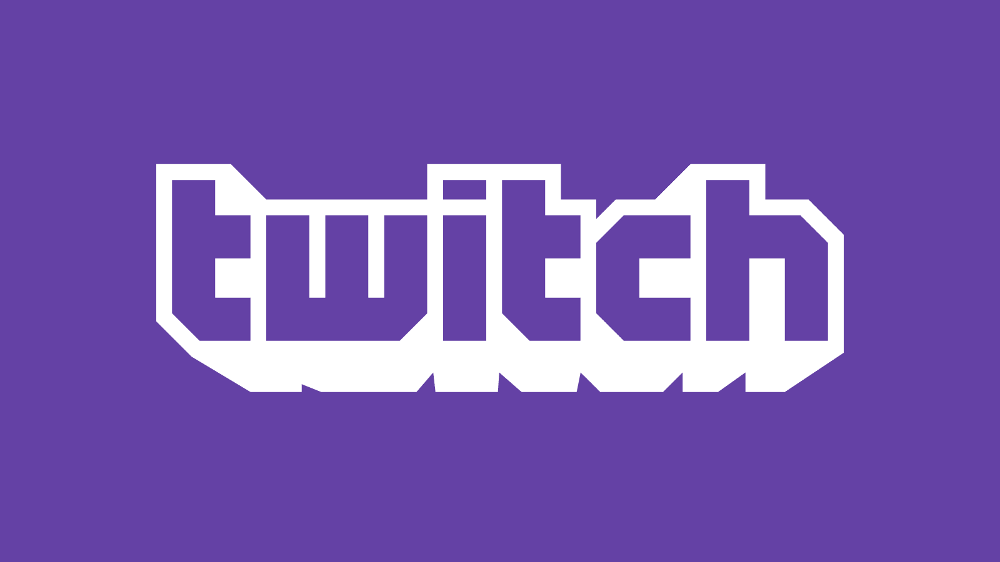
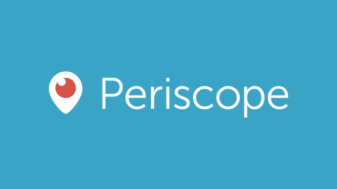
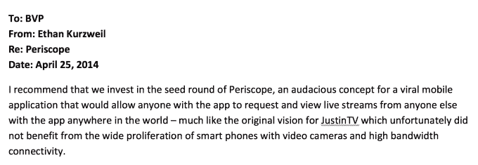
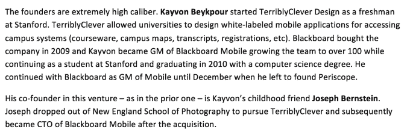
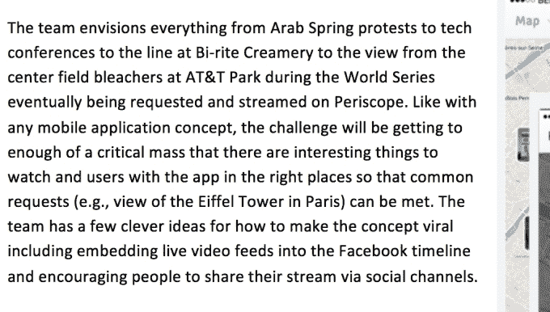
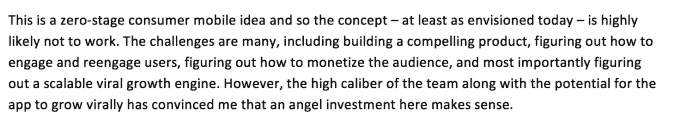

# 看看 Twitch 和 Periscope TechCrunch 的内部备忘录

> 原文：<http://techcrunch.com/2015/10/18/can-the-past-help-a-vc-predict-the-future/?utm_source=wanqu.co&utm_campaign=Wanqu+Daily&utm_medium=website>

伊森·库兹韦尔撰稿人

More posts by this contributor

Bessemer 正在积极投资消费视频初创公司。这是一个我们已经关注了一段时间的领域。2012 年，在 Twitch 从 JustinTV(去年[以大约 10 亿美元](https://beta.techcrunch.com/2014/08/25/amazon-will-officially-acquire-twitch/)的价格卖给了亚马逊)转向之后，我们投资了 Twitch，并且是 Periscope 的首批种子投资者之一(今年早些时候 Twitter 收购了 Periscope，当时他们的产品仍处于测试阶段)。

但这仍为时尚早，我渴望见到下一批创始人，他们不仅能想象出视频的新未来，还拥有带领我们实现这一目标的远见、毅力和技术实力。

在考虑我们在该领域的下一笔投资时，我认为值得看看我们能从过去学到什么。具体来说，知道我们早期在 Periscope 和 Twitch 上的投资都得到了回报，我决定回顾一下我们写的第一份建议投资 Twitch 和 Periscope 的投资备忘录，看看它们如何为未来的视频机会提供启示。

因为我发现这次回忆之旅特别有启发性，所以在创始人的许可下，我开源了两个投资建议中的某些元素。希望这能让未来 BVP 资助的团队对我们如何评估他们的产品和想法的潜力有所了解，并最终决定资助什么。

因为我记得在 Periscope 中看到过 Twitch 的影子，所以我决定从 Twitch 开始，这是我和我的同事 David Cowan 合作的一项投资。

## 我们所看到的我们喜欢的

团队:我们喜欢这个团队。他们对业务充满热情，执行力很强，知道应该把重点放在哪里来建立组织。埃米特·希尔是第一次担任首席执行官，但他准备迎接挑战。尽管团队中存在差距，但他们在一些“难以雇佣”的属性上却是无与伦比的:激情、产品愿景和对用户的同情。

![Image 1[1]](img/6a77981959c7f633accd07d0bd779768.png)

随着亚马逊收购案的结束，回顾 Twitch 走过的道路令人印象深刻。这个团队成功了:埃米特证明了自己是一名出色的首席执行官，他管理了经济高效地扩展这样一个大型网站的技术复杂性，以及管理社区的商业挑战，巩固了与游戏发行商和游戏机平台的交易，同时建立了成功的广告和订阅业务。在这个过程中，他雇佣了一个强大的管理团队，包括 CRO、首席财务官和总法律顾问，来帮助他管理增长。

事实证明，我们错了，我们需要一个有经验的广告销售主管。在我们投资之后，Twitch 的 CRO·乔尼·辛普森-宾特立即接手这项工作，并组建了一个最好的广告销售团队。

**模式识别:** Twitch 具备了[市场](http://www.bvp.com/Marketplaces)的一些特征，这些特征具有内在的网络效应，往往更具粘性，如果市场的双方都运转正常，则倾向于持续增长。

![Image 2[1]](img/bfb199cf074f7a31237d410f458e7449.png)

想法和市场规模:正如我们向公司描述的那样:“Twitch 基于一种非直觉的想法，即看别人玩视频游戏是一种娱乐。”很明显，Twitch 针对的是非常特定的观众。也许我们不是他们的目标人群，但他们的增长是不可否认的。我们知道他们正在做一些事情，与热情的 Twitch 合作伙伴的交谈证实了这一点。

我们内部确实就整体市场规模是否足够大进行了长时间的存在性辩论，并认为这是投资的关键风险，但不幸的是，我们没有太多明确的数据来支持这场辩论。

![Image 3[1]](img/315653baba82c0807af8fdf14b051411.png)

在将 Twitch 与亚洲在线扑克和电子竞技的病毒式增长进行比较时，我们相信视频游戏不仅可以成为一项观众运动，而且市场规模足够大，足以让 Twitch 成为一个大型网站，这是任何有效广告业务所必需的。

这也感觉像是一种预先存在的行为，因为即使在互联网出现之前，发现一群朋友在客厅里看着彼此玩一个特别吸引人的主机游戏也是非常自然的。那么为什么这种体验最终不会迁移到网上呢？

Twitch 的指标很能说明问题:

![Image 4[2]](img/afc941a7e29430a7a7997819e1441d81.png)

## 我们错在哪里

**Twitch 的广告盈利努力:**当我们第一次投资时，Twitch 仍处于制定媒体销售战略的初期阶段，尝试了残余优化、代理公司甚至直接销售。他们与一个特定的合作伙伴合作，将 Twitch 的库存与他们的捆绑在一起，以获得优质的 CPM:

![Image 5[2]](img/488f72aa7743ef20a88ae14b9b327e3a.png)

这被证明是错误的；让合作伙伴代表他们的库存实际上降低了质量，而不是提高了质量。更好的策略是出售 Twitch。幸运的是，Twitch 能够友好地结束关系，建立自己的销售团队。到那时，他们已经成长到 Twitch 本身就是一个优质网站，不需要任何帮助。

**融资需求:**我们的备忘录完全没有提到这个话题。鉴于该团队多年来一直在盈利地运营 JustinTV，我认为我们相信他们能够以资本高效的方式扩展支持 Twitch 所需的基础设施。

事实证明，随着流量继续以超出预期的速度增长(合作伙伴驱动的广告效果不佳)，我们需要额外的资金来继续扩大规模，同时在内部进行广告宣传。结果一年后我们筹到了 C 轮。我们试图预测未来的融资需求，所以这是我们的失误。

**对广播公司的竞争:**虽然我们谈论了很多来自 own3d(现已倒闭)和 YouTube 等其他玩家的竞争威胁，但我们忽略了这里的关键问题:窃取流行视频流的尝试将成为经常性的(代价高昂的)事件。团队做了很好的工作，通过构建更好的产品和吸引最大的观众观看现场比赛来赢得这场战斗，但这是一个持续的干扰，比我们意识到的成本更高。

**Mobile:** 与 Twitch 相关的 Mobile 一词仅在本节中提及:

![Image 6[3]](img/a8154d820c8a3833cf5132d6220b00ec.png)

这向你展示了过去三年世界发生了多大的变化(或者说回到 2012 年我是多么的沉睡)。我们只是没有专注于 Twitch 的移动计划。幸运的是，Twitch 团队在这方面比我们更胜一筹，他们开发了一个非常受欢迎的移动观看应用程序(在今天的 iOS 娱乐类别中一直排名前 25 ),以及几个基于 SDK 的广播移动集成。

## 我们的结论

Twitch 会大吗？现在下结论还为时过早，但我们很乐观。这个利基市场不同寻常，但我们不能否认它的吸引力和潜力。作为一家年轻的公司，Twitch 展示了一些强大的早期成功指标:有意义且不断增长的客户群、强大的网络效应和非常强的参与度。我们想投资。

![Image 7[2]](img/8d45d2774c5b34623f75d15e75cdf83b.png)

# 

引用我们的第一个投资建议，我们认为潜望镜是“一个大胆的概念”…他的时代可能已经到来。认识到 JustinTV(诞生了 Twitch 的失败的前身)的元素，我们觉得现在 Periscope 的技术和市场都成熟了。

## 我们所看到的我们喜欢的

**团队:**和 Twitch 一样，我们尊重并喜欢 Periscope 的创始人。两个团队都斗志昂扬，专注于执行。

与 Twitch 的 Emmett 一样，Kayvon、Joe 和他的团队对未来的在线社交形式有着先见之明，是优秀的产品设计师和斗志昂扬的经营者。我没有太多时间来观察他们的执行情况，但从 Periscope 的巨大增长(根据 Kayvon 的问答 Periscope 流，每天有 1000 万注册用户和 40 年的视频观看量)来看，他们显然已经解决了产生意识和扩展支持大规模用户负载所需的技术基础设施的双重挑战。

潜望镜具有广泛的吸引力。当然，这是大胆的，但考虑到智能手机上社交媒体的激增，这似乎是可以想象的。在这种情况下，只吸引一种特定类型的用户就没有那么大的问题了。正如脸书和推特所显示的，如果有合适的环境和背景，分享的倾向——无论是广泛分享还是与有限的朋友分享——是相当普遍的。

## 我们错在哪里

当投资 Periscope 的种子期时，我预计他们会推出这款应用，花一些时间迭代以获得一款引人注目的产品，并最终在接下来的一年里完善他们的发行方式。我对这一切发生得如此之快感到惊讶(和惊愕)。

在我们投资的五个月内，他们就出现在 Twitter 等大型互联网公司的雷达屏幕上，并非常巧妙地确定了互动和分发模式，以至于 Twitter 甚至在推出产品之前就对收购感兴趣。如果我知道这一点，我肯定不会等待尝试领导系列 A！

## 我们的结论

同样，这是一项非常早期的投资——比 Twitch 的情况要早得多——但这个想法和创始团队如此引人注目，以至于我们在团队允许的情况下尽可能多地投资。事实上，当我第一次传阅这份投资备忘录时，我在 BVP 的同事告诉我，这个想法和时机非常有说服力，团队非常适合打造一款伟大的产品，我应该请求凯冯让我们投资更多。幸运的是，他让步了，我的投资增加了一倍多。

回顾这些备忘录，一些结论是显而易见的。这个团队对最终的成功至关重要。时机必须正确(例如，JustinTV 在 2007 年未能抓住更广泛的潜望镜机会；当时还没有无处不在的智能手机)。拥有一个最终能为业务运营提供资金的收入模式不应该是事后的想法。但是一些有趣的部分存在于细微差别和模式中。

两个团队都考虑了对所有不同组成部分的吸引力和激励 Twitch 的广播公司、观众和游戏开发商/发行商，以及 Periscope 的广播公司和观众。他们预先考虑了平台上的激励和奖励(社会、财务和其他)，以及随着产品的发展和在线行为变得更加主流，这些机制会有什么不同。

两个团队还思考了线下世界中社交互动的基本机制，以及如何以最自然的方式将它们带入新媒体。这并不一定意味着复制现有的行为而不改变任何行为，因为互联网和手机提供了一个重新发明和重塑文化规范的机会。

但是，每一个成功的社交产品都必须首先利用天生的社交欲望——这是一个显而易见的事后声明，但并不总是事先考虑到的。最后，两个团队之前都尝试过并坚持了下来——结果是他们这一次被驱使产生更大的影响。