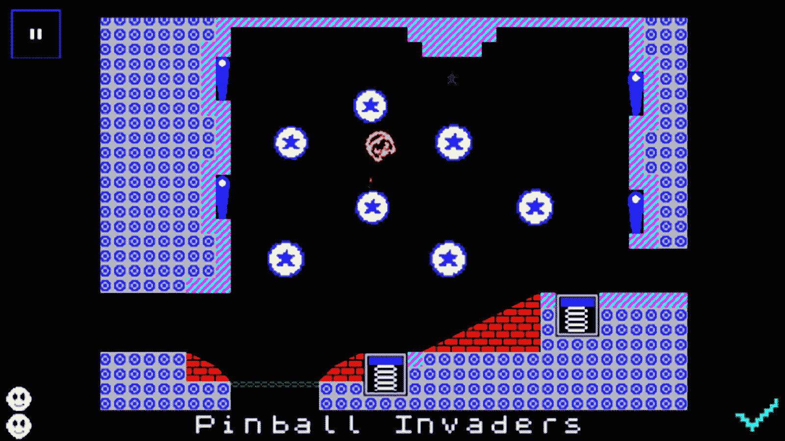

# 当一个开发者死了，他们的应用应该依靠|东西生存

> 原文：<http://www.stuff.tv/features/when-dev-dies-their-apps-should-live?utm_source=wanqu.co&utm_campaign=Wanqu+Daily&utm_medium=website>

我职业生涯的大部分时间都花在思考和写作科技、小工具、设计和游戏上。虽然这听起来很老套，但我最喜欢的部分是*人*。

当我站在苹果电脑发光的屏幕前时，没有什么比编辑发来一份丰厚的委托更好的了，这份委托让我与一群有才华的人接触，了解他们对某个特定主题的看法，然后将他们编织成一个专题。

最近，一份游戏杂志邀请我写一篇关于苹果电视和游戏的文章，主要是从开发的角度。像以往在这种情况下一样，我浏览了我的电子邮件和 Twitter 联系人列表，认为这是一个向独立开发者提供一些曝光的好机会，这些年来我一直很喜欢他们的工作。一个回复很快就回来了，尽管是一个我不太认识的名字。这条消息实际上是来自一位开发商的妻子；我试图联系的那个人已经在一周前去世了。

有问题的开发者是斯图尔特·霍加斯，他在与先天性心脏病的斗争中失败了；他才 34 岁。我们只接触过几次，但几年前我就被他真正出色的 8 位致敬作品*迷住了，我是 [iOS](https://itunes.apple.com/gb/app/i-am-level/id699125052?mt=8&at=11lMf5&ct=apps) 和 [Android](https://play.google.com/store/apps/details?id=com.SmilingBag.IAmLevel&hl=en_GB) 的*级。这是一个聪明，迷人，有趣的标题，结合了令人眼花缭乱的光谱式图形，老派的单屏幕平台挑战，和现代的移动倾斜控制。它仍然安装在我所有的设备上，想到创建它的人已经不在了，我感到很奇怪也很难过。

我当时采访的另一个开发人员表达了他对 Stew 去世的震惊，也担心他的作品现在可能是借来的时间。

作为一名开发者，他说他的灵魂几乎融入了他制作的每一款应用或游戏；通过你所创造的，你可以在某种程度上活下去，如果你不在了。这当然不是新的想法——当谈到艺术和文学，甚至电影和音乐时，人们经常说类似的话。但是这些媒介的寿命是现代数字应用所没有的。

一旦开发者账户因不付费而失效，这些应用就永远消失了，这感觉是不对的。

<noscript></noscript>

社交网络正在慢慢掌握应对死亡的概念。脸书可以让你发出一个[请求来记忆某人的账户](https://www.facebook.com/help/contact/1605213279719667),[会很有帮助地记录下那个人的页面和设置会发生什么](https://www.facebook.com/help/103897939701143)。

自然，社交网络领域的事情仍然远非完美——我听说过同事、朋友和去世的爱人在人们的时间表中出现自动好友建议。但至少保护原始账户和珍贵记忆的机制已经开始到位。

对于应用和游戏来说，事情就更复杂了。开发者账户被绑定到合同框架中。通常情况下，可以向您的帐户添加额外的管理员，但很难知道有多少独立开发人员做出这样的安排。毕竟，谁会料到他们明天就不在了呢？

在写这篇文章的时候，在联系苹果和谷歌的时候，我发现至少已经有了亲属接管账户的政策，这可以通过全面和适当的法律检查和身份验证来实现。有人创作的图书可以继续存在，至少只要有人支付相关的年度开发费用和账单。

这就是商业，但它看起来是如此的冷酷和冷漠。它没有真正认识到那些创造性的努力是创造它们的人的一部分。

或许移动内容的看门人应该考虑制定一项类似脸书的政策。想到 *我是等级* 可以不顾一切地活下去，而不是人们在回忆某一天永远消失的炖肉时想到的事情，这将是相当可爱的。

*[斯图尔特·霍加斯的家人正在筹集资金](https://www.justgiving.com/chicknstu/) 纪念他，为弗里曼心脏&肺移植协会捐款。这篇文章的作者捐了款。*