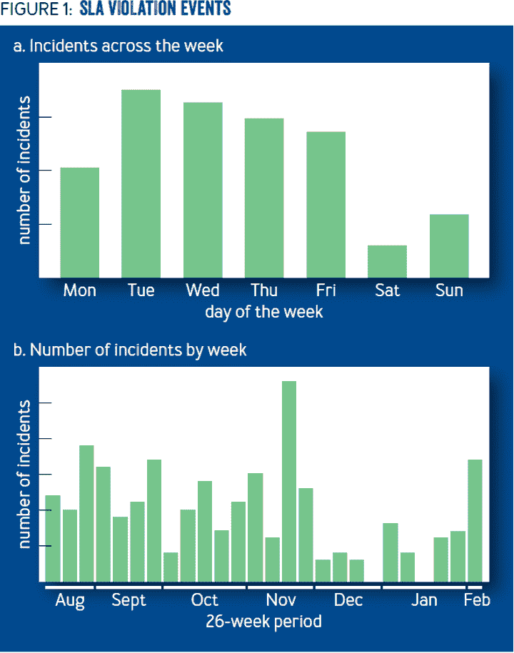
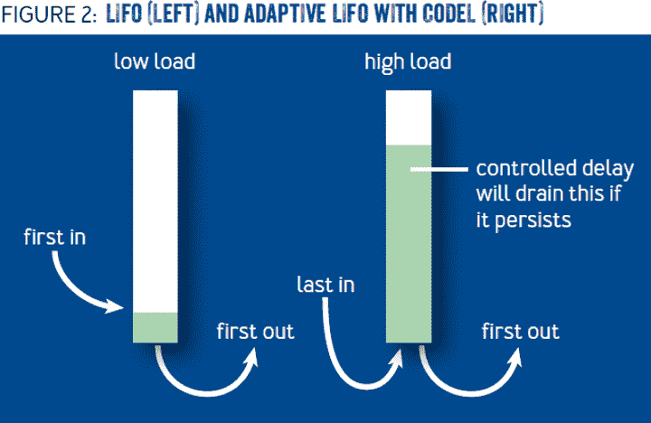
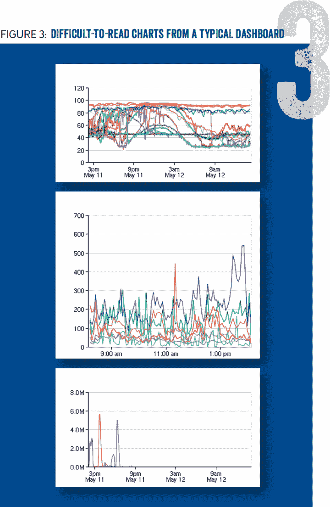
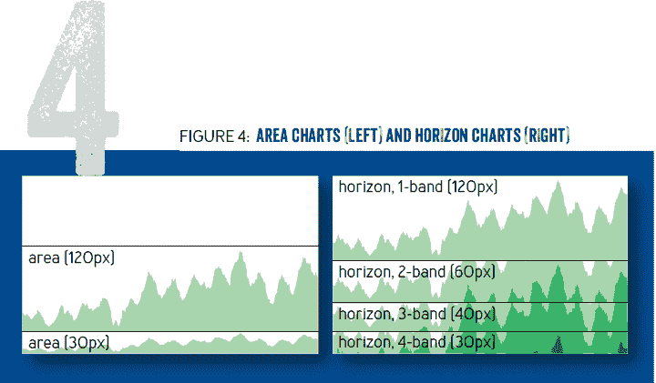

# 规模失败- ACM 队列

> 原文：<http://queue.acm.org/detail.cfm?id=2839461&utm_source=wanqu.co&utm_campaign=Wanqu+Daily&utm_medium=website>

<label>October 27, 2015
**[Volume 13, issue 8](issuedetail.cfm?issue=2838344)**</label>

[ PDF](https://dl.acm.org/ft_gateway.cfm?id=2839461&ftid=1638772&dwn=1)

# 大规模失败

## 面对快速变化的可靠性

### 脸书·本·莫伊雷尔

<iframe src="https://www.youtube.com/embed/dlixGkelP9U" frameborder="0" allowfullscreen="">VIDEO</iframe>

失败是任何大型系统工程的一部分。脸书的文化价值观之一是拥抱失败。这可以从挂在我们门洛帕克总部墙上的海报中看出:“如果你不害怕，你会做什么？”和“命运偏爱勇敢的人。”

为了保持脸书在快速变化面前的可靠性，我们研究了常见的故障模式，并建立了解决它们的抽象。这些抽象确保最佳实践应用于我们的整个基础设施。为了指导我们构建可靠性抽象的工作，我们必须了解我们的失败。我们通过构建工具来诊断问题，并创造一种回顾事件的文化来推动我们做出改进，以防止未来的失败。

### 失败为什么会发生？

虽然每个失败都有一个独特的故事，但许多失败都可以归结为少数几个根本原因。

#### 个别机器故障

通常，一台单独的机器会遇到一个孤立的故障，这个故障不会影响到基础设施的其余部分。例如，可能机器的硬盘出现故障，或者特定机器上的服务遇到了代码错误，比如内存损坏或死锁。

避免个别机器故障的关键是自动化。通过将已知的故障模式(如带有 S.M.A.R.T .错误的硬盘)与搜索未知问题的症状(例如，更换响应时间异常缓慢的服务器)相结合，自动化效果最佳。当自动化发现未知问题的症状时，手动调查可以帮助开发更好的工具来检测和修复未来的问题。

#### 合理的工作量变化

有时，脸书用户会改变他们的行为，这给我们的基础设施带来了挑战。例如，在重大世界活动期间，独特类型的工作负载可能会以不同寻常的方式给我们的基础架构带来压力。当巴拉克·奥巴马赢得 2008 年美国总统大选时，他的脸书主页经历了创纪录的活跃程度。超级碗或世界杯等大型体育赛事中的高潮部分会产生大量帖子。负载测试，包括一个特性被激活但用户看不到的“黑暗启动”，有助于确保新特性能够处理负载。

在此类事件中收集的统计数据通常会提供系统设计的独特视角。通常，重大事件会导致用户行为的改变(例如，围绕某个特定的对象创建有焦点的活动)。关于这些变化的数据通常指向设计决策，这将允许在随后的事件中更平稳地操作。

#### 人为误差

鉴于脸书鼓励工程师“快速行动，打破常规”——装饰办公室的另一张海报——人们可能会认为许多错误是由人为造成的。我们的数据表明，人为错误是我们失败的一个因素。图 1 包括对严重程度足以被视为违反 SLA(服务级别协议)的事件的时间分析数据。每个违规都表明我们的内部可靠性目标没有达到，并导致生成警报。因为我们的目标是严格的，大多数这些事件都是轻微的，网站用户不会注意到。图 1a 显示了周六和周日的事故发生率大幅下降，尽管该站点的流量在一周内保持不变。图 1b 显示了一个六个月的时间段，在此期间只有两个星期没有发生事故:圣诞节的那一周和员工互相撰写同行评议的那一周。

这两个数据点似乎表明，当脸书的员工因为忙于其他事情(周末、假期，甚至是绩效评估)而不积极地对基础架构进行更改时，该网站会体验到更高的可靠性。我们认为，这不是人们在进行更改时粗心大意的结果，而是我们的基础设施在面对机器故障等非人为原因的错误时，在很大程度上能够自我修复的证据。

### 引发事故的三种简单方法

虽然失败有不同的根本原因，但我们发现了三种常见的病理因素，它们会放大失败并导致失败蔓延。对于每一种病理，我们都制定了预防措施来减轻广泛的失败。

#### 快速部署配置变更

配置系统倾向于被设计成在全球范围内快速复制变化。快速配置更改是一个强大的工具，可以让工程师快速管理新产品的推出或调整设置。然而，快速的配置更改意味着当部署了糟糕的配置时会很快失败。我们使用许多实践来防止配置更改导致故障。

让每个人都使用一个通用的配置系统。

使用通用配置系统可确保程序和工具适用于所有类型的配置。在脸书，我们发现团队有时倾向于以一次性的方式处理配置。避免这些诱惑并以一种统一的方式管理配置，使得配置系统成为一种使站点更加可靠的杠杆方式。

**静态验证配置变更。**很多配置系统都允许松散类型的配置，比如 JSON 结构。这些类型的配置使工程师很容易打错字段名，在需要整数的地方使用字符串，或者犯其他简单的错误。使用静态验证可以最好地捕捉这类简单的错误。一个结构化的格式(例如，在脸书我们使用节俭) 4 可以提供最基本的验证。然而，编写程序验证来验证更详细的需求并不是不合理的。

跑金丝雀。首先将您的配置部署到小范围的服务中，可以避免灾难性的变化。金丝雀可以有多种形态。最明显的是 A/B 测试，比如只向 1%的用户发布新的配置。多个 A/B 测试可以同时运行，您可以使用一段时间内的数据来跟踪指标。

然而，出于可靠性的目的，A/B 测试并不能满足我们所有的需求。部署给少量用户，但导致相关服务器崩溃或内存不足的更改，显然会产生超出测试中有限用户的影响。A/B 测试也很耗时。工程师们经常希望在不使用 A/B 测试的情况下推出微小的变化。因此，脸书基础设施会在一小组服务器上自动测试新配置。例如，如果我们希望为 1%的用户部署一个新的 A/B 测试，我们将首先为访问少量服务器的 1%的用户部署该测试。我们对这些服务器进行短时间的监控，以确保它们不会崩溃或出现其他明显的问题。这种机制为所有的变更提供了一个基本的“健全检查”,以确保它们不会导致大范围的失败。

保持良好的配置。脸书的配置系统旨在更新配置时，在出现故障时保留良好的配置。开发人员很自然地倾向于创建配置系统，当他们收到无效的更新配置时，系统会崩溃。我们更喜欢在这些情况下保留旧配置的系统，并向系统操作员发出配置更新失败的警报。使用陈旧的配置运行通常比向用户返回错误更可取。

**让回复变得容易。**有时，尽管尽了最大努力，还是部署了糟糕的配置。快速找到并恢复更改是解决此类问题的关键。我们的配置系统受到版本控制的支持，使得恢复更改变得容易。

#### 对核心服务的硬依赖

开发人员倾向于假设核心服务——如配置管理、服务发现或存储系统——永远不会失败。然而，即使这些核心服务出现短暂故障，也可能演变成大规模事故。

**缓存核心服务的数据。**对这些类型的服务的硬性依赖通常是不必要的。这些服务返回的数据可以缓存起来，以便在这些系统中的一个短暂停机期间，允许大多数服务继续运行。

提供强化的 API 来使用核心服务。使用核心服务时，遵循最佳实践的公共库是核心服务的最佳补充。例如，这些库可能为管理缓存或良好的故障处理提供良好的 API。

进行消防演习。你可能认为自己能够在核心服务中断的情况下生存下来，但除非你尝试，否则你永远不会知道。对于这些类型的停机，我们不得不开发消防演习系统，从应用于单个服务器的故障注入到手动触发整个数据中心的停机。

#### 增加延迟和资源耗尽

一些故障会导致服务对客户端的延迟增加。这种延迟增加可能很小(例如，考虑导致 CPU 使用率增加但仍在服务能力范围内的人为配置错误)，也可能几乎是无限的(服务响应的线程已经死锁)。虽然脸书的基础设施可以轻松处理少量的额外延迟，但大量的延迟会导致级联故障。几乎所有服务都有未完成请求的数量限制。这种限制可能是由于每个请求一个线程的服务中的线程数量有限，也可能是由于基于事件的服务中的内存有限。如果服务经历了大量的额外延迟，那么调用它的服务将耗尽它们的资源。这种故障可以通过许多服务层传播，导致大范围的故障。

资源耗尽是一种特别有害的失败模式，因为它允许由请求子集使用的服务的失败导致所有请求的失败。例如，假设一个服务调用了一个新的实验性服务，该服务只向 1%的用户推出。通常，对这个实验性服务的请求需要 1 毫秒，但是由于新服务中的一个故障，请求需要 1 秒。使用这项新服务的 1%用户的请求可能会消耗太多的线程，以至于其他 99%的用户的请求都无法运行。

我们已经发现了许多技术可以避免这种类型的积累，并且假阳性率低。

**受控延迟。**在分析过去涉及延迟的事件时，我们发现许多最糟糕的事件都涉及大量等待处理的请求。有问题的服务有资源限制(比如活动线程或内存的数量)，并且会缓冲请求，以便保持使用率低于限制。由于服务无法跟上传入请求的速度，队列会越来越大，直到达到应用程序定义的限制。为了解决这种情况，我们希望在不影响正常操作可靠性的情况下限制队列的大小。我们研究了关于 bufferbloat 的研究，因为我们的问题似乎相似——需要排队以获得可靠性，同时又不会在拥塞期间导致过多的延迟。我们试验了一种 CoDel 1 (受控延迟)算法的变体:

`onNewRequest(req, queue):

  if (queue.lastEmptyTime() < (now - N seconds)) {
     timeout = M ms
  } else {
     timeout = N seconds;
  }
  queue.enqueue(req, timeout)`

在这个算法中，如果队列在最后的`N`毫秒内没有为空，那么在队列中花费的时间被限制为`M`毫秒。如果服务能够在最后的`N`毫秒内清空队列，那么在队列中花费的时间被限制在`N`毫秒。该算法防止了长队列(因为`lastEmptyTime`将在遥远的过去，导致`M` -ms 队列超时),同时出于可靠性目的允许短队列突发。虽然请求的超时时间如此之短似乎有悖常理，但是当系统跟不上传入请求的速度时，这个过程允许快速丢弃请求，而不是增加请求。短暂的超时确保服务器总是接受比它实际能处理的多一点的工作，所以它永远不会空闲。

该算法的一个吸引人的特性是`M`和`N`的值不需要调整。解决排队问题的其他方法，如限制队列中的项目数量或设置队列超时，都需要在每个服务的基础上进行调整。我们发现，M 的值为 5 毫秒，N 的值为 100 毫秒，这在很多用例中都能很好地工作。脸书的开源王乐库 5 提供了这个算法的实现，我们的节俭框架 4 使用了这个算法。

**自适应后进先出法。**大多数服务按照 FIFO(先进先出)顺序处理队列。然而，在高排队期间，先入请求经常被搁置太久，以至于用户可能已经中止了生成该请求的动作。处理先入请求首先将资源花费在比刚刚到达的请求更不可能使用户受益的请求上。我们的服务使用自适应后进先出法处理请求。在正常操作条件下，请求按 FIFO 顺序处理，但当队列开始形成时，服务器切换到 LIFO 模式。自适应 LIFO 和 CoDel 配合得很好，如图 2 所示。CoDel 设置短的超时，防止长的队列堆积，而 adaptive LIFO 将新的请求放在队列的前面，最大化它们满足 CoDel 设置的最后期限的机会。HHVM 3 ，脸书的 PHP 运行时，包括自适应 LIFO 算法的实现。

**并发控制。【CoDel 和 adaptive LIFO 都在服务器端运行。服务器通常是实施延迟预防措施的最佳位置—服务器往往服务于大量的客户端，并且通常拥有比其客户端所拥有的更多的信息。然而，有些故障非常严重，以至于服务器端控制无法发挥作用。为此，我们在客户中实施了一项权宜措施。每个客户端跟踪每个服务的未完成出站请求的数量。当发送新请求时，如果对该服务的未完成请求的数量超过了可配置的数量，则该请求会立即被标记为错误。这种机制可以防止单个服务独占其客户端的所有资源。**

### 帮助诊断故障的工具

尽管有最好的预防措施，一些失败总是会发生。在停机期间，正确的工具可以快速找到根本原因，最大限度地缩短故障持续时间。

#### 立体主义风格的高密度仪表盘

处理事故时，快速获取信息非常重要。好的仪表板允许工程师快速评估可能异常的度量类型，然后使用这些信息来推测根本原因。然而，我们发现，我们的仪表板变得如此之大，以至于很难快速浏览它们，并且那些仪表板上显示的图表有太多的行，一目了然，如图 3 所示。

为了解决这个问题，我们使用 Cubism 构建了我们的顶级仪表板， 2 这是一个用于创建 horizon 图表的框架，这些图表使用颜色对信息进行更密集的编码，从而可以轻松比较多个相似的数据系列。例如，我们使用立体主义来比较不同数据中心之间的指标。我们围绕立体派的工具允许简单的键盘导航，因此工程师可以快速查看多个指标。图 4 使用面积图和地平线图显示了不同高度的相同数据集。在面积图版本中，30 像素的版本很难阅读。另一方面，地平线图表使得找到峰值变得极其容易，即使在 30 像素的高度。

#### 什么改变了？

由于失败的主要原因之一是人为错误，因此调试失败的最有效方法之一是寻找人类最近更改了什么。我们通过名为 OpsStream 的工具收集从配置变更到新软件部署的最新变更信息。然而，随着时间的推移，我们发现这个数据源已经变得非常嘈杂。由于有成千上万的工程师在做改变，所以在一次事故中，通常有太多的工程师需要评估。

为了解决这个问题，我们的工具试图将失败与相关的变化联系起来。例如，当抛出一个异常时，除了输出堆栈跟踪之外，我们还输出由该请求读取的、最近更改了值的任何配置设置。通常，产生许多堆栈跟踪的问题的原因是这些配置值之一。然后，我们可以快速对问题做出响应，例如，通过恢复配置并让做出更改的工程师参与进来。

### 从失败中学习

失败发生后，我们的事件回顾流程帮助我们从这些事件中吸取教训。

事故审查流程的目标不是确定责任。没有人因为他或她造成的事故受到审查而被解雇。审查的目标是了解发生了什么，补救导致事故发生的情况，并建立安全机制以减少未来事故的影响。

#### 审查事故的方法

脸书开发了一种称为 DERP(用于检测、升级、补救和预防)的方法，以帮助进行高效的事件审查。

**检测。**问题是如何检测到的——警报、仪表盘、用户报告？

**升级。**合适的人很快介入了吗？这些人会不会是通过警报而不是手动被带进来的？

**补救。**采取了哪些措施来解决问题？这些步骤可以自动化吗？

**预防。**哪些改进可以消除此类故障再次发生的风险？你如何优雅地失败，或者更快地失败以减少这次失败的影响？

DERP 帮助分析手头事件的每一步。借助于这种分析，即使你不能防止这种类型的事件再次发生，你至少能够在下一次更快地恢复。

### 打破更少的东西，快速行动

“快速行动”的心态不一定与可靠性相矛盾。为了使这些哲学兼容，

脸书的基础设施提供了安全阀:我们的配置系统可以防止快速部署不良配置；我们的核心服务为客户提供强化的 API 以防止失败；面对延迟，我们的核心库可以防止资源耗尽。为了处理不可避免的问题，我们构建了易于使用的仪表板和工具，以帮助找到可能导致问题被调查的最近更改。最重要的是，在事故发生后，我们利用吸取的教训使我们的基础设施更加可靠。

#### 参考

1.CoDel(受控延迟)算法；[http://queue.acm.org/detail.cfm?id=2209336](https://queue.acm.org/detail.cfm?id=2209336)。

2.立体主义；[https://square.github.io/cubism/](https://square.github.io/cubism/)。

3.HipHop 虚拟机(HHVM)；[https://github . com/Facebook/hhvm/blob/43c 20856239 cedf 842 b 2560 FD 768038 f 52 b 501 db/hphp/util/job-queue . h # L75](https://github.com/facebook/hhvm/blob/43c20856239cedf842b2560fd768038f52b501db/hphp/util/job-queue.h#L75)。

4.节俭框架；[https://github.com/facebook/fbthrift](https://github.com/facebook/fbthrift)。

5.王乐图书馆；[https://github . com/Facebook/王乐/blob/master/王乐/concurrent/Codel.cpp](https://github.com/facebook/wangle/blob/master/wangle/concurrent/Codel.cpp) 。

本·毛雷尔是脸书网站基金会团队的技术主管，负责脸书面向用户的产品的整体性能和可靠性。本于 2010 年加入脸书，成为基础设施团队的一员。在脸书之前，他与路易斯·冯·安共同创立了 reCAPTCHA 公司。最近，Ben 与美国数字服务合作，以改善联邦政府内部的技术使用。

2015 年 ACM 1542-7730/15/0500 10.00 美元

*原载于《队列》第 13 卷第 8 期*——
见本条目于 [ACM 数字图书馆](https://portal.acm.org/citation.cfm?id=2839461)

* * *

更多相关文章:

Niklas Blum，Serge Lachapelle，Harald Alvestrand-[**WebRTC-面向开放网络平台的实时沟通**](detail.cfm?id=3457587)
在疫情的这个时代，世界前所未有地转向了基于互联网的 RTC(实时沟通)。在过去的十年里，RTC 产品的数量激增，很大程度上是因为更便宜的高速网络接入和更强大的设备，但也因为一个开放的、免版税的平台 WebRTC。WebRTC 正在从提供有用的体验成长为允许数十亿人继续工作和教育，并在疫情期间保持重要的人类联系的关键。摆在 WebRTC 面前的机会和影响确实很吸引人。

Benjamin Treynor 斯洛斯，Shylaja Nukala，Vivek Rau - [**重要的指标**](detail.cfm?id=3309571)
测量你的站点可靠性指标，设定正确的目标，并通过工作来精确地测量指标。然后，您会发现您的服务运行得更好，停机更少，用户采用率更高。

Silvia Esparrachiari，Tanya Reilly，Ashleigh Rentz - [**跟踪和控制微服务依赖**](detail.cfm?id=3277541)
如果你曾经把钥匙锁在家里或车里，你会对依赖循环很熟悉。没有钥匙你打不开锁，但是不开锁你拿不到钥匙。有些周期是显而易见的，但是更复杂的依赖周期很难在导致停机之前发现。跟踪和控制依赖性的策略对于维护可靠的系统是必要的。

Diptanu Gon Choudhury，Timothy Perrett - [**为互联网规模的服务设计集群调度器**](detail.cfm?id=3199609)
寻求构建调度系统的工程师应考虑他们使用的底层基础设施的所有故障模式，并考虑调度系统的操作员如何配置补救策略，同时在租户系统的所有者进行故障排除期间帮助租户系统尽可能保持稳定。

* * *

* * *

 
ACM 公司版权所有。