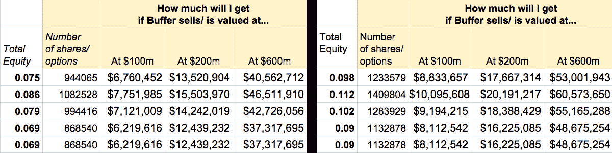
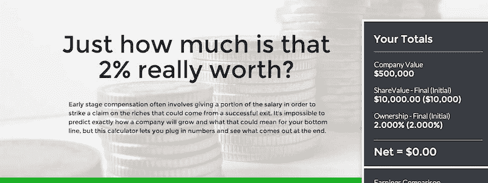
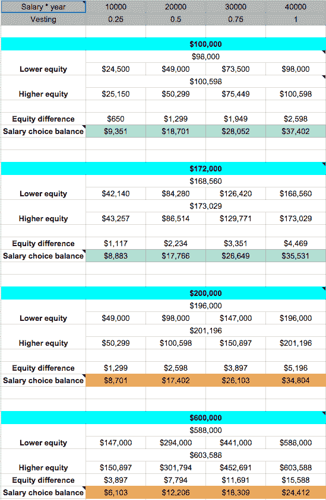

# 如何解释公平

> 原文：<https://open.buffer.com/explaining-equity/?utm_source=wanqu.co&utm_campaign=Wanqu+Daily&utm_medium=website>

不久前，丹妮尔·莫里尔在推特上问了这个问题:

解释公平是我们在 Buffer 努力做到最好的事情，Joel 在他的回复中分享了这一点。

随着团队成员的增加，我们学到了一个很大的东西，那就是理解股票期权并把它们放入背景中并不容易。

我们认为，透明地分享我们如何在 Buffer 处理事情可能有助于其他公司向加入团队的新人解释所有选项。

## 这是我们发送给新团队成员的股权电子邮件

当一名新队友加入缓冲团队并成功完成他们的[缓冲训练营](https://open.bufferapp.com/inside-buffer-bootcamp/)时，他们需要做出一个决定:要么选择 10，000 美元的高薪，要么选择 30%的[股权](https://open.bufferapp.com/buffer-open-equity-formula/)。

免责声明:我们正在重新思考我们的工资和股权公式是如何运作的。现在我们已经[达到了 50 人](https://buffer.com/resources/the-50-teammates-milestone-buffers-september-investors-report/)，通用股票期权方案已经减少，1 万美元对 30%的期权增加不像以前那样可行了。我们展示股票期权的一般方式希望仍然有用！

对于如何在要约邮件中解释股票期权的含义，我们有过多次反复，这是我们目前的措辞。这是我们发给新队友的电子邮件，完整的(注意:这些是鲁道夫的号码，只是作为一个例子。我们使用我们的[薪资公式](https://buffer.com/resources/introducing-open-salaries-at-buffer-including-our-transparent-formula-and-all-individual-salaries/)和[股权公式](https://open.bufferapp.com/buffer-open-equity-formula/)为每个队友填写薪资和股权空白:

> 我想花点时间给你发送一些信息，可能会对你的薪资/股权选择有所帮助。
> 
> *这里有很多信息，所以我想马上提一下，这个问题绝对不急！请随意花你需要的时间和你生活中的人交谈，了解你需要的所有背景，让你对自己的决定感到真正舒服。*
> 
> *在这里，你本质上有两个选择，一个是更低的工资和更高的股权，一个是更高的工资和更低的股权。*
> 
> ***选项一:***
> 
> 较低薪酬:$ 88k/年
> 较高股权:0.254% = 28591 期权
> 
> *(实际$中的*28591*期权是什么意思？*
> 
> *Buffer 每年都会重新估值，并且在一定的募资轮次之后(我们在 2014 年 8 月刚刚[募到一个)。这种重新估值就是所谓的“履约价格”，它将从你在某种流动性事件(收购/出售、首次公开募股或未来投资融资)中获得的收益中推导出来。对于下面的例子，我假设我们的价值是每股 0.799 美元。我们尽可能保持低水平。我们最近筹集了价值 6000 万美元的资金。我们不可能考虑以低于 1 亿英镑的价格出售 Buffer。所以我很乐意给出一些场景来帮助把这个转化为真钱。假设 Buffer 的售价为 1 亿美元，这意味着每股为 7.94 美元-您将得到:28591 * 7.94-(28591 * 0.799)，即 *$204.743.22* 美元。我们最近拒绝了超过 1 亿美元的报价，所以我们很可能不会以低于这个价格出售任何东西。我们的观点是，只要事情进展顺利，我们玩得开心，我们就希望看到它尽可能地发展。)](https://buffer.com/resources/raising-3-5m-funding-valuation-term-sheet/)*
> 
> *如果 Buffer 售价为 1 亿美元，你得到 204.743.22 美元*
> *如果 Buffer 售价为 2 亿美元，你得到 409，486.44 美元*
> *如果 Buffer 售价为 6 亿美元，你得到 1，228，459.33 美元*
> 
> ***选项 2:***
> *如果 Buffer 售价为 2 亿美元，您将获得 314，369.51 美元*(比更高权益少约 95，000 美元)**
> *如果 Buffer 售价为 6 亿美元，您将获得 943，108.54 美元(比更高权益少约 285，000 美元)*

## *解释细节:归属，稀释和更多*

*这封邮件继续解释了除了要考虑的数字之外的更多细节——比如我们计划多长时间筹集一次资金，选择股票而不是工资会有什么样的风险，以及授权是如何运作的。*

*同样，这是我们发给新队友的电子邮件:*

> *我们想做的一件事是每隔几年从外部投资者那里筹集资金。我们想设置这个的主要原因是为了让 Buffer 的每个人都有能力出售他们的一些股份来换取现金。在 11 月份的这一轮中，那些拥有已授予股份的人(将在下面描述授予是什么意思:)可以选择出售一些股份。乔尔、利奥和安迪卖了一点。如果你对此有疑问，请告诉我！
> 
> *换个角度来看:*
> 
> *总的来说，薪水是一个更安全的赌注，你每个月都会有保障的钱，所以选择更高的薪水会给你带来更多现金的直接好处。*
> 
> *股权具有更大的风险，因为不能保证 Buffer 会卖出任何上述金额。**两个报价之间的股权差异为 30%，因此选择较高的股权比选择较低的股权多 30%的期权。***
> 
> *此外，我们对缓冲的愿景是长期保持下去，因此我们可能在相当长的一段时间内不会退出，但在此过程中仍有机会出售您的期权——上面的“退出”示例只是为了更容易理解，我们不太可能在此时出售！**

 **从我们的角度来看，我们对什么是最好的没有任何偏好，因为它总是高度依赖于每个人的情况(例如家庭、新买的房子和其他更直接的财务责任往往是人们选择更高工资的一个原因)*

*重要的是:如果缓冲从外部投资者那里筹集更多的钱，你的股权就会被稀释。这意味着，如果我们筹集到更多的资金，比如 1000 万英镑，而估值为 1 亿英镑，那么 10%将流向投资者。所以现在只有 90%留给了我们这些拥有股票/期权的人，这意味着你必须将你现有的期权乘以 0.9，你将损失 10%的期权价值。*

**授权:我们有一个“授权时间表”，这是大多数创业公司的标准。我们的是一个四年的归属时间表，这基本上意味着工作满四年后，所有的股权将正式归属(意思是:你的)。在 Buffer 工作满一年后，你将通过“悬崖”,这意味着你正式拥有/获得提供给你的 25%的股份。在那个悬崖之后，每个月你将获得剩余的额外的 75%。*如果发生任何清算事件，如我们出售或首次公开募股等，在您通过计划完全获得授权之前，您将自动获得您的所有股份:)。***

## *1 亿美元、2 亿美元、6 亿美元是什么样子*

*为了有助于了解以上所有内容的对比情况，我们来看一下[股票期权电子表格和工作表](https://docs.google.com/spreadsheets/d/1vDCIodXUcBNJ3yKLiYtTiCIMTqIUm_stuK5vWl5Raas/edit#gid=0)来帮助理解这些数据。*

*下面是我们新加入的一些队友在 10，000 美元的高薪选项和更高的股权选项之间进行选择时的股权选项，以及如果 Buffer 以 1 亿美元、2 亿美元或 6 亿美元的价格出售，这些选项可能意味着什么(当然，这些都不是保证的！):*

**

*同样，这些数字是使用我们的[工资公式](https://buffer.com/resources/introducing-open-salaries-at-buffer-including-our-transparent-formula-and-all-individual-salaries/)和[股权公式](https://open.bufferapp.com/buffer-open-equity-formula/)确定的。*

## *我们听到的关于公平的常见问题*

*一旦我们发出了这封邮件，收到许多很棒的问题并不罕见，询问我们没有想到要提及的细节！以下是一些常见的问题，以及我过去是如何试图回答这些问题的。*

### *归属是如何运作的？*

*股权在 4 年的授权期内授予，期限为一年。它的意思是:*

*   *在 Buffer 工作 12 个月后，你将获得总股本的 25%。如果你在 12 个月前离职，你将无法获得你的股权。(这种情况存在的原因是，没有人会“欺骗”我们去获得一些股权，比如加入一个月，然后退出。我们不认为这种情况会发生，我们完全信任我们的团队成员，这只是一种长期的法律预防措施，我们认为采取这种措施是有意义的。这也变得非常混乱，因为在最初的几个月里需要时间来知道某人是否合适，相当多的人最终在 1 年之前离开了缓冲区，所以如果某人只在这里呆了 2-3 个月，围绕股权做文书工作会很快变得混乱。)*
*   *12 个月后，每个月您可以获得更多的股权，直到您可以获得全部股权(即在总共 48 个月或 4 年的缓冲期后)。12 个月后，你的股权将在接下来的 36 个月里额外获得 1/36。所以现在，在 12 个月之后的任何时候，当你离开缓冲区或缓冲卖出时，你会得到你在这里的时间。*
*   *这意味着从第 13 个月开始，你可以获得剩余股权的额外 1/36。*
*   *举例来说，如果你在 2.5 年后离职，即(12+12+6)个月= 30 个月的缓冲期，30/48 =你将获得 62.5%的股权。*
*   *例如，如果他们在 18 个月后离开，他们的全部股权计划中有 100 个期权，他们现在可以得到:100 * 0.375 = 37.5 个期权，我们将向上舍入到 38 个期权。*

### *如果有人在退出或流动性事件前离开缓冲区，该怎么办？*

*到目前为止，我们已经有很多人在已经获得部分股票期权后离开了 Buffer。由于 409a 的估值仍然相当低，他们在退出时行使股票期权只需要几百或几千美元。*

*在我们最近的一轮融资之后，我们的 409a 大幅上涨(我们的每股价格从 0.17 美元上涨到 0.77 美元)，对于那些希望留下缓冲资金以便仍然能够行使其股票期权的人来说，这开始变得越来越成为一个财务负担。*

*为了应对这种情况，我们正与律师合作，将股票期权的到期日延长至 10 年，而不是标准的 90 天。这是 Pinterest 最近为他们的所有团队成员做的事情，这真的令人惊讶——即使在他们的规模下，这仍然是他们愿意做出的改变。*

### *我的股票会被稀释吗？*

*在 2-3 年内，我们很可能会有另一轮融资。我们这样做的原因是给我们一个机会，让团队成员和投资者出售他们的股份。理想情况下，这些事件不会导致大量稀释，而是更多的是某些股票所有权的交易——没有新股发行。*

*(在理想世界中，这是我们会选择的道路。然而，这里仍然存在一些风险。很难确切知道 2-3 年后缓冲区会在哪里，融资是否可行以及其他一些因素。)*

*增加队友的期权池是非常可能的，这将导致稀释，但通常比一轮融资少得多。现在，我们再次补充了期权池，并相信这将使我们走得很远。*

*如果 Buffer 从外部投资者那里筹集到更多资金，你的股权就会被稀释。也就是说，如果我们以 5000 万美元的估值筹集了 500 万美元，那么 10%将归投资者所有。所以现在只有 90%留给了我们这些拥有股票/期权的人，这意味着你必须将你现有的期权乘以 0.9，你将损失 10%的期权价值。*

### *你对我们上一轮 6000 万美元的估值有何看法？*

*一般来说，估值与你的增长率密切相关。如果你增长很快，你几乎可以要求任何倍数，如果你增长较慢，那么估值就会下降。这是我们雄心勃勃发展 Buffer 的一个关键原因，我认为这将是一个更好的结果，对所有参与的人都是如此。*

### *你觉得我该选什么？*

*有很多不同的方式来看待这个问题。我们发现，薪水通常是更安全的赌注；这是你每个月都会得到保证的钱，所以选择更高的薪水会给你带来更多现金的直接好处。*

*股票的风险更大，因为不能保证 Buffer 会卖出上述任何金额。*

*从我们的角度来看，我们对什么是最好的没有任何偏好，因为它总是高度依赖于每个人的情况(例如，家庭、新房子和其他更直接的财务责任通常是人们选择更高工资的原因)。*

## *帮助解释股权概念的资源*

*我们发现并创建了一些资源，这些资源对计算这些数字非常有帮助。*

*这里有一个[非常有用的股票收益计算器](http://www.tejusparikh.com/projects/equity_calculator/index.html)，你可以用它来摆弄数字。*

**

*我们也热衷于透明地分享我们的工资、股权和计算方式:*

**

## *你的股权问题是什么？*

*如果你正在考虑如何向你的团队成员解释股票期权，并让他们清楚这对他们来说意味着什么，我希望以上能有所帮助！*

*我们还在我们的[透明仪表板](https://buffer.com/transparency)上发布了更多关于[透明工资](https://open.bufferapp.com/introducing-open-salaries-at-buffer-including-our-transparent-formula-and-all-individual-salaries/)、[股票期权](https://open.bufferapp.com/buffer-open-equity-formula/)、[定价](https://open.bufferapp.com/transparent-pricing-buffer/)和[收入](https://open.bufferapp.com/buffer-public-revenue-dashboard/)的信息，您可以查看。*

*关于公平，它在 Buffer 中是如何工作的，以及我们如何向队友解释，还有其他问题我们可以回答吗？哪些资源帮助你更好地理解或解释了这些概念？我们渴望在评论中听到你所有的想法和反馈！*

