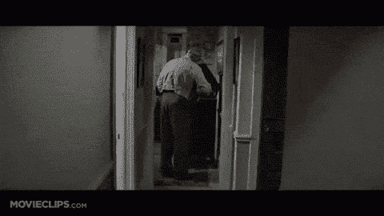

# 枪战时不要带刀——杰森·卡拉卡尼斯

> 原文：<http://calacanis.com/2015/11/02/dont-bring-a-knife-to-a-gun-fight/?utm_source=wanqu.co&utm_campaign=Wanqu+Daily&utm_medium=website>

*宛如一只@#$带刀来一场枪战*  —肖恩·康纳利，《贱民》

我们生活在一个 [的卓越时代](https://soundcloud.com/twistartups/the-age-of-excellence-an-2) ，产品设计科学为消费者制造出一波又一波精心设计的美味。事实上，产品是如此重要，以至于当创始人看着他们的孩子在产品搜索和黑客新闻上排名第一时，分销经常被香槟酒的声音淹没。

[点击发推文(发送前可编辑):[http://ctt.ec/0xFHt](http://ctt.ec/0xFHt)

登上排行榜榜首是一件多么令人兴奋的事情，这是一个完美的巅峰，但随着其他产品取代他们在 App Store 的榜首位置，谦逊的创始人将在未来几天和几周内面临最终和残酷的绝望深渊。

由拥有卓越产品的增长型团队创造的持久分销是当今的大赢家。Airbnb 为 Craigslist 打造了 [杀手级工具，优步掌握了推荐系统和‘隔岸观火’，而](https://www.quora.com/How-does-Airbnb-automatically-post-on-Craigslist) [Wealthfront 则把推荐系统](https://youtu.be/npAzREgDnoA) 和别人部署的内容营销策略更上一层楼。WhatsApp 用“电话簿社交网络”结合无情的本地化击败了它。

我已经查看了今年 [启动孵化器](http://launchincubator.co) 类的 400 份申请，并且还在增加，我很惊讶有多少人拥有特别好的产品——没有考虑分销。

伟大的举措，但没有营销预算、目标受众、标题或口号。

如今，要想在投资者面前脱颖而出，需要优秀的产品，但这只是赌注。要想真正脱颖而出，带一个你改进过的、可以直接谈论的杀手级发行版黑客。

对于一些创业公司，我有过 20 分钟的谈话，不是关于他们的产品，而是关于他们对街头团队的巧妙利用。对于我投资的其他初创公司，对话都是围绕着他们开发的一个杀手级工具，这个工具可以免费帮助他们的客户……同时建立他们的电子邮件数据库。

或许，如果泡沫破裂，创业公司减少 80%,我们将回到一个伟大的产品足以吸引投资者和消费者注意力的时代——但我对此表示怀疑。

感觉这场比赛的赌注在不断增加，2016 年没有 MVP 的让你看起来很傻，我猜在 2017 年，没有不公平的竞争分配策略的出现就像是拿刀参加枪战。

我听说我最近投资的一家初创公司的一个竞争优势是，他们通过“权力时间”来渗透大学市场他们基本上邀请人们吃油炸圈饼或墨西哥卷饼，并在校园里举办一个由有影响力的团体共同举办的聚会；那些使用这款应用的人会邀请他们的朋友来参加聚会，与在脸书上付费安装应用相比，食物的成本要低得多，用户的质量也高得多。它会长期有效吗？它会扩展吗？谁知道呢，但这向我展示了他们正在思考如何做一些其他人没有做的事情——并且无所畏惧。

我最近投资的另一家公司，没有透露他们的名字，也没有透露太多，将参加行业活动，为他们的垂直行业和签约人进行试用，并举行产品审查会议。这并不特别，但他们确实将这部分潜在客户与他们的 SDR(销售开发代表)、试用以及最终的订阅联系起来了。他们本可以向我展示更多的产品功能，但他们让我专注于他们的销售过程，我对此很感兴趣，因为“ [销售解决了一切](http://blogmaverick.com/2008/03/09/my-rules-for-startups/) ”

这里的要点是，带着一个分销故事来参加你的投资者会议将使你在竞争中脱颖而出——这也将有助于你发展业务，也许一开始就不需要与投资者见面。🙂

最佳[@杰森](https://twitter.com/jason)

PS–我正在做的一些事情需要你的反馈:

1.  我自己的小成长秘籍:Inside 推出了一个简单的 [chrome 扩展，名为 TLDR](https://chrome.google.com/webstore/detail/tldr-the-biggest-news-rig/bgnfebilkfnllimjokbkniclpjdajlag/) ，它在让你了解信息和娱乐方面非常棒。它是如何工作的？每次你打开一个新的标签，我们都会向你展示十几个精心设计的标题，这些标题要么引人入胜，要么很重要，要么很有趣。下载下来让 [@lons](http://twitter.com/lons) 我知道你怎么想！
2.  [启动孵化器](http://launchincubator.co) 于 11 月 10 日截止申请；阅读我们如何创造了地球上最伟大的创业孵化器。
3.  [发布节](http://www.launchfestival.com/) 是 3 月 2 日-4 日，创始人可以作为我们的客人来。赶快注册吧，前 5000 名创始人是免费的，接下来的 10000 名创始人每人支付 75 美元。

PPS–我们为热爱创业/ [@LAUNCH](http://twitter.com/launch) festival 的人准备了一个入门级职位！在这里应用。

### 像这样:

像 装...

## 由jasongalcanis发布

我叫杰森·卡拉卡尼斯。我是一名连续创业者、天使投资人、播客和作家。[查看 jasoncalacanis 的所有帖子](https://calacanis.com/author/calacanislaunch/)

**发表于**<time class="entry-date published updated" datetime="2015-11-02T13:49:14+00:00">2015 年 11 月 2 日</time>