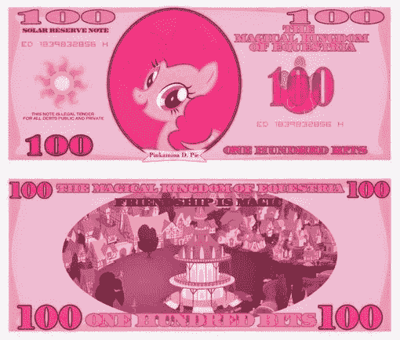
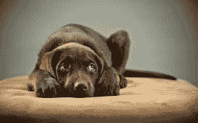
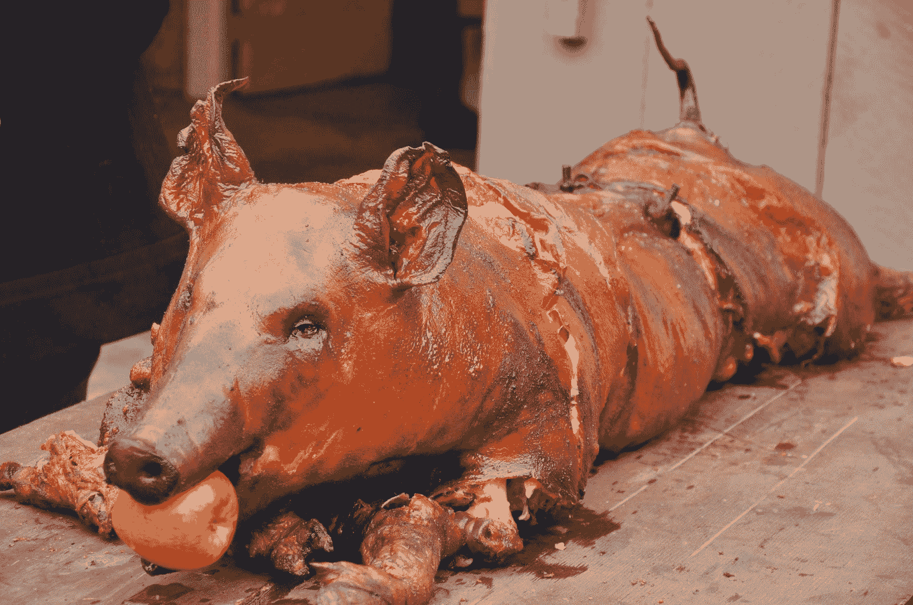
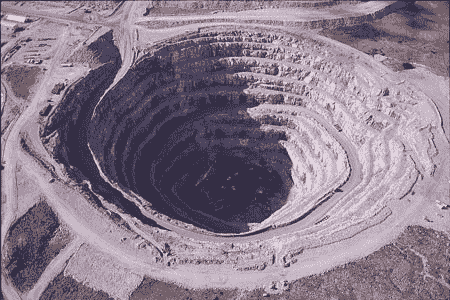

# 你将如何给你的电脑游戏定价。

> 原文：<https://jeff-vogel.blogspot.com/2014/12/how-youre-going-to-price-your-computer.html?utm_source=wanqu.co&utm_campaign=Wanqu+Daily&utm_medium=website>

| [T2】](//2.bp.blogspot.com/-IHc-OMdEZQ4/VIDczsg900I/AAAAAAAAAjQ/vUPfyWTnrh4/s1600/rUHQNTzhXL4.jpg) |
| 为了这篇文章的目的，我假设你想要很多钱。(图片偷自[此处](http://cradet.deviantart.com/art/Princess-Celestia-1-bit-bill-287856402)。) |

是的，是时候再发一个关于给游戏定价的帖子了。我在这方面写得越来越多，这很无聊，但游戏行业的事情确实在不断变化，很多人(开发者和消费者)似乎对现在的工作方式感到困惑。这是我对此的最新看法。我会试着让它变得有趣些，这样就不那么无聊了。

这主要是说独立游戏，但是，说实话，AAA 游戏也是一条船上的。时间尺度和初始价格都更大，但模式是相同的。

假设你是一个小开发者，你写了一个游戏，你想从中赚很多钱。在 2010 年，这很容易。坐上 Steam，定价 10 美元，买一栋游艇造的房子。

可悲的是，得到一个时间机器并不是一个可行的选择，因为物理学。你需要做市场营销，为你的游戏想出一个价格。自从我最新的热门独立角色扮演游戏

[Avernum 2: Crystal Souls](http://www.avernum.com/avernum2/index.html)

很快就要上映了，我想了很多。定价部分，因为想到市场营销让我如惊弓之鸟。

**How Much Should My Game Cost?**

像专业人士那样做。抛硬币。如果是正面，15 美元。如果是反面，20 美元。搞定了。

哈哈。我只是在开玩笑。(我不是开玩笑。)目前，独立游戏的可持续商业价格看起来在 15-20 美元之间。这个范围足够便宜到觉得买得起，又足够高到可以谋生。至于你挑哪个，看你的竞争对手，做他们已经做的。

当然，一些粗野的骑手想以 10 美元的价格送出他们的游戏。这仍然是可行的，但有一个警告:看看你的游戏，问:“我可以诚实地要求 15 美元吗？”如果答案是否定的，你需要认真审视你的工作。弄清楚你是否制造了一种高质量的产品，给市场带来了竞争对手无法轻易复制的独特产品。准备好度过一个漫长的不眠之夜。

(显然，我这里主要关注的是个人电脑游戏。手机定价是一个完全不同的话题，在其他地方已经有大量的报道。)

再说明一点，这完全是我自己的看法。如果你的游戏每小时花费超过 10 美元，请重新考虑你的价格。不是为了你，而是为了你之后写独立游戏的人。对你优雅的 90 分钟艺术作品收取 20 美元可能会诱使人们购买他们的第一个独立游戏，但这损害了他们购买第二个游戏的机会。

Hokay。你有号码。现在运送你的游戏！这难道不令人兴奋吗？

| [T2】](//3.bp.blogspot.com/-NWBK0_PbU-0/VIDdb3mmgII/AAAAAAAAAjY/DWrLgL469FQ/s1600/imgres.jpg) |
| 在第一阶段，这是你如何看待你的游戏。 |

**Stage One. "Will everyone please help me stay in business?"**

在你的游戏上市的头几个月，它会一直是全价或者接近全价。第一周打八折真的可以刺激销售，吸引犹豫不决的顾客，但是，除此之外，坚持你的观点。要钱。

游戏结束后的第一个月左右是关键。这是你的游戏最引人注目的时候，真正对它感兴趣的人会付全价。这就是为什么开发商

[go so insane](http://kotaku.com/indie-dev-threatens-gabe-newell-has-game-removed-from-1648678869)

担心适当的释放压力，蒸汽位置，一切都进行得很完美。

这里有一个非常重要的经验法则:

> 那些非常喜欢你的作品并愿意立刻以全价购买的人，会为你提供让你继续经营下去的大部分资金。所以你需要它们。

我怎么强调都不为过。我与我的粉丝有过分歧，但我无限感激他们冲进来并支付全价。它让我们不停地做游戏。句号。

又是难题时间。有没有人会足够关心你的产品，以全价立即购买？如果你不确定，你的前路可能会很艰难。捆绑包很好，但你不会靠它们谋生。

无论如何，如果事情按计划进行，你会在第一周/第一个月获得大量的销售，并且兴奋、乐观、飘飘然。然后，一个月左右，你的销售就会一落千丈。别担心。这是自然的方式。只是不要让它让你吃惊或者让你陷入抑郁的漩涡。这就是生活。

(这会让你大吃一惊，让你陷入抑郁的漩涡。当你看到销售图表线向下猛跌时，没有足够的心理准备来保护你。)

再给它几个月时间，让顽固分子慢慢渗透进来，支付全部费用。你需要那笔钱。然后，最终，销售会很慢，你会有三个月的长尾效应，差不多是你第一次蒸汽销售的时候了。

第二阶段开始了。

| [T2】](//3.bp.blogspot.com/-VbN-vb2QtZg/VIDdxPlQ8sI/AAAAAAAAAjg/zt9KATwG6D0/s1600/DSC_1046.jpg) |
| 在第二阶段，这是你如何看待你的游戏。 |

**Stage Two: "Will you take 25% off? How about 50%? We're pricing to move!"**

一旦几个月过去了，销售额开始下降，总是保持高价就没有任何好处了。是时候利用 Steam 和其他销售了。

(哦，你在蒸汽上对吗？在这一点上，如果你不在那里，你就有真正的问题。去做吧。这些标准是

[way looser](http://store.steampowered.com/app/321060/)

比以前更好。把你的游戏放在绿灯下，让你的姑婆米莉为你投票。)

你会想要有销售。销售期的关键是慢慢来。第一次销售，25%。几个月后下一次销售时，50%。诸如此类。(在 Steam 上，还可以求超高折扣获得闪购。为此要积极进取。被 Steam 推广赚了大钱。)

出售你特别的小游戏可能会是一次令人痛苦的经历。每个人都想保护自己的孩子。然而，在这个过程中的这个时候，我通常完全厌倦了看到我的宝宝，并且不介意稍微折磨它一下。努力培养一个冷酷残暴的情绪环境。

这个过程会一直进行下去，你有很大的自由。你可以在一次销售中打五折，然后在下一次销售中打七五折。没人会注意到。你有试错的空间来找出最赚钱的方法。

但是到了某个时候，你的作品会变得陈旧不堪，甚至销售也赚不了多少。它只是被游戏商店埋没了，太多的目标用户会拥有它。

然后是大折扣的时候了。这些包裹。强行推销。或者，换句话说...

| [T2】](//3.bp.blogspot.com/-1MbLX3DE3fw/VIDeEd8P89I/AAAAAAAAAjo/Vau-0IQvGNE/s1600/ats36902_Mine.jpg) |
| 在第三阶段，这是你如何看待你的游戏。 |

**Stage Three: "LET'S STRIP MINE THIS BAD BOY!!!!!"**

一款优质的游戏可以持续产生收入的时间长得惊人。为什么不应该呢？如果它有趣，它永远不会停止有趣。然而，在某一点上，你的游戏会从“我的必须被爱和珍惜的宝贝”转变到“必须无情地提取其价值的老化资产”

这就是捆绑包(Humble Bundle，Indie Royale，Groupees 等)出现的原因。

在第一年将游戏捆绑销售是一个错误。你会激怒出高价的人，并且你会失去以更高价格出售的机会。

一旦发行一年，情况就不同了。那么你的比赛已经是旧闻了，你可能更专注于推动你的下一个冠军。在这种情况下，捆绑销售非常好。它带来了更多的钱。它作为一个演示，给你带来很多关注，帮助你销售你的下一个游戏。令人惊讶的是，过去的经验表明，捆绑销售不会对普通销售造成很大损害。

实际上，这没什么好惊讶的。即使是最著名的独立游戏，从来没有听说过你的玩家数量也是巨大的。任何能提高你知名度的东西都会扩大你继续做生意所需的粉丝群。捆绑销售非常适合这种情况。

可悲的是，捆绑销售没有以前那么多了。Humble Bundle 仍然做得很好，但其他百万个 Bundle 很少产生太多现金。这是光辉岁月逝去的另一种方式。尽管如此，捆绑销售仍然可以增加你的知名度。所以这还是个好主意。就当是开始为你的演示收费吧。

大多数人不玩游戏，反正他们是捆绑在一起的。他们正忙着尝试他们之前拿到的十本书。

**And Then It Goes On Forever**

此后

[Indie Bubble popped](http://jeff-vogel.blogspot.com/2014/05/the-indie-bubble-is-popping.html)

，让一个小游戏公司盈利变得更加困难。在这个超级竞争的环境中，很难建立一个愿意支付全价的忠实粉丝群。你需要一个真正好的标题，赢得大量的知名度。

然而，一旦你开始谋生，继续做生意似乎就容易多了。多亏了销售、捆绑包和无处不在的 Steam，一款好的游戏可以比你想象的更长久地持续盈利。而且这还是在你开始把它移植到新平台、发布豪华版、DLC、重写为重制版等之前。

游戏行业变化真的很快。我希望这一切能让你保持清醒。我可能会在六个月后写这篇文章的新版本，那时 Steam 会发明一种方法将游戏直接传输到你的大脑中。