# 与我妻子和两个儿子住在单间公寓里——格雷格·克勒斯基

> 原文：<http://www.gregkroleski.com/2015/11/03/life-in-a-studio-apartment-with-my-wife-and-two-sons/?utm_source=wanqu.co&utm_campaign=Wanqu+Daily&utm_medium=website>

从 2011 年 7 月到 2015 年 8 月，我住在旧金山一套 400 平方英尺的公寓里。我搬进去的时候还是个单身汉，但是当我搬出去的时候，我已经是一个四口之家的成员了。以下是我一路走来学到的一些东西。

Photo: Roseann Bath – http://www.roseannbathphoto.com/

### 第一课租金控制有奇怪的副作用

旧金山有一项租金控制政策，禁止大多数房东每年将租金提高 1%以上。目标是帮助对抗家庭流离失所。

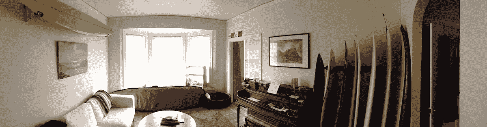

My last days as a bachelor. The house had more surfboards than furniture and we somehow had room for a piano.

当我和妻子结婚，她搬进来的时候，我们考虑搬家。我们的预算增加了一些，但是我们的购买力下降了。我们可以改变社区，但我们会牺牲公寓质量。我们决定留下来。

一年半后，我们迎来了我们的第一个儿子。当时，该市的房租上涨了 50%以上。我们降低到一份收入，这样我的妻子可以做全职妈妈，我们选择不同时承担房租上涨。

婴儿不是很大。他不会占用太多空间。

所以我在壁橱里给我们做了一张定制的床，我们把婴儿摇篮放在主房间里。我们变得非常擅长耳语。

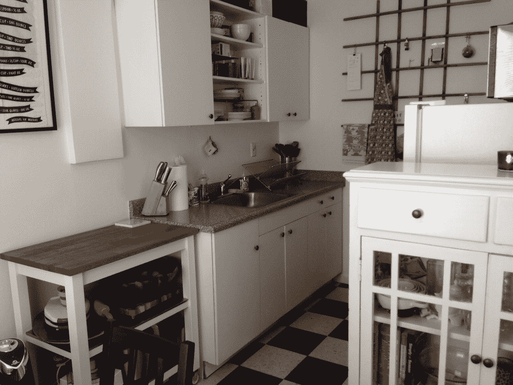

The kitchen was the area of the house that changed most dramatically when my wife moved it. It was quite spartan when I was a bachelor as most nights I worked late and ordered in. She did a really nice job making use of the small space.

第一个孩子出生七个月后，我们发现我们还会有第二个孩子。这是我们计划的一部分，但可能比预期的要早一点。有时候这些事情需要一段时间，有时候不需要。

随着怀孕的进展，我们的大儿子开始走路，像他的父亲一样，非常活跃。留下似乎是不可能的。

我们搜查过了。我们探索了所有的选择。问题是房租涨了很多，所以我们住不起这个社区了。(注意:我们对“负担得起”这个词的定义可能与你的略有不同—[点击此处了解更多信息](http://www.gregkroleski.com/2015/07/25/what-you-mean-when-you-say-you-can-afford-it/)。)

让我给你一些看法。

[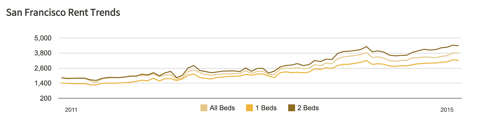T2】](http://www.gregkroleski.com/wp-content/uploads/2015/10/san-francisco-rent-trends.png)

当我搬进去的时候，旧金山的一个工作室要花大约 1200-1500 美元。每月约 3 美元。到 2015 年夏天，我们旧金山附近的 2BR 可以卖到 4000-5000 美元。5.5 美元/平方英尺/月。这本身就是一个很大的增长。但是当你做一些代数运算来计算每平方英尺增加的成本时，它会变得更大。对于额外的 400 平方英尺，我们将支付 3200 美元或 8 美元/平方英尺/月。

基本上，我们要为两倍的公寓支付四倍的租金。难以下咽。

由于租金控制，我们工作室的租金很低。但是由于租金控制，我们在经济上不愿意搬到其他地方。这是一种非常奇怪的感觉。

我们探索了其他选择:将我的通勤时间增加一倍，或者搬到一个犯罪率更高的社区。

[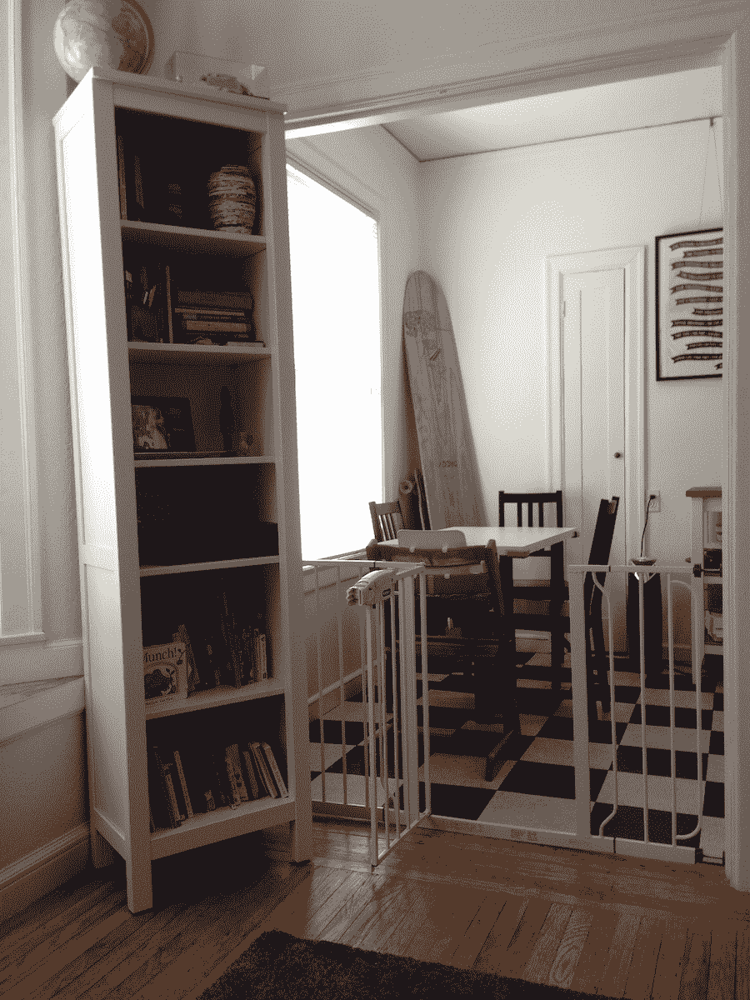T2】](http://www.gregkroleski.com/wp-content/uploads/2015/10/studio-apartment-dining-area.jpg)

最后，我们决定让它再工作一段时间。我们曾希望工作中的加薪、调到一个新的地方或者可能换一家公司会让事情变得容易些。我们需要大约 6 个月的时间来探索各种选择，做出决定并实施变革。

需要是发明之母。

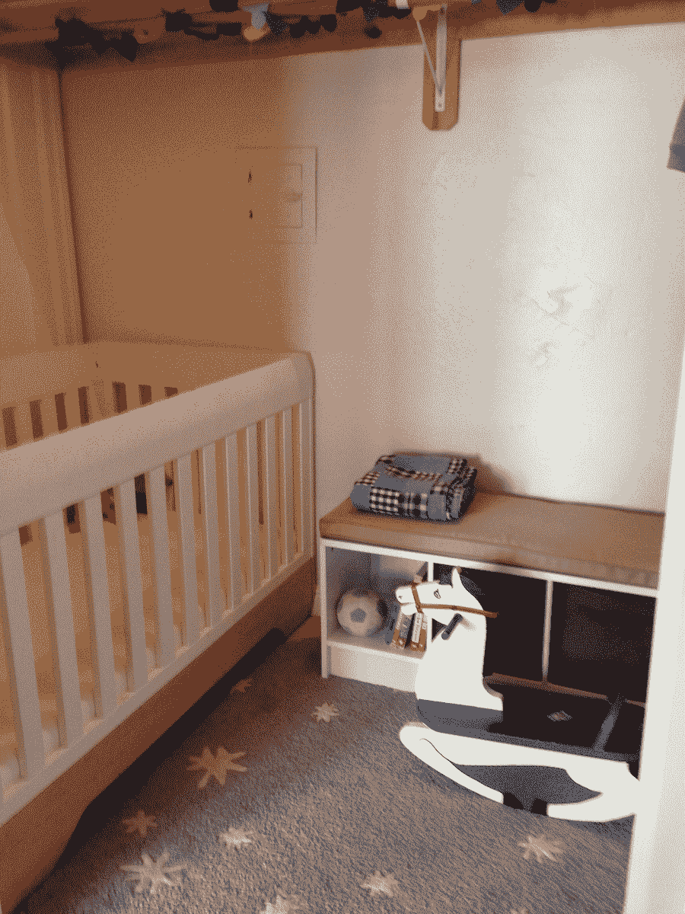

Our closet nursery. The crib fit wall to wall when I removed one side (the one you can’t see).

### 第 2 课)偏离当地标准是昂贵的

第一个儿子出生时，我和妻子都是 27 岁。明显比旧金山的平均生育年龄 33 岁要年轻。我们还决定让我妻子留在家里带孩子。

对于上个世纪的美国家庭来说，这两件事都不奇怪。但对于 2015 年的旧金山人来说，这两种情况都很奇怪。

我没有意识到这个决定会对我们在旧金山的生活产生的所有影响。那里可能有足够的空间来写一篇博客，但当谈到公寓时，这意味着我们更难找到一个住的地方。

我们对旧金山 2BR 公寓的竞争一开始就很激烈。当然，它很贵，但对我们来说，这不仅仅是成本问题。我们会申请名额，但不会被选中。

房东们关注的一个关键标准是总收入，因为我们只有一份收入，所以相对于工作的室友和丁克来说，我们处于明显的劣势。

我们会填好申请表去 2BR 公寓看房，结果发现另外 20 个人也在做同样的事情。房东有他们的选择，这个地方不可避免地会被一对年轻的专业人士占据，他们的工资加起来在几十亿美元左右。或者是一个家庭，但是比他们年长十年，在他们的职业生涯中又前进了十年，并且有十年的额外加薪和晋升。

生活在常规之外使我们处于不利地位。

### 第三课房子里有两种空间

当谈到他们的家时，密度不是很多人考虑的事情，但我开始意识到它是空间最重要的衡量标准。

任何时候你有一个优化问题，你需要确定你的限制因素。在房子里，是密度。

房子里有两种截然不同的空间类型:高密度的储藏空间和低密度的居住空间。为了优化生活空间，每立方英尺都应该被推向其中一个边界。

许多人与空间作斗争，因为他们家更多的体积占据了尴尬的中间地带。他们的生活空间杂乱，他们的存储空间没有包装。他们试图通过获得一个更大的家来解决他们的空间限制，这就像试图通过购买更大的裤子来解决腰围问题一样。

你平常一天在房子里能看到的空间就是你的生活空间。如果它被体积占据了超过 5-10%,就感觉很杂乱。环顾你所在的房间，想想所有的空间——可能占房间的 90%以上。(如果你的房子很乱，想象一下设计杂志或 Pinterest 上的一张房间照片)

在一个狭小的空间里，这对我来说是一件非常重要的事情。如果我们不把东西放好，或者如果我们获得了任何额外的东西，这个空间就会变得拥挤，我们想搬到一个更大的空间的愿望就会增加。尽可能保持这个空间不被占用是一场持续的战斗——总是试图降低这个数字。

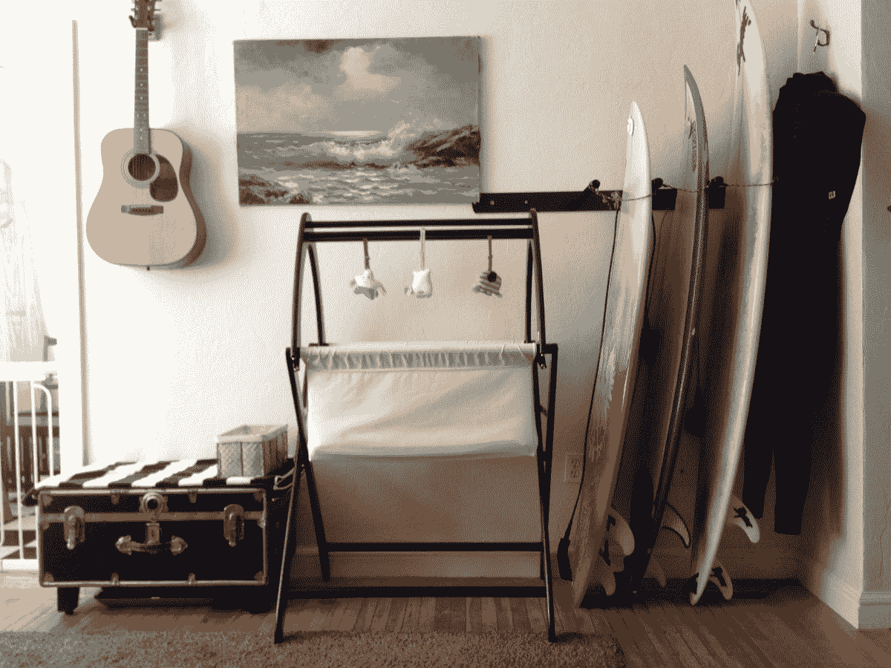

Our youngest slept surrounded by dad’s favorite things and mom’s sense of style. We tried to keep things very organized, everything had its place.

密度谱的另一端是存储空间。理想的存储密度是 100%。要做到这一点是不可能的，因为空间越密集，获取物品就越困难。考虑到一个清理出来的通道去接触物品事实上降低了你的密度。这就是为什么，为了优化，某些图书馆有可移动的书架，一次只能有一个可移动的书架——它通过减少冗余的存取空间来最大化存储空间。

[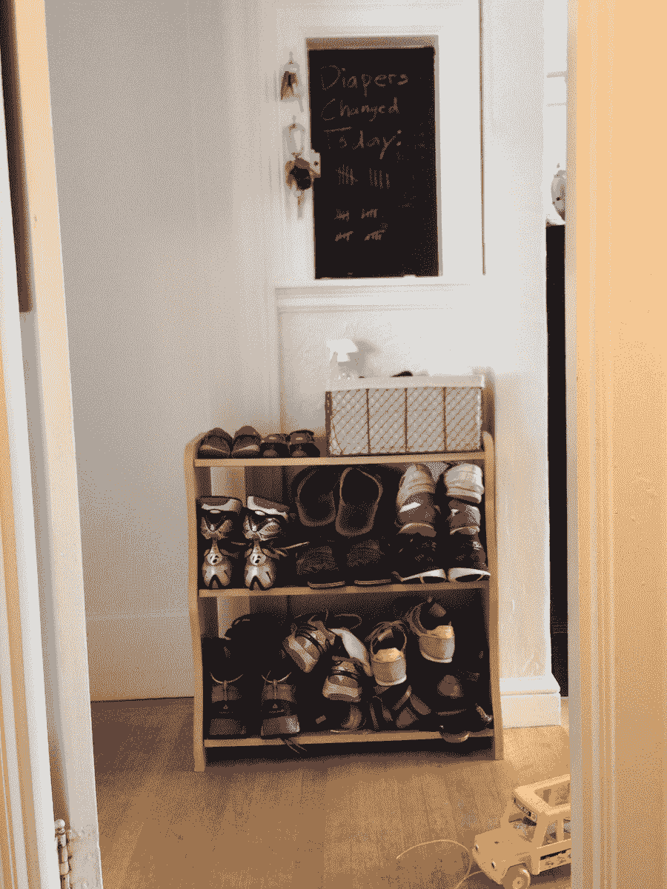](http://www.gregkroleski.com/wp-content/uploads/2015/10/studio-apartment-shoe-storage.jpg)

Each with our own shelf

一些储物空间，比如壁橱，是显而易见的，但是我有一个技巧就是尽可能的制造新的储物空间。我们的咖啡桌(见上面两张照片)，有时兼作换衣桌，是由一个旧箱子制成的，我把腿放在上面。它能完美搭配我们所有的额外客房亚麻制品，同时还能发挥其他作用，减少闲置空间。(是的，我们有通宵公司——甚至是邮政婴儿。)在下面的一张图中，你几乎看不到沙发下面有几个浴盆。我为沙发订购了不同的支腿，以便与浴缸相匹配，为我们提供了几立方英尺的高度有序且易于使用的储物空间。

[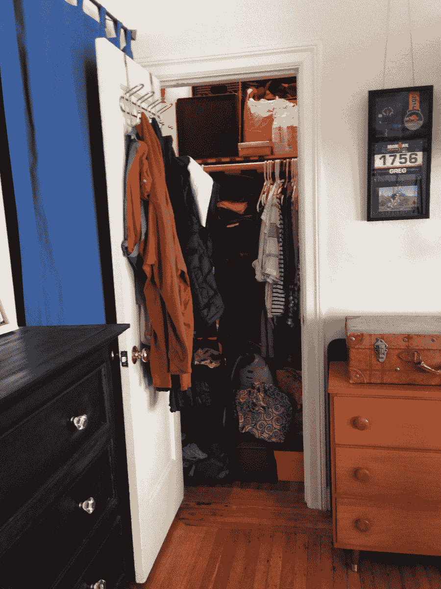](http://www.gregkroleski.com/wp-content/uploads/2015/10/studio-apartment-closet.jpg)

I left this picture out at first but decided to add it. The rest of the house looks so nice because nearly 50% of our possessions were in this 3’x4’x8′ closet. I built extra shelves, double deep hanger racks and packed it to >60% density. We had no external storage, everything we own is pictured or in this closet.

当你考虑这两种类型的空间时，你会意识到你的住房需求是由你的居住和储藏空间的下限决定的。你可以通过迫使事情朝着这些限制发展，然后减少其中任何一个，来大幅减少你的住房面积需求。

### 第 4 课无人居住的房间是浪费空气

仅仅考虑居住空间，大多数房子都太大了。请记住，房间里的东西通常只占生活空间的 10%，其余的是空气。

由于一个人一次只能呆在一个房间里——通常人们根本不在家或者聚集在一个房间里——在任何给定的时间点，美国房子里的大多数房间都是空的。这是对空间和金钱的巨大浪费。

它可以通过多种方式解决，包括:

*   增加空间的多重目的性
*   增加空间的适应性
*   减少你需要你的生活空间充当的东西的数量
*   减少你需要同时呆在不同房间的数量

当我们把儿子的婴儿室搬进壁橱时，我们的起居室兼作卧室。我设计它的意图是当你坐在沙发上时保持 10%的密度，同时避免减少床的面积。

我尝试了一些技巧，以便让它通过妻子的门槛。(这是一个神奇的障碍，每个家庭装修项目都必须清除，才能有生存的机会。)

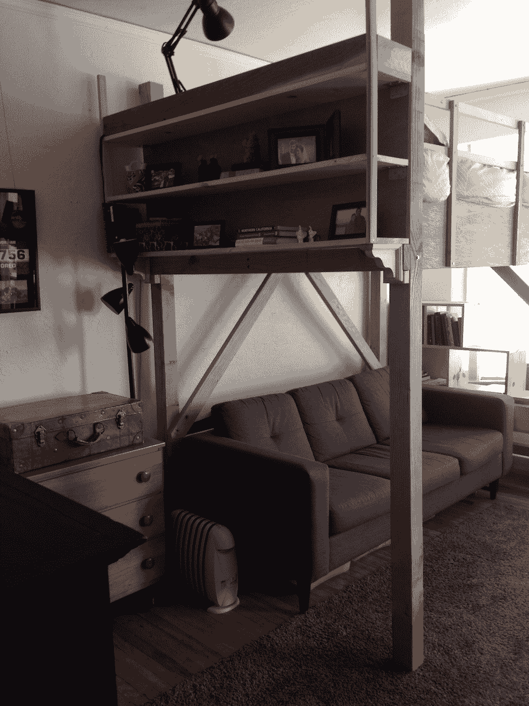

头部后面的书架是床头板搁板下方的两倍空间。当你走进房间时，除了床之外，它还能让你有东西可看，防止枕头掉落。

我还最大限度地减少了正面和侧面的支撑梁数量——你可以看到，最靠近你的腿没有任何东西脱落。这减少了杂乱的感觉，降低了头痛的几率。

我还建造了兼作书架的楼梯，因为它们没有支撑，所以可以让很多光线进来。事实上，它们是楼梯，这一点至关重要，因为我是在妻子怀孕六个月的时候建造的。直到我们第二个儿子出生的前一天，她才得以到达那里。

我上面提到的第二个方法是适应性。这是一个我没有机会尝试的问题，但是我喜欢这些例子。

这个想法是你的房子改变形状以适应当前的需要。例如，一面墙可以在卧室和客厅之间来回移动，这样它们在使用时都会变大，而不会增加总空间。

我会喜欢有一个可调升降系统的阁楼床。它所处的高度对于生活和睡眠来说都是次优的。但是那会使建造变得更加复杂，而且在生命的这个阶段是不可能的。

[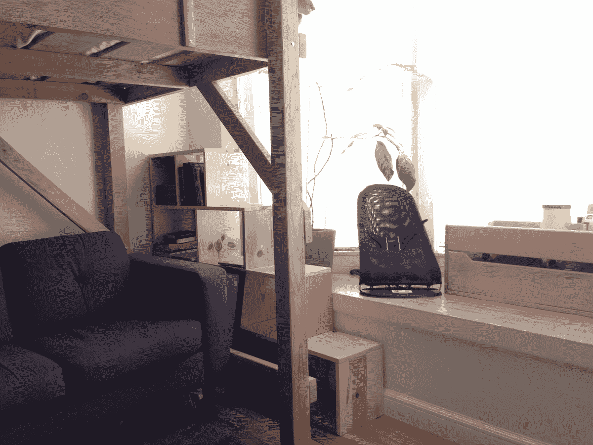](http://www.gregkroleski.com/wp-content/uploads/2015/10/studio-apartment-stair-shelves.jpg)

Here you can see the bookshelf that doubled as stairs.

最后两种减少居住空间的方法包括减少。对大多数人来说这是最难的一步，但却最容易从中获益。

你对房子的目标越简单，就越容易有一个小房子来满足你的目标。我们的客厅不需要用作电视室，因为我们没有电视。这意味着我们的家具布置不必考虑座位位置、线缆输入或扬声器放置。

最后还有房间数量的因素。这是最终让我们。当我们家增加到四个人时，每个人都呆在一个独特的房间里就变得不可能了。这给午睡时间、就寝时间和有客人来访时带来了巨大的挑战。我们本来可以做得更长一点，但这是我们应该得到的东西。

### 第五课家不仅仅是存放“东西”的地方

生活空间的第二个限制是对物品储存的需求。(参见:[乔治·卡林](https://www.youtube.com/watch?v=JLoge6QzcGY))考虑到体积，你的东西占据的空间可能是你房子的 50-200 倍。如果你有以下两种情况之一，你可以住小一点的房子:

*   增加你的存储空间的密度
*   减少您需要储存的数量

我已经讨论了前一点，但我将花一点时间思考后一点。

我们家受到公寓的限制，即使我们长大了，公寓的大小也不会变。我们逐渐适应了一个小的生活空间，以至于我们成了偶然的极简主义者。([我在这里写了我认同的五种极简主义者)](http://www.gregkroleski.com/2014/04/24/thoughts-on-the-five-schools-of-minimalists/)

We loved the light we had coming in. The west facing windows and wide street resulted in lots of afternoon light.

三年来，我们每月至少向旧货店捐赠一个购物袋，慢慢减少我们拥有的东西。随着空间变得越来越小，为了在我们的房子里赢得一席之地，一个物体必须高于的门槛也越来越高。

我开始认真思考我拥有什么，为什么拥有它。我变得更有责任感了。我现在拥有的财产是我当前需求的一个如此精简和精细的代表，以至于我很难找到对其他任何东西的需求。

随着事情变得越来越困难，我也找到了侵入系统的方法。我现在把 craigslist 作为一个介于租赁店和仓库之间的网站。为生活的一个季节买东西，在我暂时不需要的时候卖掉。这样做，我甚至经常赚到一点小钱。

我也找到了黑自己的方法。我拥有的很多东西都放在我的房子里，目的是“我可能有一天会需要它”。我不得不努力说服自己，我没有。最后，妥协归结为“如果你扔掉了这个，又需要它，你可以从亚马逊购买，当天送达”——到目前为止，这还没有发生。

考虑到你是在为你的东西付租金。壁橱空间，或者更糟的是，储物单元，每个月都在耗费你的金钱。最终，你花在储物上的钱会比里面的东西要多。

(如果你对这类事情感兴趣，你可以考虑阅读我的[六个极简主义小贴士来帮你理清头绪——s . t . o . k . e . d .方法。)](http://www.gregkroleski.com/2016/11/07/s-t-o-k-e-d-six-minimalism-tips/)

### 第 6 课共享资产奖励那些使用它们的人

共享经济是你会听到的一个时髦词，但这个想法并不新鲜。长期以来，优步对于汽车就像城市公园对于后院一样。

住在工作室的时候，我们一家人经常去旧金山的公园。清晨，我和大儿子在离我们步行距离的五个公园中的任何一个公园里，弥补了我在院子里的不足。在我去上班之前，我们会去篮球场，他会在那里玩汽车或追逐网球，我会练习跳投。

[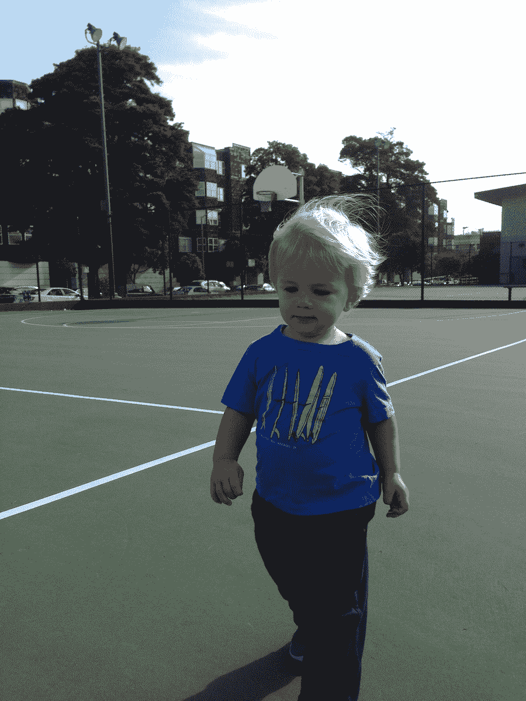](http://www.gregkroleski.com/wp-content/uploads/2015/10/studio-apartment-park.jpg)

Early morning with the basketball court to ourselves.

说到共享资产，我们生活在一个拥有书籍、CD 或 DVD 浪费空间和金钱的时代。大多数介质在其生命的大部分时间里都处于闲置状态。曾经的情况是，获取信息的机会很少，这就是为什么拥有一个图书馆是有好处的。但是现在我们有了互联网——你可以全天候获取更多的信息和娱乐。没有必要拥有。公共图书馆是免费的，当你需要的时候，有很多方法可以借到。

### 更少的房子意味着更少的家务

住在单间公寓里很艰难。这需要努力、计划、组织和承诺。但是还有一线希望。房子少有利于减少家务劳动。

最明显的一点是，需要清洁的地方变少了。需要除尘的搁板更少，需要吸尘的地板更少。

也不需要布置和装饰，减少了压力、成本和规划时间。

也减少了杂乱的机会。因为所有的事情都发生在一个房间里，如果我们自己没有收拾干净，我们就无法忽视这种混乱。每天晚上我儿子睡觉前，我们都会把玩具收起来，这样我们就可以坐在客厅里，不盯着玩具看了。一个奇怪的副作用是，我们的儿子喜欢打扫卫生。(随着我们的孩子越来越大，我们的玩具哲学变得越来越复杂——[我在这里写了一些关于它的内容](http://www.gregkroleski.com/2016/12/08/how-the-kroleski-family-does-toys-our-rotation-process/)

[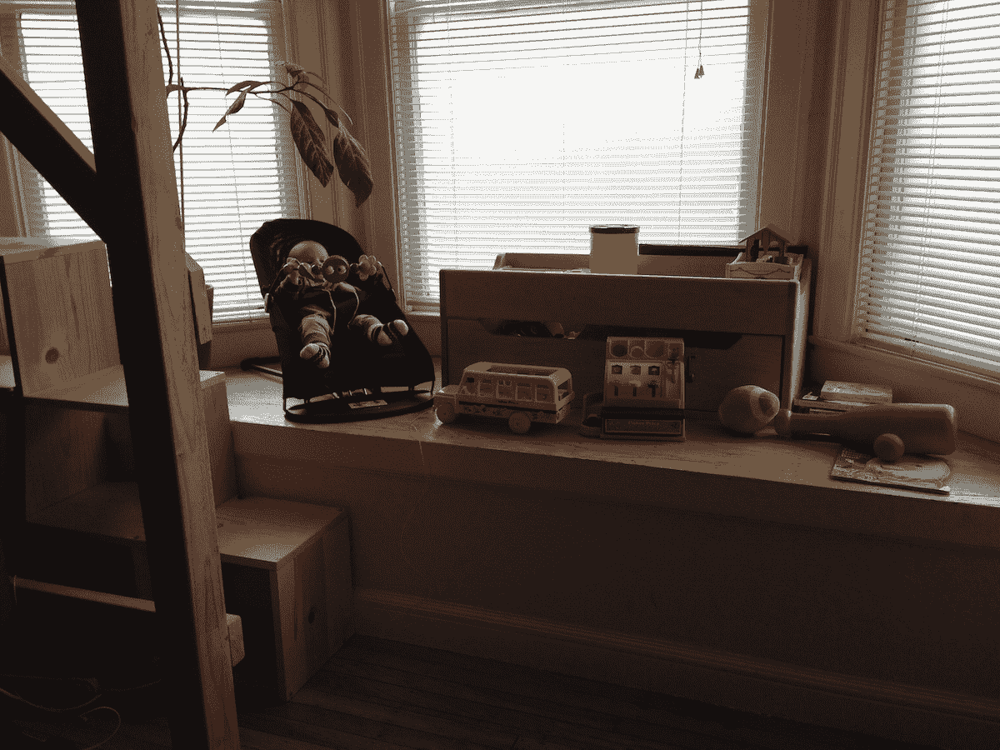T2】](http://www.gregkroleski.com/wp-content/uploads/2015/10/studio-apartment-bay-window.jpg)

我们不经常丢东西。生活在狭小的空间里迫使组织。每样东西都有一个位置，我们都知道在哪里。即使你在房子里放错了东西，也没有多少地方可以藏。你会发现它比在大空间里快得多。

更多的房子总是伴随着更多的家务劳动。更多的庭院和更多的庭院工作。在一个时间和金钱有限的世界里，减少一件事可以让你增加另一件事。打扫房子的时间越少，就意味着有更多的时间和房子里的人生活在一起。

### 第八课当生活在微薄的利润中时，高点是一样的，但低点要低得多

回想我们在那间公寓的所有时光，我能回忆起许多我最喜欢的时光。它们都与公寓没有太大关系——它们都与公寓里的人有关。无论是我们的家人，我的前室友，来访的朋友还是大家庭。

我们经历的高潮和其他家庭没有什么不同。

相比之下，低点要低得多。

现在，我不是指一个家庭可能遇到的个人低谷:疾病、冲突、经济困难等等。无论你在哪里，这些数字都可能很低。我特别指的是与生活空间更直接相关的低点。

在一个小空间里，典型的一天是可以的，但有这样薄的自由空间和分离的边缘。有些时候所有这些都会爆发。一件事出错会引发下一个错误的多米诺骨牌，并引起连锁反应。

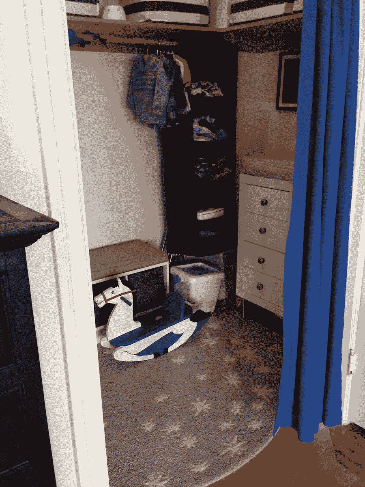

Another view of the nursery. Here you can see the clothing storage & changing table.

举个例子，想想我建造阁楼床的那个周末。为了在房间里组装它，我需要把所有东西都移开，开始连接部件，把东西靠墙立起来，同时开始另一个。到处都是螺丝钉、木板和锯屑。这花了不止一天的时间，这意味着有一个晚上，我们既没有一张完工的阁楼床，也没有放普通床的空间。不幸的是，我高估了自己能完成的工作量，不得不出差。星期天晚上，我乘了红眼航班，把怀孕的妻子和一个蹒跚学步的孩子留在家里，在一个建筑区，没有床睡觉。不是我们最幸福的告别。(我已经清理了大部分螺丝和一些木屑)

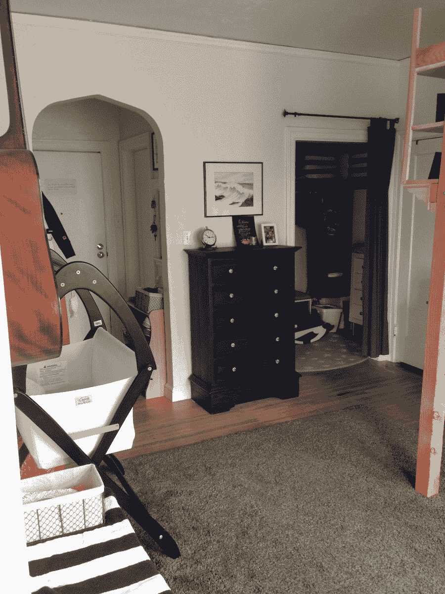

最后，我经常发现自己处于一种更幽默的境地，那就是无处可去的清晨会议。我搬到旧金山的 12 人创业公司已经发展成为一家国际软件公司。这意味着我有时需要在早上 5 点或 6 点参加早会。和旧金山的科技公司一样，我的一天通常是在上午 9 点或 10 点左右开始。我的策略是穿着睡衣接电话，然后做好准备，之后再去上班，而不是在早上 5 点的电话之前，在 4 点起床做好准备并前往办公室。

当我单身，有室友，甚至当我妻子搬进来的时候，这种方法非常有效。但是一旦婴儿出现，就很难了。你绝不会想吵醒一个熟睡的婴儿。我去了洗手间，但是宝宝们会醒过来。最终的解决方案是在我车库的车里接电话。我很自豪地说，我坐在停在大楼公共车库里的车里，穿着我的睡衣，已经帮助完成了数百万美元的软件交易。但肯定有几天我会坐在那里思考‘我现在到底在做什么？’。

我们经历了一些艰难的日子，但最终我过着幸福的生活。然而，回想这些日子，我对那些生活拮据的人有了更多的理解。无论贫富，平常的一天就是平常的一天。当你有钱了，你的车坏了，你可以租一辆。但是当你很穷，按小时计酬，而你的交通又出了问题的时候，这种事情会变得非常糟糕。病假可能意味着额外的开支，同时也意味着收入的损失。我认为人们对贫困甚至中低阶层的职业生活有很多误解。如果我们更好地理解边际和方差，这将真正帮助我们成为更有同情心和爱心的人。

### 第 9 课坚强起来——这是值得的

在自行车文化中，有一种叫做“规则五”的东西，它说，HTFU(把你选择的 F 字硬起来)。这意味着即使山很陡，天很冷，下着雨，你很累，你也要坚强起来，努力骑行。如果你想变得更快，这就是需要的。那天你所付出的努力会让你在下一次变得更强。

这条规则很好地定义了我的生活方式。

对 HTFU 来说，带着一两个婴儿住在单间公寓里是一个持续的挑战。如上所述，住在一个狭小的空间是艰难的，有几天我想放弃。空间太小，噪音太大，一个人无处可去。但是熬过那些日子是我第二天变得更坚强的方法。

为什么这很重要？

我们人类有很强的适应能力。有时这实际上对我们不利。如果我们生活在一定程度的奢侈之中，我们就会对此习以为常。习惯于简单或昂贵的生活方式的麻烦在于，我们都不知道下一步会是什么。

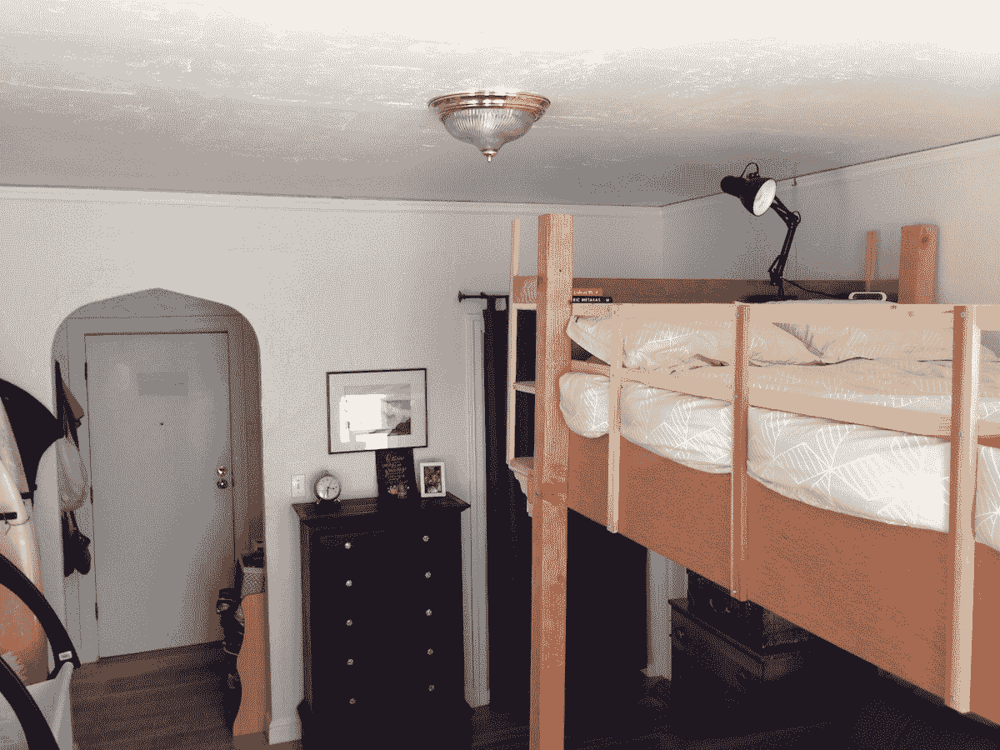

在创业的世界里，我们谈论一种叫做跑道的东西。这基本上意味着，如果资金不再流入，你还能继续运营多久。对于许多公司来说，这个时间非常短。[对于很多家庭来说，甚至更短](http://www.gregkroleski.com/2016/10/06/response-the-secret-shame-of-middle-class-americans/)。那是一个极其脆弱的地方。

我认为保持低支出如此重要的原因是，它具有降低消耗率和增加储蓄的双重效果。这两者结合起来，让你有更多的跑道。当你有很多财务跑道时，它允许你基于金钱以外的原因做出决定，因为你知道即使金钱暂时停止流入，你也会没事的。

为了省钱，我们选择住小一点的公寓、[骑自行车上班、](http://www.gregkroleski.com/2016/05/16/the-bike-counter/)、[改用低价手机套餐、](http://www.gregkroleski.com/2017/03/23/ting-review-three-years-tings-cell-phone-service/)并且很少在外面吃饭——还有其他方式。结果是很多跑道和做一些很酷的事情的能力——[比如在 2017 年休息一年](http://www.gregkroleski.com/2017/07/08/our-2017-sabbath-year/)。

当我们谈论跑道的时候，有一些钱，足够你的整个人生。如果你能存下那么多钱，并坚持你的支出预算，你就再也不需要为钱而工作了。这才是真正的自由。

我认识到不是每个人都有机会获得那种自由。有些人必须长时间努力工作才能勉强度日。但是许多人一再放弃他们的自由，选择更大的房子，更好的汽车，更多的便利和奢侈品。如果那是你最重视的，那就这样吧，但是在我们家，重视自由和灵活性。

最后一点——不要忘记复利的重要性。我要提醒您，每月节省 2000 美元的租金一年就是 24k 美元。投资 50 年，平均 6%的利息约为 45 万美元。自由。HTFU。

### 第 10 课)不需要工作室

几个月前，我们搬出了旧金山和那套公寓。最后有很多原因，其中只有一部分是有限的空间。

我们最终搬到了一个更便宜的城市(西雅图),以比我们在旧金山考虑的低得多的价格买到了 2BR。感觉很大。我们甚至不知道如何利用大部分空间。在没有迫使我们非常仔细地思考的严格限制的情况下，一切都感觉有点漫不经心。

但是，我永远毁了。我再也不能以同样的方式思考房子了。我永远无法用同样的方式思考问题。我的定义都被改变了。

然后是你。你不必住在工作室里才能从这些课程中受益(尽管也许你就是这样找到这篇文章的)。无论你占据什么样的空间，也许上面都有改变你感知的想法。正是那些思想的种子能够生根发芽，成长为行动。

当我的妻子和我看我们可能想要居住的地方时，我们用新的眼光来看。当我们思考未来和我们可能想要引导我们生活的情况时，我们的目标现在不同了。我们可能不得不做出的牺牲似乎不那么具有挑战性。这种权衡更容易管理。

我不知道未来会怎样，但我有一些想法让我非常兴奋。我将永远感激那个工作室，我们善良的房东，以及那段时间是如何帮助塑造我们将要走的路的。

—

## 作者说明

哇！感谢大家在评论中以及在其他网站和社交平台上的善意话语和健康辩论。看着不同信仰和背景的人用 4000 个单词进行如此广泛的对话是如此有趣。

我们这个家庭决定在一段时间内做出某种非传统的权衡——选择牺牲空间以节省时间和金钱，同时继续住在我们想住的地方。在那段时间里，我们受益于其他人分享他们在类似情况下的学习，所以我们希望这篇文章能以同样的方式帮助其他人..