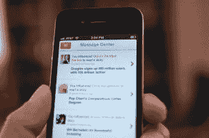

# 创业失败的原因:对社交新闻播报员 Flud 的剖析

> 原文：<http://techcrunch.com/2013/09/22/why-startups-fail-a-postmortem-for-social-newsreader-flud-and-what-to-take-from-sonars-demise/?utm_source=wanqu.co&utm_campaign=Wanqu+Daily&utm_medium=website>

7 月下旬，[有消息称，iOS、Android 和 Windows Phone 的社交新闻阅读器 Flud](http://venturebeat.com/2013/07/31/flud-folds-news-reader-startup-is-shutting-down/) 将被淘汰。创业失败在硅谷是一个再熟悉不过、甚至是老生常谈的故事。但当 San Diegoan 的联合创始人鲍比·戈沙尔(Bobby Ghoshal)和马修·奥索尼奥(Matthew Ausonio)在 8 月份正式关闭 Flud 应用和网站时，经过三年的开发，这是一个令人失望的最后一章，因为一个产品在一年内吸引的关注超过了一般创业公司在其整个生命周期中看到的关注。

这也是一个令人惊讶的结论，因为 Flud 已经从底特律风险投资伙伴、Ludlow Ventures、Behance 联合创始人兼首席执行官 Scott Belsky 和 JF Ventures 等投资者那里筹集了 210 万美元的种子资金。此外，去年流传的报道称，投资者仍对 FLUD 感兴趣，并正在筹集高达 800 万美元的新资金。

但 Flud 从未全面关闭，如今，初创公司[不再是](http://www.youtube.com/watch?v=4vuW6tQ0218)。事实上，最终导致 Flud 死亡的原因是该公司无法筹集到这笔额外的资金。尽管有多种方法和化身——[包括转向企业](https://beta.techcrunch.com/2013/04/19/mobile-social-newsreader-flud-finds-a-home-in-the-enterprise-with-a-sharepoint-yammer-integrated-service-for-both-private-and-public-content/)——追求永远难以捉摸的产品市场契合度(和货币化)，Flud 最终耗尽了资金——和跑道。

迄今为止，创始人尚未公开谈论 Flud 关闭的任何细节，以及为什么该公司未能把一个有前途的开始变成名利。上周，我们采访了 Ghoshal，他大方地同意揭开帷幕，提供一点关于 Flud 的事后分析——为了澄清，当然也是为了启发。

创业是艰难的——不要让任何人告诉你不同的观点——每个人都会失败。有些人只是比其他人更好地学会了失败，这就是区别所在。

Flud 的故事与移动领域最近的另一个受害者有很多共同之处:声纳。前 Sonar 联合创始人兼首席执行官布雷特·马丁(Brett Martin)最近在 Medium (这是所有企业家、投资者和初创公司人士的必读之作)上发表了一篇文章，阐述了他自己的移动定位初创公司为何会破产。

Sonar 和 Flud 都被数百万人下载，被苹果和谷歌推广，筹集了数百万资金，并得到了媒体的高度赞扬——然而你知道这两个故事的结局是什么。

### 需求

正如保罗·格拉厄姆的名言所说，建立一个成功的创业公司的关键之一不一定是有一个绝妙的想法，而是“制造人们真正想要的东西”当戈沙尔和奥索尼奥在 2010 年夏天开始开发 Flud 的想法时，他们的大愿景是建立一个产品，它不仅仅是另一个基于 RSS 的新闻阅读器或社交杂志，而是一个真正的社交新闻生态系统(以及一个以设计为中心的，即视觉的生态系统)——如果你愿意的话，是一个“新闻的 Instagram”。

作为一个纸上谈兵的观察者，虽然说起来容易，但 Flud 失败的部分原因是因为市场已经被类似的产品饱和，竞争太激烈了。毕竟，当 [Flud 在 2010 年 8 月](https://beta.techcrunch.com/2010/12/25/flud/)推出其第一款 iPad 应用时，Flipboard 和 Pulse 已经非常成熟，拥有数百万用户，并在新闻阅读器市场占据了大部分份额。

 此外，Flud 不得不与人们与新闻和新闻消费工具之间变化无常、不确定且不断发展的关系作斗争。他们总是说他们想要一个更好的新闻播报员，愿意尝试一些新的东西，但随后他们就像口袋里的棉绒一样粘在熟悉的东西上。看看谷歌阅读器发生了什么:大多数精通数字技术的人似乎都同意，虽然谷歌和 RSS 多年来都非常棒，但最终更智能的实时工具提供了更绿色的牧场。看似达成一致，[谷歌在 2011 年](https://beta.techcrunch.com/2013/03/13/googlereaderpocalypse-for-real-this-time/)开始拆除这项服务，最终在今年夏天关闭了它，*当然还有*，网络变得疯狂。就好像谷歌刚刚切断了他们的电源，给了他们妈妈一拳。

但是，事实上，当 Flud 在 2010 年 12 月推出其 iPhone 应用程序时，人们对“更好”的新闻消费方式有着大量的需求——事实上，现在仍然存在。作为一个例子，当我们在 12 月底与 Ghoshal 交谈时，该应用程序是[“每四秒增加一个新用户。”](https://beta.techcrunch.com/2010/12/25/flud/)

这也是为什么(至少在理论上)Flud 引起了媒体的共鸣: [Fast Company 将其 iPhone 应用程序](http://www.fastcodesign.com/1662959/12-of-the-years-best-ideas-in-interface-design-slideshow)列入 2010 年“最佳用户界面设计”之一， [NBC 将其称为](http://vimeo.com/14946187)“新闻的未来”见鬼，甚至一些叫瑞普·恩普森的家伙(我知道，对吗？)[说 Flud 可以把](https://beta.techcrunch.com/2010/12/25/flud/)打造成新闻舞台上“不可忽视的力量”。

回想起来，很明显，一句话，我们“不完全正确”(嘿，即使是最好的人也有犯错的时候，对吧，伙计们？对吗？喂？)尽管如此，当然还有我自己的一点必要的防御，对一个更好的新闻播音员的需求是存在的。更进一步，我认为 Flud 背后的最初愿景——建立一个全方位服务、设计友好的社交新闻生态系统——很有吸引力。现在也是。

问问大型社交网络就知道了。如今，脸书正在开发自己的社交新闻阅读器，Flipboard、Pulse 和 Feedly 可能仍然是最好的选择，如果不是最知名的名字的话。关于 Pulse，LinkedIn 今年早些时候以 9000 万美元收购了广受欢迎的新闻阅读器，以帮助其开发自己的内容中心和新闻阅读战略。LinkedIn 不仅认为它价值 9000 万美元，而且尽管被收购(和重叠),但仍保持应用程序的活力[,并继续更新它们](https://beta.techcrunch.com/2013/08/21/linkedin-revamps-pulse-apps-with-faster-search-more-discovery-tools/)。

### 竞争

但是谁在乎他们呢？(对，那是半个反问句。Brett Martin 在 Medium 上的帖子中，详细描述了 Sonar 过于担心竞争对手的结果，如 Highlight、Banjo 和其他许多公司。像声纳一样，Ghoshal 说，总是有关于 Flipboard 和 Pulse 做得如何的噪音，但它总是更多地是心理上的。最后，你不能让其他公司正在做的事情驱动你的业务方向——你越是让他们进入你的头脑，情况就越糟糕。

当然，不关注是不可能的，但你的回应应该是“嗯，这很有趣，而不是‘哦，f#$%^&*”…当你看到它时，知道这是一个好主意(一个“好”主意是解决你的用户现在遇到的问题的更好的方法，如果你想推动它，他们将在几周内遇到的问题，但不是他们将在一年内遇到的问题，这是傲慢。你不是史蒂夫·乔布斯)，但不要让它让你偏离你的整体愿景。

相反，如果一家初创公司足够幸运，偶然发现了用户真正想要使用的想法或产品，那么比竞争对手正在做的事情更重要的是了解客户想要什么，并缩小客户想要什么，他们实际使用的产品部分与你的产品当时存在的功能/特性集之间的差距。

### 压

不要浪费太多时间担心媒体和报道。如果你创造了一个伟大的产品，媒体就会来——相信我，我是一名医生。此外，戈沙尔告诉我们，要足够相信你的产品和愿景，这样如果媒体真的来了，你就不会感到惊讶，这样你就能做好准备。

戈沙尔说，在三年前 Flud 推出这款应用之前，他和他的联合创始人曾兼职开发这款应用。正如他们所说，后见之明是 20/20，但部分是因为他们没有想到会受到任何媒体的关注，而且之前也没有做过媒体推动的发布，所以开始时的小问题像滚雪球一样迅速扩大。

Flud 很幸运，它的早期产品发布会吸引了大量的媒体关注。然而，戈沙尔说，从那时起，当团队推出新产品时，他们会本能地去追逐媒体。他们会受到压力，用户会让应用程序超载，系统崩溃，当他们最终恢复运行时，仍然有太多的错误，而且，在一个有 170 亿个应用程序的世界里，人们往往不会原谅用户的错误体验。(顺便说一句，这是应该的。)

这位 Flud 的首席执行官笑着总结道:“我学到的最重要的事情之一，”他说，“是当你推出一款新产品时——尤其是如果它有一些真正的‘新奇’的话——最好的办法是闭嘴。”

### 测试，测试，再测试

“我们确实没有对最初的产品进行足够的测试，”戈沙尔说。该团队在没有重要的测试期，也没有花费大量时间运行 QA、场景测试、基于任务的测试等的情况下，就扣动了最初发布的扳机。当 1.0 发布时，小故障和错误很快开始抬头(就像他们总是做的那样)，导致大量的延迟和滞后的用户体验——我们甚至在早期的报道中提到过。

众所周知，初创公司没有足够的时间进行压力和负载测试，或者直到最后一分钟才进行测试——尤其是小团队——但这意味着事情往往会变得非常棘手，尤其是如果你每四秒钟就开始添加一个用户。

戈沙尔还表示，他们所做的测试范围太窄:“我们也没有测试我们的假设，即人们在新闻阅读器中最关心的是什么——我们知道他们在阅读一些东西后会想与朋友分享，但我们认为他们不关心影响之类的东西。他们做到了，当我们加上这句话的时候，有些人已经离开了。”

这与上面的建议有关:了解你的客户想要什么以及他们如何使用应用程序，正如布雷特·马丁所说，针对实际用户行为进行优化，并尽可能多地专注于消除他们现有行为的摩擦。不要把注意力放在更抽象的东西上，比如科技或者一套令人惊叹的 API。

[T2】](https://beta.techcrunch.com/wp-content/uploads/2013/09/flud-ipad.jpeg)

一旦事情开始恶化，就很难恢复

他说，Flud 过于关注媒体，而对测试少数可信人士之外的新功能关注不够。在那之后，“事情很快就急转直下，因为我们的新用户从早期用户那里听说了糟糕的体验，评论没有帮助，所以我们失去了很多注意力。”

他说，即使在 Flud 为其早期产品添加了电子邮件通知等急需的功能后，也为时已晚。“从早期的螺旋中恢复真的很难。”这位首席执行官说，为了应对这些早期问题，该团队埋头专注于重建 Flud 的技术方面，而其竞争对手则专注于用户获取。但这是一个反射性的决定，它导致 Flud 在那个方向走得太远。

正如马丁谈到 Sonar 的经历时所说，对于初创公司来说，关于是关注增长还是参与，以及如何平衡这两者，存在一场持续的内部斗争。然而，他说，如果一家初创公司正在打造一款社交产品，增长才是关键——参与并不重要。戈沙尔的说法呼应了声纳的说法——考虑到 Flud 本质上是在试图重新想象新闻消费背景下的社交网络，这或许并不奇怪。

从长远来看，Flud 首席执行官认为，该团队最终确实成功地在技术方面建立了一个更好的产品，但当需要筹集资金时，“投资者不想投资一个三级新闻阅读器。”按照马丁的观点，他们只关心增长。由于其早期的挣扎，Flud 有一个更陡峭的山要爬，这要感谢高原用户的采用。

### 确定何时以及如何转向(听取反馈)

一旦 Flud 发现投资者对它的消费产品望而却步，它就不得不评估这项业务。该团队很快意识到资金越来越紧张，必须迅速找到一个新的市场，让客户付费，换句话说，在那里它可以建立一个真正的企业。

戈沙尔说，早些时候，一些企业玩家联系了该公司，说了这样的话，“尽管 Flud 是一种消费产品，但我们的高管刚买了 iPads，他们想使用这款应用程序，但他们需要在防火墙后使用它。”本质上，这些公司希望 Flud 建立一个白色标签的产品，保持用户体验不变，但针对“大公司”的用例进行优化。

戈沙尔说，当时他没有看到机会，所以弗路德拒绝了那些机会。但是到了转向的时候，他们回到最初的线索，发现需求没有变化。Flud 很快推出了新的企业版本，该版本于去年 12 月推出，等待名单上有 1500 家公司。

### 总是有进取心的，对吗？

令人印象深刻的是，在其企业产品上线的四个多月里，这个四人团队能够带来约 50 万美元的预订。然而，这个团队没有给自己足够的时间——在真正开始任何有意义的工作之前，他们就已经耗尽了时间和金钱。

尽管 Flud 失败了，但 Ghoshal 认为，中型企业和企业仍然有一个“消费化”的社交新闻共享网络的巨大机会。“企业渴望这样的产品，”这位首席执行官说，“这是没有多少人谈论的东西。大公司有一个 Yammer 没有充分解决的内容共享问题。

这些公司希望提供一种产品，通过这种产品，员工可以阅读关于他们客户的内容，以及内部新闻和由高管和经理分享的内容。他们希望能够跟踪人们在读什么，并提供更好、更个性化的内容。

Flud 的联合创始人告诉我们:“这是一个巨大的机会，可以为企业，尤其是企业，提供一种更好的方式来阅读、分享和整合内部内容。”虽然 Flud 开始这样做，但它也遇到了任何面向消费者的创业公司在转向企业目标时都必须处理的问题，而且它没有资源来度过难关。

戈沙尔说，正如许多人所知，为企业制造产品是一项昂贵的提议，初创公司需要进行业务开发招聘，处理谈判企业中更复杂的集成流程所需的指导和时间——更不用说处理更长的销售周期带来的资本需求了。

最后，尽管它从早期客户那里看到了令人鼓舞的数据，并引起了投资者的兴趣，“他们都希望看到三到六个月的数据，但我们只有两个月的数据，”戈沙尔解释道。投资者希望看到更多的验证，而 Flud 没有，这最终导致了公司的死亡。

### 继续前进

关闭或出售一家公司的决定直到最后一刻都是一个伤脑筋、紧张的过程。这一过程耗费精力，让许多人心情不好。虽然人们可能会认为，员工和创始人很难继续寻找下一个机会，但一旦事情结束，继续前进就会容易得多。

整个 Flud 团队已经转向不同的项目，Ghoshal 说他已经开始着手他的下一个创业项目，尽管他还没有准备好谈论那是什么。与此同时，创始人正在为 Flud 的资产寻找买家，并与几家潜在的收购者进行谈判。

他对初创公司的建议是，应该从潜在收购者那里寻找什么？“我认为对大多数人来说，这是一个弄清楚哪家公司会从你的产品中获益最多的问题，”他说。“这可能是显而易见的，但能给你带来最大价值的公司是那些想马上卖掉产品的公司……而不是只给你现金然后就关门大吉的公司。”

更多信息，请点击查看布雷特·马丁在声纳上的验尸报告，另一个很棒的(验尸)读物，请查看[马克·亨德里克森在 Plancast](https://beta.techcrunch.com/2012/01/22/post-mortem-for-plancast/) 上的帖子。虽然初创公司的失败率没有改变，但很高兴看到更多的企业家和初创公司员工愿意承认这种情况发生在他们身上，并分享他们的经验，这样其他人——当他们失败时——至少不会犯同样的错误。