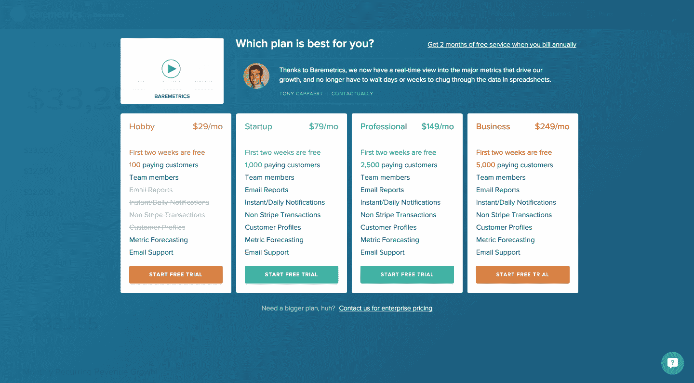
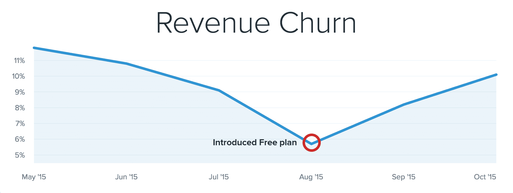

# 免费增值如何几乎导致我们的业务内爆

> 原文：<https://baremetrics.com/blog/freemium-saas-implode?utm_source=wanqu.co&utm_campaign=Wanqu+Daily&utm_medium=website>

三个月前，我们推出了一个免费计划…它几乎让 Baremetrics 屈服了。让我们看看我们做了什么，它如何影响我们的业务，以及它最终是如何失败的。

两年前，当我第一次创建并推出 Baremetrics 时，我从第一天就开始收费。没有免费计划也没有试用。你用信用卡注册，并被收取真正的钱。不开心？没问题，我们有 60 天退款保证。

我们将这种设置保持了将近两年，并使用它将业务从 0 美元增长到每月超过 3 万美元的收入。然后我们决定改变现状。

## 我们的免费计划设置

8 月，我们推出了完全免费的计划。没有时间限制和客户数量限制(这是付费计划的主要细分因素)。唯一的限制是特性集。

想要完整的历史指标吗？请升级。想要强大的工具来深入挖掘您的指标吗？你需要为此升级。想自动收取失败的费用吗？你猜对了:升级。

在您准备好升级之前，我们不需要信用卡。除了注册之外，他们基本上没有承诺做任何事情。

## 结果呢

我们在 8 月 18 日推出了免费计划，采用了一种有点不寻常的方式: [Beardmetrics](http://beardmetrics.com) 。我们的 Beardmetrics 营销实验的结果是另一个帖子的内容，但最终我们实际上没有做出一个巨大的“BAREMETRICS 现在有一个免费计划！”公告。我们向 7000 人发出了一封电子邮件，并向另外几千人发了推文，以此来制造一些关于 Baremetrics 的讨论。然后，我们试图通过让注册变得超级简单/快速来转化尽可能多的人。

在 11 周的时间里，创建了 1000 多个免费账户。需要说明的是，这并不是 1000 名“潜在付费客户”。我们仍然强烈倾向于“订阅”公司。这意味着公司需要订阅收入，更具体地说，必须使用 Stripe 的订阅 API。(更新！我们现在支持 Stripe，Braintree，Recurly 和 Chargify。)

因此，在这 1000 个账户中，有 461 个实际上有资格考虑成为付费用户。

在 461 个合格的付费用户中，有 53 个实际上升级了。

**T2`53 as a % of 461 = 11.5%`**

我们在近 3 个月的时间里，从免费到付费的转换率刚刚超过 11%，ARPU 为 90 美元，这意味着在新 MRR 有近 5000 美元。

老实说，这真是太神奇了。平均 B2B 转换率约为 3-5%……所以我们正在消灭它。但是随着这些事情的发展，事情就没那么简单了。

## 当自由开始瓦解

我们每天增加十几个新账户，但乐趣也就到此为止了。

很快，我们开始遇到许多性能和数据库问题。几周之内，我们的“免费”客户数量超过了我们的“付费”客户，存储和处理的数据量翻了一番。

因为我们必须从 Stripe 下载并存储您的*整个*数据集，然后为您的帐户上的每个计划生成每天的指标(并存储这些指标)，所以只需要进行大量的数据处理。

在免费计划之前，我们有两年多的时间来慢慢增加我们处理的数据量。然后，我们发现自己需要在几天内将可处理的负载增加一倍。不用说，结果对我们不利。

我们日复一日、周复一周地处理越来越复杂的服务器和性能问题，因为我们只是不断地增加新的免费账户。

此外，我们支持的客户数量增加了两倍。我们发现自己的分布非常稀疏，无法提供与以前相同的响应能力。除了*和*之外，由于上述服务器问题，我们的常规支持负载也增加了。

然后，更糟糕的是，我们太专注于扑灭服务器火灾，我们发现自己在产品本身上毫无进展。

说这些问题正在恶化是一种保守的说法。

## 称之为失败

这些复杂问题的最终结果导致了我们免费计划失败的核心:**流失**。

我们开始不断失去客户，因为他们日复一日地经历停机、延迟数据和不准确的指标，这绝对是不行的。最重要的是，他们的支持体验不太理想，产品本身也变得停滞不前，漏洞百出。

**我们失去了近 60 名客户**在我们实施免费计划的 11 周内，我们的收入增加了一倍，导致客户净流失。**我们的免费计划导致我们的业务慢慢内爆。**

## 当免费没有意义的时候

人们谈论了很多关于免费客户的支持负载是免费增值的主要负面因素之一。这对我们来说当然是其中的一部分。

更大的问题归结为我们的资源是有限的。我们能够缓慢地扩展我们的基础架构，因为我们以前的增长是可预测的，我们可以提前发现某些瓶颈何时会成为主要问题。

不过，免费计划把所有这些都抛到了九霄云外。

当你的可用资源，无论是团队规模、绩效上限还是资金，都很紧张时，那么“免费”就很有可能造成比提供任何实际利益更大的损害。

## 我们本可以做得不同的事情

有几件事我们本可以做得不同，*可能会导致不同的结果。*

*   **限制我们导入和处理的历史数据量** —如果我们只导入免费计划中显示的 30 天的数据，这将为我们节省相当多的处理时间，但我相信这也会带来糟糕的升级体验，因为您必须重新导入所有的历史数据。
*   **一开始提供了一个全功能的试用版，然后就降级到免费版**——理论上这将导致更多的升级，但它不会解决扩展问题。
*   限制免费计划的付费用户数量——这将防止大账户占用资源，但最终这只会将不可避免的事情推迟一两周。

有各种各样的设置我们可以测试，但最终我们需要尽快纠正。我们可以以后再讨论这些事情。

## 我们现在正在做的

在过去的一周里，我们已经切换到免费的*试用版*。在 14 天内，你可以完全访问一切，之后你可以选择一个计划。如果您选择不选择计划，我们将停止处理您的数据。

这给资源占用设置了一个硬限制，防止我们遇到复杂的性能问题。

我们还对基础设施进行了重大改进，以避免将来出现这些问题。

我不会完全放弃免费增值。我相信肯定有这样的情况，它*可以*工作。但是现在，在我们的情况下，它肯定不起作用。

我希望听到您对我们本可以采取不同做法的事情的坦诚反馈，以及您自己对免费增值的体验。