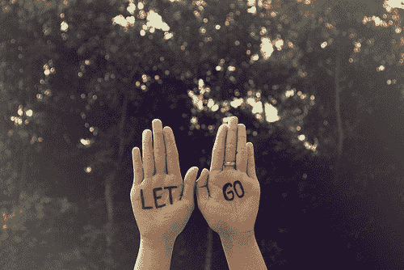

# 当你放下不可控的事情时，你会逐渐学会 20 件事

> 原文：<http://www.marcandangel.com/2015/11/08/things-you-learn-as-you-let-go-of-the-uncontrollable/?utm_source=wanqu.co&utm_campaign=Wanqu+Daily&utm_medium=website>

# 当你放下不可控的事情时，你会逐渐学会 20 件事

作者 天使/[53 评论](https://www.marcandangel.com/2021/12/15/things-you-learn-as-you-let-go-of-the-uncontrollable/#comments)

<noscript>T3】</noscript>

> 接受现状，放下过去，对你的旅程充满信心。

当你生命的某一部分已经到达不可避免的终点时，接受现实总是必要的。关门、完成章节、翻页等。–你给它起什么名字并不重要；重要的是，你找到力量将你生命中已经结束的部分留在过去。

这一切都是为了拥抱真相:已经发生的事情是不可控的；你现在所做的会改变一切！

当然，知道这一点和真正过上强化这一真理的生活是两码事。放手并不容易——这是一段一天一天走过的旅程。如果你坚持下去，以下是你的旅程最终会教给你的东西

1.  当你决定控制你有能力控制的事情，而不是渴望控制你没有的事情时，你的生活就会发生最大的变化。
2.  大多数人之所以不快乐，仅仅是因为他们发现无法接受现在的生活。
3.  如果你太担心可能会发生什么，对可能会发生什么想太久，你就会忽略和完全错过现在。
4.  当你迷失在忧虑中时，很容易把忧虑误认为现实，而不是认识到它们只是想法。正念是药方。
5.  成长的最大障碍是你必须克服的思想。一旦你能克服它，你就能克服一切。
6.  如果你拔掉插头一小会儿，几乎所有东西都会重新工作，包括你自己。*(读[无论你走到哪里，都有你](http://www.amazon.com/gp/product/1401307787/ref=as_li_tf_tl?ie=UTF8&tag=marandang-20&linkCode=as2&camp=1789&creative=9325&creativeASIN=1401307787)。)*
7.  你不会总是过得轻松，但总有一个感恩的理由。感恩的最大礼物是，你越感恩，你就越活在当下。
8.  取得成功的秘诀在于，不要把你所有的精力都放在修复和对抗旧的东西上，而是放在建设和发展新的东西上。
9.  放手并不意味着你不再在乎某件事或某个人。只是意识到此时此刻你真正能控制的只有你自己。
10.  在大多数情况下，你无法平息这场风暴——不值得一试。你能做的就是让自己冷静下来，风暴会过去的。
11.  你总是可以控制你对发生的事情的反应方式，在你的反应中是你的力量。
12.  通常，放手只是简单地改变你对一种情况的标签——用新的眼光和开放的心态看待同样的情况。
13.  你目前的情况绝对不会阻碍你进步，一次一小步。
14.  你“理解”一切的那一天，就是你不再试图弄清楚一切的那一天。你重新找到平静和自由的那一天，就是你放下一切的那一天。
15.  你必须放弃确定性。你必须记住，确定性的对立面不是不确定性，而是开放性、好奇心和接受生活本来面目的意愿，而不是抗拒它。最终的挑战是接受真实的自己，接受生活本来的样子，但永远不要停止努力学习，尽你所能成长。
16.  在这一切之下，最难的部分不是真正放手，而是学会重新开始。
17.  踏上一条全新的道路是困难的，但不会比停留在一个不再适合或不再存在的情况下更困难。
18.  有时候，一点点心碎会让你清醒，让你释怀，让你知道你的价值远远超出你的预期。
19.  说到社交剧，放下别人的粗话是最好的进步。大多数恨你的人并不是真的恨你；他们只是讨厌他们在生活中的位置，而你是他们希望成为的人的反映。*(马克和我在[1000 件快乐的小事中的“关系”一章详细讨论了这一点，成功人士的做法与众不同](https://www.marcandangel.com/book/)。)*
20.  你的心可能会受伤，但它会逐渐愈合，并再次感受到生活的美好。这种事以前发生在你身上，以后还会发生——生活总是在变化。当某件事结束或某人离开，那是因为另一件事或另一个人即将到来——你会很快再次感到充满活力和完整。

### 事后思考

即使你的内在智慧告诉你事情不对劲，是时候放手了，也很难将长期的生活状况抛在脑后。在这一点上，你可以选择放手，忍受抛弃熟悉事物的突然痛苦，为生活的新篇章让路，或者你可以留下来，忍受持续的疼痛，这种疼痛逐渐侵蚀你的心灵，就像癌症一样……直到有一天你醒来，发现自己深深陷入了这种状况的混乱之中，以至于你几乎不记得自己是谁，也不记得自己想要什么。

不要这样做你自己！

意想不到的、不受欢迎的和无法控制的事情会发生。但是你总是可以选择迈出下一小步。勇敢的接受吧…

愿意犯错，从错误中学习，放下错误，继续前进。

### 轮到你了…

你需要放下的一件无法控制的往事或生活状况是什么？在你的生活中，哪些附件给你带来了不必要的压力？请在下面留下评论，让我们知道你的感受和你打算怎么做。

此外，如果你还没有这样做，一定要注册我们的免费简讯，以便每周在你的收件箱中收到类似的新文章。

T1 照片由:[塞里斯](https://www.flickr.com/photos/omgrawr/)T4