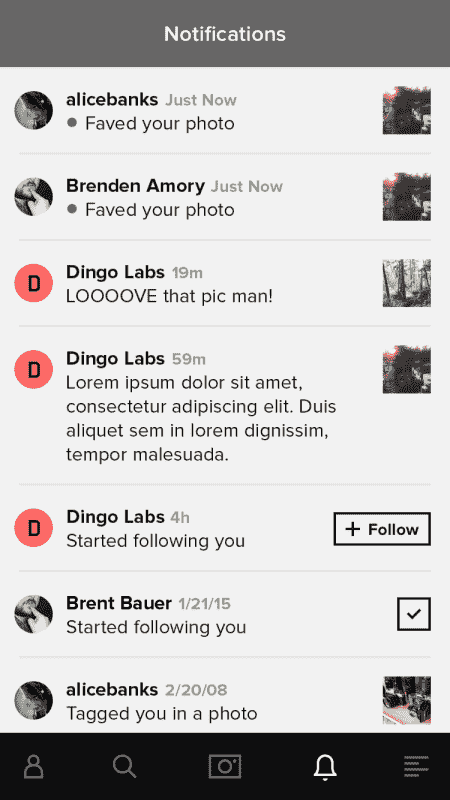
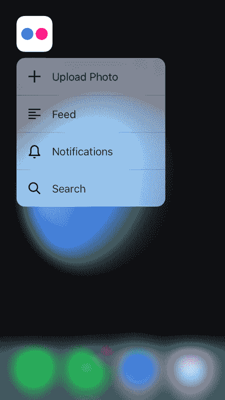

# Flickr 的 iOS 9 体验| code.flickr.com

> 原文：<https://code.flickr.net/2015/11/18/flickrs-experience-with-ios-9/?utm_source=wanqu.co&utm_campaign=Wanqu+Daily&utm_medium=website>

在过去的几个月里，苹果发布了 iOS 9 的新功能，允许应用程序和操作系统之间更深层次的集成。这些功能包括 iPhone 6S 和 iPhone 6S Plus 的 Spotlight 搜索集成、通用链接和 3D Touch。

在 Flickr，我们增加了对这些新功能的支持，我们也学到了一些经验，希望与大家分享。

## **聚光灯搜索**

有两种不同类型的内容可以通过 Spotlight 进行搜索:一种是您显式索引的内容，另一种是根据您的应用程序所处的状态进行索引的内容。要显式索引内容，您可以使用 Core Spotlight，它允许您一次索引多个项目。为了索引与你的应用程序的当前状态相关的内容，你使用 NSUserActivity:当一段内容变得可见时，你开始一个活动来让 iOS 意识到这个事实。然后，iOS 可以确定哪些内容被更频繁地访问，从而与用户更相关。NSUserActivity 还允许我们将某些项目标记为公共的，这意味着它们也可能显示给其他 iOS 用户。

为了更好的用户体验，我们尽可能多地索引有用的信息。我们预取用户的所有相册、群组和他们关注的人，并使用 Core Spotlight 将他们添加到搜索索引中。索引项目看起来像这样:

```

// Create the attribute set, which encapsulates the metadata of the item we're indexing
CSSearchableItemAttributeSet *attributeSet = [[CSSearchableItemAttributeSet alloc] initWithItemContentType:(NSString *)kUTTypeImage];
attributeSet.title = photo.title;
attributeSet.contentDescription = photo.searchableDescription;
attributeSet.keywords = photo.keywords;
attributeSet.thumbnailData = UIImageJPEGRepresentation(photo.thumbnail, 0.98);

// Create the searchable item and index it.
CSSearchableItem *searchableItem = [[CSSearchableItem alloc] initWithUniqueIdentifier:[NSString stringWithFormat:@&quot;%@/%@&quot;, photo.identifier, photo.searchContentType] domainIdentifier:@&quot;FLKCurrentUserSearchDomain&quot; attributeSet:attributeSet];
[[CSSearchableIndex defaultSearchableIndex] indexSearchableItems:@[ searchableItem ] completionHandler:^(NSError * _Nullable error) {
                       if (error) {
                           // Handle failures.
                       }
              }];

```

由于我们有多种数据——照片、相册和群组——我们必须创建一个标识符，它是其类型和实际型号 ID 的组合。

许多用户将有大量数据要获取，因此我们采取措施确保应用程序仍然性能良好非常重要。由于搜索不太可能在用户打开应用程序后立即发生(如果需要，这是我们开始预取数据的时候)，所有这些工作都由低优先级的 NSOperationQueue 执行。如果我们需要获取用作缩略图的图像，我们用低优先级`NSURLSessionDownloadTask`请求它。这些措施确保我们不会影响由用户操作触发的任何操作或网络请求的性能，例如在滚动内容时获取新的图像和页面。

Flickr 提供了大量的公共内容，包括许多令人惊叹的照片。如果有人在聚光灯下搜索“北极光”，我们不应该给他们展示我们最好的北极光照片吗？对于这些公共内容(照片、公共群组、标签等)，我们利用 NSUserActivity 及其新的搜索 API，使所有内容在查看时都可以搜索到。这里有一个例子:

```

CSSearchableItemAttributeSet *attributeSet = [[CSSearchableItemAttributeSet alloc] initWithItemContentType:(NSString *) kUTTypeImage];
// Setup attributeSet the same way we did before...
// Set the related unique identifier, so it matches to any existing item indexed with Core Spotlight.     
attributeSet.relatedUniqueIdentifier = [NSString stringWithFormat:@&quot;%@/%@&quot;, photo.identifier, photo.searchContentType];

self.userActivity = [[NSUserActivity alloc] initWithActivityType:@&quot;FLKSearchableUserActivityType&quot;];
self.userActivity.title = photo.title;
self.userActivity.keywords = [NSSet setWithArray:photo.keywords];
self.userActivity.webpageURL = photo.photoPageURL;
self.userActivity.contentAttributeSet = attributeSet;
self.userActivity.eligibleForSearch = YES;
self.userActivity.eligibleForPublicIndexing = photo.isPublic;
self.userActivity.requiredUserInfoKeys = [NSSet setWithArray:self.userActivity.userInfo.allKeys];

[self.userActivity becomeCurrent];

```

每次用户打开照片、公共群、位置页面等。，我们创建一个新的活动，并使其成为当前活动。某项具体活动越频繁，监督办就越认为它相关。事实上，某项活动被不同用户更新得越频繁，苹果就越认为它在全球范围内具有相关性，它也越有可能出现在其他 iOS 用户面前(前提是它是公开的)。

到目前为止，我们只看到了全貌的一半。我们已经看到了如何为 Spotlight 搜索建立索引；当用户最终进行搜索并点击结果时，我们如何将他们带到应用程序中的正确位置？我们稍后会谈到这一点，但是现在可以说，您将获得对我们的应用程序委托的方法`application:continueUserActivity:restorationHandler:`的调用。

需要注意的是，如果我们想利用`NSUserActivity`中的`userInfo`，iOS 不会以这种方式免费还给你。为了得到它，我们必须确保在创建它的时候，将一个 NSSet 分配给了我们的`NSUserActivity`的`requiredUserInfoKeys`属性。在他们的文档中，苹果还告诉我们，如果你在`eligibleForSearch`为`YES`时设置了`webpageURL`属性，你需要确保你指向的是与你的内容相对应的正确网址，否则你可能会在 Spotlight 中得到重复的结果(苹果会在你的网站上抓取内容以在 Spotlight 中显示，如果它在不同的网址找到相同的内容，它会认为这是不同的内容)。

## **通用链接**

为了支持通用链接，苹果要求该应用程序支持的每个域在其根目录下托管一个“苹果-应用程序-网站-关联”文件。这是一个 JSON 文件，描述了应用程序可以处理的域中的相对路径。当用户点击 iOS 中另一个应用程序的链接时，如果你的应用程序能够处理特定路径的域，它将打开你的应用程序并调用`application:continueUserActivity:restorationHandler:`。否则，您的应用程序将无法打开，Safari 将会处理该 URL。

```

{
    &quot;applinks&quot;: {
        &quot;apps&quot;: [],
        &quot;details&quot;: {
            &quot;XXXXXXXXXX.com.some.flickr.domain&quot;: {
                &quot;paths&quot;: [
                    &quot;/&quot;,
                    &quot;/photos/*&quot;,
                    &quot;/people/*&quot;,
                    &quot;/groups/*&quot;
                ]
            }
        }
    }
}

```

该文件必须由 HTTPS 托管，并持有有效证书。它的 MIME 类型需要是“application/pkcs7-mime”请求文件时不允许重定向。如果唯一的意图是支持通用链接，则不需要进一步的步骤。但是如果你也使用这个文件来支持移交(在 iOS 8 中引入)，那么你的文件必须是由有效的 TLS 证书签署的 CMS。

在 Flickr 中，我们有几个不同的域。这意味着 flickr.com、[、http://www.flickr.com](http://www.flickr.com)、m.flickr.com 和 flic.kr 中的每一个都必须提供自己的 JSON 关联文件，不管它们是否不同。在我们的例子中，flic.kr 域实际上支持不同的路径，因为它只用于短 URLs 因此，它的“苹果应用程序网站协会”不同于其他的。

在客户端，只需要几个步骤就可以支持通用链接。首先，必须在应用程序目标设置的功能选项卡下启用“关联域”。对于每个支持的域，必须添加条目“applinks:”条目。这是它在 Flickr 上的样子:


就是这样。现在，如果有人收到一条带有 Flickr 链接的短信，当她点击它时，就会直接跳到 Flickr 应用程序。

## **深度链接到 app**

太好了！我们有 Flickr 照片显示为搜索结果，Flickr 网址直接在我们的应用程序中打开。现在我们只需要把用户带到应用程序中合适的位置。我们的应用程序有不同的入口点，我们需要实现一致，避免代码重复。

iOS 支持深度链接已经有一段时间了，Flickr 也是。为了支持深度链接，应用程序可以注册来处理自定义 URL(意味着自定义方案，如 myscheme://mydata/123)。对应于该应用的网站然后可以直接发布到该应用的链接。对于 Flickr 网站上发布的每个自定义 URL，我们的应用程序会将其转换为要显示的数据的表示。这种表示看起来像这样:

```

@interface FLKRoute : NSObject

@property (nonatomic) FLKRouteType type;
@property (nonatomic, copy) NSString *identifier;

@end

```

它描述了要呈现的数据类型，以及该数据类型的唯一标识符。

```

- (void)navigateToRoute:(FLKRoute *)route
{
    switch (route.type) {
        case FLKRouteTypePhoto:
            // Navigate to photo screen
            break;
        case FLKRouteTypeAlbum:
           // Navigate to album screen
            break;
        case FLKRouteTypeGroup:
            // Navigate to group screen
            break;
        // ...
        default:
            break;
    }
}

```

现在，我们要做的就是确保我们能够将 NSURLs 和 NSUserActivity 对象转换成 FLKRoute 实例。对于 NSURLs 来说，这种翻译很简单。我们的自定义 URL 遵循与相应网站 URL 相同的模式；他们的道路完全一致。所以翻译网站 URL 和自定义 URL 就是使用 NSURLComponents 提取必要的信息来创建 FLKRoute 对象。

至于传入`application:continueUserActivity:restorationHandler:`的 NSUserActivity 对象，有两种情况。当 NSUserActivity 实例用于索引应用程序中的公共项目时，就会出现一个问题。还记得当我们创建 NSUserActivity 对象时，我们也分配了它的`webpageURL`吗？这非常方便，因为它不仅唯一地标识了我们想要呈现的数据，还为我们提供了一个 NSURL 对象，我们可以像处理深度链接或通用链接一样处理它。

另一种情况是 NSUserActivity 源自 CSSearchableItem 在这种情况下，我们还有更多的工作要做。我们需要解析为项目创建的标识符，并将其转换为 FLKRoute。请记住，我们的项目的标识符是其类型和型号 ID 的组合。我们可以分解它，然后创建我们的路由对象。它的简化实现如下所示:

```

FLKRoute * FLKRouteFromSearchableItemIdentifier(NSString *searchableItemIdentifier)
{
    NSArray *routeComponents = [searchableItemIdentifier componentsSeparatedByString:@&quot;/&quot;];
    if ([routeComponents count] != 2) { // type + id
        return nil;
    }

    // Handle the route type
    NSString *searchableItemContentType = [routeComponents firstObject];
    FLKRouteType type = FLKRouteTypeFromSearchableItemContentType(searchableItemContentType);

    // Get the item identifier
    NSString *itemIdentifier = [routeComponents lastObject];

    // Build the route object
    FLKRoute *route = [FLKRoute new];
    route.type = type;
    route.parameter = itemIdentifier;

    return route;
}

```

现在我们已经覆盖了所有的基础，我们确信当用户登陆我们的应用时，我们会把她放到正确的地方。最终的应用程序委托方法如下所示:

```

- (BOOL)application:(nonnull UIApplication *)application continueUserActivity:(nonnull NSUserActivity *)userActivity restorationHandler:(nonnull void (^)(NSArray * __nullable))restorationHandler
{
    FLKRoute *route;
    NSString *activityType = [userActivity activityType];
    NSURL *url;

    if ([activityType isEqualToString:CSSearchableItemActionType]) {
        // Searchable item from Core Spotlight
        NSString *itemIdentifier = [userActivity.userInfo objectForKey:CSSearchableItemActivityIdentifier];
        route = FLKRouteFromSearchableItemIdentifier(itemIdentifier);

    } else if ([activityType isEqualToString:@&quot;FLKSearchableUserActivityType&quot;] ||
               [activityType isEqualToString:NSUserActivityTypeBrowsingWeb]) {
        // Searchable item from NSUserActivity or Universal Link
        url = userActivity.webpageURL;
        route = [url flk_route];

    }

    if (route) {
        [self.router navigateToRoute:route];
        return YES;
    } else if (url) {
        [[UIApplication sharedApplication] openURL:url]; // Fail gracefully
        return YES;
    } else {
        return NO;
    }
}

```

## **3D 触摸**

随着 iPhone 6S 和 iPhone 6S Plus 的发布，苹果推出了一种可以与 iOS 应用程序配合使用的新手势:3D Touch。它带来的最酷的功能之一是在将内容推送到导航栈之前预览内容的能力。这也被称为“偷窥和流行。”

你可以很容易地看到这个特性是如何在原生邮件应用中实现的。但你不会总是有一个简单的 UIView 层次结构，就像 Mail 的 UITableView 一样，在单元格的任何地方点击一下就会打开一个 UIViewController。以 Flickr 的通知屏幕为例:



如果用户点击这些单元格中的一张照片，就会打开照片视图。但是如果用户点击另一个用户的名字，就会打开那个用户的个人资料。这些 UIViewControllers 的预览应该相应地显示出来。但是“peek and pop”机制要求您在 UIViewController 上用`registerForPreviewingWithDelegate:sourceView:`注册一个委托，这意味着您正在一个更高的层中工作。UIViewController 的视图甚至可能不知道其子视图的结构。

为了解决这个问题，我们使用了 UIView 的方法`hitTest:withEvent:`。正如文档所描述的，它将为我们提供“视图层次结构中接收者的最远后代”但并不是每个点击都一定会返回我们想要的 UIView。所以我们定义了一个协议`FLKPeekAndPopTargetView`，它必须由任何想要支持查看和弹出的 UIView 子类实现。然后，该视图负责返回用于填充用户试图预览的 UIViewController 的模型。如果视图没有实现这个协议，我们查询它的 superview。我们一直在检查它，直到找到一个 UIView 或者没有更多可用的超级用户。这个逻辑是这样的:

```

+ (id)modelAtLocation:(CGPoint)location inSourceView:(UIView*)sourceView

    // Walk up hit-test tree until we find a peek-pop target.
    UIView *testView = [sourceView hitTest:location withEvent:nil];
    id model = nil;
    while(testView &amp;&amp; !model) {

        // Check if the current testView conforms to the protocol.
        if([testView conformsToProtocol:@protocol(FLKPeekAndPopTargetView)]) {

            // Translate location to view coordinates.
            CGPoint locationInView = [testView convertPoint:location fromView:sourceView];

            // Get model from peek and pop target.
            model = [((id&lt;FLKPeekAndPopTargetView&gt;)testView) flk_peekAndPopModelAtLocation:locationInView];

        } else {
            //Move up view tree to next view
            testView = testView.superview;
        }
    }

    return model;
}

```

有了这些代码，我们所要做的就是在我们的委托中实现`UIViewControllerPreviewingDelegate`方法，执行`hitTest`并从`FLKPeekAndPopTargetView`的实现者中取出模型。下面是最终的实现:

```

- (UIViewController *)previewingContext:(id&lt;UIViewControllerPreviewing&gt;)previewingContext
              viewControllerForLocation:(CGPoint)location {

    id model = [[self class] modelAtLocation:location inSourceView:previewingContext.sourceView];
    UIViewController *viewController = nil;
    if ([model isKindOfClass:[FLKPhoto class]]) {
        viewController = // ... UIViewController that displays a photo.
    } else if ([model isKindOfClass:[FLKAlbum class]]) {
        viewController = // ... UIViewController that displays an album.
    } else if ([model isKindOfClass:[FLKGroup class]]) {
        viewController = // ... UIViewController that displays a group.
    } // ...
    return viewController;

}

- (void)previewingContext:(id&lt;UIViewControllerPreviewing&gt;)previewingContext
     commitViewController:(UIViewController *)viewControllerToCommit {

    [self.navigationController pushViewController:viewControllerToCommit animated:YES];

}

```

最后但同样重要的是，我们增加了对快速动作的支持。现在，用户只需按下应用程序图标，就可以快速跳转到应用程序的特定部分。在 Info.plist 文件中静态定义这些快速动作是实现该特性的一种简单方法，但是我们决定更进一步，动态定义这些选项。我们提供的选项之一是“上传照片”，这将用户带到资产选择器屏幕。但是如果用户打开了 Auto Uploadr，这个选项就没那么重要了，所以我们提供了一个不同的应用图标菜单选项来代替它。

以下是创建快速行动的方法:

```

NSMutableArray&lt;UIApplicationShortcutItem *&gt; *items = [NSMutableArray array];

[items addObject:[[UIApplicationShortcutItem alloc] initWithType:@&quot;FLKShortcutItemFeed&quot;
                                                  localizedTitle:NSLocalizedString(@&quot;Feed&quot;, nil)]];

[items addObject:[[UIApplicationShortcutItem alloc] initWithType:@&quot;FLKShortcutItemTakePhoto&quot;
                                                  localizedTitle:NSLocalizedString(@&quot;Upload Photo&quot;, nil)] ];

[items addObject:[[UIApplicationShortcutItem alloc] initWithType:@&quot;FLKShortcutItemNotifications&quot;
                                                  localizedTitle:NSLocalizedString(@&quot;Notifications&quot;, nil)]];

[items addObject:[[UIApplicationShortcutItem alloc] initWithType:@&quot;FLKShortcutItemSearch&quot;
                                                  localizedTitle:NSLocalizedString(@&quot;Search&quot;, nil)]];

[[UIApplication sharedApplication] setShortcutItems:items];

```

这是用户按下应用程序图标时的样子:



最后，我们必须处理在用户选择其中一个选项后，将用户带到哪里。这是我们可以利用我们的`FLKRoute`对象的另一个地方。为了从快速动作中处理应用程序打开，我们需要在应用程序委托中实现`application:performActionForShortcutItem:completionHandler:`。

```

- (void)application:(UIApplication *)application performActionForShortcutItem:(UIApplicationShortcutItem *)shortcutItem completionHandler:(void (^)(BOOL))completionHandler {
    FLKRoute *route = [shortcutItem flk_route];
     [self.router navigateToRoute:route];
    completionHandler(YES);
}

```

## **结论**

当应用程序附带这些功能时，需要考虑更多因素。例如，使用 Flickr，用户可以使用不同的平台。确保聚焦索引是最新的，以反映任何地方所做的更改，这一点很重要。如果用户在桌面浏览器中创建了一个新相册和/或离开了一个群组，我们需要确保这些变化在应用程序中得到反映，这样新创建的相册可以通过 Spotlight 找到，但新离开的群组则不能。

所有这些工作对用户来说应该是完全不透明的，不会占用设备的资源，也不会降低用户的整体体验。这需要考虑线程和网络优先级。对 UI 相关数据的网络请求不应该被阻塞，因为我们有其他网络请求同时发生。通过使用`NSOperationQueue`和`NSURLSession`进行一些仔细的优先级排序，我们成功地完成了这个任务，没有出现大的问题。

最后，我们不得不考虑隐私，这是 Flickr 的支柱之一。我们必须非常小心，不要违反用户的任何设置。我们很小心，从不公开索引私人内容，如照片和相册。此外，标记为“限制”的照片不会公开索引，因为它们可能会暴露一些用户可能认为冒犯的内容。

在这篇博文中，我们探讨了在 iOS 版 Flickr 中集成 iOS 9 搜索、通用链接和 3D Touch 的基础知识。为了关注这些功能，我们简化了一些示例，以展示如何在自己的应用中开始使用它们，并展示我们面临的挑战。

[T2】](https://www.flickr.com/photos/captin_nod/14965686478/ "Flickr September 2014 by Bhautik Joshi, on Flickr")

喜欢这个帖子？热爱网络摄影？想和我们一起工作吗？Flickr 正在我们的旧金山办公室招聘**移动、后端和前端工程师**。**在[flickr.com/jobs](https://www.flickr.com/jobs/)T5 了解更多。**