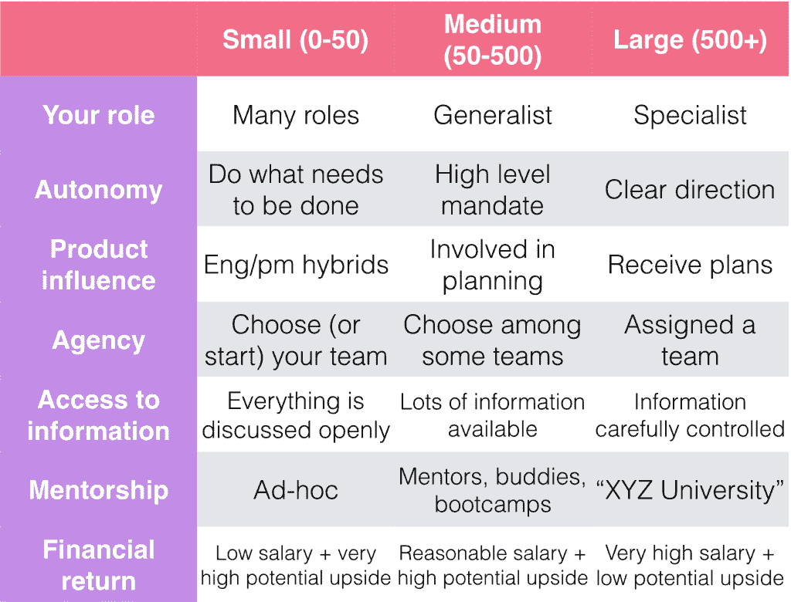

# 适合你的地方:选择你的第一份创业工作

> 原文：<https://blog.asana.com/2015/11/your-first-startup/?utm_source=wanqu.co&utm_campaign=Wanqu+Daily&utm_medium=website>

几周前，我在纽约市的 Start @ a Startup 大会上做了一个关于如何寻找你的第一家创业公司的主题演讲。我认为人们在加入他们的第一家创业公司时应该优化几件事:文化、平衡和团队规模。由于现在是许多人决定加入创业公司的时候(尤其是在大学招聘季节的高峰期)，我想我应该分享一下这个会议的关键要点，以及感兴趣的人的完整视频。

### 体验公司和个人的快速成长。

我的第一条建议是，为一家在员工人数、收入或产品采用(希望三者都有)方面快速增长的公司工作，这家公司也会对你个人进行投资。在一家成长中的公司，你会很快获得责任，观察创业的多个阶段，而不需要换公司。然而，仅靠这一点还不足以快速成长，如果你只是被赋予责任，而没有定期接受如何处理责任的指导，你可能会学到完全错误的课程。在 Asana，我们通过频繁的评估周期和入职培训项目以及为每个人提供教练来“投资于自己和他人”,这通常是为高管保留的。

然而，仅靠这一点还不足以快速成长，如果你只是被赋予责任，而没有定期接受如何处理责任的指导，你可能会学到完全错误的课程。在 Asana，我们通过频繁的评估周期和入职培训项目以及为每个人提供教练来“投资于自己和他人”,这通常是为高管保留的。

### 在一个运营良好、有积极工作文化的地方工作。

具体来说，这些因素定义了一个良好的工作环境:

*   一个非政治化的环境:没有官僚主义和政治，你将有发言权，你的成功将建立在功绩的基础上。
*   目标明确、使命驱动的公司:当整个团队朝着一个共同的方向前进时，人们会对自己的行动和优先事项深思熟虑。
*   **清晰的计划和责任**:有了清晰定义的流程，你会感到踏实，知道什么时候你有权做决定，什么时候你需要从别人那里得到指示。
*   **Strong [导师](https://blog.asana.com/2015/09/engineering-mentorship-at-asana/)** :导师不仅会加速你的成长，还意味着你的同伴也会快速成长——你会获得知识，也会对你的团队充满信心。
*   强调反馈和反思的文化:虽然这两者对学习和成长都很重要，但它们也有助于公司承担风险并从错误中学习。当你知道错误会被识别和纠正，你就可以确信公司会一直在学习和改进——因此，你也会一样。
*   **对透明度的承诺(在适当的情况下)**:虽然透明度并不适合每一家公司，但当透明度存在时，人们就有了做出决策所需的信息，信任也就产生了。

为什么所有这些都很重要？你加入的第一家公司将成为你未来经历的基准；在你的第二份工作中，你会非常依赖你第一份工作的经验/过程，如果它们是积极的，那就更好了。记住，除了犯错误，还有更好的学习方法。在上述公司，你可能会和优秀的人一起工作，不仅会建立自己的人际网络，还会向这些人学习，而且很可能会享受和他们一起工作的乐趣。

经营不善的公司很难快速扩张，但“高速增长”的公司可以通过纯粹的动力克服许多文化缺陷——这可能导致糟糕的学习体验，也可能让你对日常工作不满意。

### 想想你的选择会如何影响你的一生。

选择你的第一家创业公司不仅仅会影响你的日常工作、职业和技能。它会影响你的工作/生活平衡、工作之外的生活和健康，所有这些都是可持续、成功和幸福生活的核心。

不幸的是，许多公司都有每周工作 60、70 或 80 小时的文化，这在经验上被证明是徒劳的——研究表明，每周工作 40-50 小时后，回报会减少，甚至是负的。我给你的建议是:不要接受这种谬论，每周选择合理的工作时间来提高工作效率。[努力工作，好好生活](https://medium.com/life-learning/work-hard-live-well-ead679cb506d)。

除了你每周工作(或不工作)的时间之外，拥有工作之外的生活也很重要——拥有不同的经历，在同事之外进行社交，成为其他社区的一部分，环游世界，拥有一项爱好，等等。所有这些经历都会拓宽你的视野，帮助你个人成长(最有可能的是，还有职业发展)。最后，健康饮食，锻炼身体。如果你很早就养成了好习惯，你会在一生中收获回报，你会有更多的精力投入到工作和娱乐中。

### 在适合你的地方工作。

公司在不同阶段有不同的利弊。以下是一些需要考虑的主要差异:

和往常一样，什么适合你取决于你的总体风险承受能力和你在生活中的位置。

这张幻灯片解释了许多细微差别，所以如果你对内容感兴趣，我强烈建议你看看视频的这一部分。此外，你的里程数可能会有所不同——一些小公司在各方面表现得像大公司，反之亦然。

### 在增值的地方工作。

众所周知，科技行业是一个创新的、令人兴奋的工作场所。我们有巨大的影响力，可以用我们创造的东西接触到几十亿人。幸运的是，许多公司正在利用这一优势做伟大的事情，为世界增加价值(尽管这是一个主观的概念)。当你选择你的第一家创业公司时，问问你自己，你是否相信一家公司正在做的事情对世界有益，在这个问题上，不要满足于任何不明确的**【是】。**

 **### 了解公司

所有这些因素都会在选择公司时发挥作用，但你也需要一种方法来找出所有这些信息。以下是如何做到这一点的一些建议:

*   和那里的员工聊聊。带着准备好的问题来参加面试，并且总是答应和更多的人交谈。一定要见见你未来的团队和经理。
*   看看他们网站上关于和[职业](https://asana.com/jobs)的[页面。公司花了很大力气让这些准确地反映他们的文化，所以这是了解那里生活的一个很好的窗口。](https://asana.com/company)
*   观看讲座/阅读团队/领导的帖子。问问你自己:这些人是你想与之共事的人吗？
*   最后，要了解公司，不要依赖媒体。绝大多数关于科技公司的文章都不是基于彻底的研究。
*   最大化你的学习

不管你决定加入哪家公司，这都是你应该努力争取的。

与你工作的公司的领导交谈，了解你不工作的团队。

继续和其他公司的同事谈论他们的工作，并拜访他们——他们正在了解一种完全不同的文化，你们很可能可以互相学习。

最后，利用在线资源(Quora、YouTube 等)。这里有两个在线课程。

选择你的第一家创业公司并不容易，但是很好地理解你在寻找什么，以及有什么，是最好的开始方式。如果你有兴趣了解更多关于在 Asana 开始(或发展)你的职业生涯的信息，[我们希望听到你的回答](https://asana.com/jobs)。**