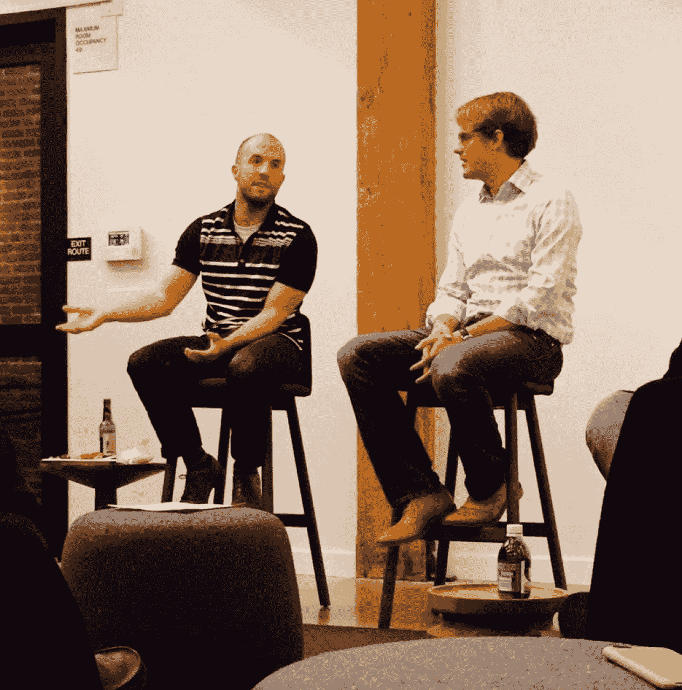

# Optimizely 早期给 SaaS 创业公司的 4 个教训

> 原文：<http://tomtunguz.com/saas-office-hours-pete-koomen-notes/?utm_source=wanqu.co&utm_campaign=Wanqu+Daily&utm_medium=website>

[T2】](https://res.cloudinary.com/dzawgnnlr/image/upload/q_auto/f_auto/w_auto/koomen_office_hours.jpg)

昨晚， [SaaS 办公时间](http://saasofficehours.com/)接待了 Optimizely 联合创始人兼首席技术官[皮特·库门](https://www.linkedin.com/in/petekoomen)。Pete 是 AdSense 的谷歌助理产品经理，推出了谷歌应用引擎。然后，他和他的联合创始人丹·西罗克(Dan Siroker)一起创建了三家公司，其中最后一家是 Optimizely。

正如 Pete 与我们分享的那样，Optimizely 的想法来自丹在第一次竞选期间管理团队建立奥巴马筹款网站时看到的需求。丹和他的团队编写了代码来微调注册流程，实验有效地提高了筹款绩效。在 YCombinator 期间，在 Pete 和 Dan 接受了一个不同的电子商务想法后，这两位创始人抛弃了第一个想法，转而追求网站优化的概念。众所周知，[他们测试了这个想法](http://tomtunguz.com/competition-from-incumbents/),给两家广告公司打电话，要求他们每月支付 1000 美元，提前获得一种还不存在(但很快就会存在)的产品。现在有 400 多人，Optimizely 是 A/B 测试的领导者。

昨晚在旧金山红点办公室的谈话集中在皮特在公司早期积累的见解上。这些是我从皮特那里学到的一些东西。

首先，随着公司的发展，雇佣一名管理教练与你一起工作。随着优化的发展，对丹和皮特的需求大幅增加。皮特告诉我们，成为领导者是一个永无止境的改进之旅。他发现学习领导技能的最好方法是聘请一名管理教练，每月与他会面一次，讨论他在 Optimizely 面临的问题。此外，管理教练对 Pete 进行了 360 度评估，以帮助他了解他的团队希望他如何发展，从而最大限度地发挥他对公司的影响。

第二，你必须在你认为你要解雇自己之前解雇自己。一旦你擅长一项工作——销售、产品、市场营销——你就有足够的知识去雇佣一个人来代替你。你应该马上去做。这是扩大业务规模的唯一途径。当那个人开始工作时，你必须退后一步，让新员工学习工作，犯下他们需要犯的错误，以便更好地胜任工作。皮特告诉我们，作为一家企业的创始人，放手是一项极其艰难的练习。

第三，为了销售而雇佣员工，尤其是在公司成立之初，销售流程和销售活动还没有确定的时候。Optimizely 的第一位成功销售人员之前在西雅图开了一家床垫回收公司。Optimizely 的第二名销售人员已经从专业芭蕾舞蹈中退休。虽然这两个主要贡献者拥有非典型的销售背景，但他们有着共同的热情，这种决心促使他们成功地为公司找到了正确的上市策略。

最后，当你的创业公司找到合适的产品市场后，招聘就成了生意的重中之重。皮特说——我喜欢这句话——“你必须制造机器，而机器将会制造机器。”2012 年初，Dan 和 Pete 召集公司说，2012 年将是招聘年，每个人的首要任务是建立一个伟大的团队。Pete 要求每个员工分享他们在 Optimizely 工作的好恶，并以此来列举公司的价值观，这成为衡量候选人并确定哪些人将成为 Optimizely 员工的标准。

Pete 是一位鼓舞人心的领导者，他对建立一家定义类别的公司的成功和奋斗非常真诚。Pete，谢谢你分享这些见解和故事！