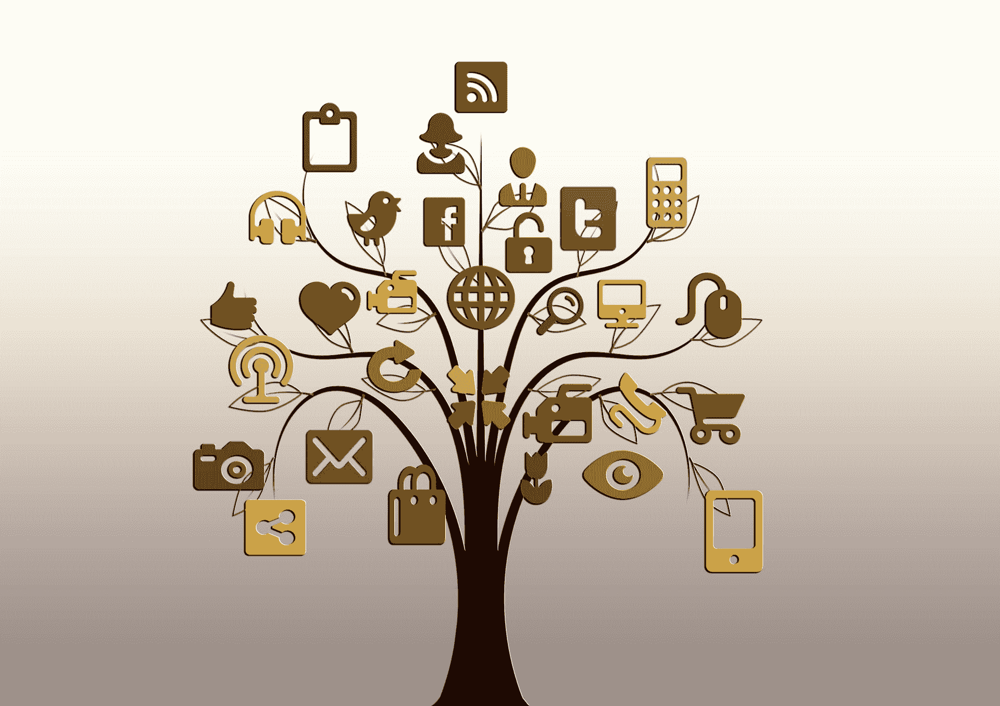
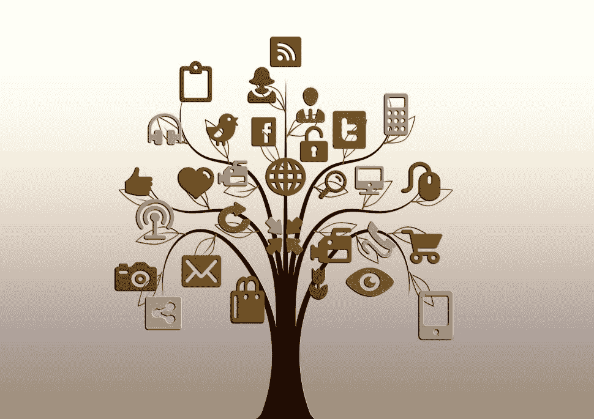

# 网络的新商业模式？订阅战来了|观察者

> 原文：<http://observer.com/2015/11/a-new-business-model-for-the-web-the-subscription-wars-are-here/?utm_source=wanqu.co&utm_campaign=Wanqu+Daily&utm_medium=website>

(Photo: Pixabay)

网络的第二次浪潮已经到来。

很快你会问朋友他们是不是谷歌计划或者亚马逊计划的一部分。事实上，在不久的将来，我们都可能成为谷歌、亚马逊或者网飞和脸书计划的一部分。事实上，我们对计划的选择很可能会成为下一代如何定义自己的一部分。

什么是第二波？第二波是这样一种想法，即世界上的互联网巨头们正在为我们每个月花在有线电视公司的 150 美元左右而游戏。为了证明和提高他们特定内容包的月价格，这些巨头将收购、积累和合并任何东西到产品中。

这是一场全面的战争，关键在于你每个月为你所有的娱乐活动付钱给谁。

那么，这对我们消费者来说意味着什么？我们是如何到达这里的？我们又将去向何方？

让我们从理解第一波网络浪潮对我们消费者意味着什么开始。从内容的角度来看，第一波网络浪潮是关于内容创作者被社会化内容聚合者取代。脸书、Twitter、Instagram 和其他网站创建并拥有内容到达我们消费者手中所必须经过的分发路径。这些公司可以大规模创造更好的广告支持的货币化，并提供比任何单一内容创作者自己能够提供的更好的用户体验。在过去的十年里，我们看到一个又一个媒体公司 [屈服于](http://www.nytimes.com/2015/05/13/technology/facebook-media-venture-to-include-nbc-buzzfeed-and-new-york-times.html?_r=0) 分销给像谷歌这样的聚合器，最近又给了脸书和其他公司。

虽然消费者很容易就能收到无限量的免费内容，这很令人兴奋，但我们都一直在为谁为内容买单这个棘手的问题争论不休。在过去的十年里，我们都在回避这样一个事实:对于个人内容创作者和媒体公司来说，让一个广告支持的网络在经济上可持续是不可能的。

有了无限量的在线内容，内容创作者将永远无法创造和维持足够的关注度，以获得昨日的广告费率。如今，没有一家专业内容公司能够仅靠广告收入生存和发展。再看看最近的 [格兰特之死](http://www.nytimes.com/2015/10/31/sports/grantland-shut-down-by-espn.html) 的例子。虽然格兰特朗归 ESPN 所有，但格兰特朗是独立运营的，只通过出售内容旁边的广告来创收。我们已经看到如此多的内容公司跳上广告支持的仓鼠轮，试图以某种方式使其工作。Vice 和 Buzzfeed 等公司甚至在一段时间内让仓鼠滚轮变得性感和时尚，但最终，它都是相同的。没有人能永远做下去。

我们的文化也受到了影响。一个广告支持的世界里的内容大多是 [惨](http://www.buzzfeed.com/caseygueren/hey-boy-are-you-my-period#.hmWqxdQDA) 。我们生活在一个 [丑陋的世界](http://omeleto.com/218086/) 。内容的广告模式创造了所有错误的动机。我们受到源源不断的可怕内容的影响，这些内容恳求我们点击，然后再点击。瑞安·霍利迪(Ryan Holiday)在他 2012 年的著作《相信我，我在撒谎》(Trust me I living)(T13)中，就内容公司出现的错位激励写了开创性的工作。

但是现在，在 2015 年，一些新的事情正在发生。我们终于清醒地认识到，除了广告，肯定还有更好的方式来赚钱。

没错。第二波。

下一波网络浪潮，第二波浪潮，实质上是的贴吧广告网络。看看 2015 年的媒体商业头条，都是关于订阅商业模式的。当然，它们以不同的形式被称为不同的名字。在视频领域，我们称订阅服务为“over the top”，或简称为“OTT”。在印刷品中，我们称之为“熟悉”——会员或订阅。

值得注意的是，所有的订阅服务都提供免费内容来帮助你入门。当你和你最亲密的朋友分享你的登录信息时，网飞和 HBO 没有追捕你是有原因的。在商业上讲，我们把这叫做“”。内容营销的理念是，公司在给你一些精彩的免费节目和文章后，最终会通过一些 *或其他* 手段赚钱。这是网络上的一个巨大趋势。对于小创作者、作者和个人商店来说，他们每天提供数量惊人的免费内容，但现在正通过一场 [众筹](http://www.kickstarter.com) 和[tip-jar](https://www.patreon.com/)革命来赚钱。

对于较大的内容创建者和聚合者来说，在每天向你展示如此多的免费内容之后，他们需要一个可靠、稳定的商业模式。一些大型聚合网站已经开始发布免费内容，而另一些网站从一开始就提供优质原创内容。

例如:

*   网飞和 HBO 的优质原创视频内容。
*   亚马逊在优质视频内容、视频游戏内容、图书出版(甚至托管网络服务)
*   音乐中的 Spotify
*   YouTube 上的 UGC 视频
*   脸书出版公司内容

所有这些互联网巨头都聪明地进入了市场，并建立了订阅捆绑包。华尔街和其他公司现在已经奖励了这些玩家，因为他们创造了下一代内容业务。过去几年，网飞通过聚集和创造捆绑销售的优质内容，实现了泡沫化的股价。几乎每个人都订阅了 HBO。

因此，在后广告网络中，需要回答的一个大问题是，每个月到底是谁得到了你辛苦赚来的钱？即:你向谁订阅内容？我们知道过去都是那些该死的有线电视公司。现在是网飞、Spotify、亚马逊和 HBO。

消费者不会每月支付 9.99 美元或更多来购买越来越多的独立点菜订阅。为能够区分服务的真正独家内容而战只会让优质内容更有价值。这就是为什么在过去的几年里，NBA 的薪水和特许权基本上翻了一番。似乎没有什么比直播优质体育内容更有价值了。

为了赢得市场份额，互联网巨头们将被迫不断收购、积累和整合所有内容。

这就是战争。这是新的战斗。

亚马逊凭借 Amazon Prime 悄然建立了真正令人敬畏的领导地位。网飞还想出了如何让 6300 万人每月在最后一次统计时掏钱。此外，还有一些互联网巨头仍在观望。通过一系列的失误，谷歌现在明显落后于其他公司。今年，YouTube 通过发布令人困惑的 [订阅 YouTube 产品](http://techcrunch.com/2015/10/21/youtube-red/#.jvclo0:1YrH) 来回应这场战争，而没有提供任何额外的新的优质内容。哎呦。

预计未来几个月，各大互联网巨头都将加入这场战争。赌注太高了。为了进一步区分服务，还需要将备选的客户优势打包到捆绑包中。有点像信用卡和航空公司的奖励计划。从隐形眼镜到汽车轮胎，当我们订阅大礼包时，我们可能会得到折扣和免费服务。世界上的谷歌和亚马逊不会停止，直到他们得到有线电视公司一直收到的每月 150 美元左右。不用多久，我们就会认同自己是谷歌人或亚马逊人。

但是从近期来看，2016 年第二波浪潮会是什么样子？

以下是未来 12 个月的一些趋势和发展:

*   谷歌将不得不通过收购来尽快赶上。吞并网飞，Spotify，或者做一笔大的 NFL 授权交易都在进行中。但是传统的电视播放器是体育联盟的现任者，所以 [不要指望他们会很快放松对这些许可协议的控制](http://www.foxbusiness.com/industries/2015/07/21/tv-deals-boost-nfl-revenue-to-new-record/) 。同样，职业体育联盟也从这场战争中受益，并将继续变得更加富有。虽然谷歌的现金肯定是用来做交易的，但一些内部人士开始质疑谷歌是否有足够的资金来吸引热门的年轻公司。

*   亚马逊将继续向各个方向扩张 Prime。观看 Prime 从内容和美食展开，到 [实验书店](http://www.npr.org/sections/thetwo-way/2015/11/03/454250311/amazon-opens-a-real-bookstore-in-seattle) 以及超越。亚马逊得到它，继续引领第二波浪潮。

*   网飞会找到新的 [理由](http://recode.net/2015/10/08/netflix-raises-prices-again-but-you-may-not-pay-more-for-a-while/) 来迅速扩大自己的捆绑价格。预计 Spotify 将很快登陆网飞或谷歌。

*   移动和有线运营商将 [不声不响](http://www.theverge.com/2015/9/29/9415137/comcast-watchable-now-available) 。作为烟斗经销商，他们将试图保护他们的金鹅，讽刺的是，他们的行为更像亚马逊和苹果。

最重要的是，网络上的内容将会成长，并被迫变得比以前更好。现在看看我们的电视选择。感谢第二次浪潮，我们看到了一场)电视革命的开始。期待这场革命扩展到其他形式的内容。我们也会向我们的新闻提供者询问更多信息。订阅商业模式的主要好处之一是它允许企业更好地计划和预测。在社交媒体世界，更好的规划意味着更好的内容。

它实际上可以归结为一个简单的想法。有人必须为内容付费。在网络的早期，内容的成本被强加在平台或创作者身上。那肯定没有持续很久。然后我们尝试了广告商。更糟糕的结果。而现在，在 web 的第二波浪潮中，是 *美国* 。消费者将为内容付费。即使你是谷歌计划的一部分，而你的姻亲是竞争对手亚马逊计划的一部分，也要期待网络生活会变得更好。 
[*本*](http://www.bensmith.tv) *是位于洛杉矶的温尼克公司的风险合伙人。本是谷歌和 YouTube 的早期高管，并创办和领导了多家风险投资支持的视频初创公司。他每月关于“为什么人们在他们所做的事情上很棒”的简介可以在这里找到**。T29】*

