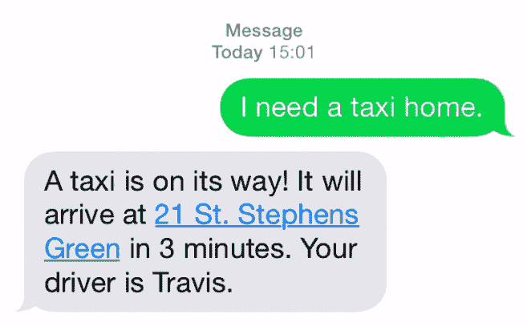
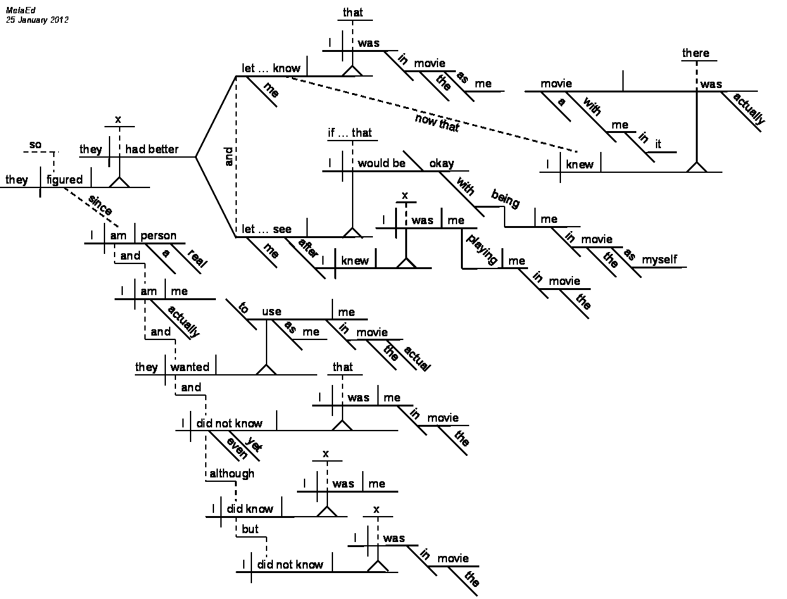
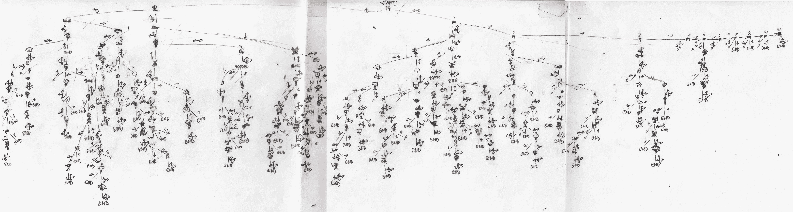
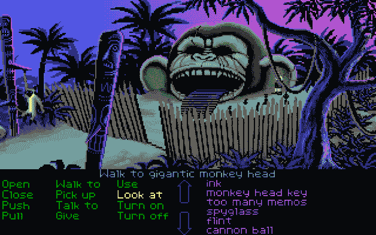

# 设计是一种内部对话

> 原文：<https://blog.intercom.io/design-is-a-conversation/?utm_source=wanqu.co&utm_campaign=Wanqu+Daily&utm_medium=website>

人们常说，设计是设计师和使用者之间的对话。我们与用户谈论他们想要什么和需要什么。我们与同事讨论项目，检查问题并找出解决方案。

对话是一种很好的清晰思维的方式，即使你只是在自言自语。

但是只有当用户参与进来时，对话才真正开始。我们制造东西，把它们放在外面，然后等着看世界如何反应。

从字面上看，对话与数字产品设计越来越相关。我们与计算机的交互从根本上来说一直根植于输入/输出、呼叫和响应。但是随着计算机变得越来越复杂，它们以更人性化的方式交流的能力也越来越强。

与计算机对话长期以来一直是科幻小说中的比喻，也是许多研究人员的目标。这一过程的实际情况与过去的预测略有不同。但是已经到了。对话已经成为一种用户界面。

## 对话作为设计材料

鉴于我们的大部分工作都是基于思想的交流，设计师们设想新一代以对话为中心的信息产品也就不足为奇了。对话式用户界面正在脱离消息应用，进入我们每天使用的产品。

这种转变的原因很简单:人性。

我们天生擅长与他人交谈。这是我们分享知识、组织自己和分享情感的方式。几十万年来，语言一直是我们构成的一部分。所以，我们当然会和家人、朋友和同事一起，一天到晚不停地发信息。消息传递已经成为日常生活进行的一个层面。

想想看:今天早上过了多久你才在手机上发送或接收信息？看看世界上最受欢迎的[应用](http://www.slideshare.net/kleinerperkins/internet-trends-v1/47)列表:前 10 名中，所有的应用都是社交性质的，其中 6 个主要用于通讯。

个人计算的历史最好被描述为机器和人之间抽象层的不断去除；从难以理解的穿孔卡片，到晦涩难懂的命令行，到鼠标指针，再到多点触摸。

在每一次变化中，界面变得更少用机器的母语表达，更容易被使用它的人所理解。下一步是让机器扩展并适应我们自然交流的方式。

## 对话式用户界面的兴起

对话式界面为设计师创造了一系列全新的机会和挑战。如果我们能制造出不仅能促进两个人之间对话，还能促进一个人和一项服务之间对话的产品，那会怎么样？[我在](https://www.intercom.com/blog/messaging-apps-just-getting-started/)之前写过关于这种新型应用的文章，但揭示其中一些应用的工作原理很有趣。

像“路径对话”和“T2 魔术”这样的礼宾服务承诺回答你的问题，并把任何东西送到你家门口，所有这些都是通过短信。他们的做法实际上有点令人泄气:他们有一群支持代理，他们阅读收到的消息，手动完成每个请求，然后打出回复。这是软件的[机械土耳其人](https://en.wikipedia.org/wiki/The_Turk)方法，在*绿野仙踪*中幕后的向导。这是资本密集型的，伸缩性差，而且可以说只是重新分配工作，为人工代理创造了低价值的工作。

其他人，如脸书·M·T1 和 T2 的操作员 T3，计划采用一种更少人工干预的方法，使用人工智能来回答问题。使用这些应用程序，你不再是和戴着耳机的人交流，而是和一个机器人交流。

最简单地说，机器人是一个运行在消息应用程序中的软件，可以执行基本任务。这就像 Siri，如果 Siri 是你联系人列表中的朋友，你就可以发短信。所以你可以给机器人发信息，它会给你回复。但它也能为你执行任务。假设你需要一辆出租车。只需给你的消息应用程序中的机器人发短信，剩下的事情就交给它了。

他们的部分吸引力在于你可以很容易地建立自己的。机器人易于编写——通常只是一个简单的脚本——并且可以集成到现有的通讯应用程序中。就像那样，你有机会创造新的东西，就在行动的地方；在人们每天都在使用的信息应用中。这意味着你可以用一些简单和集成的东西来取代今天许多脱节的应用程序体验。开发者已经为 Slack、Telegram、Twitter 和 Facebook Messenger 编写了数百个机器人。

突然间，我们一头扎进了新的领域。我们正在见证一个全新平台的出现，我们可以在这个平台上建立新的用户体验。这些变化很少发生，就像任何平台变化一样，几乎所有的东西都是可以争夺的。

## 平台转移改变了一切

回顾 2000 年代中期和 Web 2.0 时代，我们见证了互联网的巨大变化，从静态页面转向应用程序。

像谷歌地图或 Flickr 这样的网站开放了他们的 API，这意味着任何人都可以建立网站来获取这些数据。有了这种在数据基础上构建新东西的能力，网站从静态页面转变为服务。

如今，类似的转变正在发生。机器人对于现代通讯应用程序就像 API 对于 Web 2.0 一样；一种在其他服务之上构建、试验和创建与现有服务交互的新方式的方法。这是一种与计算机互动的全新方式的开始。

这给我们留下了一系列未解决的问题。设计在这里必须扮演什么角色？设计一个这样的机器人体验意味着什么？对话用户体验是下一个前沿吗？对话设计者可能会产生什么？

## 设计对话

我喜欢将设计视为与过去的持续对话。设计是在不同的主题之间建立联系。我见过的最好的设计师拥有一种天生的能力，能够过滤和综合他们在过去学到的东西，以获得对未来的一些洞察力。

考虑到这一点，我们可以从过去汲取什么样的灵感来帮助我们考虑设计对话式用户界面呢？

嗯，语言学家肯定对对话想了很多。这是一个句子图表。语言学家用来绘制句子并将其分解成结构成分的东西，如动词、主语、宾语等等。把它想象成单词的音乐符号。

每个句子都有自己的整体架构，自己的意义和结构。现在缩小来考虑一个由多个句子组成的对话。绘制地图是一个完全不同的命题。它可以分支并流向各个方向。我们如何做到这一点？

我童年的很大一部分是选择你自己的冒险书籍；互动小说，读者通过故事选择自己的道路。一些读者制作了复杂的地图，展示了游戏中所有的分支可能性。

这如何表示为一个用户界面？早期的文本冒险游戏如*巨大洞穴冒险*或 20 世纪 90 年代的点击冒险游戏如*猴岛的秘密*使用对话作为核心交互范例。基本命令驱动了这些游戏的交互性，分支对话树提供了对话引擎。

所有这些例子的有趣之处在于，它们本质上都是聊天机器人。它们是与计算机或系统的模拟对话，旨在感觉像正常的对话。但这样做实际上促进了全新类型的互动。

## 对话才刚刚开始

那么，从我年轻时那些可疑的日子里，阅读书呆子书籍和玩电子游戏中，我们可以学到什么样的设计课程呢？尽管它们很有趣，但它们没有提供可应用于 bot 消息传递的收缩包装的解决方案。

它们确实提供了一个起点。对话界面不是从一个空白页开始的。作为设计师，我们可以把这些例子作为研究的起点。在未来的帖子中，我将详细介绍我们如何为我们的 [Messenger](https://www.intercom.com/messenger) 产品添加一些令人兴奋的新功能。