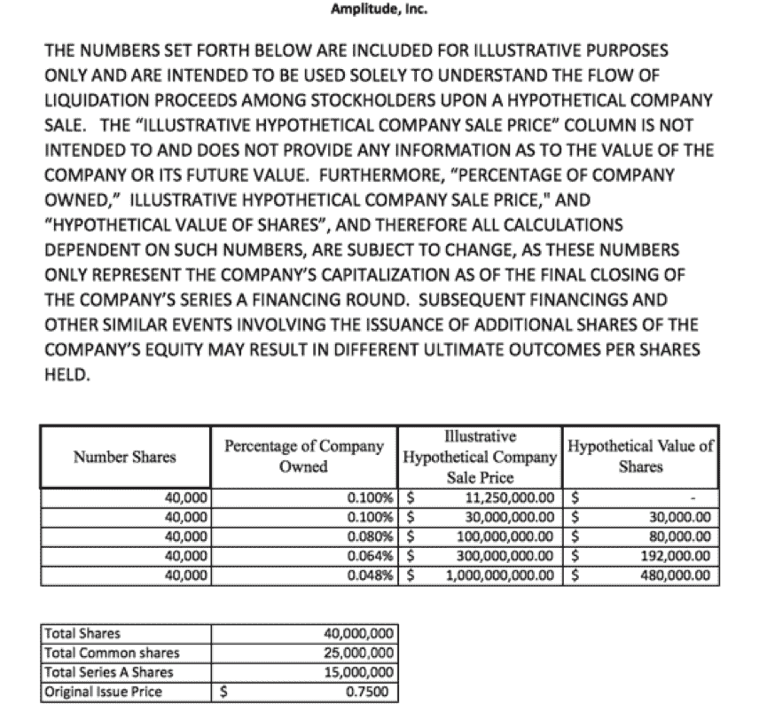

# 了解员工权益是如何被打破的，这是我们的修正|幅度

> 原文：<https://amplitude.com/blog/2015/12/01/employee-equity-is-broken-heres-our-fix?utm_source=wanqu.co&utm_campaign=Wanqu+Daily&utm_medium=website>

创业公司员工股权补偿断了。拥有一家公司被认为是加入早期创业公司的最大优势之一，但它充满了陷阱。雇主没有分享他们应该分享的信息，员工不知道该问什么问题来确保他们得到公平对待。我只见过那些被之前的创业公司搞砸了的潜在雇员会问关于股权薪酬的问题。被耍了才知道去哪里找！

创始人处于一个幸运的位置，在任何影响他们股权的决策中，他们都有一席之地，可以倡导对他们来说重要的事情。我从未见过员工获得这种待遇，尽管他们是公司成功的最大贡献者(比创始人或投资者多得多)。

我们强烈要求在最大程度上改变现状。今天，我们宣布对初创公司授予股权的标准方式进行两项重大改进:

1.  我们已经将所有员工的离职后期权行使窗口从标准的 90 天延长至 10 年，无论他们在公司工作了多长时间。
2.  我们向每位员工提供详细信息，说明我们授予他们的股权意味着什么。

## 将锻炼窗口改为 10 年

90 天的行使窗口是股权薪酬的最大“陷阱”之一，尤其是对刚开始创业的员工而言。

快速入门:由于税收原因，员工不会得到公司的股份。相反，股权薪酬以股票期权的形式出现，即购买股票的权利。为了让员工拥有股票，他们必须行使他们的期权并花钱购买股票。几乎所有的初创公司都有一个 90 天的期限，一旦员工离职或被终止行使他们的既得期权，否则他们就会失去期权。要行使期权，员工需要支付行使价以及新股的纳税义务。

在目前的制度下，员工只有在离职后 90 天内拿出足够的现金，才能拥有所有权。员工经常会意外遇到这种情况，需要在换工作的过程中拿出一大笔钱。更糟糕的是，这些股票很有可能在未来变得一文不值。我知道一个例子，一个员工在离职后花光了所有的积蓄来行使他们的期权，公司最终破产了，留下的是没有现金和一堆没有价值的文件。

我们将员工期权的期权执行窗口从 90 天改为 10 年。 2 (我们实际上已经取消了对终止后行权的任何限制，只是保留了期权默认的 10 年行权时间表，该时间表从授予开始日起适用。)这是给 Amplitude 的每个人的——不管他们在公司呆了多久。我强烈地感觉到，一旦你获得了期权，它们就是你的，没有雇佣条件。90 天的窗口是国税局税务处理的一个假象，对员工不公平。这也让公司在流动性方面走得足够远，这样员工除了不会强迫他们在短时间内拿出大量现金之外，还会更清楚是否值得行使。这不仅对员工来说是正确的事情，更多的创业公司应该认真考虑这种吸引更多人才的方式。

来到这里有一些法律障碍。我们采访的第一个法律团队告诉我们，他们从未见过这样的事情，并建议不要这样做。 3 。幸运的是，我们能够与 Goodwin Procter 杰出的 Craig Schmitz 一起工作并完成它。我们还开源了我们的文档，这样其他创业公司也可以使用它们。(这样做之前请咨询你的律师！)

## 解释公平的含义

太多的创业公司认为，即使是非常基本的事情，如发行在外的股票数量或公司估值，都是商业秘密。他们不会向潜在雇员透露这些信息，尽管这些基本指标对于理解股权的价值至关重要。在不知道分母的情况下，只知道授予的股份数量是没有用的。

一个特别令人震惊的例子是，一家初创公司的员工没有被告知公司有多少股份——只被告知他们拥有员工总数的百分之多少。该公司告诉他们，典型的员工期权池范围在 5%至 20%之间，从该范围的高端开始，在未来的融资轮次后下降。后来发现，考虑到任何稀释，包括已经通过可转换债券筹集的种子资金，该池在之前略高于 5% *。*

我们正在改变这种情况，与潜在雇员分享他们在不同情况下的股权价值的详细信息，并通过包括一个概述所有细节的电子表格来使其具体化。我们的律师和董事会都担心与潜在雇员分享这些数据，因为这可能会设定错误的预期，但我非常强烈地希望尽可能多地分享这些数据，即使存在很多不确定性。在与任何雇员分享它之前，我明确表示，公司的估值和特定数量的股份所占的百分比都是最佳猜测，并且有很大的差异。最有可能的结果是股权价值为零。(正如《黑客新闻》上的那些人喜欢提醒我们的那样，这些选项没有内在价值。)

这是我们与员工分享的电子表格。(这些数字是示例数字，不是实际数字):

我让潜在雇员浏览这个电子表格，让他们了解不同的假设情景，包括潜在的稀释。它还指出，如果我们以低于或等于清算价格的价格出售，那么股权就一文不值。尽管这是一张有巨大差异的粗略图片，但我更愿意分享它，而不是什么都没有。

## 提高员工权益的门槛

萨姆·奥特曼 5 之前已经写过关于提高员工权益的方法，[比特币基地](https://blog.coinbase.com/improving-equity-compensation-at-coinbase-8749979409c3)、 [Quora](https://www.quora.com/Why-do-most-startups-force-employees-to-exercise-their-vested-ISO-options-within-90-days-if-they-leave-rather-than-the-option-to-convert-to-NSOs) 、 [Pinterest](http://fortune.com/2015/03/23/pinterest-employee-taxes/) 和 [Clef](https://github.com/clef/handbook/blob/master/Hiring%20Documents/Guide%20to%20Your%20Equity.md) 、 6 已经开始着手解决这个问题。据我所知，这是我见过的最进步的股权薪酬。如果有更大胆的股权补偿计划，请让我知道-我们很乐意有机会匹配和改善他们！我希望我们在这里尝试的很多东西能够成为初创公司员工薪酬的新标准——这是一个需要解决的大问题。

* * *

#### 注意事项:

4.  向员工授予股票需要员工为授予支付税款，而期权授予的方式则不需要。Quora 网站上的亚当·安吉洛和 T3**[选项还涉及到税收问题。](https://www.quora.com/Why-do-most-startups-force-employees-to-exercise-their-vested-ISO-options-within-90-days-if-they-leave-rather-than-the-option-to-convert-to-NSOs)**
5.  我们实际上已经取消了对终止后行权的任何限制，只保留了期权默认的 10 年行权时间表，该时间表从授予开始日起适用。
6.  Here’s the text of the email they sent me:

    “近十年来，我与数千家初创公司合作过，直到几个月前，我才听说过这个想法。我的蜘蛛嗅觉告诉我，这里可能有一些严重的陷阱。例如，ISOs 上有 90 天的终止后执行窗口的一个原因是，IRS 要求期权有资格成为 ISO (26 U.S. Code 422)。也许有办法绕过这一要求，例如授予 NSO 或将 iso 转换为 NSO。然而，黑客本身也充满了陷阱。尽管这个想法很有创意，但我的猜测是，根据具体情况(比如与提出要求的员工)协商这样的特殊条款可能是有意义的，但让它成为所有员工的“标准”可能会变得更加复杂。我很确定[公司名称]没有把这个发给他们所有的员工-参见[链接编辑]。听起来[公司名称 2]也只是在有限的基础上这样做。我会联系[公司名称]的员工，看看我能从他们那里学到什么。我与我们合作的(律师事务所)股权薪酬专家进行了简短交谈，他的反应和我一样。

7.  **[员工持股汇总表](//assets.ctfassets.net/vrkkgjbn4fsk/3LFCMjDApyGKOEaAyUSCye/b59a74d948266ce0acf25348c31772cf/Employee_Stock_Summary_Chart.xlsx)** & **[幅度 ISO 协议格式(2014 年计划)](//assets.ctfassets.net/vrkkgjbn4fsk/3hocqi0YOIMUwM4oGWEwCQ/e55f9ff0bf34fe6ce295e02cbb3b4551/Amplitude_-_Form_of_ISO_Agreement__2014_Plan___AMENDED_.DOCX)**
8.  山姆还谈到给予早期员工更多的股权和不利的税收待遇。我非常想解决这两个问题，但不想成为这篇文章的主题。我们同意他关于授予更多股权的建议。我同意税收问题需要解决，但对于我们的第一次股权补偿来说，这个问题太复杂了。
9.  我也读过关于和 **[Palantir](https://www.quora.com/Palantir-allows-employees-3-years-to-exercise-options-after-leaving-Why-doesnt-every-company-do-this-Why-do-companies-impose-a-90-day-limit-on-exercising-shares-Encouraging-retention-seems-wrong-especially-if-they-cant-yet-afford-their-options)** 有更长锻炼时间的报道，但是他们没有分享太多细节。