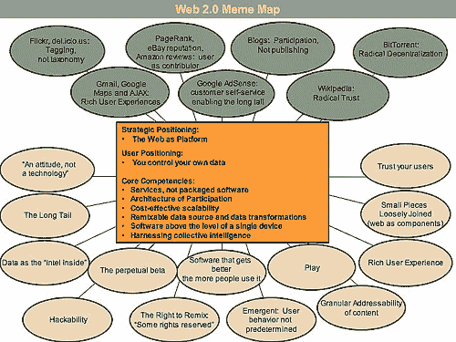

# 什么是 Web 2.0 -奥莱利媒体

> 原文：<https://www.oreilly.com/pub/a/web2/archive/what-is-web-20.html?utm_source=wanqu.co&utm_campaign=Wanqu+Daily&utm_medium=website>

# 什么是 Web 2.0

## 下一代软件的设计模式和业务模型

经过

[Tim O'Reilly](http://www.oreilly.com/pub/au/27)

09/30/2005

2009 年 10 月:蒂姆·奥莱利和约翰·巴特利回答了“Web 2.0 的下一步是什么？”在 [Web Squared: Web 2.0 在](http://www.web2summit.com/web2009/public/schedule/detail/10194)的五年。

2001 年秋天网络泡沫的破裂标志着网络的一个转折点。许多人认为网络被夸大了，而事实上泡沫和随之而来的震荡似乎是所有技术革命的共同特征。洗牌通常标志着一种新兴技术准备占据舞台中心的位置。伪装者被抛弃了，真正的成功故事展示了他们的力量，人们开始理解是什么将他们区分开来。

“Web 2.0”的概念始于 O'Reilly 和 MediaLive International 之间的一次头脑风暴会议。网络先锋、O'Reilly 副总裁戴尔·多尔蒂(Dale Dougherty)指出，网络远没有“崩溃”，而是比以往任何时候都更加重要，令人兴奋的新应用和网站以惊人的频率涌现。此外，从崩溃中幸存下来的公司似乎有一些共同点。网络公司的崩溃是否标志着网络的某种转折点，因此像“Web 2.0”这样的行动号召可能是有意义的？我们一致认为确实如此，于是 [Web 2.0 会议](//www.web2con.com)诞生了。

在此后的一年半时间里，“Web 2.0”一词显然已经站稳了脚跟，在谷歌上被引用了 950 多万次。但是对于 Web 2.0 到底意味着什么仍然有很大的分歧，一些人谴责它是一个毫无意义的营销术语，而另一些人则认为它是新的传统智慧。

这篇文章试图阐明我们所说的 Web 2.0 是什么意思。

在我们最初的头脑风暴中，我们通过例子阐述了我们对 Web 2.0 的理解:

| Web 1.0 |   | Web 2.0 |
| 双击 | - > | Google AdSense |
| Ofoto | - > | 闪烁（光） |
| 阿卡迈 | - > | 比特流 |
| mp3.com | - > | 纳普斯特(公司名) |
| 英国在线公司 | - > | 维基百科(一个基于 wiki 技术的多语言的百科全书协作计划ˌ也是一部用不同语言写成的网络百科全书ˌ 其目标及宗旨是为全人类提供自由的百科全书)ˌ开放性的百科全书 |
| 个人网站 | - > | 博客 |
| 精英 | - > | upcoming.org 和 EVDB |
| 域名投机 | - > | 搜索引擎优化 |
| 页面视图 | - > | 每次点击成本 |
| 屏幕抓取 | - > | 网络服务 |
| 出版 | - > | 参与 |
| 内容管理系统 | - > | 维基百科 |
| 目录(分类法) | - > | 标签(“大众分类法”) |
| 粘性 | - > | 企业联合组织 |

这个名单还在继续。但是，是什么让我们将一种应用程序或方法定义为“Web 1.0”，而将另一种定义为“Web 2.0”呢？(这个问题尤其紧迫，因为 Web 2.0 迷因已经变得如此广泛，以至于公司现在把它作为一个营销流行语粘贴上去，而没有真正理解它的意思。这个问题特别困难，因为许多沉迷于流行词的初创公司肯定不是 Web 2.0，而我们认为是 Web 2.0 的一些应用程序，如 Napster 和 BitTorrent，甚至不是真正的 Web 应用程序！)我们开始试图梳理出一些原则，这些原则以这样或那样的方式被 web 1.0 的成功故事和最有趣的新应用所证明。

### 1.作为平台的网络

像许多重要的概念一样，Web 2.0 没有硬边界，而是有一个引力核心。你可以把 Web 2.0 想象成一组原则和实践，它们把一个名副其实的太阳系联系在一起，这个太阳系展示了一些或所有这些原则，离核心有不同的距离。

图 1 显示了一个 Web 2.0 的“模因图”，它是在 FOO Camp 会议期间的一次头脑风暴会议上开发的。这在很大程度上是一项正在进行的工作，但它展示了从 Web 2.0 核心辐射出来的许多想法。

例如，在 2004 年 10 月的第一次 Web 2.0 会议上，约翰·巴特利和我在开场白中列出了一套初步的原则。第一个原则是“网络作为平台”然而，这也是 Web 1.0 宠儿网景公司的战斗口号，该公司在与微软的一场激烈战斗后陷入困境。此外，我们最初的两个 Web 1.0 范例 DoubleClick 和 Akamai 都是将 Web 视为平台的先驱。人们通常不认为它是“web 服务”，但事实上，广告服务是第一个广泛部署的 web 服务，也是第一个广泛部署的“mashup”(使用最近流行的另一个术语)。每个横幅广告都是两个网站之间的无缝合作，向另一台计算机上的读者提供一个集成页面。Akamai 还将网络视为平台，并在堆栈的更深层次上，建立一个透明的缓存和内容交付网络，以缓解带宽拥塞。

尽管如此，这些先驱提供了有用的对比，因为后来的进入者对同样的问题采取了更进一步的解决方案，对新平台的本质有了更深刻的理解。DoubleClick 和 Akamai 都是 Web 2.0 的先驱，但我们也可以看到如何通过采用额外的 [Web 2.0 设计模式](?page=3#designpatterns)来实现更多的可能性。

让我们深入研究一下这三种情况，梳理出一些基本的差异元素。

#### 网景与谷歌

如果说网景是 Web 1.0 的旗手，那么谷歌无疑是 Web 2.0 的旗手，因为他们各自的首次公开募股定义了每个时代的事件。所以我们先来对比一下这两家公司，以及他们的定位。

网景公司用旧的软件范式来框定“作为平台的网络”:他们的旗舰产品是网络浏览器，一种桌面应用程序，他们的战略是利用他们在浏览器市场的主导地位来建立一个高价服务器产品市场。理论上，控制在浏览器中显示内容和应用程序的标准将使网景公司拥有微软在个人电脑市场上所享有的市场权力。就像“无马的马车”把汽车框定为人们所熟悉的事物的延伸一样，网景公司推出了一种“网络桌面”来代替桌面，并计划用信息更新和由购买网景服务器的信息提供商推送到网络桌面的小应用程序来填充网络桌面。

最终，网络浏览器和网络服务器都变成了商品，价值被“上移”到了通过网络平台提供的服务上。

相比之下，谷歌一开始是一个本地网络应用程序，从不出售或打包，而是作为一种服务交付，客户直接或间接地为使用该服务付费。旧软件业的所有特征都不复存在了。没有预定的软件发布，只有持续的改进。没有许可或销售，只是使用。没有移植到不同的平台，以便客户可以在自己的设备上运行软件，只是一个大规模可扩展的商用 PC 集合，运行开源操作系统以及公司外部任何人都无法看到的本土应用程序和实用程序。

实际上，谷歌需要网景公司从来不需要的能力:数据库管理。谷歌不仅仅是软件工具的集合，它还是一个专门的数据库。没有数据，工具是没有用的；没有软件，数据就无法管理。软件许可和对 API 的控制——前一个时代的权力杠杆——是无关紧要的，因为软件从来不需要分发，只需要执行，还因为如果没有收集和管理数据的能力，软件就没有什么用处。事实上，软件的价值与它帮助管理的数据的规模和动态性成正比。

谷歌的服务不是服务器——尽管它是由大量互联网服务器提供的——也不是浏览器——尽管用户可以在浏览器中体验。它的旗舰搜索服务甚至没有托管它能让用户找到的内容。很像一个电话，不仅发生在电话两端的手机上，也发生在两者之间的网络上，谷歌发生在浏览器、搜索引擎和目标内容服务器之间的空间，作为用户和他或她的在线体验之间的推动者或中间人。

虽然网景和谷歌都可以被描述为软件公司，但很明显，网景与 Lotus、微软、甲骨文、SAP 和其他始于 20 世纪 80 年代软件革命的公司属于同一个软件世界，而谷歌的伙伴是其他互联网应用程序，如易贝、亚马逊、Napster，是的，DoubleClick 和 Akamai。

| 页数: **1** 、 [2](/pub/a/web2/archive/what-is-web-20.html?page=2) 、 [3](/pub/a/web2/archive/what-is-web-20.html?page=3) 、 [4](/pub/a/web2/archive/what-is-web-20.html?page=4) 、 [5](/pub/a/web2/archive/what-is-web-20.html?page=5) 、 | [T3】下一页T2】](/pub/a/web2/archive/what-is-web-20.html?page=2) |