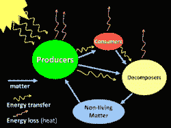

# 谷歌和易贝在构建微服务生态系统方面的深刻经验——高可扩展性

> 原文：<http://highscalability.com/blog/2015/12/1/deep-lessons-from-google-and-ebay-on-building-ecosystems-of.html?utm_source=wanqu.co&utm_campaign=Wanqu+Daily&utm_medium=website>

当你观察来自谷歌、推特、易贝和亚马逊的大规模系统时，你会发现他们的架构已经进化成了类似的东西:**一组多语言微服务**。

当你处于 polyglot 微服务结束状态时是什么样子的？曾在谷歌和易贝担任高级职位的兰迪·肖普(Randy Shoup)有一个非常有趣的演讲，探讨了这个想法:[规模化的服务架构:来自谷歌和易贝的教训](http://www.infoq.com/presentations/service-arch-scale-google-ebay)。

我真正喜欢兰迪的演讲是他如何自觉地试图让你沉浸在你可能没有经历过的事情中:创造、使用、延续和保护一个大规模的建筑。

在演讲的*服务生态系统*部分，Randy 问道:拥有一个大规模多语言微服务生态系统是什么样子的？在*大规模运营服务*部分，他问道:作为服务提供商，运营这样的服务是什么感觉？在*构建服务*部分他问道:当你是一个服务所有者时，它看起来像什么？在*服务反模式*部分，他问道:什么会出错？

一个非常强大的方法。

对我来说，这个演讲的亮点是关于**一个** **激励、**一个贯穿整个努力的一致主题的想法。虽然从来没有明确地作为一个单独的策略提出来，但它是为什么您希望小团队开发小的干净服务，为什么内部服务的收费模型如此强大，没有架构师架构如何发展，干净设计如何从自下而上的过程发展，以及标准如何在没有中央委员会的情况下发展的背后动机。

我的观点是**激励的有意调整是你如何扩展一个大型的动态组织和一个大型的动态代码库**。引入正确的激励[推动](https://en.wikipedia.org/wiki/Nudge_(book))事情在没有明确控制的情况下发生，几乎与当你移除锁、不共享状态、与消息通信以及并行化一切时，分布式系统中的更多工作被完成的方式相同。

让我们看看现代是如何建造大规模系统的...

## 多语言微服务是终极游戏

*   大规模系统最终演变成看起来非常相似的东西: **一组多语言微服务** 。多语言意味着微服务可以用多种语言编写。

*   **易贝**始于 1995 年。取决于您如何计算，他们已经是第五代体系结构了。

    *   最初是创始人在 1995 年劳动节周末写的一个单片 Perl 应用程序。

    *   然后它转移到一个单片 C++应用程序，最终在一个 DLL 中有 340 万行代码。

    *   以前的经验促使人们转向 Java 中更加分布式的分区系统。

    *   今天的易贝有相当多的 Java，但有一套多语言的微服务。

*   Twitter 的发展看起来非常相似。这取决于你如何计算，他们是第三代的架构。

    *   最初是一个完整的 Ruby on Rails 应用程序。

    *   前端结合了 Javascript 和 Rails，后端结合了大量的 Scala。

    *   最终，他们转向了我们今天所说的一套多语言微服务。

*   亚马逊走了一条相似的道路。

    *   从单片 C++应用程序开始。

    *   然后用 Java 和 Scala 写的服务。

    *   以一套多语言微服务结束。

## 服务生态系统

### 服务生态系统是如何创建的？

*   这些性能最好的系统更多的是进化的产物，而不是智能设计。例如，在谷歌，从来没有一个集中的自上而下的系统设计。随着时间的推移，它以一种非常有机的方式进化和成长。

*   变异和自然选择。当一个问题需要解决时，一个新的服务被创建，或者更常见的是从现有的服务或产品中提取。**服务只要被使用就存在**，只要提供价值，否则就被弃用。

*   这些大规模系统**自下而上**发展。**干净的设计可以是一种突现的特性，而不是自上而下设计的产物**。

*   作为一个例子，考虑谷歌应用引擎的一些服务分层。

    *   云数据存储(一种 NoSQL 服务)建立在 Megastore(一种地理规模的结构化数据库)之上，而 Megastore 又建立在 Bigtable(一种集群级的结构化服务)之上，Bigtable 又建立在基于 Borg(集群管理基础设施)之上的 Colossus(下一代集群文件系统)之上。

    *   层次感干净。每一层都增加了一些不属于下一层的东西。它不是自上而下设计的产物。

    *   它是由下而上建造的。巨像，谷歌文件系统最早建立。几年后，Bigtable 建成了。几年后，大型超市建成了。几年后，云数据库迁移到了 Megastore。

    *   没有自顶向下的架构，你也可以拥有这种美妙的关注点分离。

*   **这是没有建筑师的建筑**。谷歌没有人有架构师的头衔。技术决策没有中央批准。大多数技术决策都是由本地的单个团队出于他们自己的目的做出的，而不是全球性的。

*   与 2004 年的易贝形成对比。有一个建筑审查委员会，它必须批准所有大型项目。

*   对于易贝来说，处理这种情况的一个更好的方法是**将评审委员会中聪明的有经验的人的知识**编码，**将这些知识转化为可被单个团队重用的东西**。将这种体验编码到一个图书馆或一项服务中，甚至是一套人们可以自己使用的指南，而不是在最后一刻才进入流程。

### 没有架构师，标准如何发展？

*   没有中央控制的**有可能以标准化**告终。

*   通常被标准化的通信部分:

    *   **网络协议**。谷歌使用的专有协议叫做。易贝利用休息。

    *   **数据格式**。谷歌使用协议缓冲区。易贝倾向于使用 JSON。

    *   **接口模式标准**。谷歌使用协议缓冲区。对于 JSON，有 JSON 模式。

*   通常被标准化的公共基础设施:

*   在进化的环境中，**标准通过**来执行:代码、鼓励、代码评审和代码搜索。

    *   鼓励最佳实践的最简单方法是通过实际的代码。这不是关于自上而下的审查，或预先设计，这是关于有人生产代码，使之容易完成工作。

    *   鼓励是通过**团队提供一个库**。

    *   鼓励也是通过你想依赖的服务支持 X 协议或者 Y 协议。

    *   谷歌以**每一行代码**被签入源代码控制**被至少一个其他程序员评审**而闻名。这是交流常见实践的好方法。

    *   除了少数例外，谷歌的每个工程师都可以搜索整个代码库。当程序员试图弄清楚如何做某事时，这是一个巨大的增值。对于 10K 工程师来说，如果你想做某件事，很可能有人已经做过类似的事情了。这允许从一个领域开始的**最佳实践通过代码库**传播。它还允许错误传播。

*   鼓励共同的实践和标准化的约定**使得做正确的事情变得非常容易**而做错误的事情变得非常困难。

*   单个**服务相互独立**。

    *   在谷歌，服务的内部没有标准化。对外界来说，服务是一个黑匣子。

    *   有约定和公共库，但没有编程语言要求。常用的有四种语言:C++、Go、Java、Python。许多不同的服务是用不同的语言编写的。

    *   没有围绕框架或持久化机制的标准化。

*   在一个成熟的服务生态系统中，我们标准化的是图的弧线，而不是节点本身。定义一个通用的形状，而不是一个通用的实现。

### 创建新服务

*   当新服务的用途已经被证明时，它们就被创造出来。

*   通常一项功能是为一个特定的用例而构建的。然后发现能力是普遍的和有用的。

*   这些**架构通过实用主义**成长。没有人高高在上，说应该增加一项服务。

*   Google 文件系统支持搜索引擎。毫不奇怪，分布式文件系统更普遍可用。

*   Bigtable 最初支持搜索引擎，但用途更广。

*   Megastore 是作为谷歌应用程序的存储机制而建立的，但用途更广。

*   谷歌应用引擎本身是由一小群认识到网站建设需要帮助的工程师创立的。

*   Gmail 产生于一个在内部非常有用的副业项目，然后被外部化为其他人使用。

### 弃旧服务

*   如果不再使用某项服务，会发生什么情况？

*   可以重新利用的技术被重新利用。

*   人们可以被解雇或重新部署到其他团队。

*   Google Wave 在市场上并不成功，但其中一些技术最终出现在了 Google Apps 中。比如多人编辑文档的能力就来自于 Wave。

*   更常见的情况是核心服务经历多代，旧的几代已经过时。这在谷歌经常发生。变化如此之大，以至于谷歌内部的每项服务要么已经过时，要么还没有准备好。

## 构建服务

### 服务所有者的目标是什么？

*   **满足客户的需求** 。以适当的质量水平提供必要的功能，同时满足商定的性能水平，同时保持稳定性和可靠性，并随着时间的推移不断改进服务。

*   **以最小的代价和努力满足需求** 。

    *   这个**目标以鼓励**使用公共基础设施**的方式调整激励**。

    *   每个团队都有一组有限的资源，因此利用经过实战检验的通用工具、流程、组件和服务符合他们的利益。

    *   它还能激励良好的运营行为。自动化服务的构建和部署。

    *   它还鼓励优化资源的有效利用。

### 服务负责人的职责是什么？

### 服务之间的关系是什么？

*   将服务之间的**关系视为供应商-客户关系**，即使你们在同一家公司。

*   非常友好和合作，但在关系中要非常有条理。

*   非常清楚所有权。

*   非常清楚谁对什么负责。在很大程度上，这是关于定义一个清晰的界面并维护它。

*   **因为客户可以选择使用或不使用某项服务，所以激励措施是一致的**。这鼓励服务为他们的顾客做正确的事。这是构建新服务的方式之一。

*   定义服务级别协议。因为服务提供商向他们的客户承诺一定水平的服务，所以客户可以依赖该服务。

*   **客户团队为服务付费**。

    *   **服务收费符合经济激励**。它促使双方都极其有效地利用资源。

    *   当事物是免费的，我们倾向于不重视它们，也倾向于不优化它们。

    *   例如，一位内部客户免费使用 Google App Engine，他们使用了大量资源。恳求他们更有效地使用资源被证明不是一个好策略。在启动退款一周后，他们通过一两项简单的更改，将 GAE 资源的消耗减少了 90%。

    *   并不是说使用 GAE 的团队是邪恶的，他们只是有其他优先考虑的事情，所以没有动力让他们优化对 GAE 的使用。事实证明，他们通过更高效的架构获得了更好的响应时间。

    *   **收费也激励服务提供商保持高质量**，否则内部客户可能会转向别处。这直接激励了良好的开发和管理实践。代码审查就是一个例子。谷歌的超大规模构建和测试系统是另一个例子。谷歌每天运行数百万次自动化测试。每次代码被存储库接受时，对所有相关代码的验收测试都会运行，这有助于所有小团队保持他们的服务质量。

    *   收费模式**鼓励小的增量变化**。小变化更容易理解。此外，代码更改的影响是非线性的。1000 行变化的风险不是 100 行变化的 10 倍，而是 100 倍。

*   **保持接口的完全向后/向前兼容性**。

    *   永远不要违反客户守则。

    *   这意味着维护多个接口版本。在一些糟糕的情况下，这意味着维护多个部署，一个用于新版本，另一个用于旧版本。

    *   通常由于增量变化小，模型接口不变。

*   制定明确的折旧政策。那么服务提供者会被强烈地激励将所有客户端从版本 N 转移到版本 N+1。

## 规模化运营服务

*   作为服务提供商，在多语言微服务的大规模系统中运营服务是什么感觉？

*   **可预测的性能是一项要求**。

    *   大规模服务**极易受到性能变化**的影响。

    *   **绩效的可预测性比平均绩效更重要**。

    *   性能不一致的低延迟其实根本不是低延迟。

    *   当服务提供一致的性能时，客户针对服务进行编程要容易得多。

    *   由于服务使用许多其他服务来执行其工作，因此尾部延迟主导了性能。

    *   假设一项服务的中值延迟为 1 毫秒，99.999%的 ile(万分之一)延迟为 1 秒。

    *   打一个电话意味着你有 0.01%的时间是慢的。

    *   如果你使用 5000 台机器，就像谷歌的许多大规模服务一样，那么你有 50%的时间是慢的。

    *   例如，memcached 的百万分之一的问题被追踪到一个低级数据结构重新分配事件。随着延迟峰值的出现，这个罕见的问题浮出水面。像这样的低级细节在大规模系统中变得极其重要。

*   深度适应力。

    *   服务中断更有可能是由人的失误而不是硬件或软件故障造成的。

    *   对机器、集群和数据中心故障具有弹性。

    *   当调用其他服务时，负载平衡并提供流量控制。

    *   能够快速回滚更改。

*   增量部署。

    *   使用金丝雀系统。不要一次部署到所有机器上。选择一个系统，将该软件的新版本放在该系统上，并观察它在新环境中的表现。

    *   如果成功了**开始分阶段展示**。从 10%的机器开始，移动到 20%,以此类推，直到其余的机器。

    *   如果问题发生在部署的 50%点，那么您应该能够回滚。

    *   易贝利用**特性标志将代码部署从特性部署**中分离出来。通常情况下，部署代码时会关闭某个功能，然后可以打开或关闭该功能。这确保了在启用新功能之前，代码可以正确部署。这也意味着如果新特性有一个 bug，一个性能问题，或者一个业务失败，那么这个特性可以被关闭，而不需要部署新的代码。

*   你可以有太多的警报，也可以有太多的监控。

## 服务反模式

*   ***   做得太多的服务。你想要的是一个由非常小的清洁服务组成的生态系统。

    *   做得太多的服务是另一个庞然大物。它很难推理，很难扩展，很难改变，而且它还会产生比你想要的更多的上下游依赖。** 
***   **共享坚持**

    *   在分层模型中，服务放在应用层，持久层作为公共服务提供给应用程序。

    *   他们在易贝做到了这一点，但没有成功。它**打破了服务的封装**。应用程序可以通过更新数据库来**进入你的服务**。它最终重新引入了服务的耦合。共享数据库不允许松散耦合的服务。

    *   微服务通过小型、隔离和独立来防止这个问题，这是您保持生态系统健康和增长的方式。** 

 **## 相关文章**