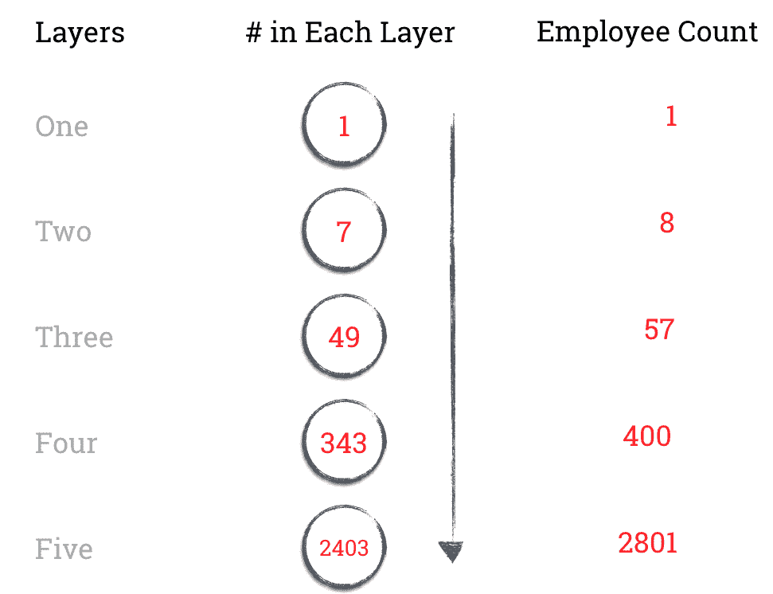

# 创业最佳实践 19 -识别创业管理结构的突破点

> 原文：<http://tomtunguz.com/breaking-points-of-management/?utm_source=wanqu.co&utm_campaign=Wanqu+Daily&utm_medium=website>

[T2】](https://res.cloudinary.com/dzawgnnlr/image/upload/q_auto/f_auto/w_auto/breaking_points_of_management.png)

上周，我采访了 Salesforce 前 CMO 和首席市场官、Zuora 创始人兼首席执行官田卓。在我们的谈话中，他谈到了快速成长的初创公司面临的主要挑战之一。他称之为认识到管理的突破点。

在创业初期，公司的结构是扁平的。每个人实际上都是对等的。在大约 8 人时，必须出现一个领导者来领导这个不断增长的团队，因此第一个管理层就产生了。然后，在大约 60 名员工时，公司必须再增加一个管理层，然后当公司达到几百名员工时，再增加一个管理层。图钉的创始人兼首席执行官马可·萨帕科斯塔曾经告诉我，“作为首席执行官，我从一个贡献者变成了一个经理，一个经理的经理，一个经理的经理。每一次，我都需要再次学习成为首席执行官意味着什么。”

奇怪的是，这种模式在所有公司中都是一致的。当初创公司接近这些员工数量时，公司内部的沟通就会中断，初创公司无法有效地协调员工。警示信号包括组织中的混乱、团队间不协调的努力和沮丧的员工。

有一个理论支持为什么初创公司总是在大致相同的规模上感受到这些成长的烦恼。一位法国采矿工程师用在煤矿观察到的经验数据证明了控制跨度的概念。。控制范围是一个人管理的下属数量。随着报告数量的线性增长，经理必须监督的关系数量也呈指数增长。

大多数公司设计的团队控制跨度为 7 。在谷歌，我是计算产品、工程和其他团队控制范围的团队成员之一。尽管根据团队的需要有很大的差异，但中位数大约是 7。上图描述了管理层的数量、每层管理的员工数量以及假设控制范围为 7 的员工总数。

事实上，另一位研究人员 V.A. Graicunas 开发了一个公式来描述这种现象，该公式考虑了三种类型的关系。首先，经理来汇报。第二，举报举报。第三，对报告子集进行管理。

> 要管理的关系= n(2^(n-1)+n-1)；n =报告数量

如下表所示，理论上的复杂性随着每一次后续雇佣而大幅增加。

| 报告 | 要管理的关系 |
| Two | six |
| three | Eighteen |
| four | forty-four |
| five | One hundred |
| six | Two hundred and twenty-two |
| seven | Four hundred and ninety |
| eight | One thousand and eighty |
| nine | Two thousand three hundred and seventy-six |
| Ten | Five thousand two hundred and ten |

虽然给初创公司增加管理层可能看起来不是最好的管理方式，一些公司如 Zappos 已经试图[维持一个单位，尽管员工人数增加到数百人，](http://qz.com/161210/zappos-is-going-holacratic-no-job-titles-no-managers-no-hierarchy/)有大量的经验证据和研究支持这样一种观点，即快速增长的公司需要发展管理层来管理员工并最好地发展他们，这些范围在各公司之间大致一致。

当建立你的创业公司时，记住这些粗略的员工范围，作为考虑给公司增加另一个管理层和在不断增长的团队中重新建立和谐的关键点。