# 内容营销手册-价格经济学

> 原文：<http://priceonomics.com/the-content-marketing-handbook/?utm_source=wanqu.co&utm_campaign=Wanqu+Daily&utm_medium=website>

## 内容营销手册

*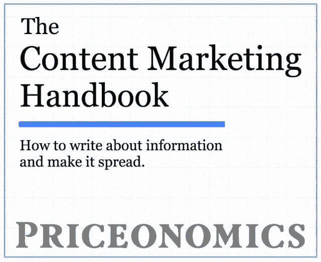

<noscript></noscript>* 

****前言****

当我们写完一本 30，000 多字的关于内容营销的书时，我们并不打算把它作为一篇冗长的博文来发表。然而，我们在这里。

话说回来，当我们在 2011 年 12 月开始写公司博客时，我们从未想过要雇佣 5 名全职作家，出版几本书，或者变成一家通过销售产品赚钱的内容公司。

这是一篇很长的博文。它包含了我们所知道的关于如何制作内容并在互联网上传播的一切。这是 Priceonomics 的故事，也是我们如何将数据转化为内容的故事。它最初是我们发给新的价格经济学作者的一本简短手册；现在我们扩展了它。

如果你喜欢这本手册的摘要，我们制作了一个 6 页的版本 [**，你可以在这里找到** 。](http://eepurl.com/bVruOT)我们还将在未来几天发布完整手册的 PDF 和 ePub 版本。如果你有兴趣， [在这里留下你的邮箱](http://eepurl.com/bVruOT) 。

把这本手册当成我们上周发布的 [内容追踪器](https://priceonomics.com/content-tracker-by-priceonomics/) 的伴侣。内容跟踪器是我们的软件程序，用于测量您的内容营销表现如何。它能获得媒体提及、流量、社交分享和客户线索吗？

但是你如何制作可以表演的内容，又如何分发呢？《内容营销手册》(这篇博文)是我们试图分享 Priceonomics 博客的“秘密公式”,这样当你写东西时，顾客、记者和读者就会注意到。Priceonomics 博客有没有其他公司可以复制的公式？算是吧。这是:

写信息。好好做。对它如何传播有一个计划。

***

这篇博文本应是我们的下一本书，因此有这么长。

但是在我们出版它之前，我们停下来考虑卖 15 美元的书是否是将这些信息产品化的最好方式。我们的前两本书， *[【一切都是扯淡】](http://www.amazon.com/dp/B00L9G96NG/?tag=priceonomic0c-20)* 和 [*潮人商业模式*](http://www.amazon.com/dp/B00QXXFVWA/?tag=priceonomic0c-20) ，卖得相当好，但产生的钱与我们向企业销售东西的收入相比一直不多。此外，我们认为避免把一本书的草稿变成一本真正的书的所有不愉快的工作会很好！

相反，我们做了一个实验。

我们决定在办公室做一个演示，讨论做内容营销的“价格经济学方法”。我们不知道是否有人想听我们谈论一个小时如何将公司数据转化为内容并使其传播。但是我们在一些创业论坛和电子邮件列表上发布了这次演讲的活动细节，希望能够吸引更多的听众。

然而，我们这次演讲的非秘密计划是提出一个“提议”,帮助参加演讲的公司实施我们书中的策略。那个“提议”(不管是什么)能比仅仅卖一本书产生更多的收入吗？我们对具体提供什么的想法很模糊，但它将涉及通过我们的软件或帮助公司将数据转化为内容的服务来帮助公司创建更好的内容营销。

令我们惊讶的是，有 200 人报名参加了我们的讲座，其中大部分是相当大的公司的创始人和营销主管。

价格经济办公室不是很大，所以我们不可能容纳 200 人。然而，这个大小限制有一个优势:我们必须运行 10 个小的演示，而不是一个大的，这意味着我们可以测试 10 个略有不同的“提议”。

所以我们做了 10 个演示，直到最后都是一样的。在演示的最后一张幻灯片上，我们展示了如何帮助公司制作更好内容的不同“方案”。

***

通过向其他公司介绍这本手册中的知识，我们学到了很多。

首先，很明显，即使没有我们的帮助，其他公司也可以复制我们的方法。每个公司都应该写自己的数据！在第一次演讲的几周内，我们收到了与会者的电子邮件，他们说，他们写的关于他们公司数据的文章被媒体转载，上升到 Reddit 的首位，比他们以前做的任何事情都要好 10 到 100 倍。

通过展示 10 种不同的“报价”,我们也学到了很多关于价格经济学如何帮助公司制作更好的内容。

从一开始，我们就知道人们想要使用我们的 [内容跟踪软件](https://priceonomics.com/content-tracker-by-priceonomics/) 。人们喜欢它！虽然 Tracker 在幕后很复杂，但它的前端是一个简单的仪表板，可以跟踪所有内容营销的表现。如果你整天制作内容，拥有 Tracker 是非常非常有用的，尤其是当你把它和 Slack 整合在一起的时候。

然而，通过与公司的交流，我们发现了一个更大的问题，单靠软件是无法解决的。许多公司在内容上有一个巨大的“头发着火”的问题:他们在博客上花了大量的金钱和时间，却什么也没发生！没有流量，没有媒体提及，没有客户线索，什么都没有。他们只是不停地检查“我们应该写一篇博客文章”的方框，但是投入的时间没有回报。对许多公司来说，Tracker 只能向他们展示他们已经知道的东西:他们的博客是一座鬼城。

所以，我们接下来测试了不同的东西。我们提出帮助公司更好地制作内容。我们会帮助他们想出如何将他们的数据转化为精彩的故事，并编辑他们的作品，使它们变得非常好。这项服务我们每月收取 2000 美元，这就像聘请 Priceonomics 作为你公司博客的编辑。

很多人注册了这项服务！

公司每月支付我们 2000 美元，我们帮助他们根据他们的数据开发想法，编辑他们的文章，并尽最大努力工作。他们可以在 Content Tracker 中看到结果，所以他们知道它在工作！我们马上就赚到了比图书销售更多的钱。

但是有一个问题。

实际上，对于一半的顾客来说，没有任何问题。这些公司喜欢这项服务，并在一点点指导和编辑帮助下发表了一些惊人的作品。效果很好。在拥有一个没人访问的博客多年后，他们开始发布记者报道和人们分享的信息。

但是另一半的公司从来没有发表过任何东西！我们见面，就他们数据中有趣的金块集思广益，然后他们去写草稿，然后就消失了！这些公司总是忙得没时间完成博客文章或进行分析。他们每月为这项服务支付 2000 美元，但他们并没有充分利用这项服务。这感觉不太可持续，即使利润率令人羡慕。

然后，在这个过程快结束的时候，我们突然想到:获取我们在 Priceonomics 开发的知识和软件的最佳方式。将本手册中的知识产品化的更好方法。

我们会根据公司的数据为他们制作内容，然后根据他们的表现向他们收费。

公司想要业绩(产生客户、公关和流量的文章)，所以这就是我们要卖的！我们知道如何查看他们的数据，将其转化为内容，并使其可以共享。只要公司使用内容跟踪系统，我们就可以根据他们的表现来收费。

所以我们提出了这个最终的提议，我们想让公司接受这个提议。

我们提出帮助公司将他们的数据转化为令人敬畏的内容营销。我们投入了巨大的努力，并且不惜成本。但是，如果该内容获得 5000 次浏览或 5 次媒体提及，他们将支付额外的成功费。而且，我们可以方便地测量 [追踪器](https://priceonomics.com/content-tracker-by-priceonomics/) 的性能。

当你考虑到创建内容所花费的时间和精力时，我们知道，我们交谈过的许多公司已经在他们的内容营销上每月花费了数千美元。但是他们没有得到结果。付钱给我们制作内容是一个低风险的提议，有着完全一致的激励。

公司开始从我们这里购买内容。一些人尝试了一次，然后问他们是否可以签署一年的协议。一家公司从我们这里购买了一部分内容。第二个月他们买了 4 个。第二个月，他们买了 10 个。这太疯狂了。这很有效，因为我们卖的是性能，而不是内容。公司不需要内容；当他们发布内容时，他们需要*事情发生*。好的内容只是业绩的催化剂。

这就是我们宣布推出新的内容营销机构 Priceonomics Data Studio 的原因。这是一家半分析半内容的公司，就像 Priceonomics 一样。它是一个内容营销代理，只提供给我们的 [内容跟踪软件](https://priceonomics.com/content-tracker-by-priceonomics/) 的用户。(这是免费的，你应该使用它。)

我们将获取贵公司的数据，对其进行分析，并将其转化为您在网站上发布的优秀内容营销。我们主要根据性能收费。到目前为止，我们在大约 75%的时候达到了成功指标。

如果您想了解更多关于我们数据驱动的内容营销机构，只需 [**给我们发送消息**](https://priceonomics.com/contact/) ，我们将安排时间谈论您的数据。会很有趣的。它工作了。

***

这本书里的一切都行得通。你可以让它工作，你可以雇佣我们来让它工作，你可以使用我们的软件来衡量它是否在工作。

在本书中，我们敦促你把内容营销想象成一场必须付出巨大努力的战役。没有什么好事是偶然发生的。你需要从伟大的想法开始，你需要有一个如何分发这些内容的计划，然后你需要执行这个计划。你的内容不会被媒体发现或意外传播。你必须策划这种结果。

这本书讲了三件事。如何做内容？如何传播内容？如果你没有大量的资源，如何实现这个目标。它完全基于我们在 Priceonomics 的经验。

这本书分为八章:

**第 1 章:入门**

价格经济学博客不太可能的起源故事。

**第二章:信息营销**

作为企业副产品的数据和信息是有价值的。

**第三章:世界是平的(公平的竞争环境)**

我们对彼得·泰尔问题的回答是，“你相信什么而别人不相信？”我们相信，如果你制作了一个好的内容，你是在纽约时报网站还是你公司的博客上发布它已经越来越不重要了。

更具体地说，本章描述了内容传播的机制。

第四章:社交网络

人为什么要分享？主要是为了证实他们现有的偏见。(但你已经知道了。)

第五章:作家的剧本

关于如何为网络写作的初级读本。

第六章:写作技巧

一个真正擅长制作内容营销的奇怪技巧是:把它想象成一场运动，不要让自己失败。

**第七章:招聘**

我们如何在 Priceonomics 雇佣作家，以及我们识别和培训人才的方法。

**第八章:为什么内容很重要**

内容营销人员应该感到恶心吗？内容营销本质上是通过销售产品来货币化的内容。传统媒体是通过出售用户注意力和个人数据来赚钱的内容。对我们来说，这是一个开放的问题，实际上更令人讨厌。

我们还总结了经济案例和公司制作更好内容的机会。内容是高质量的，不那么荒谬的自我推销，而且实际执行。

***

因此，没有进一步的告别，我们提出“内容营销手册”的其余部分或者，“如何写信息，让它传播。”或者，一个“销售内容营销软件和服务的精心制作的内容营销”

还是那句话，如果三万字的版本太长，这里用 [**6 页的总结代替**](http://eepurl.com/bVruOT) 。

现在，让我们从头开始。

**第一章:入门**

Priceonomics 博客几乎没有发生。今天，我们的网站每年有数千万的免费访客，他们从我们这里购买书籍、数据和高价值的商业服务——但我们几乎从一开始就把事情搞砸了。

2011 年末，Priceonomics(我们公司)开始提供二手物品的在线价格指南。我们建立了网络爬虫，检查人们出售他们的旧 iPhones、自行车和汽车的价格，分析这些物品的价格数据，然后发布在我们的网站上。我们就像凯利蓝皮书一样。

所以，我们建立并推出了一个网站——猜猜发生了什么？没什么。这不是我们第一次互联网创业，所以我们预料到了。互联网是一个广阔的地方:人们不会注意到一个新的网站或应用程序，除非你想出一个聪明的方法让人们找到它。

我们的目标是让人们通过谷歌发现 Priceonomics 价格指南。人们总是在谷歌上查找价格和进行产品研究，所以我们需要我们的结果显示在那里。如果你想知道一部二手 iPhone 值多少钱，搜索结果中必须出现 Priceonomics。

要在谷歌搜索结果中排名靠前，一个网站需要两样东西:内容和从其他网站到它的链接。我们的内容策略不够理想，但这是我们产品的本质。我们的算法已经为我们定价的每种产品创建了数千个网页。它们不是谷歌喜欢的丰富、手工制作的内容；它们是薄薄的几页，上面有产品的名称、价格，以及几个可以买到该产品的地方的链接。

在短期内，我们的网站有太多这样的页面，我们无法真正提高它们的质量(除了改进生成页面的算法)。

然而，我们可以控制的是入站链接。要想在谷歌的算法中排名靠前，不仅需要好的内容，还需要其他人链接。这是给谷歌算法的一个信号，表明你的内容是权威的，应该出现在谷歌搜索结果中。如果**《纽约时报》*链接到你关于 iPhone 价格的页面，这表明你的内容可能是有信誉的。*

 *所以我们决定开一个博客，写下我们的定价数据。大约在 2011 年的这个时候，约会网站 OKCupid 根据该公司的数据写了一些非常受欢迎的关于约会的文章，我们认为我们应该用我们用过的定价数据做同样的事情。这是一个实验，看看我们是否可以获得链接，并提高我们在谷歌搜索结果中的排名。

当我们计划我们的博客时，我们在创业孵化器 Y Combinator 中开始了为期 12 周的“加速器”计划。因为我们是这个项目的一部分，有影响力的技术网站 TechCrunch 同意报道我们的发布。

TechCrunch 的工作人员告诉我们，这篇文章将于 12 月 20 日上线。这篇文章会有所帮助，因为在谷歌看来，TechCrunch 上我们网站的链接会提高我们的可信度。我们还决定，在 TechCrunch 的文章上线后，我们将使用我们的数据写一篇文章，提交给黑客新闻(Hacker News)，这是一个在技术社区很受欢迎的社交新闻网站，希望能接触到更多的潜在用户。(从发现价格经济学的新闻网站获得更多链接。)

有一段时间，我们考虑我们可以写些什么。圣诞节就要到了，互联网上充斥着关于礼物创意的文章。由于 Priceonomics 是一个二手产品的定价网站，我们决定写一些你可以作为圣诞礼物购买的二手物品。由于我们计划将文章提交给 Hacker News(一个面向程序员的网站，由我们在 Y Combinator 的投资者运营),我们写了一些“黑客”会喜欢的礼物。

我们的博客帖子“在 Craigslist 上为黑客购买圣诞礼物”当然很糟糕。谁想买二手产品做圣诞礼物？一个产品是给一个“黑客”的，这甚至意味着什么？我们是否想过《纽约时报》的作者会看到这些并认为，“我们必须写一写这个有趣的网站，它会顺便帮助人们为电脑黑客购买二手物品”？

下面是我们写的博文简介:

> 你可能不想在 Craigslist 上给你女朋友的妈妈买圣诞礼物。你的丈夫或阿姨可能会嘲笑他们树下用过的小饰品。出于其他人最能说明的原因，在美国购买二手商品作为礼物送人是违反社会规范的。
> 
> 但是你知道吗，Craigslist 上有很棒的东西，而且比买新的便宜。如果说 Etsy 支持“购买手工制品”运动，那么在 Priceonomics，我们支持“购买二手制品”运动。
> 
> 如果你买二手的，你可以多花 200%的钱。如果你让别人承受贬值和在流动性差的市场上卖掉旧东西的痛苦，100 美元的预算可以让你得到 300 美元的东西。对于她的麻烦，卖家得到了他们不再需要的东西的现金。这是一件美好的事情。甚至对环境也有好处！
> 
> 怀疑？让我们带你看看黑客朋友们想要的，但是你又买不起的东西。不像你女朋友的妈妈，如果你削减了你的圣诞预算，真的给他们买了一次像样的礼物，他们会很感激的！
> 
> 我们(有些偏颇)的建议是:在 Craigslist 上找到这些项目。在 Priceonomics 上查找它们，以确保它们是一笔好交易。买下来。让你的朋友开心。冲洗，重复。
> 
> [文章的其余部分是你可以购买的产品清单，以及新旧价格的对比。]

这篇文章的最大问题是我们在扮演营销人员。我们在做我们认为营销人员在做的事情。每个公司都有博客，他们都写这样的东西，所以我们认为这是我们应该做的。当时，我们不是经验丰富的作家或内容营销人员，所以我们认为博客的目的是谈论你的产品并销售它们。这就是市场营销:无聊又无聊。

不过，好消息是:我们从未发表过那篇愚蠢的博文。12 月 20 日来了又去，TechCrunch 没有发表宣布我们发布的文章。我们关于圣诞礼物的博文冒着不相关的风险。

最后，在 2011 年 12 月 22 日晚上，TechCrunch 关于 Priceonomics 的文章上线了。第二天，我们准备发布一篇关于二手圣诞礼物价格的“有见地”的文章，但我们面临一些棘手的问题。首先，那天是 12 月 23 日——离圣诞节还有两天，在 Craigslist 上买礼物已经很晚了。更重要的是，我们还没有足够的数据来计算我们推荐的几种产品的价格。

所以，我们放弃了这篇博文，在最后一刻重新开始。我们可以写些什么呢？

本月早些时候，我们进行了一项有趣的实验。我们利用我们的定价数据在 Craigslist 上找到二手 Aeron 办公椅的好交易，然后我们以大幅加价的方式将它们转售给其他初创公司。找到这些椅子，拖着它们逛旧金山，然后卖给我们的朋友赚钱的过程相当有趣，有点像汤姆·索亚。

我们写了一篇关于这一经历的博文，并将其命名为“Aeron 椅子套利历险记”以下是它的压缩版本:

> *“低买高卖。恐惧？那是另一个人的问题。”*
> 
> *——路易·温索普三世，《交易场所》(1983)*
> 
> 这里有一个故事，讲的是我们在 Craigslist 上购买二手 Aeron 椅子，然后加价卖给我们 Y Combinator 的同学，赚了 300 美元。基本上，我们在试验是否可以通过对二手商品进行套利来做生意。简而言之，我们了解到在海湾地区搬运家具似乎不是一个特别可扩展的商业模式。
> 
> 作为一个小小的背景故事，Priceonomics 正在为所有东西制定价格指南。就像凯利蓝皮书为汽车创建价格报告一样，我们也为自行车、电脑、电话、平板电脑、汽车等等创建价格报告。
> 
> 我们的第一个实验被称为“Craigslist 套利”为了做到这一点，我们将确定需求稳定但价格差异较大的产品。然后，我们可以购买贴出的特价商品，然后以市场价出售。此外，我们团队的很多人都特别喜欢 Craigslist 搜索。
> 
> 也许因为我们当时坐在非常不舒服的椅子上，我们决定把注意力放在赫曼米勒 Aeron 椅子上。在湾区，对这些椅子的需求相当稳定，尤其是在网络初创公司中。Aeron 椅子是好椅子还是物有所值，或许最好由他人来讨论。
> 
> 我们给其他我们认识的初创公司发了一封电子邮件，提出以 450 美元的价格向他们出售 Aeron 椅子，因为我们知道我们可以在 Craigslist 上以 350 美元的价格购买这些椅子，并从中赚取 100 美元的差价。
> 
> [这篇文章的其余部分详细描述了我们的考验和苦难——被拒付的支票，在城市里拖着椅子到处跑，总的来说日子不好过。]

*****

我们在 12 月 27 日点击了“发布”,并将这篇文章提交给了黑客新闻。慢慢地，人们投票支持这篇文章，直到它成为网站上投票最多的链接。对于 Priceonomics 来说，这是一个巨大的成功。我们写的东西会出现在我们最喜欢的网站的顶部，这对我们来说似乎是难以置信的！我们对写作完全是外行。

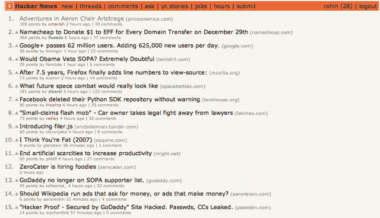

<noscript>T3】</noscript>

我们的帖子在《黑客新闻》的头版上出现了近 24 小时，并在技术行业中引起了广泛关注。华尔街日报的科技博客写下了我们的故事，许多行业领袖在推特上分享了它，我们的搜索引擎结果几乎立刻得到了改善。

虽然 TechCrunch 的报道为我们的网站带来了 6，000 名访客，但我们了解到，我们网站上一篇受欢迎的博客帖子可能会在一天内带来 20，000 名访客。在我们的网站上写一些受欢迎的东西，吸引我们自己的人群，这比试图哄骗记者来写我们要好。当我们在价格经济学上发布有趣的信息时，记者们找到了我们！

在 Priceonomics 博客上分享信息触动了人们的神经。在我们的第一篇帖子成功之后，我们专注于撰写有趣的博客帖子，分享新信息并吸引大量观众。尽管我们的公司后来有所改变，但有一点是始终如一的:尽管是公司出身，Priceonomics 博客还是吸引了很多读者。自从我们四年前开始这个项目以来，我们已经接触了超过 3000 万人——全部免费。Priceonomics 的博客越来越大。

如果我们坚持我们最初的想法“黑客用过的圣诞礼物”博文会怎么样？Priceonomics 博客会成功吗？大概不会。

“用过的圣诞礼物”的帖子只是一个坏主意。由于我们已经写了四年的博客，并且已经对热门话题有了一种直觉，我们几乎可以肯定地说。如果你打算花时间和精力写博客，写不好的东西是没有意义的。而是，多花一点时间，写一些很棒的东西。仅仅因为几乎每个公司都有一个没人读的无聊的公司博客，并不意味着你需要效仿他们。相信我们:他们不应该成为你的榜样。

但是，如果我们发表了蹩脚的圣诞礼物博客，Priceonomics 博客永远不会起飞还有另一个原因:在失败的工作上花费时间和精力是令人沮丧的。如果你写了一篇博客，但什么都没发生，你开始期待未来的写作也会失败。如果我们的第一篇博文失败了，我们也不太可能在第二篇博文上投入同样多的精力。我们会认为写博客是浪费时间，因为 99.999%的公司博客都是如此。

在组织理论中，有一种叫做 [努力-表现-结果](http://en.wikipedia.org/wiki/Expectancy_theory) 的理论:只有当你合理地期望努力会有回报时，你才会付出成功所必需的努力。这解释了为什么工人们一旦相信他们的产出不会被用于任何重要的事情，他们就会松懈下来。这也有助于解释许多社会现象，比如为什么贫穷的循环如此难以逃脱:如果你生长的地方没有努力工作导致成功的例子，就没有理由努力工作。

对于大多数公司博客来说，没有什么比在互联网上写博客更没有动力了，因为没有人会去读那些博客。我们认为在这些博客上工作的人一开始都很认真，很开心。然后，他们真的很努力地写帖子，比如“你应该把企业软件许可证作为圣诞礼物的 10 个理由”，当他们点击发布按钮时，只听到蟋蟀的叫声。写多条这样的帖子——不影响你公司的销售、曝光或线索的帖子——你会很快失去动力。

互联网的默认状态是**没人管**。如此多的文章、视频和博客文章争夺人们的注意力，以至于普通的工作往往得不到认可。发表任何不精彩的东西都是毫无意义的，因为它肯定会被忽视。

我们在两个方面都很幸运——如果没有这种运气，Priceonomics 博客就不可能繁荣起来。首先，尽管没有任何真正的写作经验，我们碰巧写出了一些好的东西(而不是像我们计划的那样无聊的东西)。第二，当我们写博客的时候，事情发生了*:我们获得了大量的流量、报道和客户兴趣。我们有动力继续写作，主要是因为我们看到了这样做的好处。*

 *这本书是关于这两件事:制作好的内容，和创建一个过程，确保当你发布它时，好的事情发生在你的公司。这很简单，但并不意味着很容易。

**制作好的内容**

定义“好内容”有很多不同的方式。*纽约客*写的文章很棒； *NPR* 制作精彩播客； *Buzzfeed* 制作高度可分享的列表；洋葱写了令人愉快的讽刺作品。但是，如果你想为你的企业争取客户，这些都不是你应该效仿的榜样。

大多数公司试图复制其他公司的风格和格式。最常见的是，模仿者试图变得有趣，因为“有趣”是网络货币之一:人们在社交网络上分享有趣的事情。但是搞笑不能让你从*华尔街日报*那里得到关注，不能在潜在客户面前激发信心，也不能突出你公司的专长。有趣的是，当你雇佣一家充满创意的 25 岁年轻人的广告公司来管理你公司的内容时，你会得到什么。

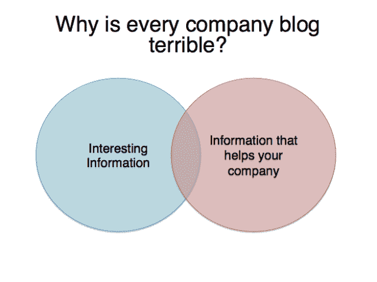

<noscript>T3】</noscript>

相反，你的重点应该是做一些对你的公司有好处的有趣的事情。这种方法缩小了你的关注点，这有助于想出要写的主题。但除此之外，作为一家企业，我们完全知道你应该写些什么。

你应该写信息。

在花费数年时间制作数百份报告并接触数千万人之后，您可以在这一点上信任我们:贵公司能够获得的真实信息是真正有价值的内容营销的货币。

当然，可能有更多“可分享”的内容——可爱的动物图片、尖刻的评论、名人八卦等等——但这些东西不会给你带来顾客。

另一方面，信息会。它可以是你的公司产生的数据，你因为你的行业经验而获得的洞察力，或者你能接触到的人的故事。

数据一直是价格经济学的核心，因此我们很自然地会写一些关于数据的文章，并用它来推广我们的产品。在 Priceonomics，我们发布了一些数据报告，主题包括 iPhone 与 Android 定价、Airbnb 与酒店费用以及旧金山房地产市场。

但是在人们(包括你)厌倦之前，你只能写你自己的数据这么久。为了改变我们的内容，我们开始努力研究经济问题，如“被盗的自行车会怎么样？”以及“速度限制是否太低？”我们开始挖掘企业家、研究人员和普通人的故事。我们在博客上公布了我们的发现。

我们为公司如何书写信息建立了一个框架:书写数据、行业或人。确保这是你的公司可以真实获得的原始信息，并且这些信息新颖有趣。你的公司是自己信息的专家——这就是你应该写的。

你可能不想复制我们所做的一切。坦白地说，我们在博客上花的时间比你应该花的时间要多。我们是局外人。我们痴迷于写好东西。我们写好东西是为了卖更多的产品，还是卖产品是为了写得起好东西？我们可能更接近后一种阵营。你应该更接近前一个阵营。

但是如果你花的时间只是我们写作时间的一小部分，你就会写出一些非常棒的内容。如果你做得好，它会让你得到媒体的提及和永久的客户线索。这将使你的公司成为某些领域的领导者。它甚至可能让你受邀在你所在领域的会议上发言。

但是生产普通材料毫无意义。你*有*让*做好*的事情。这本书将告诉你如何去做。

**一个过程**

许多营销书籍都假设你有一个庞大的、成熟的营销部门和大量的资金。这不是那些书中的一本。

当有人给我们笼统的建议却不解释如何做时，我们会感到沮丧。这本书是关于你可以建立一个过程来制作优秀内容的切实可行的方法。你如何雇人做这项工作？你应该多久发布一次？你应该花多少时间制作内容？你应该如何提出想法？你应该以什么格式发布它？你如何联系你想写你的记者？

我们知道的一切，都在这本书里。

**price onomics 发生了什么**

我们创建了 Priceonomics 博客，这样我们就可以获得链接，提高我们的价格指南在谷歌搜索结果中的排名。在某种程度上，我们在这方面取得了成功。很多人通过谷歌来到我们的网站。

但这并不像我们希望的那样有用。我们的客人是匆匆过客，他们查了一下价格就离开了。后来，他们几乎不记得是在哪个网站上找到的价格。这些不速之客从未转化为价格经济学的忠实用户。

此外，每当谷歌改变其搜索结果排名算法时(就像它经常做的那样)，它就会对我们的用户增长造成严重破坏。有几天，我们走进办公室，发现交通非常繁忙。其他日子，我们进来后发现谷歌已经决定大幅减少我们的流量。价格经济学的前景并不乐观。我们最初的想法失败了。

但是我们的博客是我们的亮点。

尽管它是一个公司的“营销博客”,它开始吸引普通读者。我们一个月接待了 100 多万游客，然后是 200 万！我们在其他公司的朋友开始问我们是否愿意向他们出售我们在网站上发布的数据。起初我们反对，因为我们不是一家数据销售公司。但是很明显，他们愿意支付我们认为很高的价格，我们同意了。后来的公司对使用我们的软件和专业知识表现出兴趣，这样他们就可以制作自己的数据驱动内容，我们也将这转化为收入。

突然间，我们有了一个商业模式:我们可以在 Priceonomics 博客上随心所欲地写作，并偶尔利用它向企业出售非常有价值的服务。此后不久，我们关闭了我们努力推广的消费者价格指南。

我们没有以获得谷歌搜索链接为目的制作内容，而是决定制作优秀的内容，因为我们喜欢制作优秀的内容。有时，这些内容会推广我们自己的产品，但即使是这些内容也很棒，因为它使用了我们业务产生的所有有趣数据。这是 Priceonomics 可以获得的真实信息，也是其他人认为有价值的信息。

我们的博客拯救了我们的公司。这让我们与众不同，让我们在众多公司中脱颖而出。我们喜欢我们的博客，我们喜欢写数据，我们喜欢讲故事。我们的 Priceonomics 博客的使命是为世界带来新的信息。这是一项我们非常重视的责任，我们希望其他人也能效仿我们的做法:在创造销售的同时，创造分享信息的优秀内容。

这是你怎么做的。

[

<noscript></noscript>](http://eepurl.com/bVruOT) 

**第二章:信息营销**

你曾经试图让一个记者写你的公司吗？这是极其困难的。你找到一个写你所在行业的人，获得她的电子邮件地址，仔细构思你的推销，然后点击发送——然后什么也没发生。

设身处地为记者着想:每天，她都会收到数百封电子邮件，向她推销自己的故事创意。每一封电子邮件都是要求她花五到十个小时研究你的公司(或者你推销的任何东西)，然后写出并编辑一些准确、有趣、有凝聚力的东西。想象一下，如果每天有数百人在街上拦住你，要求你花这么多时间和精力去帮助他们。你会发疯的。

让别人写你基本上是一个销售过程。你试图说服她放弃她的时间，以换取你必须提供的东西。你最好有一个好的理由让她对你感兴趣，因为你本质上是像电话推销员一样给她打电话。

对于电话推销员来说，销售是艰难的。盲目推销记者同样具有挑战性。相反，你应该通过帮助记者做好自己的工作，让她想写你。

像许多伟大的(和不那么伟大的)分析一样，这本书的核心理论围绕着一个二乘二矩阵。像往常一样，在右上的盒子里感觉很好。

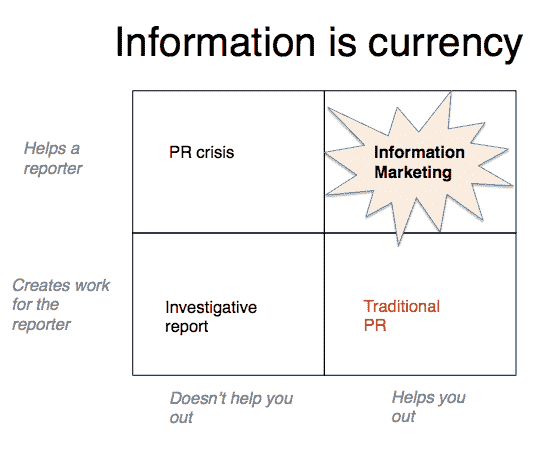

<noscript>T3】</noscript>

传统的 PR(公共关系)是类似电话销售的策略。这是你和记者之间的谈判。你要求记者通过报道你来帮助你，但是除了大量的工作之外，你能给她什么回报呢？

记者们最有可能写你，如果这不会为他们创造大量的工作，如果这个故事可能会得到很多关注。假设你是一名国会议员，你不小心在推特上分享了一张自己的不雅照。每个人都会写你，因为写这篇文章不费吹灰之力，而且肯定会成功。(这种特殊情况就是大多数人所说的公关危机。)

此外，有些文章需要记者做大量的工作，但报酬却很高。如果你有一条可以获得普利策奖的消息，记者会花上几个月甚至几年的时间来报道。但是他们的门槛很高。除非你从美国国家安全局窃取了秘密文件，或者掌握了大公司违法行为的证据，否则你很可能没有那种能激发重大调查报告的信息。即使你这样做了，这种情况对你来说也可能不是一个有效的营销渠道。

最后，我们来看看这本书的内容:通过分享信息进行营销。这涉及到获取你的公司可以获得或者可以创造的真正有新闻价值的信息，并发布出去。目标是创造一些东西，帮助其他人(记者)实现他们的目标，同时让你的公司看起来不错。

这意味着提供数据，记者可以使用这些数据轻松地撰写有趣和有新闻价值的文章。浏览一下*华尔街日报*:每一篇关于经济趋势的文章都引用了一家公司或第三方机构发布的数据。当你提供这样的信息时，你是在为别人做有价值的工作。记者会开始找你作为消息来源。你带来了一些东西，而不是让别人为你工作。

**书写现代世界的数据**

任何利用信息进行内容营销的讨论都需要从 OkCupid 博客开始。OkCupid 是一个 2001 年推出的约会网站。当时，大多数约会网站需要非常昂贵的月费；相比之下，OkCupid 有一个免费版本，很多用户觉得很有用。

尽管有成本优势，OkCupid 还是难以吸引足够数量的合格用户。他们尝试了一系列营销噱头——一个让人们进行“疯狂相亲”的网站，以及一个名为“Hello Quizzy”的问答网站——直到他们偶然发现了一种更平淡无奇但有效的营销形式:写下他们的数据。

虽然 OkCupid 与 Match.com 或 eHarmony 相比并不庞大，但它确实拥有数百万个关于世界上最有吸引力的话题的数据点:性。它有关于用户发现彼此有多有吸引力以及他们互相发信息的频率的信息。OKCupid 还知道他们的年龄、种族和性取向等变量。

普通营销人员可能会看着这些数据说，“那又怎么样？我们有关于人们年龄的数据，没什么大不了的。”但是 OkCupid 团队用这些数据讲述了每个人都想谈论的故事。

在一篇帖子中，OkCupid 使用其数据明确证明了 20 多岁的异性恋男性希望与 20 多岁的女性约会，而 50 岁的异性恋男性也希望与 20 岁的女性约会。OkCupid 认为，无论男人变得多老，他们仍然更喜欢 20 多岁的女人。另一方面，随着年龄的增长，女性倾向于寻找年龄相仿的伴侣。

OkCupid 的博主们并没有就此止步。他们有关于不同种族的人收发约会信息的可能性的数据。他们发现，在所有异性恋女性用户中，非裔美国人发送的信息最多，但收到的信息最少。他们写下了信息中的哪些特征——长度、语言、主题——最大化了某人回应的可能性。这些帖子在社交网络上获得了数百万次观看和数万次分享。

OkCupid 博客是数据和故事讲述的杰作；它也吸引了很多媒体的关注。在运行结束时，我们在该公司的消息来源告诉我们，OkCupid 的博客有一个 300 名媒体成员的名单，每个人都要求在他们发表博客帖子时得到通知。OkCupid 没有冷冰冰地给记者发电子邮件，乞求他们的关注，而是找到了一种让记者来找他们的方法——这完全是因为他们分享信息。

写数据并不容易。OkCupid 团队有两个人全职为其博客工作，这对一家初创公司来说是一笔巨大的投资。大部分看数据的人会觉得很无聊，或者说很费解。正如我们将在本书后面谈到的，从数据集中提取一个故事并确保它是正确的，需要花费大量的时间。

但是公司的数据中隐藏着有趣的故事，你只需要把它们挖掘出来。作为 Priceonomics 的一项脑力练习，我们经常问自己，“我们能让任何公司的数据变得有趣吗？”为了回答这个问题，让我们想象一下我们在邓德米夫林公司工作，这是一家众所周知的无聊的虚构的造纸公司，在电视喜剧《办公室》中有所描述。如果你为 Dunder Mifflin 的公司博客写稿，你会写哪些数据？

以下是我们快速集思广益得出的一些想法:

*   传真机的死亡:我们从 1980 年至今的传真纸年销售额
*   会计在纳税季节用多少纸？
*   谁用的纸更多:医生还是牙医？
*   纸质收据正在消亡吗？
*   节日贺卡的复兴
*   感谢信的兴起和衰落
*   为什么复写纸正在复兴
*   纸变薄了吗？
*   电话簿的死亡:从 1950 年至今电话簿纸的年销售量

这些只是利用公司信息系统产生的数据的想法。但它们也是世界上至少有些人会好奇的问题和话题，邓德·米夫林可以解决这些问题。

但是这本书不仅仅是写数据，而是写信息。数据是一种重要的大型信息类型，但还有其他类型的信息。如果你在造纸行业工作，你知道(或者可以研究)其他人想知道的关于你所在行业的事情:

*   为什么某些类型的纸张会导致更多卡纸？
*   最贵纸张的历史
*   让纸变薄的技术创新
*   浴室平均每年用多少棵树？
*   如何在家制作古埃及纸莎草纸
*   卖纸赚了十亿美元的人
*   改变了美国造纸工业的家族企业
*   为什么纸很便宜但墨水很贵？
*   宪法是写在什么样的纸上的？
*   售出的最有价值的纸质文件
*   新闻纸做起来有多便宜？
*   电话簿的历史
*   法律案件中使用最多的纸张是什么？

一旦你写了这些东西，它会放在哪里？首先，信不信由你，有几十个人可能在报道造纸行业，他们需要一些东西来写。对造纸行业趋势的分析有助于他们开展工作。他们会链接到一个关于纸张的有趣轶事，因为没有人会写以纸张为主角的故事！

除了记者，人们还喜欢阅读(和分享)关于他们的行业、爱好和家乡的故事。如果你在造纸行业工作，人们多久会写一次关于你的行业历史的精彩故事，或者使用关于纸张的数据来提出一个有趣的观点？或者说有一个律师每天要处理成吨的文件；当一篇文章展示了他不幸背后的数据时，他终于有办法向他的朋友传达他工作的这一方面。写人们想要分享的文章是如此重要，以至于我们在本书的后面用了整整一章来讨论这个话题。

你可以看看造纸行业，然后想，"*哎呀，多么无聊的行业*"但事实是，T2 有很多有趣的故事——你只需要把它们挖掘出来。要做到这一点，你必须培养这样的态度:一切都是有趣的。每个行业都有一段历史，每组数据都有一个洞见，每个人都有一个故事。

明白了吗？一切都很有趣。

**用于娱乐和盈利的企业数据:Airbnb 案例研究**

我们在 Priceonomics 使用网络爬虫从网页中提取数据，然后以可用的格式呈现给我们的客户。我们的客户要求我们做一些事情，比如从酒店搜索网站上分析巴黎的酒店价格，在网上拍卖中找出带 32GB 硬盘的 iPhone 5Cs 的售价，或者从互联网上摘录书评。

我们为客户做的实际工作包括无数个小时编写计算机代码，以获得他们需要的定制数据。我们最大限度地利用这项工作，想方设法让它变得有趣，这样我们就可以写关于它的内容，并获得客户。

让我们从一个我们最成功的内容营销活动的例子开始:住酒店和 Airbnb 的价格比较。

Airbnb 是一个网站，它为人们提供了一个平台，可以出租他们家中多余的房间，或者出租他们的整个房子。所以，当你旅行的时候，你可以住在酒店或者别人家里 Airbnb。凭直觉，我们知道住在 Airbnb 可能更便宜，尤其是如果你只是出租一个房间的话。但是我们想用数据量化它到底便宜了多少。

我们用我们公司的产品(我们的网络爬行服务)算出了确切的答案。我们浏览了美国所有的 Airbnb 列表，以及所有的酒店列表，比较价格。仅仅是获取数据就花了超过两周的工程时间，一周的时间来分析数据，看它是否有意义，另一周的时间来可视化数据，并写一篇描述数据的简短博客文章。

我们的帖子比较了美国各大城市的酒店住宿价格与私人房间(在某人家中)或通过 Airbnb 租赁的整间公寓的价格。在这篇文章发表时，住在 Airbnb 私人房间比住在酒店便宜 49.5%，租一整个公寓便宜 21.2%。

在我们点击博客帖子上的发布后，我们做了一些事情来确保人们看到它。我们将在本书的后面讨论如何分享你的内容营销，但没有什么是你自己做不到的。

就像我们开展的几乎所有成功的内容营销活动一样，一开始什么也没发生。但是渐渐地，在登上黑客新闻的头版之后，这个帖子出现在了合适的人面前。一个名为 Skift 的专注于旅行技术的行业博客写到了这一点。更大的博客如 Lifehacker、Gizmodo 和 GigaOm 写了关于它的文章。然后大人物们开始报道它:《美国消费者新闻与商业频道》、《金融时报》、《时代》、《商业周刊》和《赫芬顿邮报》都写了我们的研究，并对价格经济学表示赞同。

当 Airbnb 的投资者、演员阿什顿·库彻将这份报告分享给他的数千万推特粉丝时，媒体的怒火愈演愈烈。时至今日，各大媒体出版物在谈到 Airbnb 时，都会提到 Priceonomics 的报告。

我们并没有通过推销来招揽这些媒体功能。是媒体找上了我们，而不是我们找上了他们。我们的数据创建了一个入站公关流程。

在数百家报道我们研究的媒体网站中，没有一家联系我们询问这项分析。他们只是拿着图表写了一个故事，没有问任何问题。为什么？因为我们帮助他们完成了创造有趣内容的工作，而且我们通过向他们提供易于理解的新信息，使他们的工作变得更容易。

你也可以这样做。如果你没有纠缠记者去写你的公司，而是创造了非常好的内容，让他们想去写，那会怎么样？这就是我们创造的过程。如果你创造了大量的信息，你就有机会在你的公司开发类似的过程。

**其他数据营销成功案例**

这并不容易做到。但是 Priceonomics 和 OkCupid 并不是唯一成功的公司。

金融网站 FutureAdvisor 发布有关投资和支出的金融建议。我们第一次听说它是在该公司利用其数据做了一个非常聪明的内容营销的时候。FutureAdvisor 分析了数百万客户的信用卡数据，得出了有趣且可发表的见解。

当该公司决定使用信用卡账单来计算有多少人使用优步和 Lyft 这样的“拼车”服务时，它突然想到了一个令人难以置信的主意。事实证明，优步主宰着 a 股市场。人们直觉上知道优步是一家比 Lyft 更成功的公司，但现在他们有了证实这种直觉的真实数据。

FutureAdvisor 将其调查结果编制成一份报告——“研究:优步在乘客和收入方面领先 Lyft，领先美国 12 倍”——并向媒体发布。(我们知道他们这么做了，因为他们给 Priceonomics 博客发了电子邮件，问我们是否想写这些数据)。

那天，每个技术网站都写了关于未来顾问的研究。这是帮助记者完成工作的重要信息:写可能受欢迎的文章。在这种情况下，数据是关于优步，世界上最热门的技术公司之一。正是数据决定了优步与其主要竞争对手 Lyft 之间的“分数”。

众所周知，房地产公司擅长将数据转化为媒体提及。阅读《华尔街日报》一篇关于租金价格上涨的文章，你可能会看到一些公司向投资者出售租金数据。同样，关于房地产价格上涨的文章经常引用标准普尔凯斯席勒指数，这是标准普尔公司拥有的一个数据源。这样的数据*帮助*记者。

人们喜欢这种东西，记者们也知道！年底，你总会看到“年度最受欢迎的谷歌搜索”或“Spotify 上年度最受欢迎的艺术家”之类的列表，因为记者和普通公众喜欢获取信息。这就是为什么人们总是对“美国顶尖学校”或“美国最多元化的城市”进行量化排名。

如果你写了一个关于数据的故事，并让它变得足够容易获取，你会吸引每个人心中的那个小小的数据呆子。

许多现代公司拥有专有的信息访问权。你不必非得是谷歌、Spotify、Priceonomics 或美国新闻(US News)才能访问数据。服装公司 Everlane 提供了令人震惊的数据，显示其他公司在向你出售“名牌”t 恤时是如何敲诈你的。Mailchimp 是一家帮助其他公司发送电子邮件的公司，该公司分析了一天中发送电子邮件最有效的时间(根据某人打开电子邮件的可能性来衡量)，并将结果转化为精彩的内容。

这个策略同样适用于任何行业。

假设你拥有一家冰淇淋店。你知道你每天卖多少个冰淇淋甜筒。你也可以查看每天的平均温度。创建一个图表，x 轴是温度，y 轴是冰淇淋蛋卷的销售额，这样你就有了优秀的数据驱动的内容。

如果你经营一家轮胎公司，用你的数据来计算哪个季节爆胎最严重。如果你是一家火灾保险公司，确定一栋有 10 个单元的建筑在未来 10 年的某个时候发生火灾的累积概率，然后用 100 个或 1000 个单元的建筑来衡量。如果你是一名会计，用你在纳税季临近时收到的邮件数量来衡量你每天收到的平均邮件数量。

每家公司都有机会获得有助于更好地了解这个世界，或者至少了解这个世界的小环境的信息。

**写信息，不一定是数据**

在我们的第一篇 Priceonomics 博客文章中，我们几乎只写了我们的数据。如果您还记得，为了支持我们的第一个产品(消费者价格指南)，我们已经建立了一个二手商品价格的数据集。我们对二手自行车、二手美国车和二手日本车、二手电子阅读器和二手电视的价格进行了流行分析。

我们从这些文章中看到了很多兴趣，得到了很多关注，但我们厌倦了写二手商品的价格。我们决定写一个与价格经济学相关的市场。事后看来，这是一个伟大的决定。你必须让事情对自己有意思，否则你的热情会减弱，这将在你的写作中表现出来。

也就是说，我们只是在掌握了撰写自己的数据之后才开始探索关于行业的更广泛的问题。我们建议您在拓宽主题之前，至少发布十几份关于您公司数据的报告。不要因为比写关于你公司数据的故事更有趣而跳过前面的部分。

但是哪个行业呢？我们有很多来自发现我们的二手自行车价格数据库的人的流量，我们中的许多人喜欢自行车和通勤上班。当我们争论该写些什么时，我们开始问，为什么这么多自行车被偷？

就我们而言，我们以前写过关于自行车的文章，知道人们喜欢谈论自行车。我们分析了固定齿轮自行车(“fixies”)在美国销售最多的地方，并以此构建了一个最“潮人”城市的半开玩笑指数。(一个常见的刻板印象是，潮人喜欢骑固定档位的自行车。)我们被媒体淹没了，布鲁克林的每一个“潮人博客”都在写我们。

自行车失窃对我们来说是个谜。我们知道这是美国城市的一种流行病，但我们对它的流行感到困惑。自行车并不像毒品或手机一样是罪犯们非常珍视的商品。

我们对被盗自行车市场做了一些二手研究，打了几个电话，并使用一些经济框架来找出为什么这么多自行车被盗。这是一个深入的过程，可以被解释为“新闻报道”

当我们发表博客文章“被盗的自行车会怎么样？”，它成为迄今为止我们写过的点击率最高的文章。该帖子在两天内吸引了超过 100，000 名访客。它吸引了数百个链接，提高了我们的自行车价格数据库的搜索引擎优化排名，NPR 甚至在一个广播节目中介绍了我们。

写被盗自行车的经济学使我们的博客焕发了活力，给我们提供了更多关注行业的话题——这些话题反过来又有助于给世界带来新的信息。我们写了一篇名为“钻石是扯淡”的帖子，有超过 10 万人在脸书上分享。我们写了乐队预订的费用，已经被浏览了近 200 万次。我们写了一篇关于床垫行业的分析，这给我们带来了巨大的流量，并在 TechCrunch 上被引用。

自从我们把博客开放给公司数据集之外的故事，Priceonomics 博客真的起飞了。但事实是:这种类型的内容不会直接为你的企业带来客户线索。这并不是说它没有价值，但我们不建议你开始就随机话题写娱乐性的分析。我们的理论是，你的内容应该是促进你的产品的东西和不促进你的产品的东西的混合物。我们将在本书的稍后部分对此进行深入探讨。

如果你准备在你的数据之外写一篇文章，你应该问问自己，你的公司可以写哪些利用你的行业知识或专长的主题。之前，我们给出了 Dunder Mifflin 的博客可以解决的各种主题的例子。

如果你经营割草生意呢？有什么有趣的东西可以写吗？我们认为是的:

*   不同种类的草需要多少水？
*   什么是人造草，安装要多少钱？
*   美国不同地区的主要草是什么？
*   美国人是什么时候开始种植草坪的？
*   现在还有人用手动割草机吗？
*   根据面积和布局，修剪草坪需要多长时间？
*   草坪修剪公司有合适的保险吗？

一般人会努力写这些帖子，并提供新颖的信息。草坪护理行业的人可以。

贵公司还有哪些其他种类的信息？

你的公司可以获得你可以写的专有数据。因为你的行业和专业技能，你可以比一般记者更有效地研究你的行业。

但是信息不仅限于数据:你还可以写人们的生活。有一种说法是，轶事的复数是数据。还有人说奇闻轶事的复数是*不是*数据。无论哪种方式，讲述一个你的公司可以接触到的故事都是很强大的。

最近，我们采访了一位科技初创公司的员工，他正在努力为公司的博客寻找素材。该公司已经筹集了一大笔风险资本，由著名的投资公司凯鹏华盈(Kleiner Perkins)牵头。该公司的创始人必须找出如何更快地发展，制作优秀的内容是他们计划的重要组成部分。

我们建议他们写一篇帖子，谈谈从凯鹏华盈(Kleiner Perkins)那里筹集资金的感受。几个月后，这家公司发表了一篇关于其风险资本融资是如何产生的精彩文章。他们提炼了我们提出的想法，使之更好，并以只有他们才能做到的方式讲述了他们的故事。他们把这个故事贴在了公司博客上，这正是他们想要的:大量的媒体关注和访问。

为什么这是一篇好文章？这家公司知道让凯鹏华盈投资是什么感觉，很多人想知道他们如何从硅谷最成功的投资者之一那里获得资金。你的公司拥有的(或可以获得的)真实知识是一种非常强大的信息形式——即使它只是讲述一个主观的轶事。

Priceonomics 的核心原则之一是，每个人都有一个有趣的故事。你每天接触的每个人都有一个关于心碎、胜利、悲剧或喜剧的根深蒂固的故事。

写故事、轶事和小数据的关键是:坚持你所知道的。不要举一反三，试图把一个人生活中的趣闻变成别的。如果你想谈谈你公司的创立，就讲那个故事吧。不要试图把它延伸到你所在行业的某个决定性时刻，或者某个改变世界的事件；你的观众会翻白眼，把你的内容斥为蹩脚的营销。只说你知道的，坚持事实。

斯坦福大学商学院最受欢迎的课程之一被非正式地称为“多愁善感”。这个班级由一群学生组成，他们每周聚会几次，围成一圈，没有任何议程。当然，每个人都知道这门课叫做“多愁善感”，所以最终人们开始谈论他们的感受。

几周后，话题转移到人们对其他成员的感觉上。通常，人们开始互相冒犯——“你总是打断我，”或者，“你认为你比我聪明，因为你在私募股权公司工作，而我在非营利机构工作”。不知何故，一切都乱套了，一群本来很有礼貌的人表现得很不礼貌。

但是紧张的讨论最终揭示了与人相处的神奇公式。这是一个叫做“站在你这边”的表达不要假装你知道别人脑子里在想什么；你只能真正知道你脑子里在想什么。你不知道别人认为他们比你聪明。你只知道你对某件事的感觉。

当小组成员明白他们应该谈论自己的感受，而不是指责其他人的感受后，大家开始相处。到课程结束时，这个团体已经结合在一起，人们也建立了新的友谊。像“你认为我不聪明”这样的指责被换成了“我觉得我的智力不受尊重。”当你坚持站在网的一边时，人们会听你说什么。

你不必这样做营销，但在 Priceonomics，我们必须这样做。我们告诉你，“这是我们掌握的信息。”我们从来不会说，“这里有十个你会*喜欢*这个产品的理由，”因为我们不了解你或者你喜欢什么。我们永远不会说“谷歌是邪恶的”，因为我们无法证明这一点，我们也不知道他们的动机。相反，我们会说，“数据显示谷歌已经逐渐不再强调有机搜索，现在专注于获得更多的广告点击。”

我们的风格是给你信息，让你决定你的感受:这里是关于我们刚刚写的一本书的信息，这里是我们为什么写它，这里是购买它的链接。你会喜欢吗？我们怎么会知道？这是进行内容营销的价格经济学方法。

那么，在你公司的网站上写这种基于故事的信息有什么简单的方法呢？从采访你公司的人开始，在你的网站上写下他们。我们知道这听起来可能很无聊，但其实不必如此！一切都很有趣，记得吗？

找到你公司里工作最无聊的人(系统管理员？)和她说话。她是如何对计算机网络感兴趣的？老师或导师激发了她对技术的兴趣吗？她的父母为了帮助她成功做出了哪些牺牲？做系统管理员是一种怎样的体验？一个系统管理员的志向是什么？这份工作让你满意的地方是什么？

你必须真正相信每个人都有一个有趣的故事要讲，而你的工作就是恰当地讲述它。看着某人的工作，很容易觉得它很无聊——但是相信我们，它不是。一旦你想出了如何实现这一点，你就可以写你公司的每一个人——主管、销售人员、接待员。如果你用一种发自内心的方式讲述你员工的故事，这也会突出你公司人性化的一面。

在你熟练地写下在你公司工作的人之后，开始和你的客户交谈。在大多数情况下，他们会因为你给他们做侧写而兴奋不已。讲述他们的故事:他们做什么，他们的苦难和胜利。如果他们自己是公司，谈谈他们是如何成立的。询问他们如何使用你的产品，但不要把这作为他们故事的中心。

我们写过的一些最受欢迎的文章只是一些公司的创立故事。下面介绍一个关于一家名为 AnyPerk 的公司的故事，这家公司提供员工福利:

> 在 Y Combinator 的 2012 年冬季批次中，福山太郎和曾向阳以及他们的团队进展并不顺利。该团队作为一个名为 Mieple 的约会网站被创业孵化器接受。但是这个想法并没有得到用户的支持，所以他们决定在到达山景城开始这个项目时改变想法。
> 
> 在 Y Combinator 的第一个月，福山和曾经历了六个支点，评估了七个不同的商业想法。第一，交友网站以通过朋友介绍为前提。然后，一项为投资者引荐的服务。接下来，介绍工作的服务。当他们厌倦了“基于介绍”的商业想法后，他们尝试了一些随机的想法:一家翻译公司，关于看哪部电影的建议，一项通过 Skyping 与专家学习烹饪等新技能的服务。
> 
> YC 合伙人否决了许多想法，创始人在与潜在用户交谈时发现其余的都是无用的。第一个月快结束的时候，团队会见了 Y Combinator 的负责人保罗·格拉厄姆。他说，他们目前是这一批公司中最差的，他们应该以此为动力做得更好。
> 
> 所以他们做得更好。在为期三个月的孵化器项目开始一个月后，创始人在第七次尝试时偶然想到了他们的想法。他们创建了 AnyPerk，一家让公司向员工提供折扣和津贴的初创公司。该公司现在有 28 名员工，每个月都有可观的经常性收入。在经历了 Y Combinator 的两年后，他们已经从最差的一批跃升到接近最高的一批。

AnyPerk 是一家为员工提供折扣的公司，但我们讲述它的故事并不是这样开始的。它从那之前开始，展示了创始人在最初失败后如何建立一个伟大的公司。如果你付出努力，你可以写一篇关于几乎任何公司的引人入胜的文章。见鬼，如果制片人能制作一部关于一家叫 Dunder Mifflin 的无聊的纸张供应公司的受欢迎的情景喜剧，你也能做同样的事情！

不信你能把办公用品的故事讲的有意思？这是我们在 Priceonomics 上写的一篇关于透明胶带发明的文章的一大段:

> 1921 年，3M 雇佣了三个人来监督产品创新——这一举动被公司自己称为“商业史上最和谐的融合之一”其中有一个叫理查德·德鲁的人。
> 
> 从年轻时起，德鲁就对传统的美国工作场所不感兴趣。在他的整个青年时代以及少年时代，他一直从事班卓琴演奏者的职业。在与当地舞蹈乐队巡回演出几年后，他凑够了钱，在明尼苏达大学获得了机械工程学位。项目进行了 18 个月，德鲁开始不满意并退出了。相反，他求助于当地的分类广告，看到了 3M 公司的招聘信息，心血来潮，决定去应聘，并附上一封典型的求职信:
> 
> “我还没有受雇于商业工作，我渴望开始。我意识到，在获得一定的实践经验之前，我的服务没有多大价值，我很乐意从你认为合适的任何薪水开始……如果需要，我习惯于体力劳动，因为我开拖拉机和做一般的农活。”
> 
> 这位 22 岁的年轻人被雇用了，并被扔进了 3M 公司的下层:两年来，他的任务是测试各种砂纸颗粒。最终，该公司派德鲁去当地的汽车商店分发砂纸进行测试，这些商店是 3M 公司当时最频繁的客户。
> 
> 在 20 世纪 20 年代，汽车上的双色喷漆风靡一时。对于汽车工人来说，这完全是一件痛苦的事情:为了达到这种效果，他们必须用屠宰纸、报纸、自制胶水和重型外科胶带来掩盖汽车的某些部分。当胶带被移除时，它通常会带走新涂的油漆碎片。一个恶性循环将接踵而至，胶带，油漆，再胶带，再油漆。
> 
> 那天，当德鲁走进商店时，迎接他的是他所听过的“最精选的脏话”:强力胶带又一次搞糟了汽车工人的油漆工作。德鲁没有抓住机会向不满的工人出售砂纸来去除油漆，而是有了一个完全不相关的启示:如果他能设计出一种更好、更温和的胶带——一种不会破坏油漆工作的胶带，会怎么样？
> 
> 他向汽车工人发誓，他很快就会带着解决方案回来，然后冲出了车间。

德鲁带着一种新发明的胶带回来了，这种胶带可以帮助汽车工人更有效地给汽车上漆。这种后来被 3M 公司命名为“透明胶带”的产品还有许多其他用途。剩下的就是历史了。

磁带可能是世界上最无聊的话题。但是这篇博文为我们的网站带来了超过 100，000 的访问量和数千次社交媒体分享。甚至 Office Depot 和 OfficeMax 也在推特上与粉丝分享。网上发表的关于办公用品的有趣文章似乎不多:我们填补了空白。

***

信息是有价值的。这给了记者一些可写的东西；它把潜在客户带到你的门前；它会让你成为你的领域的专家。

最好的信息是你的公司可以访问的数据。尽管如此，因为你是一个在特定行业工作的聪明人，你可以以一种知情的方式谈论该行业及其问题。如果你培养了一种心态，认为每个人都有一个有趣的故事，你就可以讲述对你来说重要的人和公司的故事。

但是当你写信息的时候，重要的是要记住做好工作的好处是巨大的，但是做一般工作的好处是零。

[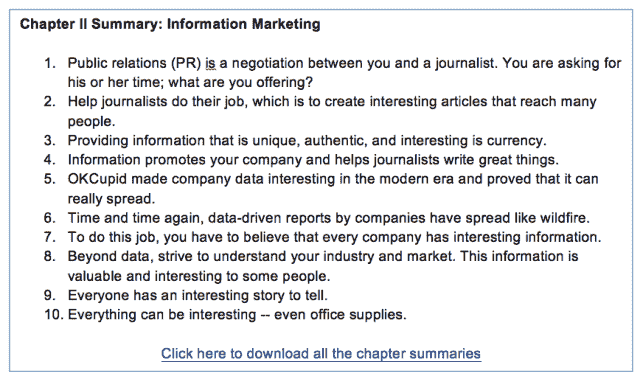

<noscript></noscript>](http://eepurl.com/bVruOT) 

**第三章:世界是平的(公平的竞争环境)**

贝宝的创始人、亿万富翁彼得·泰尔是脸书的第一位投资者，他认为最好的面试问题是，“你认为几乎没有人同意你的观点的是什么？”

我们相信:如果你写了一些好东西，不管是发表在你默默无闻的公司博客上还是纽约时报上。这两种方式都可能成功。事实上，如果你在博客上写下令人难以置信的内容，而不是让其他出版物以专栏或客座博文的形式发布，可能对你的公司更好。

在这一章中，我们将带你了解内容发布世界是如何运作的。把它当作你传播你所写的东西的剧本。如果你能做到这一点，你可能会同意我们的观点，在纽约时报上发表内容是傻瓜才会做的事情。

**今天的流量来自哪里**

30 年前，在互联网出现之前，你发布信息的方式是请求新闻记者将信息纳入他们的文章。这就是所谓的公共关系，有很多钱和关系的公司今天仍然可以这样做。

随着万维网的出现，大型网站和门户网站变得流行起来。人们会在浏览器中输入“nytimes.com”，或“slate.com”，或“yahoo.com”，然后阅读那里的任何内容。有一段时间，让你的信息传播出去的最好方法仍然是利用公共关系让这些新的大玩家写出来。但是媒体的前景正在改变。

在世纪之交，谷歌成为网络流量和客户的主要来源。为了让你的信息传播出去，你仍然可以从事昂贵的对外公关。但是，如果你聪明的话，你有一种新的方式来接触客户:通过大量生产内容，并希望人们通过搜索查询找到它。它不必真的很棒，但它必须有正确的关键字组合，以利用搜索算法。

新闻网站的首页开始看到越来越少的访问者。相反，这些大型新闻网站看到的大部分流量来自谷歌用户搜索随机文章。人们会进行谷歌搜索，链接到一个网页，简单浏览一下，然后返回谷歌，并不真正关心他们刚刚访问了哪个网站。

在当前的出版时代，社交网络正超越谷歌搜索，成为人们寻找内容的主要方式。今天，几乎每个内容网站最大的流量来源是脸书。内容必须如此特别，以至于人们会选择与他人分享:在脸书、Twitter、Reddit、Tumblr，甚至是电子邮件上。像以前一样，当有人分享一篇关于脸书的文章时，读者会点击进入，阅读文章，然后返回脸书，而不会真正关心他们访问了哪个网站。

甚至《纽约时报》的主页也奄奄一息。在该报 2014 年出版的“创新报告”中，该公司报告称，不到 1/3 的访问者直接出现在首页。其余的人通过谷歌搜索和社交网络找到随机的文章。

今天的现实是，内容出版商没有多少真正的“用户”——至少，没有几十年前，互联网出现之前，甚至是互联网出现之初的那种品牌忠诚度，每天检查一次的感觉。说到内容，拥有很多忠实用户的网站是平台:脸书、推特、谷歌搜索、Gmail。

虽然这对于像华盛顿邮报这样的传统巨头来说是个坏消息，但对于新贵或初创公司来说却不是坏消息。你和大公司在一个水平的竞技场上，因为你的内容可以在网络上用他们所依赖的同样的机制被放大。你的公司可以成为与世界上最大的传统媒体资源相媲美的信息源。

**如何爆料:广场上的价格经济学**

Priceonomics 专注于发布*信息*，而非新闻。新闻是一种保质期很短的信息形式。我们关注的“常青”内容是永久相关的。但是我们可以写一些被认为是“新闻”的东西——当我们这样做的时候，我们可以像大人物那样做。

有时候新闻就这么落到我们头上。在我们办公室的拐角处有一个三明治店，我们喜欢在那里订午餐。有一天，我们注意到他们有一个选项，你可以使用支付公司 Square 提前在线订购三明治，然后在准备好的时候去取。

这是来自 Square 的一个全新产品——三明治店正在做这个新产品的试点，因为 Square 的办公室就在熟食店的正上方。

快速的谷歌搜索显示，Square 的新服务还不为公众所知。所以，我们写了一篇简短的博文，发表在 Priceonomics 上。一开始，什么都没发生。这是一个无聊的帖子，似乎没有人关心支付处理公司的一些小新闻。

但有些人确实关心 Square 的一个小发展:许多科技记者将报道该公司作为他们报道的一部分。所以，我们再次*做了一些事情*把故事呈现在正确的人面前。在本书的前面，我们对如何分享内容含糊其辞，但是在这一章，我们将会更加具体。

为了发布这个故事，我们写了一条关于这篇文章的推文，并附加了“tip@techmeme”字样。这是什么意思？嗯，这意味着我们向科技新闻聚合网站 TechMeme 提交了一个提示，这个网站有很多科技行业记者阅读。

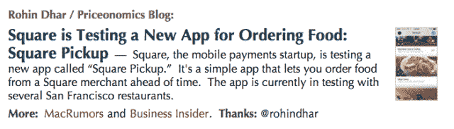

<noscript>T3】</noscript>

一名编辑看到了这条推文，认为我们关于 Square 新产品的文章对 Techmeme 的观众来说具有新闻价值，并将其发布到了网站上。从那里，科技记者发现了它，Priceonomics 被 TechCrunch、The Verge、Business Insider 和几乎所有的科技博客引用。

这个轶事并不意味着建议你应该在你的公司博客上发布新闻。我们这样做只是因为我们几乎没有花时间去写，我们很好奇会发生什么。

但是这个故事提供了两个教训。首先，你的内容是在一个公平的竞技场上竞争。你可以写点东西，发表在你的网站上，它就可以流行起来。它可以像病毒一样传播，被主流媒体引用，即使它发布在一个不知名公司的博客上。

第二，当你写东西的时候，即使你有像我们在 Priceonomics 一样数量可观的观众，你也必须做一些事情来使内容成功。那么你到底能做什么呢？

当你写内容时，你必须在头脑中有一个传播内容的渠道。发布非常有用的信息很重要，但是除非你考虑如何将这些内容分发给你心目中的观众，否则什么都不会发生。

你需要一个关于你的内容如何传播的计划，并且在你开始写作之前就已经准备好了。

**内容频道**

如果你与一家广告公司交谈，它将主要是关于脸书，互联网上内容网站的最大流量来源。广告公司的人可以为你制定一个“社交媒体”计划，但这个计划的大部分实际上都是关于脸书的。

这是*而不是*你应该思考内容的方式。

脸书是内容传播的众多渠道之一。当你开始考虑如何传播你的内容时，不要从脸书开始。虽然脸书是 Priceonomics 的第三方流量的最大来源，但来自脸书的流量是其他内容频道运作良好的一个症状，而不是我们流量的主要原因。

对于我们大多数最成功的作品，我们首先做了一些别的事情——在脸书之外做了一些使文章受欢迎的事情。直到那时，人们才开始在脸书这样的社交网站上分享它。我们写的大多数文章在脸书并不受欢迎，直到发生了许多其他事情使它们成为病毒。

在你写了一篇内容之后，你需要采取措施把它呈现在合适的观众面前。因此，在你开始写作之前，你需要对文章如何传播有一个计划。如果你不能为一篇文章想出一个计划，写一篇不同的文章。

**我们的第一个内容大满贯**

我们做的第一个非常成功的内容营销是分析 iPhones 和 Android 手机的二手销售价格。我们计算了每部手机在首次购买后的贬值速度，然后我们发布了一份关于 iPhones 比 Android 手机转售价值更高的报告。

你能猜到接下来发生了什么吗？没错:什么都没有，直到我们*做了一些事情*。

有很多博客致力于写关于苹果和手机的文章，所以我们列出了 50 个博客，并分别给每个人发了电子邮件，介绍我们的研究。我们没有任何私人关系，所以我们用电子邮件发送了他们“联系我们”页面上的通用地址。

在大约 50 封电子邮件中，我们没有收到任何回复。这并不理想。该团队集体花费了数百个小时收集数据，分析数据，并找出如何呈现数据。在付出了这么多努力之后，如果失败了，那将会极大地打击士气。

所以我们考虑可以给其他人发邮件。我们记得 TechCrunch(900 磅重的科技博客巨擘)的一名记者曾报道过我们的发布会。我们写信给他，看他是否感兴趣。以下是我们所写内容的编辑版本:

> 嗨乔希，
> 
> 希望一切都好，非常感谢你在我们一个月前推出时写下关于我们的报道！
> 
> 只是想让你知道 Priceonomics 刚刚公布了一些关于手机贬值速度的有趣数据(iPhone v Android v Blackberry)。
> 
> https://priceonomics.com/phones/#cell-phone-depreciation
> 
> 基本上，iPhone 在转售价值排名中占据主导地位。我想你可能会对这个感兴趣！
> 
> 最好的，
> 
> 洛汗

几个小时后，他的回应是:“伟大的研究，我现在正在写。”然后他问了几个关于数据的问题，并写了一篇关于我们研究的文章。几个小时后，TechCrunch 发表了一篇文章《研究:一年后 iPhone 转售价值 63%，Android 46%》，文章引用并讨论了 Priceonomics 的报告。

TechCrunch 的这篇文章引发了 GigaOM、The Atlantic、CIO.com、PCWorld、TUAW、Apple Insider、Cult of Mac、Macworld 和 ZDNet 等网站的铺天盖地的报道。一些忽略了我们的推销的网站写了关于 Priceonomics 手机研究的文章。

这篇文章获得了巨大的成功，但它几乎失败了。如果我们没有给几十个记者发电子邮件，我们所有的努力都将付之东流。

仅仅发布好的信息是不够的。你必须发起一场运动来确保合适的人发现它。50 多名记者拒绝了我们，但找到一个想写我们的研究的人使这个帖子成功了。

*******

当你开始根据你公司的信息撰写内容时，强迫自己向你想报道的人发送至少 50 封个性化的电子邮件。你给他们的邮件应该简短，只有一个目标:激起他们足够的兴趣，让他们点击链接阅读你的内容。

如果你能让他们做到这一点，那么你的电子邮件活动就成功了。如果你的内容足够好，记者们看到了，他们会写下来的。但你需要在这两个方面都得到报道:内容必须是好的，记者需要看到它。

这就是所谓的出站过程。你正在“接触”记者，看看他们是否对你的信息感兴趣。你不需要私人关系，或者昂贵的公关公司(这并不是说这些东西没有帮助，*如果*你有资源的话)；你只需要展示信息。

让一两个人写下你的信息会引发其他人写你的雪崩。这就是甜蜜点:“入境公关。”

但事实是，除非你提前投入工作，否则入站公关不会发生。当然，随着你变得越来越大，越来越成功，记者会跟随你的公司。如果发生这种情况，当你发布信息时，你不必做同样多的工作。但是你总要做*一些*工作，这样你发布的信息才有渠道传播。

我们告诉人们从给 50 多名记者发电子邮件开始，因为这要求你在写完之后非常努力地传播你的内容。喜欢制作酷的、数据驱动的内容的人可能讨厌冷冰冰地给 50 个人发邮件。但是如果你想让你的内容成功，你必须投入一些不愉快的工作。

我们告诉人们在发布报道后给记者发电子邮件的另一个原因是，我们希望你在创作内容之前*就能预料到你会对他们说什么。钩子会是什么？你将如何向别人推销它？为什么会有意思？*

获得内向媒体的秘密是做一些工作来创造它。这意味着预测你的内容将通过的渠道，然后确保它到达那里。给记者发电子邮件是一个很好的开始，但是还有很多其他的方法来传播你的内容。

**分布的超级节点**

说到内容，互联网只是一个人们寻找阅读材料和观看视频的网络。记者是网络的“超级节点”:他们收集信息，然后转发给其他人。这就是为什么给记者发电子邮件是将你的内容传达给数百万人的好方法。

你希望你的内容能被数百万人看到，但是这对你的公司来说太昂贵了。相反，*把你的努力集中在说服一小部分人上，他们是通向更多观众的大门*。那是一项更容易完成的任务。

记者是超级节点的一种形式。数百年来，他们一直是观众的看门人，所以每个人都知道他们有影响力，这就是为什么人们用成千上万的推介淹没记者的收件箱。但是记者并不是价格经济学最有效的超级节点。

目前互联网上最强大的超级节点是社交新闻网站。在这些网站上，用户——而不是记者——决定“头版”上的内容。他们给你的公司带来的流量远远超过《纽约时报》或 CNN 的报道。社交新闻网站包括像 Reddit、Digg 和 Hacker News 这样的大型网站。它们还包括中型网站，如 Metafilter、Fark、Designer News 和 Product Hunt。

大多数社交新闻网站是这样运作的:网站用户提交一篇文章给人们阅读。如果在很短的时间内，有几个人“投票”支持这篇文章，它将出现在网站的首页，通常在底部附近。许多人阅读这些网站的首页。如果你的内容很棒，会有更多的人投它的票。它将上升到排名的首位，并带动成千上万的游客到您的网站。如果你的内容一般(或者低于一般)，就会被否决，很快就会从首页掉下来。

在我们看来，这些网站是内容分发最重要的部分。它们使得如何分享优秀内容的问题变得更加可行。当你联系记者时，问题是，“我如何让那个记者写我的内容？”那是一个碰运气的提议。对于内容网站，你的问题是，“我如何让互联网上少数随机的人喜欢我的内容，这样它就会成为这些网站的首页？”他们可以是*任何*几个积极使用网站的随机人群，而不是几个特定的看门人。

这些网站的美妙之处在于它们使内容共享民主化。如果你的作品很好，吸引了足够多的读者，它会被投票通过。如果不是，就不会。您可以自己提交内容，但在提交之前，您应该是该网站的活跃用户。如果你经营一家自行车店，花点时间在 Reddit(称为 sub reddits)的自行车版块上玩玩。广泛阅读论坛，评论帖子，提交你认为其他人会喜欢的东西。

只有当你知道他们会喜欢你的内容时，才把它提交给社交新闻网站。永远不要发布纯粹自我推销的东西:你会被互联网评论者钉在十字架上。延伸一下自行车店老板的例子，你永远不会在 Reddit 上发布“来我的自行车店买东西。”纯粹的自我推销不符合社群的规范，也不会受到好评。

如果你开了一家自行车商店，你可能会有很多自行车社区的人可能会感兴趣的信息。开一家自行车店花了你多少钱？哪里赚钱？你如何找到一个自行车店的位置？你需要雇佣什么样的人？骑行行业真的能赚钱吗？

在 Priceonomics，我们曾经写过一篇文章，介绍了我们一些开了一家自行车店的朋友。我们把它发布到 Reddit 上，它非常受欢迎。这篇文章最终成为自行车商店有史以来最大的公关政变之一。为什么？因为里面有很多关于开自行车店的信息。下面是文章中关于哈克贝利自行车的一部分:

> 在第一天，当哈克贝利还是一个概念时，他们计算出如果他们积极管理成本并自己完成大量工作，他们需要 30-35 万美元才能开始。这笔钱可以让他们找到并翻新一个零售点，给他们一个初始库存的预算，雇佣第一名员工，并提供至少持续一年的缓冲。
> 
> 因为两位创始人曾是自行车店的员工，他们对成本有一个相当准确的想法。他们预计他们需要一个 2000 平方英尺的商店，租金为每月 6-8 千美元(他们只针对较便宜的社区)。翻新商店将花费大约 10 万美元(他们将自己完成大部分工作)。开始时的初始库存大约为 7.5 万美元，2.5-5 万美元将涵盖杂项费用。他们给自己留了 10 万美元作为缓冲，这样他们就可以放心地雇佣一名全职员工来管理他们的服务中心。事实证明，他们的实际支出与他们最初的预测相符(干得好！).
> 
> 创始人会投入少量初始资本，但绝大部分会得到融资。他们考虑引入额外的股权投资者，但最终决定他们寻求的资本如此之少，以至于放弃更多的公司股份是没有意义的。

这篇文章一上 Reddit，就在脸书和推特上被分享。《大西洋月刊》甚至转载了它。该书出版后，自行车行业的一些最重要的人物找到了这家小店。直到今天，人们走进商店说他们通过这篇文章发现了它们。这篇文章为什么这么受欢迎？因为它分享了哈克贝利的创始人有特殊权限获得的信息:关于开一家自行车店要花多少钱的硬数据。

分享信息的内容特别适合社交新闻网站。Reddit 和类似网站上人们的胡说八道探测器阻止了大多数公司制作的脆弱的推广博客帖子。另一方面，作为你业务副产品的信息是真实的，实际上 T2 帮助了人们。直到今天，当你搜索关于开办自行车店的信息时，我们关于这家自行车店的文章是谷歌上的首要结果。这个信息对其他人有帮助。

如果你的内容很棒，它会上升到这些新闻网站的顶端。当这种情况发生时，你会遇到一股交通洪流。

在 Priceonomics，我们称之为“撞击”当大量的人看到这篇文章时，所有可能发生的好事都会发生。一旦大约有 1000 人在同一时间看到这篇文章，这就足够了，这篇文章将会被每一个对该内容感兴趣的记者、合作伙伴或潜在客户找到。有人会通过电子邮件发给他们，他们会在脸书或推特上看到，或者你的文章会在他们搜索重要内容时出现。

内容营销分销是所有关于获得凸点。

**掌握超级节点**

这里有一个关于社交新闻网站的好消息:如果你写了很棒的内容，你有很大的机会获得奖励。

但是要做到这一点，必须先做一些其他的事情。必须有人把你的内容提交到网站上。在很短的时间内，你至少需要几票才能上头版。一旦你得到了这些选票，你的内容将会因其自身的价值而起伏。

你如何确保这一切发生？在社交新闻网站上发布自己的内容是可以的，但如果你一直在宣传自己，那就显得很糟糕。即使你真的发表了你的文章，也很难“玩弄系统”所有这些新闻网站都有算法，可以检测人们何时创建新账户来支持报道。他们还可以判断何时同一批人倾向于一起投票，并禁止这些账户成为投票圈。

所以你不能玩弄这个系统，人为地从这些网站中获得提升。除非你的作品绝对出色，否则你不可能登上 Reddit、Hacker News 或 Digg 等网站的榜首。

但是一旦你足够大，有了一些读者，所有这些事情就会开始发生在你身上。其他人开始将您的文章发布到 Reddit 随机有你不认识的人在你的文章上留下评论；拥有大量追随者的记者开始关注你公司的 Twitter 账户。创建凹凸所需的工作量会随着时间的推移而减少。如果你坚持写伟大的东西，其他人开始*做帮助你的事情*。

这就是我们如何从一个不得不为颠簸而努力的公司演变成一个开始自己发生的公司。

正如我们在第一章中提到的，当我们被 Y Combinator (YC)孵化器项目接受时，Priceonomics 就开始了。Y Combinator 除了是一家投资和指导公司之外，还运营着一个名为 Hacker News 的大型社交新闻网站，人们可以在这里提交和投票选择科技初创公司员工感兴趣的内容。运营新闻网站是 Y Combinator 自己版本的内容营销:内容和讨论吸引了对创业公司感兴趣的人，Y Combinator 希望其中一些人能适用于创业孵化计划。

这就是说，在我们开始写自己的内容之前，我们是黑客新闻社区的一部分。我们不是最活跃的评论者，但我们的公司是由 YC 资助的，我们都虔诚地阅读黑客新闻*，大概一天 20 次。所以我们很清楚什么样的材料会在那里流行，什么样的材料不合适。*

 *当我们开始在我们的博客上发布文章和报告时，我们知道我们想把它们发布给黑客新闻和电子邮件技术记者。我们意识到，我们写的内容应该是我们——作为黑客新闻的狂热读者——想要阅读的那种内容。

这是一个关键点:当我们创建我们的内容时，我们牢记它的传播渠道(黑客新闻和技术记者)。这是一个简单的计划，但我们有一个计划。

我们写的前五篇文章是:1。Aeron Chair Arbitrage 历险记(一个关于斗志昂扬的企业家的故事——美国)；2.最低可行搜索引擎优化(根据我们的经验，这是一本入门书，介绍创业公司可以做些什么来提高他们的搜索引擎排名)；3.Fixie Bike Index(定量分析人们在哪里购买固定齿轮自行车，因此哪个城市是最多潮人的家园)；4.如何在 Craigslist 上成功(一个人靠开公司扭转人生的故事)；第五点。黑客的耳机(调查编码时使用的最佳耳机)。

在我们写每一篇文章之前，我们预计它会在哪个频道上流行。前五篇帖子中的每一篇都提供了关于创办公司或技术建议的信息，或者是面向程序员的——我们知道这是那种在黑客新闻上表现良好的内容。我们的内容和频道之间有一个契合点。

在早期，Priceonomics 博客引起了人们的关注，主要是因为黑客新闻给了我们一个推动我们获得更大认可的契机。起初，我们每隔几周才发布一次博文，所以我们自己提交内容。由于我们当时在 Y Combinator 项目中，当我们的帖子出现在《黑客新闻》上时，人们注意到了我们，这帮助我们获得了上头版的那几票。当内容优秀的时候，我们的博客帖子飙升到顶部。如果不是这样，我们的博客帖子很快就从首页掉下来了。我们的大部分内容都很棒，因为我们花了很多时间来制作。

点击这些社交新闻网站的顶部是一个比记者在一篇文章中链接更大的流量事件。为什么？假设 TechCrunch 上的一篇文章被浏览了 5 万次。只有很少一部分看到文章的人会点击你的链接(根据我们的经验大约是 1%)，所以你只有 500 人访问你的网站。如果你写了一篇登上社交新闻网站榜首的文章，你就能让 5 万人直接访问你的网站。流量增加了 100 倍。

当我们开始发布时，我们每 2-3 周写一次新东西。这种情况很少发生，所以我们可以毫无顾忌地在《黑客新闻》上发表自己的文章。但最终我们更加专注于我们的写作，聘请全职作家，每天发表文章，并停止在 Hacker News 和 Reddit 等网站上发布内容。当你频繁地发布内容时，你不能冒险提交你所有的内容给这些论坛发垃圾邮件。我们不想成为对适当的提交礼仪没有任何自我意识的无知的营销人员。

当我们停止向社交新闻网站提交自己的帖子时，我们的流量下降了。我们会写一些伟大的东西，然后…什么也不会发生。过去，当什么都没发生时，我们会做些事情。我们最喜欢*做*到*做*的事情之一是向社交新闻网站提交文章。但是我们已经取消了这个选项。

然后，渐渐地，互联网上的其他人，我们不认识的人，开始为我们做事情。通过电子邮件、Twitter 或脸书订阅我们博客的人会阅读我们的文章，然后自行提交到社交新闻网站。最终，我们从 Reddit、Digg 和 Hacker News 等超级节点网站获得了更多流量，因为其他人在那里分享了我们的工作。记者们开始跟踪我们，我们收到了在大西洋、Gizmodo、Lifehacker 和 Business Insider 等网站上重新发布我们内容的请求。

在电影《蠢蛋》中，有一个场景是主角(一个可爱的白痴，由史蒂夫·马丁扮演)匆忙查看最新版本的白页电话簿。当他在书中找到自己时，他大声说道:“我出版了！现在，事情开始在我身上发生了。”

事情开始发生在我们身上。当我们在互联网上发布我们的内容时，在数百万做同样事情的人当中，我们开始脱颖而出。我们的公关流程以前是“外向”的，包括联系记者或在新闻网站上发布文章，现在变成了“内向”

我们产生了高质量的信息，事情开始发生在我们身上。我们的粉丝把它提交给了社交新闻网站，记者们自己找到了它，内容开始在谷歌搜索结果中排名很高。

我们很高兴能走到今天。我们仍然没有达到可以创造大量流量的垃圾内容的阶段。(有很多媒体公司都这么做，但我们希望这很快就不可能了。)但是，如果我们把某样东西变好了，好事就会发生。

但还是要考虑渠道。

甚至在今天，当我们写一篇文章时，我们会问这样一个问题，这篇文章会在哪里流行？这是一个比早期更广泛的对话。它不再是:“这些个人作家可能会涵盖它。”取而代之的是:“哦，我可以看到 Digg 喜欢它，”或者，“这种高度技术化的作品非常适合 Reddit 上的 r/编程！”如果你在写一些东西，但不知道它会在哪里流行，这绝不是一个好兆头。仅仅“好”是不够的。你的文章既要“好”，又要适合特定的频道。

现在制作哑弹(一段没人看的内容)很少发生在我们身上，这真是太好了。什么时候发生？当我们写的东西真的很好，却没有考虑它会在哪个频道传播。当我们忘记了这一点，我们就没有给我们的内容一个成功的机会。

关于我们已经说得够多了。你应该把你公司的内容发布到我们称之为超级节点的社交新闻网站上吗？

是的——至少在开始的时候。但你需要作为社区成员参与新闻网站一段时间，然后才能使用自己的内容。了解人们喜欢的内容以及发布这些内容的规范。如果版主一直删除你的内容，找出原因。

可能不是很好，或者不适合那个特定的频道。也许你需要为你的工作寻找新的论坛，或者改变你正在写的内容。或者，如果你像我们一样，开始创造大量的内容，最终你可以停止到处传播你的文章，其他人会为你这样做。但这一地位是通过持续创造人们如此喜爱以至于愿意与其他人分享的内容而获得的。不要试图玩弄系统，因为你不能。

如果你写的是信息，你会发现有很多地方可以接受你的内容。这是少数几种可以在超级节点网站上发布的营销形式之一。为什么？因为信息是有价值的。如果它以一种不偏不倚的方式呈现，对公司来说分享它是有用的。

***

在这一章中，我们认为在纽约时报发表一篇文章和在你公司的博客上发表一篇文章之间的差别越来越小。

这是一个媒体公开的秘密，每个人几乎所有的流量都依赖于第三方——主要是脸书。你可以访问这些相同的流量来源。

《纽约时报》的一篇文章依赖于人们的分享，就像你博客上的一篇文章一样。这是一个公平的竞争环境。如果你写了一些伟大的东西，并预期它将传播到哪里，你可以接触到数百万人。

[**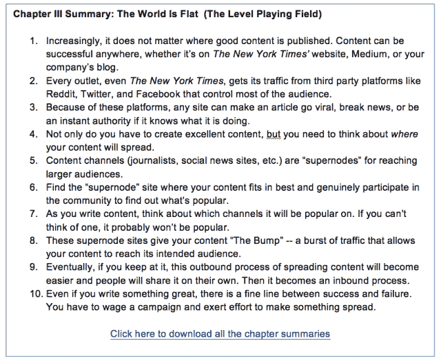

<noscript></noscript>**](http://eepurl.com/bVruOT) 

第四章:社交网络

在上一章中，我们提出了一个论点，即你公司的内容可以和媒体公司创造的内容一样成功。我们不是在开玩笑:在 Priceonomics(一个大多数人从未听说过的公司博客)发表的平均博客文章有大约 25000 次浏览。这比大多数名牌媒体公司都要高。每个内容网站都从大平台获得流量:Buzzfeed 是，纽约时报是，我们是，你也可以。

这一章是关于社交网络的，但主要是关于脸书，这是大多数内容博客的最大流量来源。2014 年，有 180 万来自脸书的游客访问了 Priceonomics。Twitter 以少 10 倍的流量排在第二位(这并不是说 Twitter 不重要，我们将在后面讨论)。LinkedIn、Google+和 Tumblr 在 Priceonomics 的社交流量中所占的份额都不到 1%。

到目前为止，脸书是 Priceonomics 最大的第三方流量来源，但我们认为它对我们的成功没有我们在上一章讨论的超级节点——特别是社交新闻网站——重要。为什么？只有在足够多的人看过之后，事情才会在脸书疯传。对于病毒式传播来说，这是必要的一步，但还不够。仅仅因为脸书，内容几乎不会“病毒式”传播:大量的人需要首先接触到它。

所以，如果肿块是病毒传播的必要条件，为什么要关注脸书呢？

**幂律适用于一切，包括内容**

当早期风险投资者考虑他们的回报时，他们通常会想到一种叫做“权力法则”的东西:如果你投资于早期公司，你的基金的大部分回报将由你资助的一两家超级成功的公司主导。如果你投资 50 家早期创业公司，其中 49 家可能会失败，如果第 50 家公司成为下一个谷歌，你仍然会赚很多钱。

就像风险投资一样，内容营销也是一项由点击量驱动的业务。2014 年，Priceonomics 写了 319 篇文章。其中，10 个网站占据了我们超过 50%的流量。那些是我们的热门。对于点击率来说，压倒性的流量来源于在脸书的疯狂传播。

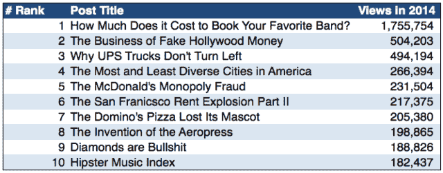

<noscript>T3】</noscript>

如果你的目标达成了，脸书是非常重要的。如果你想要来自脸书的流量，你必须把它当成一个进入自身的渠道。它有自己的一套动力，围绕着一个特殊的问题:“为什么人们要分享？”

脸书是新的电视

在前几代人，父母哄孩子睡觉后，他们会爬上床，打开电视，进入状态。在这位作者的家里，我们为卧室里没有电视而自豪。相反，我们拿起手机，检查人们在脸书上发布了什么内容。一天晚上，我们意识到睡前我们平均花了一个小时在社交媒体上。电话已经取代了电视机，而脸书是告诉你该消费什么内容的频道指南。

虽然过去你可能不会在工作时间看电视，但现在你可能会花一些时间在网上点击文章链接，阅读人们在工作时间在社交网络上分享的内容。Buzzfeed 是一个覆盖数亿人、每月产生数十亿视频浏览量的网站，它建立的前提是覆盖 [那些](http://sara-weber.com/post/77404854237/buzzfeed-founder-jonah-peretti-about-being-bored) “工作无聊”的人

在 Priceonomics，我们绝大多数的流量都来自工作时间的人们。尤其是来自脸书的流量，值得注意的是，大部分是移动流量。

自从脸书作为哈佛学生的在线目录成立以来，它已经发生了很大的变化。在它存在的大部分时间里，它是一个年轻人与他们认识的人分享生活信息的地方。今天，个人内容构成了典型的脸书新闻的一小部分。文字内容、图片和视频的链接更常见。

为什么要转变？脸书的全部动机可以从 [中解读出来，这是该公司首席运营官雪莉·桑德伯格 2011 年引用](http://robhof.com/2011/04/20/1014/) 的话:

> “[脸书是]需求的一代。当你已经想好要买什么的时候，我们并不是真正的需求满足，这就是搜索。我们是需求生成，在你知道你想要什么之前，在你知道你对什么感兴趣之前。”

如今，绝大多数“创造需求”的广告都花在了电视上。为了赢得部分市场份额，脸书必须提供与电视相同的功能:它必须开发一种产品，让人们花费大量时间消费媒体内容(和个人内容)，并在产品旁边插入丰富的广告。

当桑德伯格在 2011 年说这话时，按照收入标准，脸书是一家小公司，许多人怀疑它是否能赚钱。但是脸书实际上完成了桑德伯格暗示的事情:该公司成为了一家专注于创造需求的广告巨头，就像电视广告的运作方式一样。

这让我们得以一窥脸书的动机，它现在就像新电视一样运作。内容在网站上共享，公司的算法决定显示什么，脸书提供广告。一个区别是，有线电视公司必须为电视节目和其他节目付费，而脸书免费获得内容。

另一个不同之处是:在广播电视领域，有线电视公司决定电视播放什么节目。在“脸书电视”世界中，广播是基于用户行为自动进行的。分享东西的人越多，脸书的算法显示出来的可能性就越大。

在这个社交内容分发的新世界，任何人都可以成为明星。你只需要制作人们愿意分享的内容。当你发布一些东西时，问自己这样一个问题:考虑到脸书的目标是成为与电视相媲美的优质内容中心，这是它长期以来希望在其平台上出现的内容吗？

**人为什么要分享？**

如果我们给你两个关于如何在现代世界进行内容营销的案例研究，第一个，我们已经提到过，是 OkCupid 博客。第二个是燕麦片。

由漫画家马修·因曼于 2009 年创立的燕麦片——基本上是一个漫画和喜剧写作博客——并不是大多数企业应该遵循的范式。但这是一个很好的例子，说明一个网站(a)理解人们为什么分享，以及(b)将商业项目与内容无缝捆绑。

凭借数百万脸书粉丝和推特粉丝，燕麦片已经积累了庞大的追随者。但是燕麦片的特别之处在于，当因曼创造了一些东西，人们——不管是不是追随者——真的会分享它。

他最受欢迎的漫画每幅都有超过一百万个脸书喜欢。当他写了一幅漫画，请求特斯拉汽车公司的创始人埃隆·马斯克(Elon Musk)捐赠数百万美元，资助一个关于发明家尼古拉·特斯拉(Nicola Tesla)的博物馆时，这幅漫画迅速走红。埃隆·马斯克真的捐了钱。

马修·因曼是一位出色的漫画家。但他不是那种天真的艺术家，他认为，“如果我做出好的漫画，人们就会来我的网站。”他制作好的卡通片*和*他考虑人们分享它们的分发机制。最初，他开始制作漫画是为了搜索引擎优化的目的——具体来说，是为了给一个约会网站 Mingle2 生成链接。这让他开始探索为什么人们会分享内容。后来，他在会议上发表演讲，讲述他如何想出人们能够认同并愿意分享的想法。他思考*为什么*人们会想要分享他发表的东西。

我们在社交网络上分享的是自我表达的一种形式。当我们分享某样东西时，重要的是它让我们感觉如何。当我们去度假时，我们会分享隐藏我们第二下巴的自己的照片，以及我们玩得开心的照片。我们还分享反映我们希望被人如何看待的媒体和内容。更重要的是，我们经常分享我们有反应的事情:*我在网上看到一些东西，现在我感到厌恶。或者惊讶。或者敬畏。或者聪明。*

在讨论人们为什么分享东西时，首先要考虑的问题是:“读者*通过分享这个来表达*什么？”

第二个问题是:“考虑到自己的认知限制，读者能分享这一点吗？”

思考第二个问题的一个更实际的方法是询问这段内容是否可以用一句话来概括(例如一条推文)。从认知上来说，有人能阅读你的内容，然后想出一些有趣的东西来谈论它吗？更多的时候，你读完一件东西后，就无话可说了。如果是这样，你就不会分享了。

我们发表过的最受欢迎的数据报告之一是对旧金山每个社区的公寓租金的分析。我们编写了网络爬虫程序来检查公寓网站，看看房东对公寓的收费是多少，分析数据，并整理出一份价格报告。我们称第一份报告为“旧金山房租爆炸”

它像野火一样蔓延，获得了超过 29，000 次脸书分享和 300，000 次浏览。对我们的数据服务业务来说，这是一个不错的广告！

我们知道这份报告很有可能会像病毒一样传播开来，因为在我们开始收集数据之前，我们考虑过:(1)一个人通过分享这份报告表达了什么？，以及(2)他们对此能说些什么？

人们出于各种原因分享了这篇文章。一般人会说“旧金山的房租价格太荒谬了！”或者是对城市高生活成本的愤怒的其他表现。愤怒中也隐藏着一些骄傲。分享这篇文章是一种巧妙的表达方式，“我找到了在世界上最昂贵的城市生活的方法。”其他人分享了这篇文章，以表达对他们拥有的租金控制公寓的感谢，或者对该市租金控制的定价效率低下进行抨击。

不管人们的动机是什么，这些数据，以及我们是如何呈现的，都允许读者通过分享文章来表达他们的感受。此外，我们写这篇文章是为了让读者有话可说。虽然它是数百万个数据点和数周分析的产物，但有人可以看着它，用简单的话来说，“哇，旧金山的房租涨了很多。”除非有人可以轻松地将一篇文章消化成可分享的金块，否则这篇文章不会被分享，无论它有多棒。

有时我们会忘记这一课。我们有史以来最好的两篇文章，一篇是关于数字货币比特币的入门，另一篇是关于一名荷兰艺术品伪造者的简介，都获得了大奖。但是它们并没有在脸书和推特上被广泛分享。

两篇文章都很优秀，但人们在读完这些文章后，除了“这是一篇好文章”之外，没有什么可说的通常情况下，人们需要一些东西来专心致志——一些他们浓缩成一个简短摘要来在社交媒体上分享的东西。

一次又一次的失败让我们心碎，这让我们学会了问这样一个问题:“为什么有人会分享这个？”在开始写作之前。很多时候，我们无法找到答案，所以我们会不断完善这个想法，直到找到答案。

它会在脸书上演吗？

我们不是说你应该创造内容*只是*，因为你认为它会在脸书病毒式传播。历史上充斥着制作游戏内容来玩脸书算法并获得点击的公司。最终，当脸书变聪明并改变它的算法时，他们什么都没有了。此外，如果您为营销目的创建内容，您希望发布的内容能够吸引真正对您公司的信息感兴趣的人。不要试图用“9 只完全热爱企业软件的猫”这样的文章来欺骗人们访问你的网站

但是问这个问题“有人会分享这个吗？”应该会帮助你将你的*好的*内容转化为*可分享的*内容，有时是以非常简单但非常真实的方式。

让我们做一个小测验。你认为这两张图片哪个会得到更多的份额？

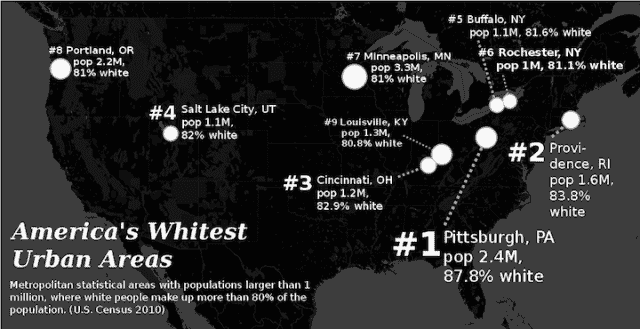

<noscript>T3】</noscript>

或者

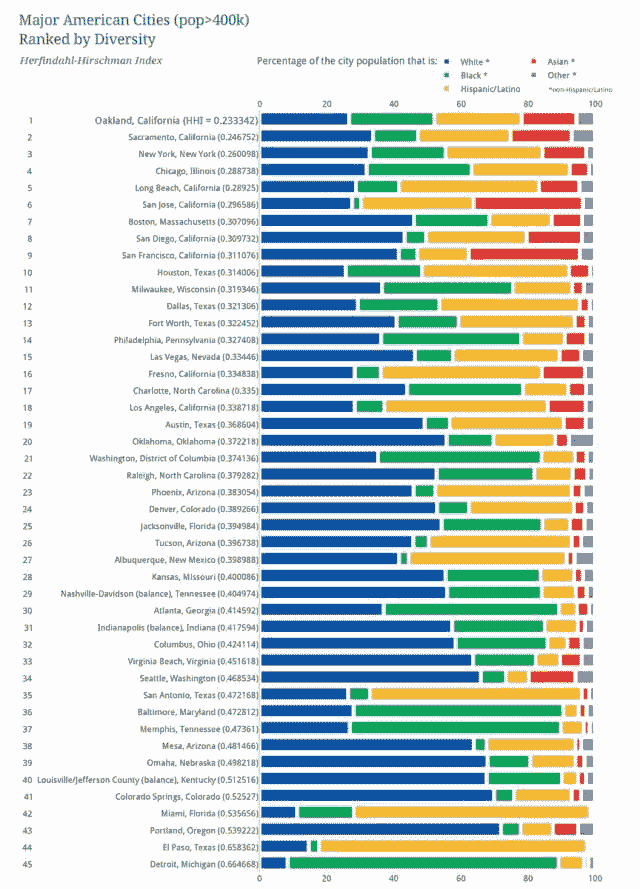

<noscript>T3】</noscript>

好吧，你想好答案了吗？答案是，第二张图——列出美国最多样化城市的图表——肯定会获得更多份额。虽然地图看起来更酷，需要更多的工作，但它不会那么成功。

为什么榜单更好？让我们用我们的框架 1。)读者分享这个表达了什么，2。)他们对此能说什么呢？

这张地图很酷。读者会分享是因为看起来很工整，想通了觉得自己很聪明。但除了“美国有些地方比其他地方更多样化”之外，他还能说什么呢？这不是一个非常有趣的观点，而且大多数人也不太可能花时间在脸书的评论中阐述这一点。也许住在那 10 个城市的人会分享，但即使这样，谁愿意说自己住在美国最白的城市之一呢？

另一方面，这张图表是很多人觉得值得分享的东西。谁啊。住在萨克拉门托的人呢？没有人真正认为这座城市在任何方面都是最好的，但它在一项重要指标上排名第一。潜在地，任何居住在这个列表顶端的城市的人都会分享它。顺便说一下，这张图表在我们的网站上有超过 15，000 次脸书分享和 280，000 次浏览。

排名表更好，因为它给了人们一些简单而有见地的说法:“我不敢相信底特律的多样性如此之低”，或者“我知道你们这些人不认为长滩很酷，但实际上，我们很酷。”名单上还有数十亿个城市，所以你有机会和来自许多城市的人分享它。最后，如果人们分享“美国的白人城市”，他们可以分享一个关于多样性的排名，而不会有看起来像白人至上主义者的风险。

如果你想让你的内容被看到，光写好东西是不够的。写好的东西有一个渠道让他们获得提升也是不够的。为了增加流量，你必须写出好的东西，有一个渠道让他们得到提升，*和*阅读它的人必须有一个分享它的理由。

Twitter 重要吗？

是的，Twitter 很重要。但是为什么这很重要有点复杂。

如果你看看 Priceonomics 的分析数据，Twitter 似乎并不特别有价值:2014 年，脸书向 Priceonomics 发送的流量大约是 Twitter 的 10 倍。此外，Twitter 仅占我们全年流量的极小一部分。如果它消失了，也不会真正改变我们的统计数据。

然而，推特非常重要。

Priceonomics 的作者都沉迷于查看 Twitter，尽管脸书发送了更多的流量。脸书上的大部分分享都是私人的，所以几乎不可能了解你在那里工作的情况。但是推特是一个公共信息系统。当你发布内容时，Twitter 会让人上瘾，因为你可以看到人们——包括记者和其他有影响力的人——对你的文章的评论。

如果你的目标是让媒体报道你的数据，你会发现 Twitter 比脸书更重要。对于记者来说，Twitter *就是*社交媒体。因此，如果你要制作我们在本书中讨论的信息丰富的内容，那么仅仅制作优秀的内容是不够的。通过超级节点传播是不够的。让它在脸书共享还不够。重要的是，它也在 Twitter 上传播。

Google Plus 重要吗？不，不是的！Tumblr、Instagram、Youtube 和 Pinterest 等其他平台对某些类型的内容也很重要。我们 4000 字的长篇分析对这些媒介不起作用。如果你正在制作简短的信息图表，或者漂亮的图片，或者视频内容，这些媒介确实很重要。但这些形式的内容并不是 Priceonomics 的专长，所以我们在这里不会重点讨论它们。

***

制作让很多人都能接触到的优秀内容并不容易。如果你写的是信息，并用它来推广你的业务，那就更是如此。但这是可能的，我们经常这样做。

如果你写了很棒的内容，一定要让它得到提升。如果你想让它真正起飞，它需要在社交媒体上传播。

这就是内容分发的工作方式。

*******

关于写作，有一个重要的教训被埋没在关于分配的讨论中。如果你写了一篇好文章，而你的读者在通读之后，不能提出一个精辟的、可分享的观点，那么你真的写了好东西吗？最有可能的是，你的文章不能被分享的原因是它不是很好。你的文章可能很美，你的信息很有趣，但这还不够。不清楚、组织不良的写作是糟糕的写作。

人类的注意力持续时间很短，尤其是在互联网上。你需要马上抓住他们的注意力，写清楚，并遵循一个有组织的结构。你的文章应该有一个*点*，你必须把那个点锤回家。

[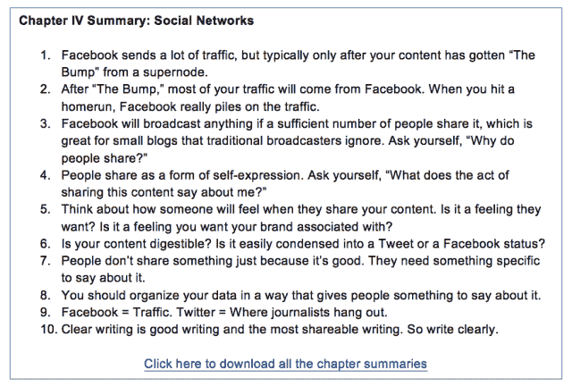

<noscript></noscript>](http://eepurl.com/bVruOT) 

第五章:作家的剧本

网络观众是注意力分散的观众。你的大多数读者都在网上冲浪，而不是在工作。所以马上，他们的工作会分散他们对你内容的注意力。(或者他们可能被你的内容分散了注意力。)

互联网本身也是一个嘈杂的环境。过去，只有精英媒体渠道，如《纽约客》的*和《经济学人》的*的*才能做出好的内容。现在，每个人都是！天底下有令人难以置信的长格式内容、短格式内容、视频、播客、列表和其他一切。也有很多废话。所有这些在线内容都在争夺人们的注意力。*

**有力的介绍**

每篇文章的开头都要打读者的脸。显然不是字面上的意思，但你需要抓住他或她的注意力。假设一个读者偶然发现了你的文章，并且马上就要关闭或者永远埋葬这个标签。介绍是你向他们推销为什么他们应该阅读它的机会。

大多数内容的生死取决于它的介绍。这是我们为一篇名为《钻石都是扯淡》的文章写的最好的介绍之一，这篇文章是关于钻石订婚戒指的经济学:

> 美国男性通过一个特殊的成年仪式进入成年:他们把大部分积蓄花在一块闪亮的石头上。他们可以把钱投资到资产上，这些资产会随着时间的推移而复利，有朝一日会提供一笔储蓄。相反，他们用这笔钱换了一枚钻石戒指，这根本算不上什么资产。一旦你带着一颗钻石离开珠宝商，它就会贬值 50%以上。
> 
> 美国人交换钻戒是订婚过程的一部分，因为在 1938 年，戴比尔斯公司决定他们希望我们这样做。在 1938 年惊人成功的营销活动之前，美国人偶尔会交换订婚戒指，但这并不是普遍现象。对钻石的需求不仅是一种营销发明，而且钻石实际上并不那么稀有。德比尔斯公司只是小心翼翼地限制供应，才保持了钻石的高价。
> 
> 无数美国人会证明，提供一枚订婚钻戒的社会义务既紧张又昂贵。但问题是——这种义务之所以存在，只是因为有望从中获利的公司希望它存在。
> 
> 因此，这里有一个适度的建议:让我们同意钻石是扯淡，拒绝他们在婚姻过程中的作用。让我们承认，作为一个社会，我们被欺骗了大约一个世纪，对闪闪发光的碳碎片垂涎三尺，但现在是时候结束这些废话了。

这篇文章被浏览了 70 多万次，被分享了近 15 万次。为什么说是很棒的介绍？因为它有效地证明了读者应该花更多的时间阅读文章。

首先，它以一个有趣的句子开始:*“美国男性通过一个奇特的成年仪式进入成年:他们把大部分积蓄花在一块闪亮的石头上。”*这是众所周知的“射穿弓”，表明这将是一篇批评钻石行业的文章。

其次，它让读者对文章的走向有所了解。我们的介绍总是电报文章是关于什么的，这样读者就知道如果他们在这篇文章上花些时间，他们会学到一些有趣的东西。在这种情况下，他们将了解到交换订婚钻戒是一种营销发明，以及它是如何发生的历史。

第三，介绍激起了他们的兴趣。它激发了好奇心。这种社会洗脑是如何发生的？

引言是文章最重要的部分。没有一个伟大的，没有人会看你的文章。文章的第二个重要部分是结论。

结论很重要，因为它提醒读者她应该从文章中得到什么。它提供了银盘上可分享的金块信息，这将是脸书或鸡尾酒会上的热门话题。结论是提醒读者她刚刚学到的信息以及它为什么重要的时候。这是钻石文章的结论:

> 我们觊觎美国的钻石，原因很简单:从钻石销售中获利的公司认为我们应该这样做。戴比尔斯公司的营销活动单枪匹马地使钻石戒指成为衡量一个人在美国成功的标准。尽管它完全缺乏内在价值，该公司制造了一个钻石图像作为地位的象征。尽管发现了大量新的钻石，但为了保持钻石的高价，德比尔斯实施了 20 世纪最有效的垄断。好吧，我们明白了德比尔斯，你们真的很会做生意！
> 
> 这篇文章的目的是指出钻石订婚戒指是一个谎言——它们是麦迪逊大道和戴比尔斯的发明。这篇文章完全掩盖了我们因相信这个谎言而造成的巨大人类痛苦:冲突钻石资助战争，用我们的钱支持种族隔离几十年，掠夺地球寻找闪亮的碳。既然我们谈到了这个话题，为什么女人需要被邀请并赠送戒指才能结婚呢？为什么他们不能提问并做陈述？
> 
> 钻石其实并不稀缺，做一个可怕的投资，纯粹作为身份象征的价值。
> 
> 钻石，说得委婉点，就是扯淡。

这个结论不仅重新包装了这篇文章，让读者能够记住它的内容，而且让读者知道他应该分享什么——在这种情况下，这是“钻石是狗屎”这句话的变体这篇文章是互联网历史上关于钻石的最受欢迎的文章之一，这不是偶然的。这篇文章为可分享性进行了优化，结论强调了可分享的信息。

文章的引言很重要，结论也很重要。文章的主题句同样重要。在编辑我们的作品时，有时我们只是阅读引言、结论和每一个主题句。文章应该独立于这些部分。

为什么？因为这模仿了人们浏览文章的方式，你必须假设人们正在浏览你的内容。记住，他们是在工作——而不是慢慢地阅读你关于公司数据的博客文章，就好像这是他们最喜欢的作者写的小说一样。

此外，对主题句的关注提高了你的写作。它可以防止你在一个长段落的中间隐藏重点。如果你想表达一个重要的观点，你需要把它放在段落的前面，以增加读者真正阅读句子的可能性。

这些是在互联网上清晰写作的经济学规则。重点放在引言、结论和主题句上。你的文章不仅会变得更加清晰，而且会提高人们真正阅读、理解和分享你的内容的可能性。

**语气&观点**

你写作的语气应该是对话式的——读起来应该像是说出来的。我们在学校写的文章与你应该为互联网写的文章截然相反。一种正式的学术语气读起来既无聊又让你的读者难以理解，这是对你的伤害。这并不是说你不应该听起来很聪明；相反，你应该听出一个聪明人是如何说话的。

另一个要考虑的因素是文章的观点:它是谁写的？在 Priceonomics，我们禁止在博客中使用“我”这个词。我们写每一篇文章，就好像是实体 Priceonomics 写的一样。因此，当我们提到自己时，总是用“我们”我们只在文章末尾加了署名。在那之前，读者应该想，“我正在读一篇 Priceonomics 的文章。”

除了不指明文章作者的《经济学人》杂志之外，很少有网站采用这种惯例。我们开始以这种方式写作，因为最初只有一个人在我们的博客上写作，但许多人的工作创造了产生我们数据的基础设施。

“没有第一人称”的观点有它的好处。第一，我们从不发表意见，因为“我认为”这几个字被放逐了。当你不能陈述你的观点时，你必须用事实来证明你的观点。这个看似武断的不使用“我”这个词的决定迫使我们做更多的研究来说明一个观点。

因为我们的文章是从 Priceonomics 公司的角度，而不是从一个叫 Zack、Rosie 或 Alex 的个人的角度，很少有网络流氓会花时间在我们的网站上。网络巨魔，或者那些说刻薄话只是为了刻薄的人，需要另一个人来巨魔。对于一个恶霸来说，拖住一家名为 Priceonomics 的数据公司，或者一本名为 *The Economist* 的出版物，远不如对一个人发起卑鄙的人身攻击令人满意。

最后，由于每篇文章都是从 Priceonomics 的角度撰写的，所以每一位 Priceonomics 手里都握着我们公司的好名声和品牌。他们对此非常重视。“价格经济学”永远不会失去理性，不会犯草率的错误，不会刻薄，也不会断章取义地提出廉价观点。这不是“价格经济学”会做的事情。如果你团队中的人认为你的观点和声誉神圣不可侵犯，这有助于你产生高质量的工作。如果你团队中的人发布的东西会危及你公司的声誉(通过煽动性或低质量的工作)，那么内容营销可能不适合你。

我们使用“我们”而不是“我”的观点是经济学文化的一部分。我们并不是说你应该这样做，但它帮助我们从文章中剥离观点，用事实建立案例，并专注于正确。

**正确很重要**

每次你在网上发表一些东西，就会有一千个人试图证明你是错的。只有当你足够幸运，有很多人看到它的时候。如果你发表一些涉及数据的东西，你做出的每一个假设都会受到挑战，每一个计算都会被仔细检查，许多人会不厌其烦地仔细检查你的结论。

最可怕的是，在你刚刚发表的东西上，你不太可能是世界领先的专家。如果你的报告很受欢迎，真正的专家可能会阅读它。那样的话，你最好是对的。

对我们来说，犯错的后果将是灾难性的，尤其是当我们发布涉及网络数据的报告时。我们偶尔会犯一些打字错误和小错误。但是我们不能因为弄乱了数据，做了不好的研究，或者曲解了什么，就得出错误的结论。我们的业务是获取人员数据，并为客户准确分析这些数据。我们的一些客户是对冲基金，他们根据我们的数据交易数亿美元。还有一些是科技公司，他们将我们的数据作为业务的一部分。

所以我们没有错是非常重要的。Priceonomics 博客只有三条准则:1。)给世界带来新的信息 2。)要有趣，还有 3。)对。这些要点都没有商量的余地，但是如果我们写了一些结果并不有趣的东西，或者如果我们写了很多人已经知道的信息，那也没关系。但是如果我们写了一些实质上错误的东西，那就太糟糕了。到目前为止，这还没有发生，但我们生活在恐惧中，担心有一天会在某些事情上犯下大错。

有一个最小化你犯灾难性错误的机会的秘密:保持你的争论范围狭窄。在每篇文章中，我们都试图提出一个真正好的观点，并确保我们在这一点上是正确的。如果我们写的是旧金山的房租价格，我们不会同时谈论租金控制、科技行业的影响或市政府的分区法规。我们只关注一件事:价格的变化。

当你只考虑一件事的时候，就更容易正确。您可以“检查”结论是否有意义。当你写博客的时候，把它当成你和所有想反驳你结论的人之间的一场战争。不要打多战线战争；相反，选择一场你会赢的战斗，因为你非常了解它，并且你已经检查了你的工作。

采用这种方法有助于《价格经济学》撰写有争议的话题，并且仍然正确。在一篇文章中，我们问“精英大学歧视亚裔吗？”这是一个爆炸性的话题，你应该避免这样的话题，除非你像我们一样疯狂。

我们将这篇文章简化为一个更为狭窄的论点:**一些亚裔学生认为他们受到了歧视；公开可用的证据非常有限，但证实了这一观点；大学并不总是对少数民族很友好，他们通过不透明的招生标准来保持他们的招生黑箱。**

 *我们界定我们论点的方式实际上相当无懈可击:现有的数据表明亚洲人面临歧视。我们必须非常小心地调查当前公开的数据。也许大学没有歧视亚裔，但如果没有，他们也没有公布任何免责数据。

“数据表明存在歧视”和“确实存在歧视”之间有着重要的区别。前者引发了一场关于何种数据可用以及如何解释这些数据的民间对话。后者引发了一场关于歧视是否存在、是否合理的辩论，以及各种你不想有的争论。你使用的语言很重要，因为它限制了你试图证明的东西的范围。注意你选择的词语。

**编辑流程**

创作内容不完全是团队的努力。长篇的、信息驱动的文章需要个人提供的火花。你不能在委员会会议上做。你需要想出点子，研究它们，写下它们，然后重构产品，直到它变好。写作通常是一项孤独的活动。

但是发表一些危及公司声誉的东西是一项团队活动。作家需要反馈。他们需要有人来验证他们的假设。他们需要有人来确保文章是好的。他们需要编辑。

当我们创建这一流程时，Priceonomics 没有人了解“真正的”记者如何与编辑合作。相反，我们制定了自己的流程。偶尔，我们会与为我们的博客撰写文章的“真正的”记者合作，他们告诉我们，我们的编辑流程至少和国家媒体一样严格。我们的过程是业余的，但我们关心我们发布的内容，所以它是严谨的。

每周五，我们举行内容会议来讨论我们的想法。我们的一些想法是针对简短的博客帖子的；其他的是雄心勃勃的长篇论文；有些是为了更宏大的数据报告。在我们同意一个主题是一个好主意之后，那个作者继续她的想法，有时和一个会帮助得到数据的工程师一起。作家每周都要发表一两篇短文和一篇雄心勃勃的文章，这是他或她的全职工作。

对于一篇给定的文章，大部分的写作经历都是一个孤独的过程:进行采访，收集二手研究，写提纲，写初稿，反复写，直到他准备好与他人分享。

然后，这个故事被分享给“编辑”，那个将初稿撕成碎片的人。初稿从来都不好。编辑需要帮助改进文章的组织，提供使文章清晰的建议，最重要的是，积极地质疑文章中的所有内容是否正确。

价格经济学的编辑过程相当残酷，但它把草稿变成了事实上准确的伟大文章。在我们的博客上，我们曾经“伪造编辑”了一篇著名的错误的《新闻周刊》文章，这篇文章声称已经确认了比特币创造者的身份，这位创造者选择了匿名。事实上，这位记者并没有发现比特币的神秘发明者，这篇文章也不可能通过 Priceonomics 的编辑程序。以下是我们编辑片段的方式:

> **《新闻周刊》** : *【他】有着几周没睡觉的人的千里凝视*
> 
> Priceonomics 编辑:我们似乎不太可能知道他是否在睡觉。切，哪怕这只是个比喻。
> 
> 新闻周刊 : *这看起来很可笑，这个发明了比特币的人……会隐居在洛杉矶的圣盖博山麓，躲在家里，不动他估计价值 4 亿美元的比特币财富。*
> 
> 同样令人难以置信的是，我敲中本聪的门时，他的第一反应是报警。
> 
> **Priceonomics 编辑**:假等价？这并不是同样难以置信。如果我不认识的人出现在我偏僻的家里问问题，我会报警。
> 
> **新闻周刊** : *默认了自己在比特币项目中的角色，他低头盯着路面，断然拒绝回答问题。*
> 
> **Priceonomics 编辑**:切这个。这在逻辑上是一个相当大的飞跃。你怎么知道他在“默认”承认什么，因为他在看着地面？

当《新闻周刊》发表这篇文章时，互联网评论者和其他媒体很快揭穿了它的说法。但是如果一名编辑要求每一项声明都有证据的话,*新闻周刊*绝不会发表它。

Priceonomics 编辑最有价值的作用是评估草稿中的每一句话，看它是否有意义。这符合逻辑吗？它是在做一个可以用数据证明的断言，还是通过其他来源？编辑通过对组织和用词的建议使文章更有趣，但他或她最重要的工作是确保作者不会发表不正确的东西。

编辑对作者的草稿持反对意见后，作者实施修改，使文章变得伟大。不容易，但是经过一轮苛刻的反馈，第二稿通常还是挺好的。编辑又看了一眼，签字同意这篇文章可以发表了。

然后进行拷贝编辑和最后润色。我们修复错别字，在文章中插入图片(注意这些图片是开源的，或者我们已经付费或要求使用它们的权利)，整理图表和数据可视化。另一个人用一种全新的眼光来看这篇文章，以确保它是好的。

然后，我们将文章上传到内容管理系统中。我们最初在 Tumblr 上托管博客，但后来我们在我们的内部管理系统中建立了一个定制的 CMS。任何东西都适合发布——WordPress、Tumblr、Squarespace。我们大部分的写作都是在谷歌文档中完成的，只在最后才粘贴到 CMS 中。

**头衔**

点击“发布”前的最后一步是为每篇文章选择一个标题。标题可能是内容创作中谈论最多的一步。有些“链接诱饵”标题在标题中承诺过多，但在内容中却传递不足。有“好奇心缺口”的标题，它通过承诺只有在文章中才会透露的令人惊讶的信息来激起你的兴趣。当然，也有“列表”标题，承诺向你展示“33 张可爱到令人发狂的小狗图片，让你的一天变得明亮起来。”

我们希望我们能告诉你，所有重要的是有伟大的想法，但这不是真的。标题很重要，有两个原因。

首先，你将主要在社交新闻网站和社交网络上发布你的内容，你的文章出现在那里的唯一方面是标题，可能还有一张小图片和描述。在社交渠道上看到你文章的人不得不仅仅根据标题来决定点击它。因此，如果你的标题含糊不清或令人厌烦，点击量就会减少。但是，如果你过于关注最大化点击率，你最终会得到“点击诱饵”标题，这将对你的公司产生不良影响，并让你对自己的诚信感到糟糕。

第二，标题很重要，因为没有人想分享一篇让他看起来很蹩脚或无聊的文章。记住，分享是自我表达的一种形式，当文章被分享时，标题是文章最显眼的部分。你的标题应该让人们乐于分享。当有人分享你的文章时，标题应该表达他们想要分享的感觉。

不同的出版物对如何选择书名有不同的见解。掌握了点击诱饵、好奇心间隙和/或愚蠢列表的媒体网站会获得大量的流量。我们将告诉你我们如何看待头衔。价格经济学的方法不一定是最好的方法——它只是我们的方法，也是我们最了解的方法。

我们用标题的目的有两个:它应该诚实地传达文章的内容，它应该强调我们认为读者会同意的观点。

对我们来说，出于道德和实践的原因，标题是内容的总结是很重要的。例如，我们写了一篇关于快餐车行业经济学的文章，目的是吸引想要分享它的聪明读者。我们希望标题能很好地反映他们，所以我们把文章的标题定为“快餐车经济学”，而不是“这两个 DJ 辞职去卖食物，你永远也猜不到接下来发生了什么。”

第二个标题可能会吸引更多的点击，也可能会吸引更多的份额，但它与我们想要的 Priceonomics 品牌不一致。当我们写一篇文章时，我们的目标是写一篇关于这个主题的最权威的文章。因此，标题需要听起来有权威性。我们希望我们的文章“经久不衰”,并且在 20 年后仍然具有相关性——而标题是其中很大一部分。

显然，你应该以一种与你希望公司呈现的形象相一致的方式来写整篇文章。但是标题是最能诱惑你妥协的地方。你会看到其他公司用他们酷的、轻松的标题获得了很多份额，并且想，“我们应该复制这个最佳实践，我们会获得更多的流量！”不要这样做。找到一种标题风格，与你所展示的信息类型以及你试图吸引的读者和顾客类型相一致。

我们想出标题的第二个标准是，它应该传达读者最有可能分享的观点。毕竟，当一个读者在分享你的文章时，她实际上只是在分享你的标题。例如，我们最近发表了一篇关于 Monty Hall 统计问题的文章，当 Marilyn Vos Savant(世界上智商最高的人)在她的报纸专栏中发表答案时，争议随之而来(没有人相信她，尽管她是对的)。

我们可以把标题定为“蒙蒂·霍尔问题”及其令人困惑的程度。相反，我们的是，“每个人都'纠正'世界上最聪明的女人的时候。”为什么？我们有一种预感，这篇文章中最值得分享的一点是:“哦，又一个男人错误地坚持认为他们最了解的例子。”这篇文章获得了超过五万的分享和五十万的浏览量。标题引发了这种分享。

**声音**

“声音”听起来像一个通用的、陈词滥调的术语。但还是值得考虑的。在 Priceonomics，我们的声音是客观的，由数据驱动的。我们博客的读者经常告诉我们，“价格经济学就像一个聪明的朋友，你可以指望它告诉你发生了什么。”我们并不打算这样；相反，这是试图记录数据和分享信息的自然结果。

拥有发言权意味着你可以为你所写的主题带来一致的视角，并在写作团队中分享共同的风格。当我们编辑时，一个常见的批评是，“这似乎不是一个非常经济学的东西”——特别是如果一个观点背后的逻辑不是无懈可击的，或者如果语言不是精确的。当每个人都知道应该如何工作时，写作就变得容易多了。

[**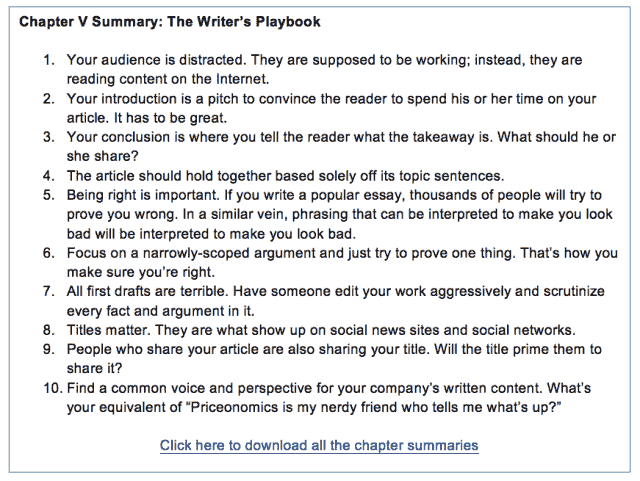

<noscript></noscript>**](http://eepurl.com/bVruOT) 

第六章:写作技巧

用尤达不朽的话来说，“做。或者不要。没有尝试。”致力于写作，然后就去做。

传统观点认为你应该每天写作。不管多大，多小，多好，多坏——只要建立写作的肌肉记忆。

我们不赞成这种观点。虽然这可能是开始个人写作项目和写个人观点或经历的好方法，但对公司来说，这不是处理内容的理想方式。

在我们看来，一个想要掌握内容营销的公司需要早日尝到成功的滋味。当你开始创作内容的时候，集中精力做一件让世界为之一震的事情。媒体引用的雪崩，访问者的涌入，Twitter 上对你工作的评论——这些都让人上瘾。一旦尝到成功的滋味，你就会沉迷于发布广受好评的信息。

我们当然上瘾了。当我们发表第一篇文章时，我们的网站每月有 2000 名访客。我们不知道会发生什么。然后这篇文章产生了 10，000 次浏览。我们试图重现它…我们做到了！

我们发表了更多的文章，获得了 10，000 次浏览和数十次媒体提及。然后，我们写了几篇获得 20，000 次浏览的文章。然后 5 万观看，10 万观看，50 万观看，150 万观看。每次浏览都是对我们网站的一次独特的访问。现在，当我们写一篇获得 10，000 次浏览的博文时，感觉并不精彩。就像，“嗯，没关系。”这是瘾君子的标志:你需要更多同样的东西，只是为了感觉像以前一样好。

如果你打算制作内容，你可能会沉迷于成功。大多数记者、严肃的作家和创作者都有这种感觉。你也应该。沉迷于写流行内容的方法是做出真正好的东西。去 [衡量结果](https://priceonomics.com/content-tracker-by-priceonomics/) ，然后鞭策自己做出更好的东西。

在我们在 Priceonomics 写博客的第一年，我们发表的每篇文章都至少花了 40 个小时来创作。我们花了大部分时间分析数据，以不同的方式分割数据，并想出如何用它来讲述一个有趣的故事。我们只花了最后 10 个小时来制作漂亮的图表，并亲自打字和编辑博文。

要写一篇真正好的博文，需要付出大量的心血、汗水和泪水。所以，给你一个提示:刚开始的时候，不要天天写。花 40 个小时写你的第一篇文章，然后让它成功。尽一切努力找到数据中的故事，让它变得真正有趣。

写伟大作品的回报是巨大的；写东西的平均回报是零。

在你写完第一篇全垒打的博客文章，掌握了如何创造伟大内容的窍门之后，你必须再做一次。这不像制造一个产品；你必须从头开始。好消息是，这一次比一次容易。如果你做出好东西，人们会开始在推特和脸书上关注你，订阅你的电子邮件列表。最终，你的观众会自愿帮助你分发内容。

但要达到这一点，你必须开始更频繁地发表文章。您将更擅长编写数据驱动的报告，很快，您将能够在保持质量的同时更快地生成它们。你会变得熟悉写关于你的行业和行业中的人的有趣的文章。

发布内容的最佳数量是多少？尽你所能，同时保持它真的很好！我们现在通常一天发表一篇文章。我们有一群才华横溢、尽职尽责的全职作家，经过三年的写作，我们现在对整个出版工作相当在行。

不过，想出文章的创意还是很难的。因此，我们想出了一些“窍门”或技巧来提出和实施好的想法。

正如我们之前提到的，我们喜欢关注三个信息节点:数据、行业和人员。

**写关于数据的文章**

我们在 Priceonomics 博客上写了这么多不同的主题，以至于我们注意到我们的许多文章都有相似的主题。

当你写关于数据的文章时——理想的是你的公司拥有专有访问权的数据——有主题是很有帮助的。以下是我们在数据驱动的帖子中经常提到的一些常见主题:

*一个排序列表*

想出一个有趣的衡量标准，并在列表中对结果进行排名。我们过去用过的例子包括最“时髦”的城市，黑莓手机最受欢迎的地方，生活最昂贵的社区，预订最昂贵的乐队，以及喝咖啡最多的国家。

列表很有趣，人们分享它们是因为列表包含了对他们很重要的信息(他们住在哪里，他们的学校，他们最喜欢的音乐)。如果你列出美国养羊的最佳城市，美国每个城市的人都会分享那篇文章，因为你提到了他们的城市:“爱荷华州的杜布克是美国养羊的第七大城市。我为我的城镇感到骄傲！”

也就是说，不要滥用列表的力量，写一些与你的公司、产品或行业无关的东西。从你的数据中得出一个很好的见解，然后找到一种方法把它以一种有趣的格式，这将有助于它的传播。

某物的价格是多少？

人们对东西的价格非常感兴趣。我们关于乐队预订价格的文章迄今已获得 180 万次浏览，一年多后仍继续吸引大量关注。我们写了一些文章，分析如果你打碎屏幕，iPhone 的转售价值会受到多大影响，葡萄酒的价格是如何确定的，初创公司的办公空间成本是多少，以及美国各个城市的公寓成本是多少。

价格和成本是人们好奇的事情，你的公司可能有很好的信息:医疗程序的价格，各种纸张的价格，特别重要的汽车零件的价格，补牙的价格等等。人们很好奇！

*证明某人强烈持有的直觉的数据，或反驳微弱持有的直觉的数据*

人们喜欢自己的偏见被数据证实。例如，如果你写一篇数据驱动的文章，比较二手 Android 手机和 iphone 的价格，它会给某人一个借口，比如说:“*我一直知道 Android 手机比 iphone 差，现在我有数据来证明这一点！”*或者，如果你写一些关于城市多样性的东西，有人可能会用它来说，*“我的城市有很多事情值得去做，但从来没有人给予我们信任，现在我有一些数据来证明这一点！”*

再多的数据也无法说服一个人仅仅通过阅读一篇博客文章就推翻一个坚定的立场。同时，人们喜欢看到他们不重要的直觉被打破。换句话说，人们喜欢惊喜(例如:等一下，UPS 卡车不会为了省油而离开？或者，“大多数好莱坞电影要么带有一种暗示，要么带有蓝色或橙色？，或者“麦当劳的垄断游戏被操纵了？).

*一个令人惊讶的趋势*

除非某样东西加速或减速的速度快得令人震惊，否则写一个趋势是很难成功的。当我们写旧金山房租价格时，我们称之为“旧金山房租爆炸”,以强调房租上涨非常快。

因此，如果您想要显示麻疹病例正在增加或地球温度正在增加的数据，您必须找到一种方法来显示一些背景信息，说明为什么您的数据会促成一个巨大的趋势。

*两件事的关系*

你有没有想过为什么这么多图表都局限于 2×2 矩阵？这是因为人们喜欢思考两个项目之间的关系。这种图表也需要一点思考才能理解，所以当你弄清楚数据的真正含义时，你会很满意。

当然，弄清楚在 x 轴上画什么，在 y 轴上画什么是棘手的部分。假设你是一家冰淇淋店。如果你把每天的平均温度放在 x 轴上，把每天的销售额放在 y 轴上，这就是你整个企业的故事！

写一个行业:什么信息对其他人有价值？

当你是一个行业的专家时，你有来之不易的关于这个行业如何运作的信息，这对其他人来说是有价值的。许多你认为是常识的东西对其他人来说可能是非常有用或有趣的。

例如，当你在一家销售销售人员使用的软件的公司工作时，你可能知道很多关于销售人员如何工作，如何招聘人员，销售副总裁做什么，如何获得线索，什么软件可以自动给人打电话，以及如何关闭潜在客户。这种信息对那些想建立自己的销售组织的人来说是很有价值的，同时也是你的潜在客户。

你对你所在的行业有着独特的理解，并且处于一个很好的位置去研究别人好奇的话题。

另一个例子:你是一家度假租赁物业管理公司。你的潜在客户(需要有人管理其房产的房主)会有哪些问题？考虑以下情况:出租房屋时，如何处理 Airbnb 的所得税？这是一个复杂的问题，你的每一个潜在客户都在努力解决。为什么不和一些会计师谈谈，研究一下这个问题，然后给出答案呢？

在正确的时间获得正确的信息对某些人来说非常有价值。永远不要低估你的公司有一个巨大的关于其行业的知识库，可能对其他人有所帮助。

**写人:英雄的旅程**

你可能没有意识到这一点，但几乎每部关于史诗冒险的电影或书籍都遵循相同的模式。《星球大战》、《哈利·波特》、《奥德赛》——它们本质上都是同一个故事。

<noscript>T3】</noscript>

美国神话学家坎贝尔·约瑟夫在他的书《千面英雄》中推广了“英雄之旅”的理论。在书中，坎贝尔详细描述了每个主角在一个典型的故事线中经历的 17 个步骤。过了一段时间，我们意识到我们下意识地将这种循环应用到了 Priceonomics 博客上的许多文章中。

主人公旅程的本质是:主人公只是一个普通人。一天，一个事件导致主人公开始了一段旅程。主人公试图解决一个巨大的问题。看起来男主角要去解决，但是他失败了。经历了一次又一次的失败后，英雄坚持下来并取得了胜利。

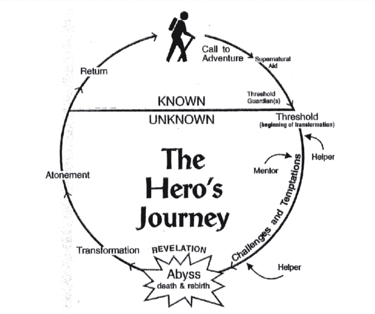

<noscript>T3】</noscript>

这种模式是一个讲述每个企业家、发明家或普通人故事的框架。我们每个人都在我们小英雄的旅途上。

当我们讲述公司如何成立的故事时，我们最常使用这个框架(请注意，是下意识的)。你应该去找你的每一个客户，问问他们是如何建立的。他们都会受宠若惊；你的网站会有令人难以置信的内容；你可以展示你有真正的顾客。

下面是我们写的一篇关于一家制造水母缸的公司的文章的介绍(注意这里的英雄循环):

> 当 Alex Andon 获得第一份价值 25，000 美元的水母水箱安装订单时，他非常兴奋。他也有一个问题。他对水母一无所知，也不知道如何制作水母缸。他预感到人们想把水母当宠物养，所以他创建了一个测试网站，并在谷歌搜索广告中花了 100 美元。你瞧，他的电话开始响个不停，询问声此起彼伏，他拿到了第一份订单，订购价值 25，000 美元的水母缸。
> 
> 今天，亚历克斯的公司水母艺术是水母宠物领域的领先公司。事实上，他们几乎是这个领域唯一的公司。当他们在四年多前推出时，将水母养在家里的唯一方法是支付 1 万至 2.5 万美元的定制安装费用。在开始作为一个定制安装程序后，Alex 后来开发了一个桌面水母箱，将水母所有权的价格降到了 500 美元。
> 
> 一路走来，他发起了最受欢迎的 Kickstarter 活动之一，获得了 Y Combinator 的资助，并创造了一个以前不存在的市场。
> 
> 这是亚历克斯·安登和水母艺术的故事——世界上唯一的水母创业公司。

我们还不如谈论卢克·天行者:故事是一样的。你也可以这样写你的客户，你所在行业的发明家，关键人物，甚至你公司的员工。

**寻找主题和想法**

你会发现很难弄清楚写什么。撞墙之后，我们终于回过头来看看过去发表过的那些受欢迎的文章。那次练习揭示了我们反复触及的主题。因此，当我们需要创意时，我们会从以下主题中寻找灵感:

X 的地下经济:*毒品、食品车、收集罐*

作为英雄的企业家:*水母，Anyperk，Experiment.com*

Y 的兴衰:*保龄球，粘土动画*

x 是扯淡:*钻石*，*红酒，艺术品，瓶装水，床垫*

Z 的怪异历史:*战时猫，蒂莫西·德克斯特*

企业冒险故事:*索罗斯诉英格兰银行，保时捷诉大众*

一个有趣的亚文化:*费西合唱团*

原来这个我们都信以为真的东西是错的: *UPS 卡车，电影海报*

一个图表中的故事:v *inyl records，diversity*

Y 的发明:*气压机、Slinky、切片面包、思乐冰*

这些是我们在 Priceonomics 提出的一些主题。我们在事后整理清单，但这有助于集思广益。这些是我们自己独特的主题，我们敦促你们提出自己的主题。

**想出点子**

也许写作最重要的部分是从一个好主意开始。如果你打算在一份研究报告或一篇博客文章上投入 40 多个小时，如果你在一个没有腿的想法上投入了很多努力，你就注定要失败。

如果你在一个令人不快的想法上花了很多时间，或者给你的公司蒙上了一层阴影，那就更糟了。这种情况经常发生，对一家公司来说可能是灾难性的。你应该假设任何潜在的负面或侮辱*会被这样理解*，并不惜一切代价避免它。你需要好的想法，也需要避免非常糟糕的想法。

想出好主意需要一些判断，但是你可以通过阅读好的内容来建立你的判断。选择一个我们之前列出的“超级节点”社交新闻网站，去那里逛逛，感受一下像病毒一样传播的文章类型。去一个 Reddit 子网站，选择一个对你来说重要的主题，查看有史以来最高票数的文章。是什么让这些想法得以传播？

这并不是一个很难理解的概念:以一种可以分享的方式写一些好的信息，让你的内容非常好，每个人都必须阅读，包括你的目标市场。

但更难的是执行力。为了实现这一点，你必须雇佣优秀的人才。

[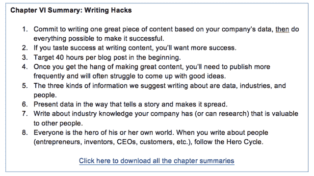

<noscript></noscript>](http://eepurl.com/bVruOT) 

**第七章:招聘**

负责贵公司博客的写手工作有多努力？

Priceonomics 的作者们实际上是在拼命做好工作。他们经常通宵达旦地完成故事，花几个星期跟踪采访，写草稿，重写草稿，直到他们真的很棒。故事创意被提出、否决、辩论和提炼，直到我们有了真正伟大的主题。

我们不能低估 Priceonomics 的作者在工作中付出的努力。这是我们成功的关键:有才能的人在一个奖励努力的系统中付出努力。在这种情况下，回报是达到数百万人(以及帮助公司产生收入)。作家想要触及人们。如果你的博客是一座鬼城，那就没有动力去创造伟大的东西——没有人会发现它们！

到目前为止，这本书的大部分内容都是关于创建让伟大内容传播的系统。但是，你如何在这样的系统中找到有才华、有动力的人呢？

创造“内容营销”有很多选择，但大多数都是垃圾。许多公司认为，主导内容制作的方法是雇佣自由职业者；这不是你一开始应该做的。

相信我们:为了让你的内容成功，制作内容的人必须真正关心你的业务。他们需要了解你公司拥有的信息，以及如何让这些信息变得有趣。雇佣一个自由职业者为你“写内容”,充其量只会让你的博客充满有趣的东西，缺乏与你的业务产生的信息相关的细微差别。在最坏的情况下，自由职业者只会在一页上写单词，因为你是按单词付费的。

如果有人不深度关心你的问题，就不要指望他去解决。你公司的某个人需要开始工作，投入 40 个小时制作一个内容，并擅长它。如果你是一家小型创业公司，这意味着公司的创始人；如果你是一家大公司，这意味着有人负责营销。

所以要么是你，要么是真正关心你公司成功的人，应该负责制作内容。现在，你如何找到这样的人？

**招聘流程**

当我们寻找作家加入 Priceonomics 团队时，我们会要求三样东西:某种形式的简历、写作样本和申请人想写的主题列表。

简历是三者中最不重要的。我们通常看它 15 秒钟。我们可能会扫描它来查看候选人的经历，但与申请的其他部分相比，这并不重要。

写作样本更重要。申请人能给你发一个写的很清楚很有趣的东西吗？根据我们的经验，也许 5%的申请人能做到这一点。

到目前为止，应用程序最重要的部分是 ideas 部分。人们推销的大多数想法并不令人兴奋、有趣，或者与你的公司无关。当合适的作者提出申请时，你会知道，因为他们的想法清单很管用。

当我们雇用我们的第一位作家亚历克斯·马亚西时，我们根据他申请中的想法的力量请他参加了面试。以下是他的建议:

***

*无家可归的海特街儿童的财务状况*

我住在海特街&自从我搬进来就一直想知道。

*陈年老酒能收回成本吗？*

一位向我展示他的酒窖的亿万富翁曾说，他的陈年葡萄酒的增值覆盖了他每年喝的所有葡萄酒的成本。我想看看他是喝醉了，还是天才，或者两者兼而有之。在这一点上，葡萄酒对于价格指南来说是不是太复杂了？

*战争的供给和需求:一把 AK 在全世界的价格是多少？*

数据将是稀缺的，但随着新闻中的枪支管制，这将是非常能够向新闻界推销。奥巴马正在考虑枪支管制，以防止家庭枪支暴力，但如果我们将同样的逻辑应用于减少全球武器贸易，以防止内战，会怎么样？

美国肾脏市场会是什么样子？

灵感来自我在吉威尔的一个朋友的专栏。

你应该从杂货店还是酒店买酒？

坊间证据表明，这是价格(杂货店)与选择(酒店)之间的权衡，但我想要一个数据驱动的答案。即使这需要我去一家又一家的酒店写下价格。或者我应该说，尤其是如果我要去一家又一家的酒店。

*科切拉还是电雏菊嘉年华？最佳价值音乐节*

根据门票价格、住宿费用、活动中的食品和饮料价格以及驾车或乘坐公共交通工具到达活动现场的难易程度进行综合

第三方售票商。如何看比赛不被坑

我认为像 StubHub 这样的网站是垃圾，抬高了我们最喜欢的季后赛和 T Swift 演唱会的票价。我想调查一下这个行业，看看哪些网站抬高票价最少，以及像 ebay 这样的替代网站是如何运作的。

*你应该(和不应该)在宜家买什么？*

我想这是 5 月下旬发布给大学毕业生的假毕业致辞，建议他们是否在宜家为自己的第一套公寓配备家具。可能会引用宜家诅咒中的 30 块石头。

*快餐车-经济学。*

与餐馆的成本相比，快餐车在财务上节省了多少？我们是否看到了海湾地区食品卡车场景中的那些节约？潮人吃货是在哄抬物价吗？我是潮人吃货吗？

*有钱人喜欢的东西*

索思比列出了物品的预期价格，以及描述和拍卖的最终出价记录。看看是否能收集到任何 1%的洞察力将是有趣的——也许可以通过观察在金融危机之前、期间和之后拍卖是否成功地达到了预期的产出。

“新女孩”公寓到底应该是什么样子？

你有没有看过像《老友记》或《T2 新欢》这样的情景喜剧，并认为剧中的角色根本不可能买得起那套公寓？嗯，我有。根据公寓截图、租房清单、工资信息和家居用品的价格经济学数据，我应该可以证明这一点。

***

在收到数百份作者申请后，这是迄今为止 Priceonomics 博客主题的最佳创意。这个应用程序中突出的就是这些想法。在我们雇佣了 Alex 之后，这些话题中的一些成为了非常成功的 Priceonomics 博客帖子。

但是一堆好点子不足以成为你雇人的证据。如果候选人通过了优秀申请的筛选，那么我们将安排 30 分钟的 Skype 面试，讨论申请人的想法、背景和任何以前的写作经验。

虽然只有 1%左右的申请人会得到这样的面试机会，但其中大约 50%的人会进入下一阶段。这是最重要的阶段，我们强烈建议你去做。

然后我们付钱给申请人为我们写一篇自由撰稿人的文章。我们共同挑选一个想法，告诉他或她我们将支付多少钱，并提出一个合作的流程。然后，申请人开始写文章。

在这个过程中发生了许多令人惊讶的事情。首先，大约三分之一的候选人消失了，没有完成任务。在雇佣某人之前，这是很好的信息。

另外三分之一的申请者的工作比你预期的要差得多。这些人在书面上看起来很棒，有很棒的写作样本，并且在面试中表现出色，但是他们的工作质量就是不怎么样。

最后三分之一的申请者表现出色。这并不是说他们写的文章不可思议，但他们显示出了希望。我们非常努力地和这些人一起编辑他们的文章，然后在 Priceonomics 上发表。这给了我们和候选人一个很好的共同工作的感觉。

在亚历克斯的案例中，我们付钱让他研究他提出的关于旧金山海特-阿什伯里社区无家可归的年轻人的第一个话题，他发表了一篇名为“旧金山街头儿童”的文章。下面是介绍:

> 在旧金山的海特-阿什伯里区，无家可归的年轻人不容忽视。在附近花点时间，你会注意到成百上千的“街头儿童”——十多岁和二十多岁背着大背包和睡袋的年轻无家可归者——把海特街和金门公园称为他们的家。
> 
> 在这个街区，流浪儿童经常出现。他们在大多数角落闲逛，要零钱或吃剩的食物，抽大麻，偶尔提供毒品出售。该地区作为 20 世纪 60 年代嬉皮士运动的中心而闻名，但街头儿童与今天的中产阶级海特不自在地融合在一起——这个地区的租金为 1500 美元，有时尚的夜总会，谷歌巴士载着工程师去上班。即使在一个以无家可归而闻名的城市，他们也以异常年轻和数量众多而引人注目。
> 
> 遇到旧金山的街头儿童可能会引起不舒服的反应:看到他们的贫穷就感到内疚和怜悯，对他们的毒品交易感到不安，甚至因为他们的不可预测性、粗鲁的外表和对长相凶恶的狗的偏好而感到紧张和恐惧。忽视他们是最容易的，大多数当地人都承认从未和他们有过交谈。
> 
> 在 Priceonomics，我们想更多地了解这些我们每天都看到但几乎一无所知的街头儿童。他们是谁？他们是怎么赚钱的，又是怎么过的？他们为什么在这里？所以，我们决定问问他们。
> 
> 我们最初的假设是，海特街的生活将是一个严酷的、狄更斯笔下的地狱。相反，我们发现了一个被误解的现代游牧民族的世界，他们无忧无虑地生活在贫困、毒品交易和嬉皮士天堂之间。他们中的大多数人似乎都玩得很开心。

这篇文章最终成为了一篇非常受欢迎的文章，但这不是重点。首先，亚历克斯制作的草稿显示了潜力。第二，我们一起努力使它们变得更好，所以当他发表文章时，它真的很好。我们有了合作的机会。

文章发表后，我们让 Alex 进行了“最后一轮”采访，我们花了半天时间采访他。但这主要是一种形式，以检查他是一个好人；真正的面试是自由写作任务。我们给了亚历克斯一个提议，他接受了。

我们已经对我们雇佣的每一个作家都进行了这一过程。作家们为我们创作的大多数自由作品都不如这一篇受欢迎，但这没什么。更重要的是，我们可以看出他们有天赋，他们会在做研究时弄脏自己的手。无论你付给申请人为你做自由职业的人多少钱，都将是你在招聘过程中花的最值的钱。

根据我们的经验，一个新作家需要大约两个月的时间才能达到他或她的水平。我们已经聘请了一些你能想象到的最有才华、最有抱负、最杰出的作家，但他们仍然需要时间来找到自己的声音，了解哪些主题会起作用，并找出如何获得他们需要的信息。

找到合适的人并对他们进行培训是一项繁重的工作。但是大多数公司博客没有流量是有原因的:如果很容易，每个人都会这么做！在本书中，我们一直在争论，有一个根本性的变化正在发生，内容创作者有一个公平的竞争环境。现在是时候利用这一点，全心投入制作令人惊叹的内容了。

你的公司博客正在与充斥着广告、烦人的弹出窗口和绝望的赚钱计划的媒体网站内容竞争。你的内容是由产品销售资助的，这是一个巨大的优势。

[**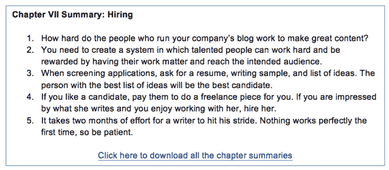

<noscript></noscript>**](http://eepurl.com/bVruOT) 

**第八章:为什么这很重要**

Priceonomics 有史以来流量最大的一天正好是我们利润最高的销售日——但这两个里程碑并不像人们想象的那样相关。我们来探究一下发生了什么。

那天，一位价格经济学作家匆匆写了一篇名为《预订你最喜欢的乐队要花多少钱》的博文这篇文章——数百个乐队的大致预订费用的价格清单——不是我们最激动人心的文章，但它比我们以前发布的任何文章都更受欢迎。

我们当时并没有意识到，但这篇文章有非常有利于分享的特点。它包含了人们感兴趣的新奇的定价信息，并且提到了如此多的乐队，以至于每个阅读帖子的人都可以至少认同其中的一个。成千上万的人在社交网络上分享了这篇文章，并附带了一些不同的短语，“嘿，我最喜欢的乐队[乌鸦乐队、活结乐队、贾斯汀比伯乐队等]。]预订私人音乐会的费用为 XXX 美元！谁愿意出钱帮他们预订？”这篇文章是我们第一篇点击率超过 100 万的文章，现在已经达到了 200 万。

同一天，几乎纽约的所有对冲基金都联系了 Priceonomics，询问我们的数据抓取服务。啊？

当天早些时候，谷歌更新了其搜索结果算法，这一变化对许多网站造成了严重破坏。其中之一是 RetailMeNot，这是一家上市公司，专门发布优惠券代码，消费者可以使用这些代码在网上购物时获得折扣。(公司向 RetailMeNot 提供介绍费，这是它的主要收入来源)。

据传，谷歌算法的更新对 RetailMeNot 的 SEO(搜索引擎优化)打击尤为严重。如果传言属实，这意味着该公司的主要流量来源(谷歌)受到了负面影响，导致收入减少。

实际上，华尔街的每一位分析师都在谷歌上搜索“RetailMeNot SEO”这个词，以了解该公司在谷歌搜索结果中的表现。最高的结果是什么？Priceonomics 的一篇文章名为“RetailMeNot 的搜索引擎优化优势”

像我们几乎所有的文章一样，这篇文章分享了一些不为人知的信息。但是，这篇文章非常明确地宣传了 Priceonomics 的数据获取服务。尽管这是我们公司的广告，但这篇文章已经像病毒一样传播开来。许多新闻来源对此进行了报道，因此它是谷歌搜索的首要结果。这是该作品的简介:

> 你正准备从你最喜欢的网上商店买一条令人愉快的裤子，这时你注意到在结账按钮附近有一个标有“促销代码”的小盒子嗯，你想，我像个十足的傻瓜一样，正准备花全价买这条裤子，这时正好有折扣。有点恼火，你在谷歌上快速搜索优惠券代码。
> 
> 当你搜索网上优惠券时，你通常会登陆促销代码聚合网站 RetailMeNot。RetailMeNot 是一家上市公司，去年 IPO 后市值 18 亿美元。2013 年，该公司的收入超过 2 亿美元；RetailMeNot 将优惠券代码变成了一笔大生意。
> 
> 根据公司文件，RetailMeNot 目前 63%的流量来自搜索引擎，96%的收入来自代销商的销售佣金。RetailMeNot 成功的关键因素是可靠地将优惠券代码相关查询的谷歌搜索结果排在首位，然后将流量转化为推荐费。
> 
> 鉴于谷歌在搜索领域的主导地位，占领它的结果页面可以带来难以置信的利润。但在 RetailMeNot 的情况下，也是一个篮子里有很多鸡蛋。谷歌搜索算法的改变可能会导致整个公司的崩溃。流量会直线下降，导致收入下降和股价暴跌。
> 
> Priceonomics 数据服务公司为我们的对冲基金客户分析上市公司的 SEO(搜索引擎优化)风险。我们浏览网页，看看这些公司的搜索引擎结果是如何改善或恶化的。对于像 Zillow、Yelp 和猫途鹰这样的 SEO 驱动的企业来说，这是他们财富的一个重要领先指标。
> 
> 由于 RetailMeNot 是一家出色的 SEO 驱动型公司，我们认为展示我们所做的一些工作会很有趣。让我们回顾一下 RetailMeNot 赚钱的聪明方法 2)搜索引擎流量对其业务有多重要，以及 3)该公司在赢得优惠券代码的 SEO 游戏中到底有多占优势。

倒数第二段(着重号后加)明确指出，我们销售的这项服务可以抓取搜索结果，并计算出公司的表现。文章的结尾还提供了一个链接，如果您想注册我们的服务，可以与我们联系。

因此，当谷歌改变算法时，华尔街的每个人都找到了我们的文章(讽刺的是，通过谷歌搜索)，我们收到了大量的客户咨询。他们中的许多人成为了我们数据服务的高利润客户。

但是我们这篇关于 RetailMeNot 的文章是如何在互联网的喧嚣和浩瀚大海中脱颖而出的呢？

首先，我们的大部分内容不会直接推广我们的服务。这只是为我们的普通读者制作的很棒的内容。如果我们只在每篇博文中写关于 Priceonomics 数据服务的内容，我们就不会有固定的读者。因为我们有固定的读者，所以偶尔会有宣传我们服务的文章被阅读。

第二，这篇文章是一个很好的信息来源。我们解释了 RetailMeNot 的商业模式，并提供了比世界上任何人都更好的数据来说明我们的观点。实际上，没有其他人既能解释业务，又有获得正确数据的技术能力。只有价格经济学能做到这一点。

第三，这篇文章对我们的业务来说是一个明显的广告，比一般的价格经济学文章要好——文章的平均质量真的很高。如果你要写的内容，哪怕只是远程推广你的业务，其质量也必须高于专业新闻网站的竞争信息。你的博客需要很棒，推广你业务的博客帖子需要更棒。

最后，我们选择了一个促进我们业务的话题，但我们对这个话题没有偏见。我们的数据显示，RetailMeNot 主导 SEO。然后，当谷歌的算法改变时，我们展示了它是如何对 RetailMeNot 的搜索引擎优化结果产生负面影响的。我们对该公司的表现是否良好没有偏见，因为这与我们提供的服务无关。因此，读者可以信任我们。

所以，这是我们一年中流量最高的一天，因为那篇关于乐队价格的文章，也是我们一年中最赚钱的一天，因为 RetailMeNot 帖子成功了。但是这些事件有关联吗？

是的。RetailMeNot 的文章非常受欢迎，只是因为我们已经赢得了分发高质量信息的声誉。人们在社交网络上分享它，它上升到黑客新闻的顶端，并赢得了谷歌搜索结果的顶端。

当我们写出为我们赚钱的东西时，我们团队为写出伟大作品付出的疯狂努力得到了回报——这些文章对我们来说是广告，因此很受欢迎。但是，如果你所做的只是推销自己，你就不可能有高质量的信息来源。

**必须做出决定**

当你开始内容营销时，我们建议你使用你公司的数据，看看你是否能创造数据驱动的故事。为什么？如果你能做到这一点，那么你就知道如何写能宣传你的公司并且有趣的内容。如果你做不到这一点，可能就不值得你花时间关注内容了。

但如果你能写出宣传你公司的内容，而且很牛逼，那么你就有一些问题要回答了。

首先，你的内容中有多少应该是关于推广你公司服务的信息，有多少应该只是关于你的行业和其中的人的有趣信息？在 Priceonomics，大约 10%的帖子是我们服务的广告；其他 90%的人不是。

记住，我们热衷于写好内容。如果经济上可行，我们会免费做。你需要选择你自己的比例，它可能不应该看起来像我们的。

不管你选择的比例是多少，你的内容给人的感觉越少，你就能获得越多的观众。如果你写的推广内容比非推广内容更好，并分发给大量读者，这些文章实际上会非常受欢迎。在我们推广价格经济学的文章中(比如上面的 RetailMeNot 例子)，大部分帖子都是很棒的数据和分析。恰好数据是我们提供的服务的产品。

第二，你得弄清楚如何不偏不倚。如果你公司的博客是关于你明显有既得利益的话题，没人会去看。例如，威瑞森最近有一个欠考虑的计划，要推出一个技术网站，这将微妙地影响关于网络中立的辩论。同样，石油巨头雪佛龙公司正在资助一家报纸，希望这家报纸成为其总部所在城镇的主要新闻来源。显然会有偏见。在威瑞森案和雪佛龙案中，公众的强烈反对是巨大的。

我们写的是我们没有特别偏见的信息。有些主题我们可能有兴趣推广某个观点，因为该观点对我们的业务有利。我们回避这些话题。相反，我们写的是由我们的服务产生的信息。我们建议你也这样做。

内容营销人员应该感到恶心吗？

你在网上阅读的文章被认为是“内容”然而书籍、食物、时尚和艺术却不是。是什么造就了一种媒体内容和另一种艺术？

在 Priceonomics，我们认为内容是基本上可以免费消费的媒体，但与其他需要付费的东西捆绑在一起。几乎每个媒体网站都遵循这个公式:制作免费阅读的文章，并与花钱购买的广告捆绑在一起。

根据这个定义，一本书不是内容，因为你为它付费——它是你直接购买的东西。一幅画、一件衣服或一顿饭也是如此。如果你不是直接付费，那就是内容。

大多数内容网站将他们的作品与广告捆绑在一起。那是他们的特权。在 Priceonomics，我们有一个不同的模式:我们把我们的内容和我们卖的东西捆绑在一起。内容吸引观众到我们的网站，我们卖给他们一定比例的东西。

在某些方面，内容营销有一个令人讨厌的名声，就像“这家公司正在写有趣的内容，所以它可以操纵我去买东西，或者对他们有好的想法。”对我们来说，这实际上没有传统内容网站的普遍看法那么令人讨厌:“这家公司正在编写有趣的东西，所以他们可以向其他公司出售我的注意力和个人数据。”

你不仅可以认为广告支持的内容商业模式在道德上是不道德的，而且它正在成为一种商品。任何人，不仅仅是成熟的媒体网站，都可以写内容——他们都在试图让广告商在他们的页面上投放广告。有如此多的网站产生如此多的页面浏览量，以至于广告的价格持续下跌。这对广告客户来说很好，但通过制作内容来谋生几乎是不可能的，除非你只是粗制滥造，沉迷于获取页面浏览量的最基本的做法。

在我们看来，也许那些撰写内容来吸引受众并将其卖给广告商的记者才是应该感到恶心的人。为什么不写内容，主要靠卖有价值的东西赚钱呢？

不可思议的内容公司都是这样融资的。彭博拥有广泛的新闻业务，其资金主要来自出售其金融终端的订阅。《纽约人》是脸书和 Tumblr 的图片页面，但它的资金来自卖书。燕麦片是一个免费的在线漫画，但它的大部分收入来自出售漫画的实体表现形式(书籍、游戏、海报)。Priceonomics 是一个关于信息的博客，我们的大部分收入来自向企业出售特定种类的有价值的信息和服务。

上述公司是内容营销者，还是制作伟大内容的人通过卖东西来资助内容？我们认为，把商品广告放在内容上是对我们制作的内容质量的侮辱。因此，我们转而追求一种更周到的销售产品的商业模式。

听着，我们在这本书里一直坚持说我们疯了。我们真的相信我们写的内容比你在报纸或杂志上找到的内容更好，因为我们不是为了展示广告而试图吸引浏览量。我们已经警告过你不要过多地模仿我们，因为我们对自己所做的事情很狂热。但是这里有一件事我们建议你效仿:对你的工作表现出极大的自豪感。不要认为自己是一个“低贱的内容营销者”；把自己想象成一个制作优秀内容的人，这些内容碰巧通过产品销售而不是广告来赚钱。你的同事是《T2》《纽约客》、*《华尔街日报》*和*《经济学家》**的作家，你应该努力在你的专业领域比他们做得更好。*

 *这是本书最重要的一点:你的作品必须非常出色才能脱颖而出。但是如果你做了一些很棒的东西，你的内容就可以和世界上最有声望的新闻网站和分析师的作品相媲美。

此外，你还有一个优势，因为你可以通过你的公司和你的行业经验获得信息。伟大的信息传播，但只有当你设计它传播。它需要被包装成一个伟大的故事，你需要预测它将通过哪些渠道传播。有才华和做好工作是不够的；你需要有一个计划。

写信息。让它变得伟大。有计划。

***

*这篇文章由[罗欣·达尔](https://twitter.com/rohindhar)撰写。感谢整个 Priceonomics 团队阅读、编辑和创造了本手册中的知识。*

想了解更多关于 Priceonomics Data Studio 的信息吗？priceo nomics Data Studio 是我们的内容营销机构，致力于将公司数据转化为精彩的内容。发送消息 [**此处**](https://priceonomics.com/contact/) 或在[**【info@priceonomics.com】**](mailto:info@priceonomics.com)。

*[**点击此处**](http://eepurl.com/bVruOT) 下载所有章节摘要和一份“单页作家清单”。*

* * *

* * ******