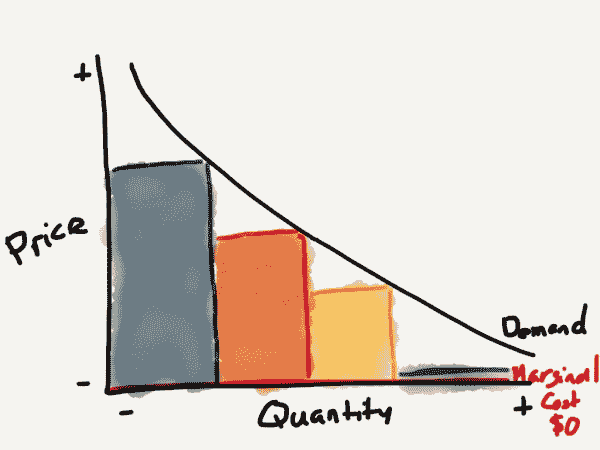

# 2014 年商业模式——本·汤普森的战略

> 原文：<https://stratechery.com/2014/business-models-2014/?utm_source=wanqu.co&utm_campaign=Wanqu+Daily&utm_medium=website>

也许技术专家和普通人之间最大的持续脱节是软件的价值。正如 Marc Andreesen [的名言](http://online.wsj.com/news/articles/SB10001424053111903480904576512250915629460)，“软件正在吞噬世界”，虽然这是绝对正确的，但软件，尤其是在消费者领域，并没有吞噬价值，至少没有直接吞噬价值。事实上，如果说 2013 年教会了我们什么，那就是消费者对软件的价值比以往任何时候都低。

这种现象在应用商店经济中表现得最为明显，付费下载的受欢迎程度直线下降。许多开发者写道，在商店赚钱变得越来越困难，并对免费(通过应用内购买)的无情进军感到绝望。我自己也加入了进来，批评苹果没有做更多的工作来帮助开发者在应用商店创造可持续的商业模式。然而，最终，从软件购买过程中消除[摩擦](http://stratechery.com/2013/friction)已经——就像它对音乐和其他媒体所做的那样——降低或消除了许多消费者的支付意愿。

它告诉我们，软件和音乐有着共同的遗产:在收缩包装的盒子里的圆形、闪亮的塑料片。虽然开车去商店购买实物的想法看起来很荒谬，但似乎是那张 CD——以及之前的磁盘和磁带——的实物推动了客户的支付意愿。消费者在技术层面上可能不理解当他们下载一个应用程序或一首歌曲时发生了什么，但他们似乎隐含地知道他们只是在复制比特，这个过程的边际成本为零。

正如我在[开源应用](http://stratechery.com/2013/open-source-apps/)中所写的，随着时间的推移，产品的价格移动到其边际成本，如果边际成本为零，这意味着免费是不可避免的。

> 
> 
> As competitors enter the market, the price moves towards the marginal cost. In the case of software, that is $0.
> 
> 
> 
> 从经济学角度来看，软件市场之所以如此迷人，是因为软件的边际成本是 0 美元。毕竟，软件只是驱动器上的一点点，眨眼之间就可以复制。同样，创建所述软件需要多少努力并不重要；这是沉没成本。重要的是多复制一份要花多少钱——0 美元。
> 
> 这对应用程序的影响是显而易见的:任何无差别的软件产品，比如你的花园综艺应用程序，将不可避免地是免费的。这就是为什么付费应用市场已经基本消失。随着时间的推移，替代品以越来越低的价格进入市场，最终达到边际生产成本——0 美元。

然而，另一方面，根据定义，边际成本大于 0 美元的有形产品继续受到消费者的重视。没有人期待免费的微波炉、汽车，甚至是糖果。消费者明白制造、包装和运输这样的产品需要钱，而且花钱买一杯众所周知的不仅仅是一个应用程序的拿铁咖啡也不会感到内疚。

在思考消费者商业模式时，理解这一点至关重要:消费者为有形商品付费；他们不会购买虚拟商品(游戏的应用内购买是一个明显的例外)。接下来，在消费市场赚钱的两种主要方式是:1)销售物理设备和 2)广告(通常是物理商品)。不过，最终，这两个领域的成功都依赖于软件。它真的什么都吃。

#### 实物商品。

也许经典的儿童礼物是遥控车。谁不记得在你当地的收音机小屋急切地注视着圣诞阵容，急切地打开你的礼物，寻找电池，最后像疯子一样开着你的车。一个经典的物理设备，以现金出售。

正是这种背景解释了苹果在去年 WWDC 上的奇怪开场。唯一的应用程序演示是 Anki，今天的遥控车版本。当然，这些汽车一点也不像 Radio Shack 的那些垃圾:Anki 汽车拥有人工智能，其参数是通过应用程序设置的。显然，这个应用程序是*免费的，*，但是应用程序中软件的价值是通过[Anki drive 199 美元的价格](http://store.apple.com/us/product/HD003VC/A/anki-drive-starter-kit?fnode=43)实现的。

这是未来软件货币化的主要方式之一:硬件的销售利润很高，这是由软件提供的差异化决定的。其实我只是描述了苹果本身的商业模式。MacBook Pro 或 iPad 的物理组件的边际成本远低于其零售价格；余量由软件提供。

另一个很好的例子——与本博客和本博客的主题特别相关——是纸张。去年，我谴责了 Paper [无法在 app store 上建立可持续业务](http://stratechery.com/2013/papering-over-app-store-problems/)的事实:

> 有了少量的种子基金，最初的五名员工开始创建 Paper，这是捕捉你的想法的最佳场所。在推出一年后，他们开始通过应用内购买获得回报。他们不断改进应用程序，并在 10 月份推出了一个重大更新——混合器，售价 1.99 美元。
> 
> 然后他们意识到，他们是生活在纽约市的五个人，没有明显的可持续收入的途径。

相反，他们正在制造实体设备:虽然他们在应用内购买收取 4.99 美元可能取得了有限的成功，但他们可能会在收取 59.99 美元的实体商品上取得更大的成功，我相信这包括可观的利润率。

#### 广告

科技消费市场的规模比以往任何时候都要大。不仅越来越多的人可以使用计算设备，而且由于移动设备，人们花在计算设备上的时间比例大大增加。更重要的是，有一个行业比消费者本身更重视消费者的时间和注意力:广告业。这一现实是去年脸书复苏的根源，也是推特首次公开募股最初看好的原因。

广告模式的持续优势——以及随之而来的数据收集和分析——是消费者不愿意为软件付费的另一面:消费者需要像谷歌搜索、脸书或 Twitter 这样的优秀产品，并且已经清楚地表明，他们会容忍广告来换取免费体验。

事实上，我认为技术领域最大的误解之一是，像谷歌或脸书这样的公司将不可避免地不可挽回地损害他们的产品，因为他们真正的客户是广告商。诚然，广告是有成本的——[脸书《华尔街日报》最近的简介](http://online.wsj.com/news/articles/SB10001424052702303640604579296452086218242)称，移动广告降低了 2%的活跃度——但这必须通过专注于以比广告降低产品质量更快的速度改进产品来抵消。

考虑激励因素:

*   公司 A 在付费产品占主导地位的市场中竞争；事实上，你必须为转换付费，这在他们的产品周围建立了一条护城河，减少了快速改进产品的动力
*   公司 B 在一个由广告支持的免费产品主导的市场中竞争；转换成本极低，创造了巨大的激励，以确保广告的影响远远小于产品价值的增加

简而言之，我一点也不确定广告会滋生劣质产品；有可能恰恰相反。我可以肯定的是，广告作为基于消费者的软件的一种盈利方式将会继续存在，任何能够吸引大量消费者注意力的服务——比如 Snapchat——都将是非常有价值的。

#### 软件即服务是面向企业的

在这一点上谈论 It 消费化几乎是老生常谈，但是，正如我去年所写的，[这是一个非常以产品为中心的观点](http://stratechery.com/2013/consumerization-of-it-myth/):

> 手机是这一趋势最明显的表现；iPhone、Android 甚至 Windows Phone 首先是消费设备；以企业为中心的黑莓差不多要完蛋了。
> 
> 但是，尽管就技术本身而言，这一趋势可能是正确的，但商业模式和走向市场战略的差异似乎比以往任何时候都更加明显。

从广告开始:没有企业会依赖基于广告的服务来满足关键的业务需求。除了缺乏专业精神之外，数据安全问题使得任何消费者服务都不可行。

然而，设备也变得同样令人生厌，尤其是对上市公司而言。服务器等设备是一项资本支出，对用于评估公司的最重要比率的分母有重大影响:投资资本回报率。

相反，企业越来越愿意做与消费者完全相反的事情，以软件即服务的形式购买无形商品:

*   如上所述，软件即服务对公司的财务结构有积极的影响，并意味着更稳定和可预测的运营成本
*   企业通常仍然有集中采购，这很好地回应了生产力的论点。让 SaaS 公司更容易表达软件的价值。这与只能通过生硬的大众市场广告才能接触到的消费者形成了鲜明的对比。这也意味着成功的 SaaS 公司将拥有发展良好的销售团队
*   企业通常需要定制或有特定的功能要求，并愿意为此付费。成功的公司平衡了响应能力和对客户应该去哪里的清晰愿景；事实上，SaaS 是基于云的，因此可以轻松快速地迭代，这使得这种平衡行为比多年升级周期的本地软件更有可能实现

也就是说，适用于以消费者为中心的广告业务的一些动态也适用于 SaaS:具体来说，转换成本更低，员工对替代品的了解可能更多。这将继续推动更高的商业软件标准，加大传统供应商面临的挑战，这些供应商一直专注于最大限度地实现锁定和多年合约。

* * *

可以肯定的是，其他商业模式将继续存在，包括付费下载、以消费者为中心的软件即服务和面向企业的硬件。此外，这种趋势也有例外:例如，整个应用内购买游戏细分市场，或者 Evernote，作为一种主要面向消费者的 SaaS 产品，它似乎正在取得成功。然而，展望未来，我预计以这种模式建立的公司将越来越专业化，规模越来越小，而那些已经很大的公司——如 Dropbox——将继续转向企业。

### *相关*