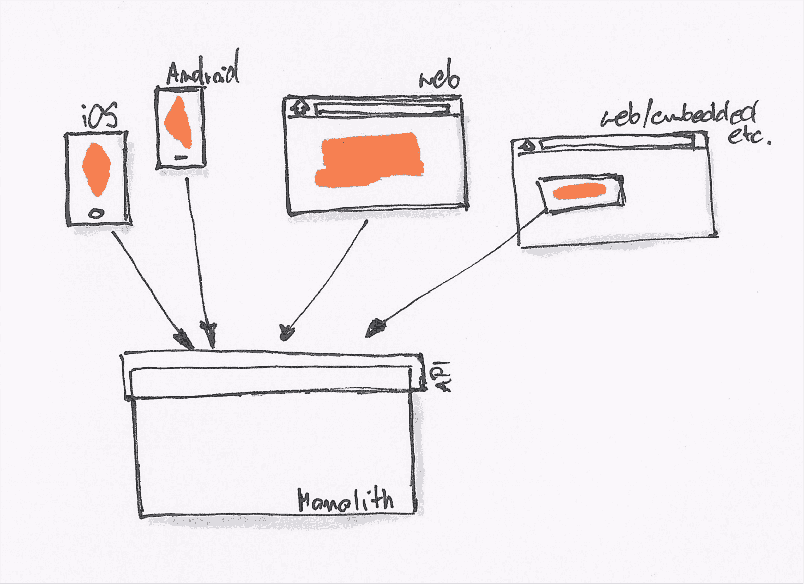
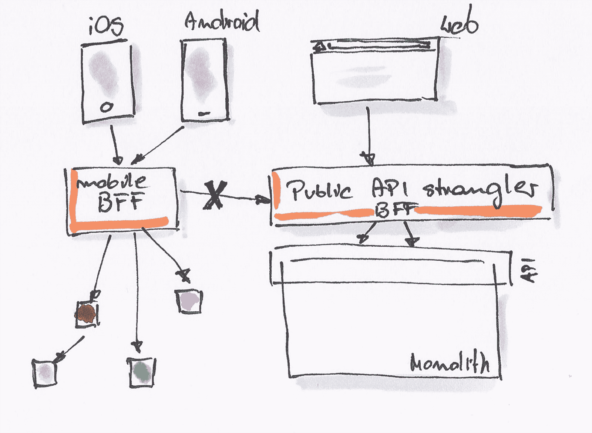
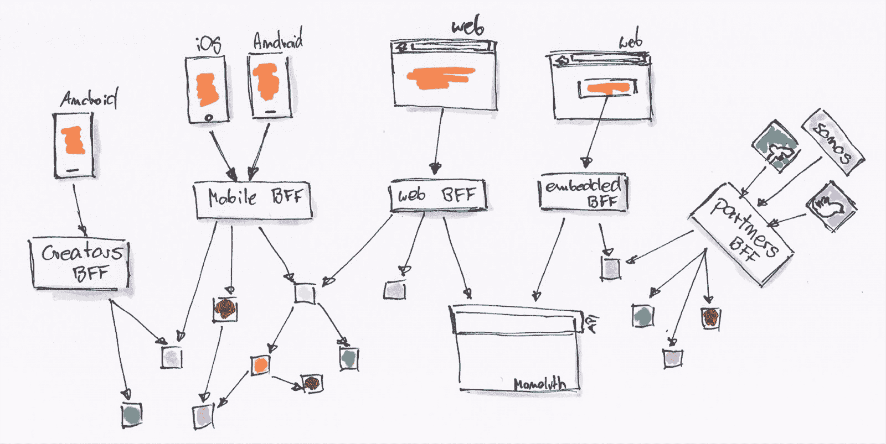

# BFF @ SoundCloud | Thoughtworks

> 原文：<https://www.thoughtworks.com/insights/blog/bff-soundcloud?utm_source=wanqu.co&utm_campaign=Wanqu+Daily&utm_medium=website>

几年前，我们在 SoundCloud 的朋友踏上了一段旅程，他们改变了他们的系统，将它从一个单片 Rails 应用程序转移到一个微服务的生态系统。在那个项目中，有一件事对他们特别有效，那就是 BFF 模式、[后端对前端](https://www.thoughtworks.com/radar/techniques/bff-backend-for-frontends)。他们的 BFF 用法和背后的成功故事可能会帮助其他团队；所以我们决定写下来。我们希望你觉得有用。

### 动机

早期，SoundCloud 是一个整体系统，公开了一个服务于 web 客户端、Android 和 iOS 应用以及互联网、一堆不同的混搭、合作伙伴等的 API。这个共享的 API 随着每一个特性而增长，也是所有平台和 API 消费者之间的一个共同点。

<noscript></noscript>

过了一段时间，就开始出问题了，既考虑到添加新功能所需的时间，也考虑到平台的不同需求。例如，对于移动 API 来说，比 web API 具有更小的有效负载和请求频率是明智的。现有的 monolith API 没有考虑到这一点，是由另一个团队开发的，不知道移动需求。因此，每次应用程序需要新的端点时，首先前端团队需要说服后端团队这是真实的情况，然后需要编写故事，确定优先级，挑选，开发并传达给前端团队。

这里可以看到问题:不必要的摩擦，沟通开销，延迟。与此同时，后端团队开始对单片应用程序产生问题，因为添加新功能变得越来越困难，而消防变得更加突出。

### 解决办法

为了解决这些问题，SoundCloud 决定，每当实现一个功能需要一个特定的、经过微调的 API 时，驱动这个功能的团队也能够实现 API 端点，从而决定从哪里获取数据以及如何聚合数据，需要传输什么有效载荷等。这个 API 端点将在单片应用程序之外创建，并充当特定于功能的门面。前端团队是这个新层的所有者。

BFF 诞生了，可以根据特定平台和功能(Android、iOS 客户端、web API 和其他消费者)的需求进行微调。

<noscript></noscript>

T3】

### 前端开发人员编写后端代码

这种转变意味着，到目前为止主要从事前端代码工作，主要专业知识围绕 Android 或 iOS 开发的人，需要对后端进行推理:不同的技术堆栈和不同的挑战。为了帮助实现这一点，后端团队开发了一个轻量级库，使编写“边缘服务”变得更加容易，负责警报、监控、遥测、认证以及应用速率限制和清理传入请求的最佳实践。这有助于标准化 BFF 的编写方式，因为使用提供的 BFF 框架(基于 [Finagle](https://twitter.github.io/finagle/) )比从头开始做任何事情都更容易。

### BFF 作为迁移路径

[BFF 的一个特点](http://samnewman.io/patterns/architectural/bff/)是它消除了外围对下游服务的任何直接调用。这种模式的实现还实现了向基于微服务的架构的最小侵入性迁移，因为 BFF 对应用程序本身隐藏了任何底层更改。新的功能通过了 BFF，然后被称为新的微服务或整体。每当从整体中提取出更多的功能时，BFF 就会改变，而应用程序代码保持不变。人们可以看到与[扼杀模式](http://www.martinfowler.com/bliki/StranglerApplication.html)的相似之处，BFF 正在扼杀由 monolith 提供的公共 API。因此，一个名为*public-API-stranger*的 BFF 被引入来对消费者隐藏 monolith API。它最初只是一个代理，将请求转发给 monolith。随着时间的推移，来自 monolith 的部分被提取出来，*public-API-stranger*只是将请求重新路由到新的微服务。消除消费者对 monolith API 的直接调用，简化了向基于微服务的系统的迁移过程。

<noscript></noscript>

T4】

### 一个或多个 BFF

好吧，那你应该交几个好朋友呢？在移动平台的情况下，由于时间和资源有限，SoundCloud 从 iOS 和 Android 的一个 BFF 开始。事后看来，为每个平台提供一个 BFF 会更有好处，因为 Android 和 iOS 应用程序的差异足以暴露不同的 API 需求。您还可以考虑为每个特性提供一个 BFF，如果一个特定的特性在两个平台上都存在，它们可以使用相同的 BFF。SoundCloud 用户可分为创作者和听众；因此，为创作者和听众分别提供一个 BFF 也是有意义的，因为这些用户群也有各自的应用。这是 SoundCloud 也决定走的路。人们可以尝试定义更细粒度的 BFF，封装特定的特性，这将使 BFF 的扩展和发布周期更加灵活。然而，由于他们仍然与他们服务的应用程序紧密耦合，并且由于平台审查过程以及用户实际触发更新的意愿，应用程序发布周期要“严格”得多，这是有争议的。

SoundCloud 决定为每个上游用例/体验创建一个 BFF:它可能是一个服务于特定需求的应用程序(例如，iOS listener 应用程序与 iOS creator 应用程序)，或者是为嵌入式使用或向脸书、Twitter 或 Sonos 等战略合作伙伴公开的 API。在这里，不同需求的好处，尤其是发布周期，足以证明所做的努力是正确的。

目前，所有的 BFF 都是基于相同的核心库/框架(上面已经提到过了)，每周更新一次。一个共享的 BFF 库有其独特之处，比如:

1.  过快地向库中添加新功能，而没有让它先成熟并在某些服务中投入使用，可能会导致所有 BFF 升级到一个有缺陷或接口不稳定的版本
2.  允许足够的灵活性和可配置性，放弃默认实现适合每个 BFF 的假设
3.  保持库的小型和可组合性，这样开发人员可以选择他们需要和喜欢的部分

### BFF 的演变

现在，SoundCloud 的闺蜜们显然是随着时间的推移而成长的。应用程序有了新的特性，这需要新的 BFF 功能。这种横向增长不会引起任何头痛。但是 BFF 也在深度上(垂直地)增长，这暴露了一些重复，并导致提取新的服务或部分到核心库中。问题是*什么时候*某样东西应该成为一个新的服务或者一个库。一个指导原则是:如果提取的功能不需要同时更新，就使用共享库，如果需要，就使用服务。

<noscript></noscript>

说到重复和重用，不要一开始就试图让一切通用化。如果你尝试，并且在整个组织中使用，这将会引起摩擦，因为很多人都想做出贡献。在考虑一般用法之前，先关注你的特性和具体的用例。“*特殊功能优先于一般用途*”的策略效果更好。当考虑提取代码时，不要忘记三个中有用的*规则。*

### 结论

BFF 提供了一个很好的方法，让构建不同面向客户端的应用程序的团队能够掌控自己的命运。这种自主性对于快速迭代客户端应用并快速交付良好的体验/功能至关重要。通过支持变化，BFF 支持进化设计，并将整个系统移入一个更好、耦合更少的状态，然后是一个大的单一用途 API。

最后但同样重要的是，感谢 [SoundCloud 的 Kristof Adriaenssens、Matthias Kä ppler 和 Michael England 分享 BFF 的故事，并分享 SoundCloud 在微服务之旅中的所有经验。](https://soundcloud.com/)

Thoughtworks 技术雷达*每年出版两次。点击[此处](https://www.thoughtworks.com/radar)查看最新版本。*