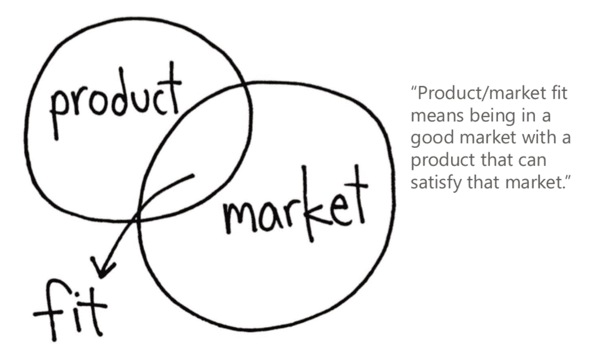

# 你如何知道你是否达到了产品/市场的契合度？萨钦·雷基

> 原文：<http://www.sachinrekhi.com/blog/2015/12/14/how-do-you-know-if-youve-achieved-product-market-fit?utm_source=wanqu.co&utm_campaign=Wanqu+Daily&utm_medium=website>

[Marc Andreessen](https://twitter.com/pmarca)

最初引入产品/市场契合的概念

[this post published in 2007](https://www.linkedin.com/pulse/marc-andreessen-product-market-fit-startups-marc-andreessen)

。这是一个非常有帮助的概念，可以解释为什么初创公司的产品在左右两边都失败了，同时也为你提供了一颗指引北极星，告诉你最终需要实现什么才能建立一个成功的初创公司。

马克·安德森写道:

> 产品/市场匹配意味着在一个好的市场中拥有一个能满足该市场需求的产品。
> 
> 当产品/市场不匹配时，你总能感觉到。客户没有从产品中获得足够的价值，口碑没有传播开来，使用率没有快速增长，媒体评论有点“废话”，销售周期太长，很多交易都没有成交。
> 
> 当它发生时，你总能感觉到产品/市场的契合。客户购买产品的速度与您生产产品的速度一样快，或者使用量的增长速度与您添加更多服务器的速度一样快。客户的钱在你公司的支票账户上堆积如山。你正在尽可能快地招聘销售和客户支持人员。记者打电话来是因为他们听说了你的热门新东西，他们想和你谈谈。你开始获得哈佛商学院颁发的年度企业家奖。投资银行家正在监视你的房子。你可以在巴克餐厅免费吃一年。

因此，Marc 将创业初期对北极星的终极追求定义为寻找产品/市场契合度。

[Steve Blank](https://twitter.com/sgblank)

和

[Eric Ries](https://twitter.com/ericries)

随后提供了以下方面的具体指导

[Customer Development](http://www.amazon.com/Four-Steps-Epiphany-Steve-Blank/dp/0989200507)

然后

[Lean Startup](http://www.amazon.com/Lean-Startup-Entrepreneurs-Continuous-Innovation/dp/0307887898/ref=sr_1_1?s=books&ie=UTF8&qid=1450116132&sr=1-1&keywords=lean+startup)

有助于提供指导寻找产品/市场匹配的过程的方法。

然而，我经常会被问到，你如何知道你是否真的达到了产品/市场的契合度？Marc 提出的上述感觉通常不容易辨别，尤其是在最初阶段，除非你处于拥有或不拥有产品市场的极端。

我发现，知道你是否找到了产品/市场契合度的最佳信号是对可重复性、可发现性和可扩展性的测试。

**Repeatability**

第一个信号是确保当你向更多的用户展示你的产品时，你看到你的产品在可重复的基础上与这些用户的子集产生共鸣。你很少会发现你的产品能引起每个用户或组织的共鸣，这没关系。但与此同时，如果你没有看到你在不断地找到与解决方案产生共鸣的用户，那么你还没有找到合适的产品/市场。与你的产品产生共鸣的用户或组织的精确定义将取决于你的创业公司目前所处的阶段。在最早的阶段，这是愿意加入你的试点/测试的证据。一旦你有了一个测试产品，这就是团队参与和保持。一旦你实现了你的商业模式，你就会表现出愿意为付费产品付费的意愿。

**Findability**

在最早阶段通常会发生的是，你会看到与你的产品相当不一致的共鸣。接下来，手头的任务就变成了确定特定的用户子集是否与解决方案产生共鸣，以及该用户子集的属性是什么。然后，如果您可以将解决方案部署到新的合格用户子集，并发现您确实在这些用户中找到了产品共鸣的可重复性，您可能已经找到了与产品共鸣的更好的目标受众定义。

但是这直接把我们带到了第二个信号，那就是你的目标受众的可发现性。这里的信号是您是否能够始终如一地找到与解决方案有高度共鸣的用户或组织。一些目标受众特征很容易找到。例如，如果你发现你的解决方案引起了财富 500 强公司的共鸣，那么你可以很容易地详细列出每一家财富 500 强公司。如果您发现您的解决方案适用于特定行业的公司，您可以找到这些行业的公司列表。如果你发现你的产品能引起特定角色用户的共鸣，那么你就可以专门针对这些角色的人做广告。

但是如果你发现你的产品似乎能引起具有特定心理特征的人的共鸣，你可能会发现很难反复找到这样的用户。或者，如果在每一批新用户中，对产品产生共鸣的用户比例仍然很低，那么你的可发现性信号仍然很低。

**Scaleability**

一旦你的解决方案获得了目标受众的可重复性和可发现性，剩下的信号就变成了目标受众的可扩展性。事实上能找到的观众有多大？这是您希望利用可找到的目标受众属性的地方，然后根据这些特定属性估计总地址市场。受众是否足够多，足以支持你创业的最终目标？有时候，有明确的方法可以根据人口统计学或公司地理属性(如年龄、性别、角色、行业、公司规模等)来估计受众。然后，您可以利用可用的数据来支持评估。通常情况下，你会发现目标受众的属性并不容易估计。在这里，你最好的选择是利用其他产品的可比数据或具有这些属性的可识别受众。

确保产品/市场契合度的关键是确保用户或组织与你的产品产生共鸣的可重复性强，找到这些用户或组织的可发现性强，以及在精确定义目标受众方面有足够的可扩展性。当你评估产品/市场是否适合你的解决方案时，评估所有这三个信号是很重要的，而不是线性地对待每一个，否则你可能会以一个非常常见的情况结束:你已经发现产品/市场适合一些小受众，但远没有大到足以达到你的创业愿望。