# 什么是用户入职？

> 原文：<http://appcues.com/blog/atlassian-5-billion-dollar-user-onboarding-magic/?utm_source=wanqu.co&utm_campaign=Wanqu+Daily&utm_medium=website>

第一印象很重要。用户入门体验是新用户对你的产品的第一印象。对于新用户来说，入职可能比用户旅程中的任何其他时刻都更重要，这是一次成败攸关的体验。
‍
让用户正确参与，你可以期待各种各样的好事——比如更好的参与度和保留率，更快乐和更成功的客户，以及更有利可图的产品。如果做错了，你会有很高的用户放弃率、不可持续的收入流失、负面的产品评论和收益递减。(恐怖的东西！)
‍
好消息是，我们多年来一直在研究、撰写和帮助公司实现卓越的用户入职体验，我们非常乐意分享我们的经验。
‍
在这份全面的指南中，我们将澄清一些关键术语，解释为什么用户入职很重要(对用户和企业都是如此)，涵盖 6 个用户入职最佳实践，看一看来自真实产品的 4 个优秀的入职示例，最后，了解如何准确衡量用户入职的成功。‍
我们开始吧！

### 用户入职的基础知识

你必须先走，然后才能跑。因此，在我们深入探讨如何创造一种非凡的入职体验之前，让我们先来看看什么是真正的入职(以及在你创造这种体验时最重要的是什么)。

### 什么是用户入职？

首先，什么是用户入职？
‍
用户入职是**引导新用户发现你的软件产品或服务价值**的过程。
‍
用户入职体验从有人开始注册你的产品开始，到第一个啊哈时刻——他们意识到你的产品将如何以这样或那样的方式改善他们的生活——等等。‍
良好的用户入门体验不仅仅是教新用户如何使用软件。它教他们如何成功地使用它，以满足他们独特的目标。

在用户入职体验结束时，用户应该:

1.了解产品的价值(最好是通过第一手经验或使用获得)。

2.准备好自己成功使用核心产品所需的信息(或者知道在哪里可以快速方便地找到这些信息)。

<iframe src="https://www.youtube.com/embed/PatIqbGEQe4?rel=0&amp;controls=1&amp;autoplay=0&amp;mute=0&amp;start=0" frameborder="0" allow="autoplay; encrypted-media" allowfullscreen="" title="What is user onboarding?">视频</iframe>

### 用户入职体验≠产品参观

了解什么是用户入职*不是也很重要。*具体来说，“用户入职”并不等同于“产品之旅”(或者其他任何一种入职模式)。
‍
用户入职不仅仅是指出关键特性(尽管这肯定是流程的重要部分)。完整的用户入职体验可能包括销售演示、电子邮件、客户成功拓展、边做边学模式等，以及[产品参观和演练](https://www.appcues.com/blog/the-5-best-walkthrough-examples)。
‍
最好的用户入职体验是[全渠道](https://www.appcues.com/blog/omnichannel-user-onboarding)——包括跨多个渠道和接触点的有凝聚力的、周到的信息传递——并考虑到整个用户旅程。

### 啊哈时刻

不管它看起来有多光滑，如果一个用户入职体验不能引导新用户到他们的第一个[啊哈时刻](https://www.appcues.com/blog/aha-moment-guide)，它就不是好的入职体验。简单明了。
‍
那是因为啊哈时刻是把评估用户变成激活用户的开关。
‍
说得更直接一点，顿悟时刻是突然领悟或发现的时刻**。**在软件领域，这是一个关键时刻，新用户第一次意识到你的产品的价值以及他们为什么需要它。

[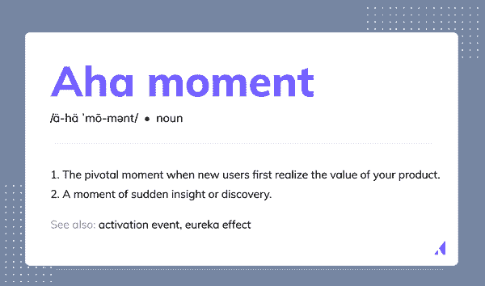](#)

### 啊哈时刻在上下文中是什么样子的？

aha 时刻对每个产品和每个用户来说都是独一无二的。你不能把另一个 app 的啊哈时刻复制粘贴到你的用户旅程中。‍:也就是说，有哪些顿悟时刻的例子？在上下文中，那一刻是什么样的？

对于一个语言学习 app 来说，典型的用户历程可能如下:

1.下载应用程序

2.开始第一堂西班牙语课

3.学习一个新单词(" *manzana"* = "apple")

4.多学一些与食物相关的词汇

5.通过重复练习进行练习

6.为一个简单的句子选择正确的翻译(" *Yo como una manzana"* = "我吃一个苹果")

7.意识到他们已经通过上下文学习了 *como* 的意思—****啊哈时刻✨**** 

**8.完成第一课，查看祝贺模块** 

**9.创建帐户继续学习** 

**[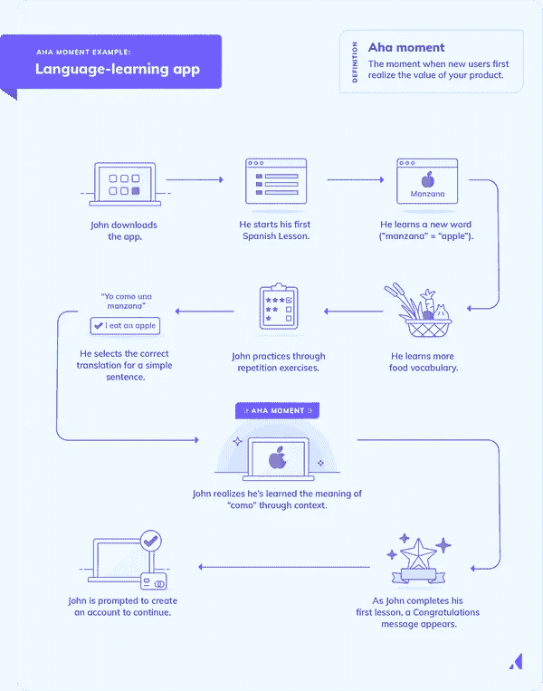](#)

学习一门新语言的过程已经包含了许多啊哈时刻，因为学习者通过重复和演绎推理的结合来拼凑语言规则和模式。在上面的例子中，应用程序的啊哈时刻自然与语言洞察力的时刻相吻合。当用户意识到这个应用程序帮助他们以自然的方式学习一个新单词时，他们经历了一个双重的啊哈时刻。
‍
想要更多啊哈时刻的例子吗？看看下面的信息图:

[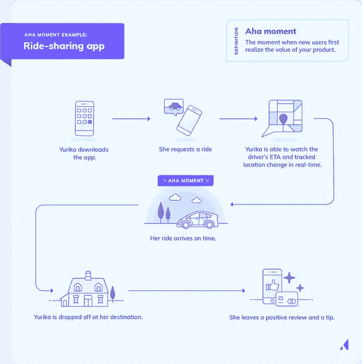](#)[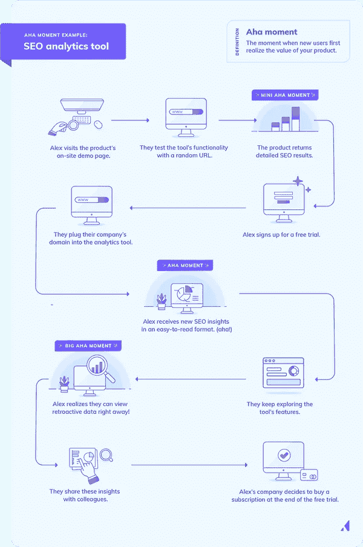](#)

这里的教训是，每个应用程序和每个用户的啊哈时刻都是不同的。一些用户可能会在旅程中的某个时刻体验到 aha 时刻，而另一些用户会在以后体验到。例如，在上面的图片中，Yurika 经历了一个啊哈时刻，她被准时接走了；但迈克尔可能是一个更怀疑的第一次用户，他的啊哈时刻可能会发生在他下车的时候。
‍
你的用户甚至可以在一次入职培训中经历*多个*啊哈时刻。
‍
我们将在下面更详细地介绍如何为你自己的产品定义啊哈时刻和激活事件。现在，只要记住 aha 时刻对于每个产品都是独一无二的——这意味着用户的加入也应该是独一无二的。

### 价值实现时间

另一个需要了解的重要入职术语是[价值实现时间](https://www.appcues.com/blog/time-to-value) **(或 TTV)** 。
‍
简而言之，价值实现时间是**新用户体验价值**(或达到他们的第一个啊哈时刻)所需的时间。

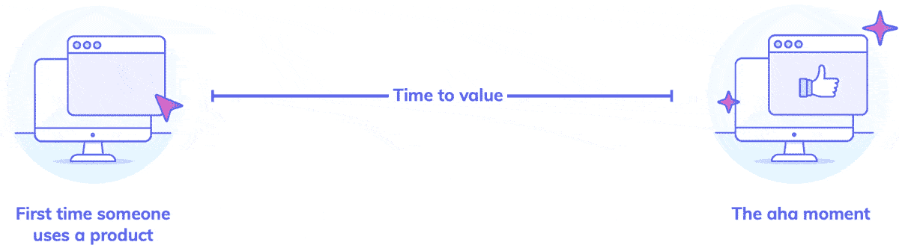

对于一些产品来说，好处是立竿见影的——就像下雨时买的雨伞。你保持干爽的那一刻就实现了。有时候，付出一点努力就会有好处，比如做瑜伽来增加灵活性。
‍
实现价值的时间取决于你提供的产品或服务的种类，但它通常分为两类:

### 立即或短时间实现价值

短 TTV 的一个例子是 HubSpot 的[网站评分员](https://website.grader.com)——只需插入你网站的 URL，就可以获得你网站在社交媒体、搜索引擎优化和潜在客户生成等类别的分数。该工具为用户提供即时价值，并作为 HubSpot 的一个强大的潜在客户生成工具。

### 价值实现时间长

大多数 SaaS 产品都属于这一类。仅仅获得产品并不能带来预期的好处，还需要采取进一步的行动。您的客户可能需要邀请同事进行协作，或者导入他们的客户数据，或者在他们开始意识到产品可以为他们带来什么好处之前完成您的入职培训。以 Expensify 这样的产品为例。注册费用管理软件没有价值。当用户提交他们的第一份无障碍费用报告时，啊哈时刻到来了，这是一项需要几个步骤才能完成的任务。‍:人们的耐心是有限的——如果他们不能迅速意识到价值，他们很可能会觉得自己的时间被浪费了。如果他们已经为你的产品付费了，那就是时间和金钱花在了看不见的回报上。你创造价值的时间越长，你看到的客户流动就越多。
‍
这就是为什么用户入职的目标之一应该是尽可能缩短价值实现时间。** 

### **用户入职体验与产品参观的区别**

**了解什么是用户入职*不是也很重要。*具体来说，“用户入职”并不等同于“产品之旅”(或者其他任何一种入职模式)。
‍
用户入职不仅仅是指出关键特性(尽管这肯定是流程的重要部分)。完整的用户入职体验可能包括销售演示、电子邮件、客户成功拓展、边做边学模式等。—以及[产品参观和参观](https://www.appcues.com/blog/the-5-best-walkthrough-examples)。
‍
最好的用户入职体验是[全渠道](https://www.appcues.com/blog/omnichannel-user-onboarding)——包括跨多个渠道和接触点的有凝聚力的、周到的信息传递——并考虑到整个用户旅程。** 

### **为什么用户入职很重要？**

**我们以前说过，现在再重申一次:用户入职是客户旅程中最重要的部分。** 

<iframe src="https://www.youtube.com/embed/4NAhcZT_dls?rel=0&amp;controls=1&amp;autoplay=0&amp;mute=0&amp;start=0" frameborder="0" allow="autoplay; encrypted-media" allowfullscreen="" title="Why user onboarding is the MOST important part of the customer journey">视频</iframe>

**对于使用免费增值或免费试用收入模式的 SaaS 和产品导向型公司来说，这一点尤其如此。人们越快发现并理解你的产品的核心价值，他们就越有可能成为热情的(且有利可图的)顾客。
‍
不仅如此，你的整个团队都花时间来设计、开发、推广和销售你的产品。为什么要破坏第一印象，冒着一开始就失去用户的风险呢？
‍
这里有四个理由[为什么用户入职很重要](https://www.appcues.com/blog/why-user-onboarding-matters-now)——为什么最好的软件也需要周到的入职体验:** 

### **1.用户入职有助于建立关系**

**我们与许多客户成功经理交谈过，他们知道积极的早期体验可以为整个客户关系定下基调。这些 CSM 还明白，更好的入职培训会加快产品的采用，这反过来会促进持续的用户参与和客户忠诚度。‍:这是因为一旦人们意识到你服务的价值，开关就会打开。到达那个啊哈时刻或激活事件通常是将坚持使用你的产品的用户——并成为快乐付费的客户——与那些最终搅动的用户区分开来。** 

### **2.良好的入职会创造动力和动机**

**不管你认为你的产品有多直观，总有一个学习曲线。
‍
熟悉一个新的用户界面并开发从产品中实现价值所需的技能需要时间。入职培训的作用是确保这个过程不会花费*太多的时间——如果花费了太多的时间，这些时间会被一些小胜利打断，以保持用户的积极性。
‍
克里斯·萨维奇，Wistia 的联合创始人兼首席执行官，[解释了为什么小胜重要](https://wistia.com/learn/culture/growing-your-flatsides) :*** 

**“学习弹钢琴很难。大多数人都无法走出绝望的低谷。这是因为要真正享受弹钢琴的乐趣，你需要能够即兴创作，创作自己的歌曲，用耳朵听曲子，用你的创造力娱乐自己...‍:变得更好的秘诀在于:你必须衡量那些会在前进的道路上给你带来快乐的小成功，这样你就能穿越绝望的山谷。”** 

**SaaS 产品不应该要求和学习弹钢琴(你能想象吗？！)但是将用户的入职体验分成小的成功从来都不是一个坏主意。
‍
这是因为人们被一种叫做[目标梯度效应](https://www.appcues.com/blog/user-psychology-ux-design-principles)的东西所激励。我们越接近达成目标，我们就越努力去完成它。
‍
伟大的入职体验是通过激励用户走出绝望的低谷来实现的。将入职之旅分解成更小的任务，提醒用户他们在这个过程中进行了多远，并奖励微小的成就，这大大增加了用户完成所有必要的入职任务并为事后成功做好准备的可能性。** 

### **3.用户入职提高了参与度、采用率和保留率**

**长话短说，伟大的客户拥有伟大的用户入门体验。他们更有可能使用你产品的其他部分，并与它保持更长时间的接触。
‍
那是因为优化首次用户体验对整个用户旅程有着深远的影响。
‍
更好的入职会带来更高的激活率，这又会转化为更多的产品采用率、更高的保留率以及更多忠诚客户的拥护——所有这些都会随着时间的推移呈指数级增长。

事实上，第一周用户留存率[提高 15%](https://www.appcues.com/blog/reduce-customer-churn)可以在 10 周后复合成将近两倍的留存用户数。任何关注用户保持率的人都知道，这个指标的 2 倍是巨大的。** 

### **4.用户希望获得出色的入职体验**

**投资入职体验的另一个原因？现代用户期待它。‍:糟糕的入职不仅仅是一个设计问题，还是一个商业问题。当用户有负面的入职体验时，他们不会认为“这是糟糕的入职”他们认为，“这是一个糟糕的产品。”赌注很高。
‍
免费试用和免费增值产品的普遍存在意味着许多人不再购买没有首先看到价值的产品。即使你设法建立了足够的品牌形象，以至于你可以在进入前要求付费，人们已经习惯了优秀用户的加入。新用户*希望*你解释你的应用程序如何工作，以及他们如何使用它来快速有效地解决他们的问题。‍
无法提供有效的入职体验意味着你会失去优秀的客户，否则他们可能会逗留数月或数年。** 

### **用户入职最佳实践**

**到目前为止，我们已经讨论了什么是用户入门以及它为什么重要。现在是时候采取战术了。
‍
在下一章中，我们将回顾 6 种用户入职最佳实践，它们对于设计和实施有效的大规模入职体验至关重要。** 

<iframe src="https://www.youtube.com/embed/03P6UYokxzY?rel=0&amp;controls=1&amp;autoplay=0&amp;mute=0&amp;start=0" frameborder="0" allow="autoplay; encrypted-media" allowfullscreen="" title="6 user onboarding best practices for 2022">视频</iframe>

### **跨团队交流和协作**

**向那些希望自己能直接投入到设计一款华而不实的 UX 的人道歉。因为无论你是第一次实施入职培训，还是试图改善现有的体验，你首先需要建立跨职能沟通和协作的渠道。
‍
有效的入职战略需要设计、产品和营销团队之间的跨职能协作。它还涉及电子邮件活动、应用内消息、用户测试和分析。

创造更协作环境的方法包括:** 

**将您的一些客户经理转移到产品单元，成为客户的代言人** 

**创建一个定期开会的跨职能“工作队”**

**让面向客户的团队成员直接参与创建和部署应用内流程和入职电子邮件创建定期会面的跨职能“任务小组”** 

**创建一个定期开会的跨职能“工作队”**

**你可以从无数的角度来解决这个问题，但没有一个正确的方法来打破你公司的孤岛。重要的是你以某种方式去做。因为把这第一点做好是后面所有事情的要求。** 

### **了解用户旅程**

**如果你不了解用户的旅程，你就无法设计一个好的入职体验。这就是[用户旅程映射](https://www.appcues.com/blog/user-journey-map)发挥作用的地方。
‍
找到你的啊哈时刻——以及如何帮助用户更快到达那里——的关键是向后映射:看看那些已经从你的产品中获得价值的成功用户，找出是什么让你的保留用户(也就是你的激活用户)与那些制造麻烦的人区分开来。
‍
使用群组分析和产品分析，注意你行为数据中的模式，以识别保留用户在你的产品中采取的早期关键行动。然后，弄清楚这些行动与长期客户保持的相关性有多强。** 

**[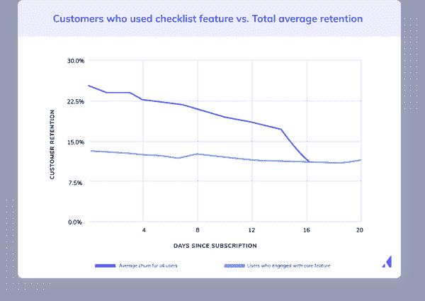](#)

通过与用户交谈，使用分析工具(如 Heap、Mixpanel 或 Amplitude)观察他们的行为，并利用面向客户的团队成员的洞察力，验证您关于哪些行为重要的假设。例如，‍
[在 Facebook](https://www.youtube.com/watch?v=raIUQP71SBU) 上，成长团队将用户分成两组:成为活跃用户的人(日复一日地使用 Facebook)和没有成为活跃用户的人。他们发现了一些令人惊讶的事情。参与用户在注册的前 10 天内至少添加了 7 个好友。这个数字成为他们的激活指标。
‍
确定预测指标是一个非常强大的驱动力，让公司的每个人都围绕着让新用户在入职期间尽快添加 7 个好友的目标。最终，确定这一指标有助于推动增长引擎，使脸书的用户数达到 10 亿以上。

### 关注价值

还记得微软 Office 领域过于急切的管家 Clippy 吗？Clippy 为他的微软队友所做的感到自豪，并抓住一切可能的机会展示一个又一个的功能。

表面上看，Clippy 听起来是个很棒的主意。但是很多时候，Clippy 想和用户谈论他们不关心的功能——那些不会改善他们生活的功能。更糟糕的是，Clippy 分散了用户的注意力，使他们无法找到并定期受益于微软 Office 产品的核心价值。

微软

这是许多入职经历都会陷入的一个陷阱:说得太多。‍:事实是，用户并不像你那样关心你的功能。他们关心你的产品如何让他们的生活变得更好。是的，用户会很乐意花时间和精力去学习你的整个产品——但是只有在他们亲身体验了它的价值之后。
‍
这就是为什么用户入职的目标应该是展示这种价值，而不是聚焦于你产品的每一个细节。
‍
换句话说，**不要为了炫耀特性而炫耀特性**。不要拖着新用户浏览每一个产品特性，其中大部分直到几个会议之后他们才需要。
‍
相反，找出用户需要熟悉的功能和动作，以达到他们的啊哈时刻，并围绕这一点进行你的入职培训。一旦灯泡打开，用户意识到你的产品如何解决他们最迫切的问题，那么你可以向他们介绍额外的功能，帮助他们提取更多的价值。

### 使用数据来个性化体验

在 1998 年接受《华盛顿邮报》采访时，杰夫·贝索斯解释说，电子零售的成功取决于为每个顾客创造独特的体验。“如果我们有 450 万顾客，我们不应该只有一家店，”他告诉邮报；“我们应该有 450 万家店铺。”
‍
当然，[个性化用户体验不仅仅是为了电子商务](https://www.appcues.com/blog/user-onboarding-personalization)。如果你小心翼翼地保护你的网飞账户，以免家庭成员“搞乱”你的推荐，或者如果你期待每周一收听由算法生成的“每周发现”Spotify 播放列表，那么你已经体验到了个性化在工作中的力量。‍:当涉及到你自己的产品时，这种个人拥有感和快乐感可能意味着忠诚客户和流失客户之间的区别。‍:当然，“个性化”现在是个时髦的词。但是，当你回到它的根本，个性化是让体验为一个人工作——也就是说，一个特定的人。
‍
要做到这一点，先从需求分析开始。对你遇到的不同类型的用户做一个有意义的区别清单。这不一定要由你的角色来定义。取而代之的是，寻找划分你的用户的变量。出现的差异可能是角色和技术经验水平的混合，也可能与角色和知识有关。
‍
使用从需求分析中获得的洞察以及用户声明的数据(无论是与他们的职位、偏好还是目标相关的数据)，通过细分和定位为每个用户个性化用户体验。这将使您能够交付更相关的入职体验，从而引起更深刻的共鸣，并加快用户实现价值的时间。

### 迭代，迭代，迭代

如果你能设计出一些东西，并在第一次尝试时就让它变得完美，那不是很好吗？如果那个完美的东西*永远保持*完美和相关不是更好吗？
‍
不幸的是，软件不是这样的。世上没有完美的靶心，因为目标总是在移动。‍
没有人愿意承认的关于产品设计的事情是，它永远不会被完成。好的 UX 是频繁实验、分析和迭代的产物。用户入职体验不是一劳永逸的事情。它们应该随着产品的变化、公司目标的转变以及用户需求的发展而变化。类似地，它们的影响需要被监控、测量和优化，以提供能够随着用户需求和期望的发展而跟上的用户体验。
‍
你应该有一个计划来跟踪和分析你的入职情况——以及一个快速和频繁迭代的过程，以消除摩擦点并不断缩短价值实现时间。
‍
你的支持 UI 模式需要快速且易于执行，否则它们永远不会保持最新、相关或有效。事实上，这就是像 [Appcues](https://www.appcues.com) 这样的产品存在的原因——让创造卓越的入职体验更快更容易。使用第三方工具可以让您的非技术团队自主地快速进行更新，而不需要尝试将更改融入开发冲刺周期。

### 从熟悉的 UI 模式开始

一些设计师和产品经理看不起熟悉的学习模式。想法是这样的:如果你设计了一个伟大的 UI，你不应该需要 onboarding 模式。但是，即使是最好的 UX 也需要入职。这也是为什么在反复试验之后，人们会一次又一次地回到工具提示、模态、热点、幻灯片和清单的原因。

[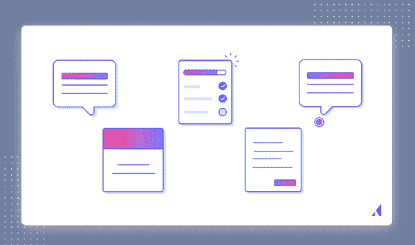](#)

这些模式屡试不爽——它们持续存在是有原因的。它们灵活、有效且易于实现(尤其是如果您使用像 [Appcues](https://www.appcues.com/) 这样的工具，就不需要为每个元素编写和更新代码)。
‍
更重要的是，用户熟悉这些模式，并认为它们是学习的辅助工具。这种自动识别可以加快学习过程，从而提高入职效率。‍:如果你有足够的资源，尽一切可能尝试新的界面。但是，如果像许多其他产品一样，您发现经验证的入职模式最适合您的用户，我们建议您使用第三方工具来快速创建和更新您的入职体验。** 

### **用户登录 UI 模式的流行类型**

**这 5 种流行的用户入职模式被证明可以吸引、教育甚至取悦新用户。** 

### **工具提示**

**[工具提示](https://www.appcues.com/ui-patterns/tooltips)是应用程序内的小消息，可以单独使用，也可以作为一个系列的一部分。它们非常适合自助服务演练、上下文相关的产品教程和新功能发布。** 

**[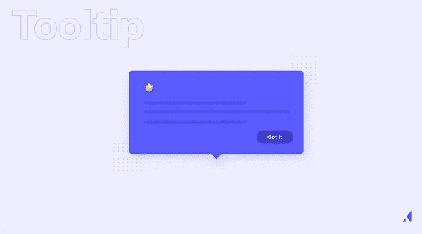](#)

### **模态**

模态是位于应用程序主界面之上的大型模式。它们非常适合欢迎新用户、介绍关键功能和传递重要信息。

[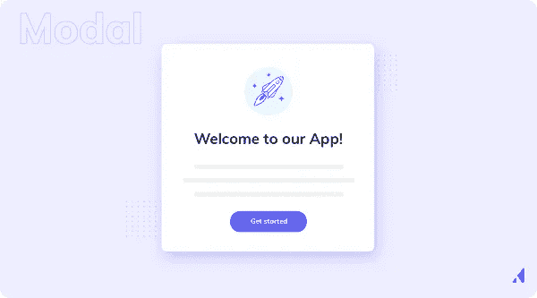](#)

### **幻灯片**

[滑出](https://www.appcues.com/ui-patterns/tooltips)是从用户屏幕一侧滑出的中型 UI 模式。像情态动词一样，它们也非常适合欢迎用户、发布应用内公告和提示行动。

[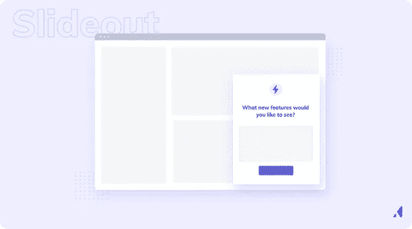](#)

### **热点**

[热点](https://www.appcues.com/ui-patterns/tooltips)是鼓励用户关注某些设计元素或功能的小点或信标。它们是鼓励探索、创造更多自助服务体验和减轻支持负担的理想选择。

[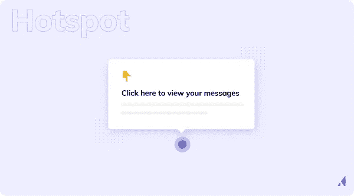](#)

### **清单**

[用户入职清单](https://www.appcues.com/ui-patterns/checklists)是让用户入职和参与的简单而有效的工具。事实上，它们是经过科学证实的促进激活和保持的。

[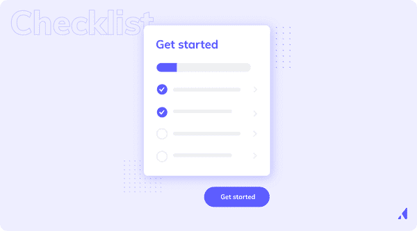](#)**

### **如何成功接纳新用户**

**良好的用户入职对用户的终身价值具有级联效应。如果你通过更好的入职培训将第 1 周的保留率提高 15%，你会看到来自这些用户的收入增加 [40%。因此，花费时间和金钱来开发吸引用户的入职体验是值得的。

这里有一些我们学到的技巧，可以让你的入职尽可能有效地长期留住你的用户。](https://www.appcues.com/blog/user-onboarding-customer-journey)** 

### **让他们享受人生的第一个顿悟时刻**

**啊哈时刻是新用户使用你的产品并真正看到它带来的价值的时刻。到目前为止，你的用户已经得到了 x、y 和 z 的承诺，但是现在他们有机会真正看到了。一旦他们体验了你的产品能做什么，他们就会被吸引住。设计入职流程时，您的目标是让用户尽可能快地到达那里。如果你把注意力集中在修剪掉所有不必要的东西，你会不可思议地迅速到达顿悟时刻。保险公司[柠檬水](https://www.lemonade.com/)可以让用户在几分钟内从他们的主页上找到一个报价[。](https://www.reallygoodux.io/blog/lemonade-user-onboarding)** 

**[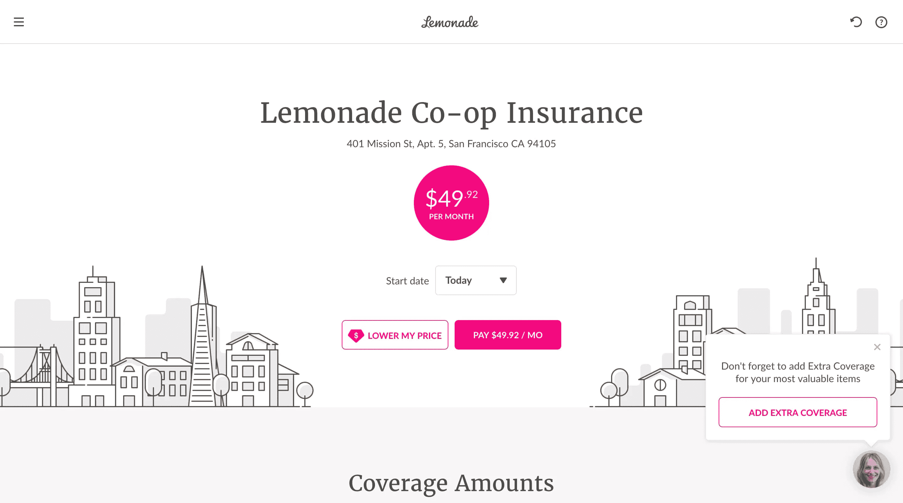](#)

图片来自柠檬水

回答几个问题，输入你的电子邮件，很快，你就得到了一份保险报价。用户可以立即得到他们想要的:一个没有麻烦的在线保险体验。Lemonade 简化了入职体验，只询问提供准确保险报价所需的问题。你甚至不用签到。设计入职计划时，考虑如何简化流程。虽然产品教育很重要，但是许多用户在投入时间学习你的产品之前希望看到价值。通过向用户展示你的产品将如何改善他们的生活来奖励那些在你的产品上冒险的用户。如果你这样做了，用户将更有可能留下来听你要说的其他内容。

### 使用细分数据创建个性化的学习路径

不是每个用户都会以同样的方式使用你的产品。您的入职培训需要反映这一点，为每个用户提供一条学习路径，帮助他们实现自己独特的目标。为了实现这一点，你需要通过细分用户来个性化你的入职培训。

细分就是你通过共享特征来划分你的用户群。因此，如果你是一个通过人工智能帮助运动员提高的 SaaS 产品，你可以将新用户细分为棒球运动员、曲棍球运动员和高尔夫球员。然后，你可以向每个细分市场展示他们如何使用你的应用程序，根据他们所从事的运动来提高挥杆水平。这样，高尔夫球手在到达他们关心的部分之前，不必学习如何挥动棒球棍。

视频定制师 [Bonjoro](https://www.bonjoro.com/) 在[他们的入职](https://www.reallygoodux.io/blog/bonjoro-recommendations-for-product-experience)(不包括运动员)中就是这么做的。

[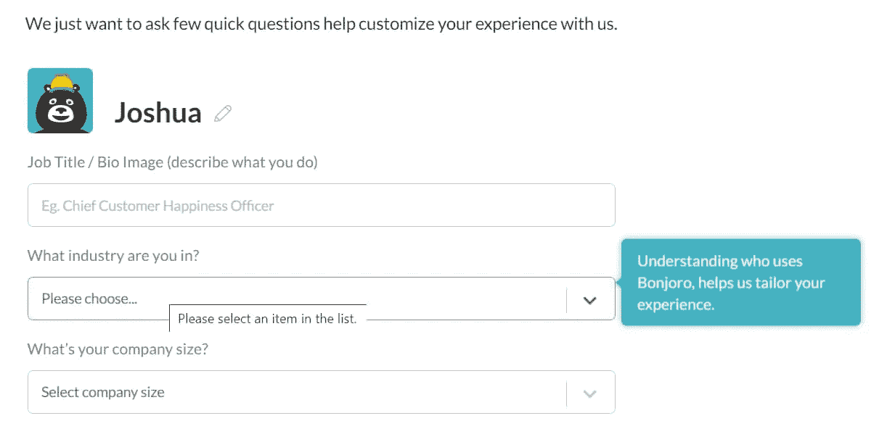](#)

*图片来自邦乔罗*

一点都不难。Bonjoro 会在设置的第一页询问用户所在的行业。他们还解释了为什么他们需要知道，这样用户就不会觉得他们的数据被挖掘了。然后，他们定制他们的入职培训，向用户展示对他们的细分市场最重要的功能和用例。就像这样，他们有一个个性化的入职流程，鼓励用户在第一天之后继续留在公司。最棒的是任何人都可以做到。了解更多关于[入职个性化](https://www.appcues.com/blog/user-onboarding-personalization)的信息。

### 用 UX 文案教育和激励他们

没有精彩的 UX 文案，最好的入职战略就什么都不是。UX 文案是你在整个入职过程中(以及产品的其他部分)用来教育用户、向他们展示如何做事、鼓励他们采取下一步行动的所有文本。

[Wise 的货币转账产品](https://wise.com/)使用 UX 副本来揭开他们的货币兑换魔法，让人们为他们将要存的钱而兴奋不已。

[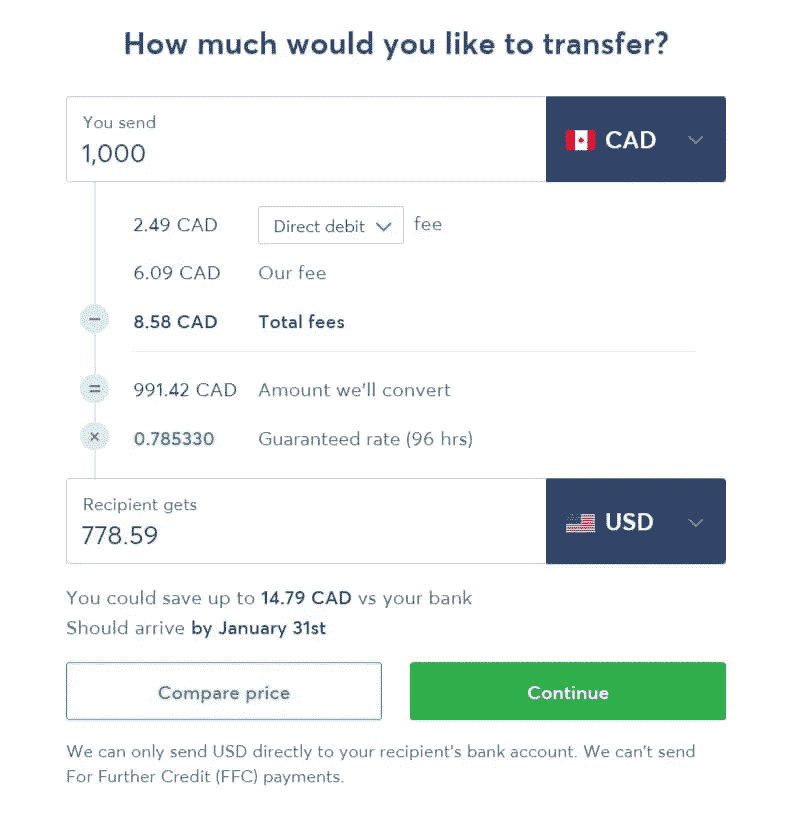](#)

*图片来自睿智的*

这张图表上的副本都是简单的英语，所以你确切地知道你支付多少，你得到多少，以及费用是多少。同样，没有词被浪费。他们在页面上包含的每个单词都有价值，所以你更有可能阅读每个单词而不是略读。最后，它们包括你能省多少钱，什么时候能拿到钱，这样你就能对使用他们的产品节省更多钱感到兴奋。当起草你自己的 UX 文案时，考虑以怀斯为榜样。你的文案应该清晰、简洁、有影响力。做得好，你的用户入职将更好地说服你的用户留下来，而不是流失。

### 使用工具优化您的入职 UX 和用户界面

工具让创建入职流程变得更加容易。无论你是用它们来收集用户数据，跟踪点击，还是仅仅设计流程，它们都可以为你节省大量的时间。不要把每件事都做得太难，考虑投资一些工具，这样你就可以把你的时间和精力放在用其他方式改进你的产品上。

[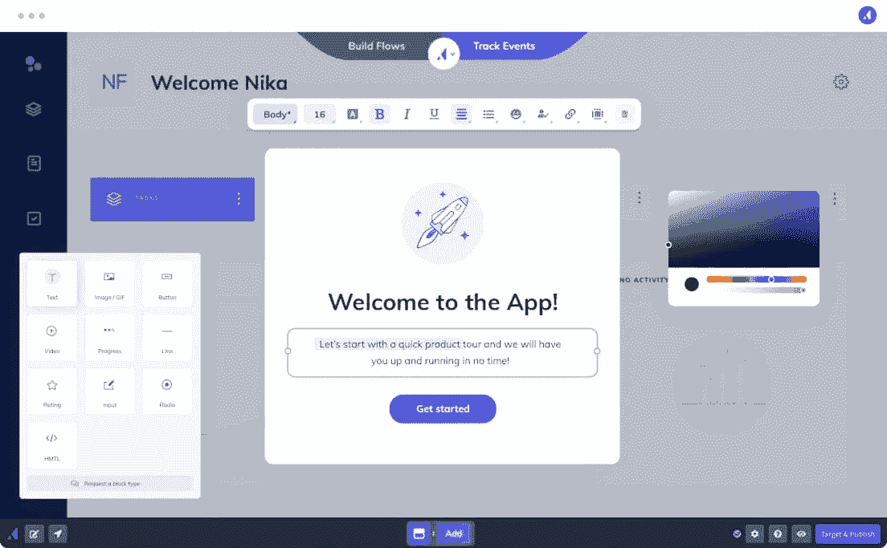](#)

### **您可以使用以下工具来简化入职创建流程:** 

[Appcues](https://www.appcues.com/use-case/user-onboarding-software) :使用我们的无代码构建器构建无障碍的入职体验，包括应用内消息传递、NPS 调查和个性化流程。然后，使用洞察力来衡量您的入职流程如何提高产品采用率，以便您可以继续调整和改进您的工作。

[Mailchimp](http://mailchimp.com/) :在整个入职过程中，自动向用户发送个性化电子邮件，让您的产品始终保持领先并不断发展。

优化地:对你的入职流程的每个方面进行 A/B 测试，以完善你的用户界面和 UX。

[Clearbit:](https://clearbit.com/) 在入职期间收集用户数据，以便您在未来更轻松地创建个性化的入职体验。

[Typeform](https://www.typeform.com/) :创建并添加深度调查，以了解受众用户旅程的每一步。

Zendesk :为用户提供文档数据库或实时代理，帮助他们回答入职过程中可能遇到的任何问题。

如果您想了解更多关于技术如何改善您的入职体验，请查看我们的[最佳入职工具](https://www.appcues.com/blog/user-onboarding-tools)列表。** 

### **出色的用户入门示例**

**至此，我们已经涵盖了重要的定义、最佳实践，以及最初投资入职培训的原因。现在你可能在想:所有这些知识都很棒，但我仍然不确定什么样的入职培训最棒。‍
让我们来解决这个问题吧！下面是 4 个来自真实公司的优秀用户入职体验的例子。** 

### **1.Asana 的用户入职演练**

**项目管理工具 [Asana](https://asana.com) 帮助团队组织、跟踪和管理他们在网络或手机上的工作。他们的产品的特点是清晰、简单的界面，有趣的细节和流行的颜色。
‍
新用户会得到一个简洁的、行动驱动的入职培训，引导他们创建第一个任务——这是一个清晰的啊哈时刻。** 

### ****我们喜欢 Asana 的什么:**** 

**微妙但有效。一系列脉动热点吸引了对特定元素的注意，这使新用户熟悉 Asana 的 UI。它是规定性的，但没有牺牲发现感。** 

**演练随着用户采取有意义的操作而进行，每个提示都要求用户单击页面上它所指向的元素。行动驱动的方法引导用户完成初始设置——创建任务——帮助他们比自己更快、更自信地实现啊哈时刻。** 

**演练以工具提示结束，该工具提示向用户显示他们将来可以在哪里找到自助帮助。为用户提供解决他们自己的问题所需的资源，可以减少支持负担和用户的挫折感。** 

### **2.科尔多瓦美丽的入职流程**

**[Qordoba](https://qordoba.com)——一个面向企业的人工智能写作助手——使用 Appcues 创建了一个美丽的用户入职流程。
‍
科尔多瓦用 5 款设计精美的时装迎接其免费试用用户。简洁的入职流程很好地重申了 Qordoba 的关键价值主张，向新用户介绍了产品的关键部分，并引导他们进行激活活动(安装 Chrome 扩展)。** 

### ****我们喜欢 Qordoba 的用户入职流程:**** 

**插图打破了模态框架，创造了视觉趣味，使每个模态感觉更加动态。更重要的是，这些图片很好地展示了每个特征的价值。** 

**科尔多瓦的品牌响亮而清晰。大量的空白、醒目的标题和连贯的配色方案让这种流动感觉像是整个品牌体验的一部分，而不是一种事后的想法。** 

**•.每个模态顶部的描述性进度指示器让用户确切地知道流程中还剩下多少步骤，以及他们下一步会期望什么。** 

**•.它最终形成了一个明确的指令——安装 Chrome 扩展——充分利用了用户的高度积极性。** 

### **3.Grammarly 的边做边学演示文档**

**‍Grammarly 充当个人写作助手——用户可以通过在线建议检查拼写、语法、单词选择等。
‍
总的来说，我们是 Grammarly 用户体验的忠实粉丝——从电子邮件到升级提示，他们的一切都做得很好——他们的入职体验也不例外。他们聪明的边做边学演示文档在鼓励发现和教导用户如何在受控环境中使用该工具的众多功能方面做得非常出色。** 

### ****我们喜欢 Grammarly 的入职体验:**** 

**演示文档是“边做边学”的绝佳范例从语法上向人们介绍他们需要了解的特性和 UI 模式——一步一步来，忠实于形式。你通过使用它的特性来学习如何使用它的特性。** 

**通过脉动热点指出显著的特征——足够微妙，不会模糊界面，但足够醒目，足以吸引用户。单击时，热点会显示工具提示，对突出显示的功能进行简短说明。** 

**入职培训按顺序展开，带用户浏览应用程序。例如，在您修复了第一行中的拼写错误后，您会被吸引到“使用助手进行更正”按钮，该按钮展示了一个您可能从未探索过的功能。** 

### **4.Duolingo 的渐进参与方法**

**与许多应用不同的是， [Duolingo](https://www.duolingo.com/) 的用户入职体验始于产品，止于注册表单——这是[渐进参与](https://www.appcues.com/blog/gradual-engagement-mobile-app-first-screen)的一个很好的例子。
‍
渐进参与包括尽可能推迟注册——通常直到用户必须注册才能进一步发展的时候。Duolingo 很专业地做到了这一点:他们的 onboarding 流程通过一个快速翻译练习指导访问者，展示了学习一门新语言是多么快速和容易——然后要求用户注册该产品。** 

### ****我们喜欢 Duolingo 的用户入职:**** 

**提示用户选择一个学习目标。让用户在注册之前就承诺一项任务，对用户坚持使用该平台的可能性有着巨大的影响。这是因为人类有一种天生的完成偏好，或者说是想把事情做完的欲望。** 

**进度条有助于设置用户完成一节课的预期工作量。当用户看到他们的进展时，他们可能会更加致力于完成它。进度条利用了目标梯度效应，这表明人们越接近目标，他们的努力就越大。** 

**通过让用户逐渐参与应用程序，实际注册感觉像是更大流程中的一小步，而不是他们实现价值道路上令人沮丧的障碍。** 

### **用户入职指标**

**因为用户入职的影响并不局限于用户旅程的一个部分，所以许多用于衡量和跟踪其功效的指标并不特定于用户入职体验。
‍
除了激活率[和价值实现时间](https://www.appcues.com/blog/time-to-value) (TTV)之外，你还需要考虑一些指标，比如你的采用率和参与率，以及短期和长期保留率。事实上，您可能已经跟踪了许多与用户入职相关的指标。让我们在这个背景下重新审视其中的一些。** 

### ****激活**** 

**激活与啊哈时刻密切相关。[激活事件](https://www.appcues.com/blog/product-activation-metric)是用户需要采取的行动或步骤，以达到啊哈时刻，成为激活用户。识别你的激活事件将帮助你找到你的啊哈时刻，反之亦然。
‍
激活事件可以用 aha moments 无法衡量的方式来衡量——跟踪用户是否执行了某个动作比确定他们是否经历了顿悟和连接的时刻要容易得多。
‍
有 4 种方法来识别你自己的激活事件，以及它导致的啊哈时刻。这些方法相互结合使用，提供了定量和定性见解的健康组合。** 

**1.**向后映射**—看看已经从你的产品中获得价值的用户。保留的用户是激活的用户——找出[是什么将他们与那些搅动的用户区分开来](https://www.appcues.com/blog/product-activation-metric)。** 

**2.**与你的用户交谈**—为了从用户的角度了解你的产品的激活体验，你应该采访最近注册了你的产品的人。** 

**3.**观察用户行为**—观看真实用户会话的记录，找出用户感到沮丧的地方，并确定可能对激活率产生最大影响的修复措施。** 

**4.**利用您的团队**—您的客户成功、支持和销售团队每天都与您的客户交谈。他们坐拥无价信息的宝库，敏锐地意识到用户的许多痛点。喝杯咖啡，问问*他们*将如何改善用户体验。** 

**一旦您审核了您的指标，您就可以使用[分析工具](https://www.appcues.com/blog/product-behavioral-analytics-tools-guide)如 Amplitude、Mixpanel、Heap 等跟踪您的激活率——成功完成您的激活事件的用户的百分比。** 

### ****收养**** 

**激活本身并不是最终目标，它为产品采用铺平了道路，而产品采用本身又是从长远来看至关重要的每项绩效指标的先决条件，这些指标包括客户保留率、用户参与度和收入。它还可以帮助你打开新的增长机会，因为完全购买你的产品的用户会向其他人宣传你的解决方案。

[计算领养率](https://www.appcues.com/blog/measure-optimize-product-adoption)最基本的方法是:** 

*****采用率=新增活跃用户数/总用户数***** 

**就其本身而言，这一公式还有许多不足之处。衡量产品采用的一个更有意义的方法是识别与采用相关的行为，就像你识别激发激活的行为一样。通常这将是一系列促使用户更深入你的产品的行动，或者将你的产品整合到他们的日常生活中——邀请 X 个队友，有 X 个活跃的项目，等等。** 

### ****订婚**** 

**跟踪有多少用户真正参与到你的产品中是整体产品健康的一个很好的指标，这个指标的任何变化都可能是潜在问题的领先指标。

产品参与度应该是一个关键的成功指标，最好通过[群组分析](https://www.appcues.com/blog/cohort-analysis)来可视化。从最基本的角度来说，参与率是特定群体中在一段时间内保持活跃的用户的百分比。
‍
[敬业度](https://www.appcues.com/blog/engagement-rate)的简单公式是这样的:** 

*****参与度=某时间段群组活跃用户数/群组总用户数***** 

**从这里，有许多不同的方法来衡量敬业度，包括:** 

****·按月、周或日的参与度:**这让你对你的产品是否能随着时间的推移成功创造忠诚用户有一个总体的了解。** 

****渠道参与度:**这说明了每种获取方式的效率，有助于您专注于为您的产品带来最佳客户的渠道。** 

****按功能参与:**这有助于你了解用户的价值，并指导你的产品开发工作。** 

**你不必只选择一个——你可以从多个角度来看待参与度，以便更全面地了解你的产品。更好地了解你的参与度，最终可以帮助你留住更多的用户，并建立一个强大的客户群，支持长期增长。** 

### ****粘性**** 

**在软件中，粘性指的是你的产品如何吸引人们的注意力。衡量产品粘性有助于你更全面地了解用户参与度。
‍
最常见的粘性计算方式是:** 

*****【日活跃用户(DAU) /月活跃用户(MAU)***** 

**这揭示了在给定的一个月内用户返回你的产品的频率。这个比率越高，你的产品标签就越大。粘性的另一个指标是会话间隔——或者说，用户会话之间的时间间隔——它告诉你用户返回你的产品的频率**

### ****留任**** 

**用户入职的最终目标是[保留](https://www.appcues.com/blog/the-importance-of-customer-retention)。
‍
找到你的留存率相对容易:** 

*****留存率=持续订阅的活跃用户/一个时间段开始时的活跃用户总数。【T2***** 

**保留的丑陋逆过程，流失，甚至更简单:** 

*****流失=流失用户数/总用户数***** 

**当然，之前发生的一切都会直接影响到保留率和流失率。因此，它们是影响准确性和精确性的最棘手的指标。为了[诊断一个流失问题](https://www.appcues.com/blog/customer-retention-metrics)，它有助于将保留分成几个阶段——短期、中期和长期。** 

**[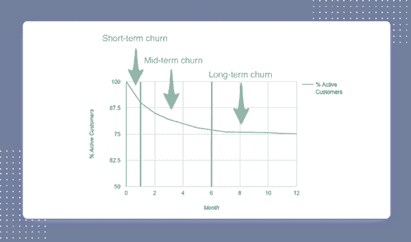](#)

[获利丰厚](https://www.profitwell.com/blog/youre-calculating-retention-wrong)

用户在其旅程的不同点因不同原因而流失，因此改善用户入职不会解决所有的长期保留问题。但是典型的保留曲线在最初的几周内会有一个急剧的下降。之后，斜坡变平了。
‍
在客户生命周期的后期增加客户保留率的最佳方法之一是在早期提高客户保留率。最好的方法是什么？当然是用户入职！** 

### **后续步骤**

**入职不会(或者不应该)在第一次用户会话后结束，尤其是如果你有一个复杂的产品。学习是一个过程，你的用户旅程图应该考虑到你的普通用户如何随着时间的推移与不同的功能交互或执行不同的任务。
‍
最初的入职是为了打下基础——这是第一个顿悟的时刻。一旦你解决了这种体验，是时候问自己了:我们怎样才能让用户不断学习？一旦他们习惯了，我们如何继续吸引他们？我们如何在明天和后天继续提供新的价值？** 

### **更多用户入职资源**

**你刚刚阅读了近 6000 字的用户入门！希望你对它是什么、它为什么重要以及如何设计和实施有效的入职体验的理解(更加)自信。
‍
但是如果你还想吃更多的话:** 

****访问 [Appcues 博客](https://www.appcues.com/blog)，了解更多关于用户入职、UX 设计、产品管理等方面的深度内容。**** 

******查看 [ReallyGoodUX](https://www.reallygoodux.io/) 每周 UX 设计灵感来自我们喜爱的产品。****** 

********完成我们的免费认证课程[用户入职 101](https://www.appcues.com/product-adoption-academy/user-onboarding-101) 以加深您的入职知识并获得 LinkedIn 证书徽章。******** 

********最后，加入我们的[产品导向的增长集体](https://www.productled.org/)，这是一个社区驱动的资源，由有增长意识的人为有增长意识的人制作。********