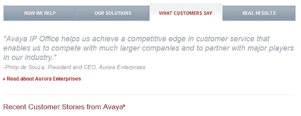
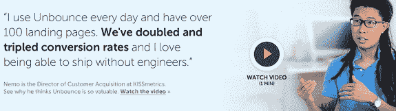
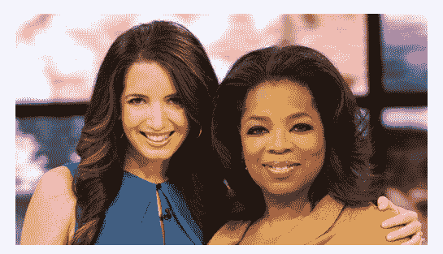
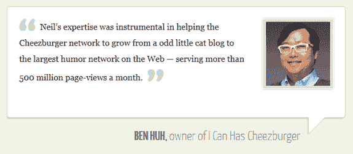
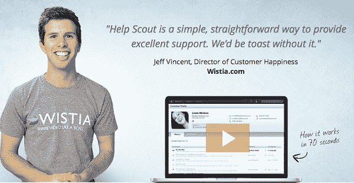
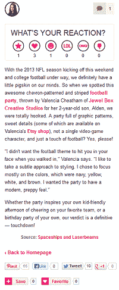
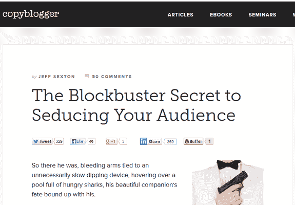
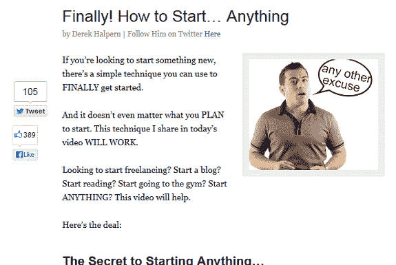
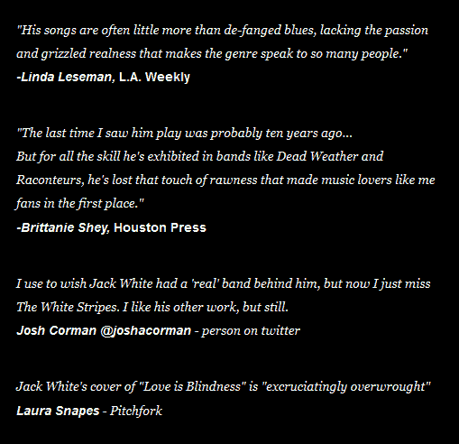

# 让你的登录页面社交证明证明一些东西的 3 种方法

> 原文：<http://unbounce.com/landing-pages/social-proof-proving-the-wrong-things/?utm_source=wanqu.co&utm_campaign=Wanqu+Daily&utm_medium=website>

企鹅知道发生了什么。

我们都知道为什么催眠师把他的员工安插在观众中…

为什么电视喜剧会使用笑料…
为什么咖啡师会在小费罐里播种来开始他的一天…

这是因为**人们需要相信他们是相信 X、被 Y 娱乐或做 z 的大群体中的一员。**没有人想成为第一个或唯一一个做某事的人。人多力量大(见上图)。

这就是广受欢迎的社会证明原则背后的思想，你会从恰尔迪尼博士的*影响力*以及其他书籍和文章中想起这个原则:

> 当别人在做一件事时，人们会认为这件事更合适罗伯特·恰尔迪尼

想让某人接受催眠吗？说明别人被成功催眠了。

在网络上，**社交证明有多种形式**——或*社交认可/不认可的指标*——你可以很容易地在你的登陆页面和博客帖子上使用，包括:

*   推文、关注者、喜欢的数量…
*   评论数量
*   星级评定
*   评论数量
*   书面证明
*   视频证明

**在你的登陆页面或帖子上使用社交证明的全部目的是以一种单纯复制根本无法做到的方式影响你的访问者……**

…但是如果你的帖子或页面上没有 0 条推文呢？

我听说有些人把缺乏社会证明称为“低社会证明”。**但是没有所谓的“社会证明低”。缺乏推荐和过多的推荐一样多——它只是讲述了一个消极的故事，而不是积极的故事…**

让我们来探讨 3 种负面的社会证明……以及你如何中和它们或者改变你的访问者的看法。

## 你的社会证明可能对你不利的 3 种方式

你有积极的社会证明，消极的社会证明和中立的社会证明。当我们试图鼓励我们的访问者改变信仰时，我们希望得到积极或中立的社会证明，而不是消极的。当你 a)没有证据表明人们在谈论你，或者 b)有证据表明错误的人在谈论你时，消极的社会证据就会出现。

### 1:没有推荐……或者推荐少得可怜

让我们假设你正在经营一家拥有巨额营销预算的大型软件公司。你最近推出了一个新的操作系统，你想让学生购买它。但是你知道，在那些学生眼里，你绝对不酷…

你可能想[为学生制作一个登陆页面](https://unbounce.com/how-to-create-a-landing-page)，比如说，使用其他学生的视频推荐？来增加你的酷元素？…当然，除非你是微软:

产品照片很棒……但是一张长得像我的人(例如，一个学生)的照片和一篇关于 Windows 8 有多酷的感言怎么样？在这个登陆页面上，或者事实上，在这次经历的任何后续页面上，没有任何推荐是负面的社会证明。它在告诉访问者，没有人会关心到给 Windows 8 一个热情洋溢的褒奖。潜台词？这个操作系统可能很烂。

同样糟糕的是薄弱的证明。**一份无力的客户评价要么只说了一句“我爱这款产品”，要么充斥着机械术语，几乎毫无意义……**

以下是 Avaya 登录页面的一个示例:

<picture><source data-srcset="https://unbounce.com/wp-content/webp-express/webp-images/doc-root/photos/Avaya.png.webp 600w, https://unbounce.com/wp-content/webp-express/webp-images/doc-root/photos/Avaya-150x58.png.webp 150w, https://unbounce.com/wp-content/webp-express/webp-images/doc-root/photos/Avaya-560x216.png.webp 560w" sizes="(max-width: 540px) 100vw, 540px" type="image/webp">

<noscript></noscript>

</picture>

证明对谁有帮助？它到底在说亚美亚什么？

总结一下，是的，你需要证明来表明别人信任和使用你。但是要小心，那些证明要讲述丰富的、自然语言的故事……否则它们肯定没有什么影响，事实上，可能会对你不利。

### 2:不相关或不匹配的“弃名”

好吧，让你的社交证明为你服务的最好方法之一就是确保你的证明来自与你的潜在客户非常相似的人。

你想让你的潜在客户产生共鸣。在文案中，我们经常希望我们的访问者在页面上看到*他们自己*——就像他们在照镜子一样。这就是你需要使用相关证明的原因。

对于 B2B，相关证明:

*   是你的潜在客户已经喜欢的人给的
*   是由您的潜在客户可以合理地看到自己在 3-5 年内的表现的人给出的
*   是由与您的潜在客户的公司类似的公司的人提供的
*   是你的潜在客户所仰慕的公司的某个人给的

在 Unbounce 主页上，我们看到了一个相关证明的很好的例子——来自一家大多数成长型企业都很钦佩的公司的一个人:

<picture><source data-srcset="https://unbounce.com/wp-content/webp-express/webp-images/doc-root/photos/Unbounce.png.webp 575w, https://unbounce.com/wp-content/webp-express/webp-images/doc-root/photos/Unbounce-150x42.png.webp 150w, https://unbounce.com/wp-content/webp-express/webp-images/doc-root/photos/Unbounce-560x157.png.webp 560w" sizes="(max-width: 575px) 100vw, 575px" type="image/webp">

<noscript></noscript>

</picture>

但是现在我们来看一点负面的社会证明。Marie Forleo 帮助女性微型企业家变得令人敬畏。她太棒了——我喜欢看她的视频——但是她的主页却成了一些非常自由派的留名的牺牲品，包括她和理查德·布兰森爵士、托尼·罗宾斯、拉塞尔·西蒙斯、唐娜·卡兰以及奥普拉的照片

<picture><source data-srcset="https://unbounce.com/wp-content/webp-express/webp-images/doc-root/photos/Marie.png.webp 545w, https://unbounce.com/wp-content/webp-express/webp-images/doc-root/photos/Marie-150x86.png.webp 150w, https://unbounce.com/wp-content/webp-express/webp-images/doc-root/photos/Marie-435x250.png.webp 435w" sizes="(max-width: 545px) 100vw, 545px" type="image/webp">

<noscript></noscript>

</picture>

奥普拉！你觉得你可以和奥普拉一起玩吗？我没有！

那么，对于开始了解玛丽·弗里奥的人来说，这样的社会证据实际上能证明什么呢？

当然，她有一些有影响力的朋友，因此，可能知道她的东西。…但她也可能与普通的女性微型企业家有些脱节。它可能会产生与预期相反的效果！她的社会证明是*超越*抱负…她在一些照片中穿插一些自己与非常成功的女性微型企业家的照片，不是更有意义吗？

[quick prout](http://www.quicksprout.com/pro/)善于利用相关的评价来创造积极的社会证明:

<picture><source data-srcset="https://unbounce.com/wp-content/webp-express/webp-images/doc-root/photos/icanhaz.png.webp 575w, https://unbounce.com/wp-content/webp-express/webp-images/doc-root/photos/icanhaz-150x65.png.webp 150w, https://unbounce.com/wp-content/webp-express/webp-images/doc-root/photos/icanhaz-560x244.png.webp 560w" sizes="(max-width: 575px) 100vw, 575px" type="image/webp">

<noscript></noscript>

</picture>

[Help Scout](https://www.helpscout.net/) 还推出了一些推荐，这些推荐不仅能快速讲述一个丰富的故事，而且来自我们可以联系到的可爱的人:

<picture><source data-srcset="https://unbounce.com/wp-content/webp-express/webp-images/doc-root/photos/helpscout-testimonials.png.webp 600w, https://unbounce.com/wp-content/webp-express/webp-images/doc-root/photos/helpscout-testimonials-150x77.png.webp 150w, https://unbounce.com/wp-content/webp-express/webp-images/doc-root/photos/helpscout-testimonials-483x250.png.webp 483w" sizes="(max-width: 540px) 100vw, 540px" type="image/webp">

<noscript></noscript>

</picture>

所以不要放弃大量的名字。你不需要世界上最有影响力的人来谈论你才能让你的访客感受到你的推荐的积极影响…

### 3:缺乏赞和推文(以及你博客上的评论)

<picture><source data-srcset="https://unbounce.com/wp-content/webp-express/webp-images/doc-root/photos/No-Reactions.png.webp 200w, https://unbounce.com/wp-content/webp-express/webp-images/doc-root/photos/No-Reactions-61x150.png.webp 61w" sizes="(max-width: 200px) 100vw, 200px" type="image/webp">

<noscript></noscript>

</picture> 我们一直在谈论你的登录页面上的推荐，但推文和关注者计数呢？

几乎每个登陆页面都有一个 Twitter、脸书或 G+按钮。…但是他们应该这样做吗？看看右图中的“反应”。

没有反应就是反应。

如今分享一篇文章很容易——有了缓冲和闪光点——这意味着缺乏分享比以往任何时候都更糟糕。发一条微博最多需要点击两次…所以如果你没有微博，你可以说:*我的内容太差了，人们甚至不会浪费一次点击…你也不应该这样。*

这并不意味着所有无法分享的内容都是糟糕的内容。一点也不。有很多令人惊奇的东西没有人在推特上发布或谈论。**但是*实际*质量不是重点；质量的*感知*是。展示没有人在谈论你是消极的社交证明，你可以通过应用以下一些技巧来控制这一点…**

## 如何中和负面的社会证明

如果人们还没有在推特上谈论你，全世界都不需要知道！**遵循以下建议，远离负面的社会证明:**

*   从你的帖子中删除 Twitter，脸书和 G+分享按钮，只有当你的网站有真正的吸引力和/或你的访问者已经显示出分享时，才添加它们
*   不要把社交分享图标放在不会被分享的页面上，比如你的 squeeze 或 lead gen 页面
*   如果你没有很多电子邮件或 RSS 订阅者，就不要显示这个数字！没人需要知道只有 116 个人注册了你的邮件
*   如果你还没有推荐信，即使你有！–嵌入您从关注者那里收到的最佳推文

由于其嵌入功能，Twitter 可能是你需要的唯一一个推荐收集平台。但是如果你的追随者不是活跃的 Twitter 用户，考虑使用像 [CustomerSure](http://www.customersure.com) 这样的工具，让收集评价成为你过程的一部分。

最后，让你的帖子获得更多评论的一个非常棒而且非常常用的技巧是删除你的博客帖子的日期，就像 [Copyblogger](http://www.copyblogger.com/open-loops/) 所做的那样:

<picture><source data-srcset="https://unbounce.com/wp-content/webp-express/webp-images/doc-root/photos/CB.png.webp 575w, https://unbounce.com/wp-content/webp-express/webp-images/doc-root/photos/CB-150x104.png.webp 150w, https://unbounce.com/wp-content/webp-express/webp-images/doc-root/photos/CB-360x250.png.webp 360w" sizes="(max-width: 575px) 100vw, 575px" type="image/webp">

<noscript></noscript>

</picture>

删除日期后，自然到达或通过你的电子邮件列表到达的访问者不会对你的博客产生兴趣，例如，当他们看到你的帖子是 2009 年的，而你只有 3 条评论时。

在社交触发上，德里克·哈尔彭(Derek Halpern)进一步发展了这一策略，只在你看到他的帖子底部时才显示总评论。

<picture><source data-srcset="https://unbounce.com/wp-content/webp-express/webp-images/doc-root/photos/DH.png.webp 575w, https://unbounce.com/wp-content/webp-express/webp-images/doc-root/photos/DH-150x100.png.webp 150w, https://unbounce.com/wp-content/webp-express/webp-images/doc-root/photos/DH-373x250.png.webp 373w" sizes="(max-width: 575px) 100vw, 575px" type="image/webp">

<noscript></noscript>

</picture>
是对过时内容的感知*没人在意*对你的博客产生负面影响？

## 额外收获:这是一种过于冷静的社会证明方式

如果你是一个摇滚明星，你可以像他在自己的主页上所做的那样，随时拿出一个杰克·怀特，从本质上对整个推荐的想法指指点点:

<picture><source data-srcset="https://unbounce.com/wp-content/webp-express/webp-images/doc-root/photos/Jack-White-Anti-Testimonial.png.webp 509w, https://unbounce.com/wp-content/webp-express/webp-images/doc-root/photos/Jack-White-Anti-Testimonial-150x144.png.webp 150w, https://unbounce.com/wp-content/webp-express/webp-images/doc-root/photos/Jack-White-Anti-Testimonial-258x250.png.webp 258w" sizes="(max-width: 509px) 100vw, 509px" type="image/webp">

<noscript></noscript>

</picture>

但是如果你不是一个摇滚明星——或者还不是一个*——坚持要点。与你的访问者的从众倾向合作，隐藏任何可能让他们认为只有他们对你感兴趣的因素…*

*不管你喜不喜欢，社会证明对你来说是存在的……同样，不管你喜不喜欢，你的品牌也是存在的。仅仅因为你没有有意识地塑造你的品牌并不意味着你没有品牌…仅仅因为你没有在你的网站上放推荐或试图产生追随者并不意味着你没有社会证明。你知道。*

*你使用或未能使用社会认可的指标证明了一些事情。*

*你在证明你认为你是谁吗？*

*[*—乔安娜·维贝*](/author/joanna-wiebe/)*

* * *