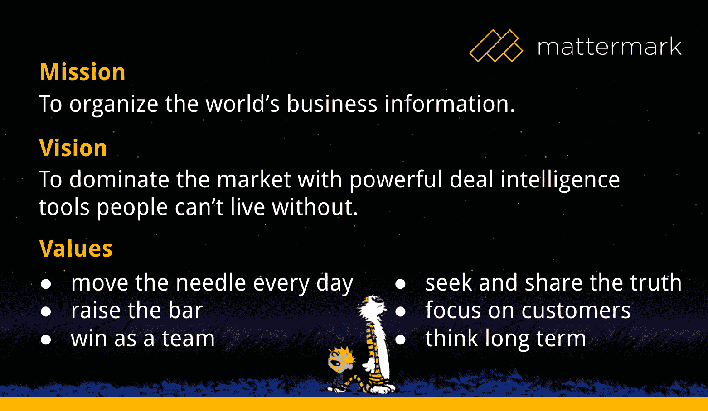

# Mattermark 成立 2 周年——我们 2015 年 6 月的投资者更新——matter mark

> 原文：<http://mattermark.com/mattermark-turns-2-years-old-our-june-2015-investor-update/?utm_source=wanqu.co&utm_campaign=Wanqu+Daily&utm_medium=website>

### Mattermark 拥有大量的种子投资者、FG 天使财团的支持者和员工股东，更不用说顾问、客户和公司的朋友了。有如此多的人帮助我们取得今天的成就，让他们了解情况非常重要，今天我很自豪地与更广泛的 Mattermark 社区和公众分享我们的进展。另外，！

* * *

**亲爱的马特马克投资者，**

今天是我们作为 Mattermark 重新发布的两周年纪念日！你们中的一些人从一开始就是的投资者(3 年多以前作为推荐人)，一些来自 FG 天使财团和铸造集团的投资者将在 1 年内到来。总之，我们的投资者基数如此之大，以至于这封邮件现在发给了 200 多个个人！我们以零敲碎打的方式筹集资金不是一种选择，而是为了生存，我非常感谢你们每一个人。

我记得每一张支票，每一次握手。谢谢你。

在过去的 6 个月里，我经历了一些不可思议的事情:在没有任何资金来源的情况下经营公司。很难表达长期思考的力量有多大，我期待着下一个季度专注于建设我们的团队，改进我们的流程，为我们的客户服务，而不用担心资金耗尽。

Fred Wilson 在 2010 年写了[“CEO 做什么”](http://email.angel.co/wf/click?upn=iLext8ZRcdF9o7CiX6vL7vtYsllEPIHOwvzTTmG68WZrhFI51KU1g-2BIu0y97tELXNHCXD9TQT0io-2BS4mq6FbdzVGe8BRdWoq5-2FawuSQLO6pxxtqmvbevBoSdT0KHNpRFT5PO45X7oJJoF-2FLR6AXVms3b6VffekI8fi8rSYFGmjkE-2BoXsOsDj6arxEB4JoK6jjlcgmHDyY-2BVC0LhSXLa9yA5eGdkEdbmuA8rs-2FI0AOzO5iXtalfWt49oFJ79dKb386TzbCYRNcR-2BKNH3wDhmekGm7hEz3iSwfcULOJ48HfB7KBCQtt9kfJIQdiIXXXejWHXoVylcFXnQYutONW9TIKFwIXnAXjM-2BIiB7a1OUUHSySFGPdx0Ju6Qm7Bm8-2F-2FFqkYlT0Sb-2BDOWGOY-2FLE-2F7ToAsbws8mJLyuhhSoYs19JD8SQGZXygpkhZkF5v-2BwVUYFjJcP2QQMnmbcK2GPVppBJhsZkPDkFzsq-2Bh-2FjAnpsUvSXEYu4vPqGKV3b3x-2F9dO4pyhVBYydsl21WdFQTkLYmq6N3frnf-2F4DrwTP2WHUWgCwKwl3YrTgl1dW-2Fl-2FQA36V4WjPIqj0nAZFL6sBPGqWSi0A-3D-3D_tj0NZ5XGQigqS5wgTDpYypcNBY4hzB2vXIFxDQeb2RiLqfccK5r7C5Z6T8cQjkBiPHi1AkXmm7gpm3N0B0YVPAzjxfntPlSSJWjol-2FCJl-2BwXCYGovTdS6fNYZ-2FCg4gRbE5GRO3jGRU3cTa8PzDOytEgD3ZZutLEAEw0CU2HLAX5vyb-2F4JLmhOeGXHZJnwfd5vUh44S83rLmlBqmAFoUGzGdTgzpulZrAFwapV7ETgiNgMBiiHuk7HG3rUmgR7TNhu1kwHp7IPq-2BFLGQa4NofsOMJpif2glnIstj-2B3igoBBxlYkxz5Xr5GzQma11CQiXb)，我喜欢用他的定义:*“CEO 只做三件事。设定公司的整体愿景和战略，并与所有利益相关方进行沟通。为公司招募、雇佣和保留最优秀的人才。确保银行里总是有足够的现金。”*

我总结了 2015 年这些领域的亮点(和不足之处)。

**<u>愿景/战略设定&沟通</u>T3】**

*   2015 年规划和预算流程，包括所有经理
*   设定我们的公司价值观并在内部分享
*   **机会:** **没有像我应该的那样定期分享公司愿景**(演讲、写作等)。)并需要一名团队营销副总裁([此处申请！](http://email.angel.co/wf/click?upn=iLext8ZRcdF9o7CiX6vL7vtYsllEPIHOwvzTTmG68WbeWV6zE6lCxf-2BE-2F9mwq1Q9oMN0GJoM94eUZ1i9VQiJ6sw7R7-2FRUQ5xp4sSZQrS7hDE6FxsRa6jDN9ZB1u-2BVMyeAIkK-2Bcgk1DxHRtEolRjXJqvjhEUdHYq7qZIl9ltgaqgHCr-2B-2BSpkd7HWWx0DNt4JmtjytqYM0VsJsCgId1WpPJyOWBfqbur0dffK1yzbfaHVGmke3-2B2fICX-2FDSJygqOiOc1zqYZoxIvFzMmbNqNmlELMDBKbAgtHqmI1lqbblWWyz8AfmPSme-2FQCvGe40dT6eXCjfZoJ8c1pdvXouzJWyklT0j3fTGW93IqEKQIXzMC7OHZjHmyuAl3H7-2FN0IAZkiMSngTKFiTLUAWHE7rUN-2Bug3QMdjw3C68hd0l7o5wULq6XIbwo7B4e0JiOQ1lJ31UWxC-2FLPzPOso50F0JLWCyc83TuXyX33bQw4o6Bp6BbrrlM5bzH-2BV7xfT-2BaV2k4N-2BpNxtyReO3SSTDHpBQOZE1HgWcaBEj7MR-2Fc3wm3EBA8cwUcMe9YPsv1APAEAwVWZ37sNRq4wj5RBdkWlcFvw-2Fe-2BgH6S8lErSnRu3FrLzzy2ST-2BTzpz45EzRbvic5vPbQ-2BlK31G1hsiVlRpSOXioG1r2g-3D-3D_tj0NZ5XGQigqS5wgTDpYypcNBY4hzB2vXIFxDQeb2RiLqfccK5r7C5Z6T8cQjkBiPHi1AkXmm7gpm3N0B0YVPAzjxfntPlSSJWjol-2FCJl-2BwXCYGovTdS6fNYZ-2FCg4gRbfhCseA-2B6eGowHScfkQBmBEcOBeN68x1sMYXiRcXR1AJCj0JX4DOeYhKYwZQ9EVfaeleJxCan-2FUk2LHMsNZnCklxlTytD1RbKvI-2FVfEabP3-2BiAKEcMShNFibu-2BFDB34-2BfjFaQp7neB-2BX5F-2BGDXJg0vDIiaFfbRys0N45-2Bytjf3GJxkDJB-2FxScsTil01FB6KoL))帮助系统地支持这些工作

**<u>招募/雇佣/留住人才</u>**

*   团队从 27 人增长到 39 人(其中 5 人的开始日期待定！)
*   销售总监一职由内部人员担任，由 Lisa Han 担任
*   财务副总裁 3 周后开始工作
*   机会 **:工程领域招聘速度的放缓限制了我们的产能。**我们已经完成了 2015 年总体目标招聘进度的 15%,需要填补我们的[开发运营职位](http://email.angel.co/wf/click?upn=iLext8ZRcdF9o7CiX6vL7vtYsllEPIHOwvzTTmG68WbeWV6zE6lCxf-2BE-2F9mwq1Q9oMN0GJoM94eUZ1i9VQiJ6sw7R7-2FRUQ5xp4sSZQrS7hCDdyXIEkdW8-2FbVXlze0kAl28NesxQLCWKOnOMJtL-2BJBCddjb6fPF6qyH2yYaQXqIRUctItwdMBXn51vrOChAhuMpAw8XV7gEjSMj4cknNSsomQJ7b74qEsbj3HylXsV0TRXjNLKJKgNkTnbZjwuNVexJC1Dk-2Bwky-2BPq-2BSteVboE4H6C5JGRf6-2BMe9r5ks7vQ5csq2J-2BsTcWFyNt-2BtLEf5ijxIO-2Ft9sY-2BDHzqYF6LkG5gCJEkJjiN4yLWYPAwmbZFyhJAPmgeWybvtssZ3-2F7WFHs99Ojr-2BwHe3AO0wXXc4QTHDqyLc8SVCT1Z4DAyXpNinRc-2FTPEroQwXpmKcthoKXG2Dq4wjJYT4-2BiRhPgF5YzSg0bZwLE8eyMB9WdUWQFSBmllj-2FIl9tpEDpMrajoJfkkX71QH9u58vcQWpDx75FikIASaGmmSZM50ru6Lvj09CzBtm7MvBBj1r1ZRwzr5ag8bE2TTO7j-2BIMoOum-2BuL-2F7NiXJYQCmqYP5CFHzlLNU0VH-2BgkcKUgvRLc997J-2FSPNS50JUnk2J-2B4HPzcXguHb3dMEP0En-2BqZcb3z-2BG2CNv63ZQ-3D_tj0NZ5XGQigqS5wgTDpYypcNBY4hzB2vXIFxDQeb2RiLqfccK5r7C5Z6T8cQjkBiPHi1AkXmm7gpm3N0B0YVPAzjxfntPlSSJWjol-2FCJl-2BwXCYGovTdS6fNYZ-2FCg4gRbDruZU-2FE7JNpJgjjhb7NTirf7-2FD299qR8VO9oulhNtYLJDxkQZLpLsQQq28xAR0xxFznTTicHSJ-2FD-2F9xi7cPdZNNY1ChBowS9BbwJNHrgF4KvftQ4BFAyxdCpAOxQLLttHQT8P32S6mkR3rzttzpeENUp6CM08pcgB45jbYePtl5eU52qbt59buvIdglrXkvq)来为其他工程师开路。

**<u>银行里的现金</u>**

*   银行存款 560 万美元，预计提现月份为 2016 年 5 月
*   平均每月净烧钱 38 万美元:2015 年迄今为止，收取 104 万美元，支出 294 万美元，净亏损 190 万美元
*   ARR 为 220 万美元(18.5 万美元 MRR)，2015 年年初至今[年流失率为负 4%](http://tomtunguz.com/negative-churn/)
*   167% CAGR *步伐*在 2015 年(56%年初至今，截至 5 月 31 日)
*   机遇: **不要被充满泡沫的市场分散注意力。我们将在夏季结束时重新审视公司的筹资和资本需求**，暂定计划是在 2016 年 Q1 奥运会之前筹集 B 轮资金，明确盈利目标(*)我保留改变主意的权利，因为 Mattermark 的市场机会如此之大，进一步推迟盈利可能是有意义的。*)

该业务正朝着财务健康和快速增长的方向发展，虽然我对此感到自豪，但我认为重要的是要承认，在传达我们的愿景和吸引人才方面，我有机会站出来领导。在接下来的几个月里，我将分享更多关于我们使用机器学习来管理我们不断增长的数据集的方式，我们的分布式爬虫提供的迷人的技术挑战，以及从所有这些信息中出现的见解。

**<u>马特马克的历史——在 12 篇博文中</u>**

为了庆祝推出两周年，这里有一些帖子可以让你了解我们的故事中你可能错过的部分:

[T2】](https://s21870.pcdn.co/wp-content/uploads/2015/06/mattermarkvalues.png)

谢谢你，

丹妮尔（f.）

**保持联系！**

*danielle@mattermark.com*

*@丹尼尔莫里尔在推特上*

*[425-698-7497](tel:425-698-7497)*