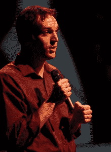

# 唯一错误的答案是 50/50:计算联合创始人的股权分割——geek wire

> 原文：<https://www.geekwire.com/2011/wrong-answer-5050-calculating-cofounder-equity-split/?utm_source=wanqu.co&utm_campaign=Wanqu+Daily&utm_medium=website>

Dan Shapiro (Randy Stewart photo)

嘉宾评论:公平的问题带来了一个有抱负的创业公司最基本的差异、认知和价值观。事实上，股权问题比其他任何问题都更有可能在一家年轻的公司开始运营之前就扼杀它。这是件非常好的事情。

但是在我们开始之前…

### 谁是创始人？

这个问题听起来很简单，但却很棘手。创始人的名字是非黑即白，但情况却各不相同。抛开哲学问题，专注于更有用的经济问题，有一个简单的方法:创始人是承担特殊风险的人。

大致来说，每个公司的生命周期都有三个阶段:

1.创始。公司唯一拥有的钱是你投入的。你不会从公司得到任何钱。公司很可能会倒闭，你会失去所有投入的钱，加上失去的工资，再加上你得找新工作。

2.启动。公司有钱，要么来自投资者，要么来自收入，他们每个月都会给你一部分钱。你的薪水比你在大公司得到的要少。50/50 公司倒闭了，你不得不找一份新工作，此外，你还失去了创业工资和 BigCo 工资之间的差额。

3.真正的公司。你得到“市场”工资。公司不太可能倒闭，如果真的倒闭了，你的损失仅限于失业。

Facial hair alone is insufficient to determine founder status

规则是这样的:如果你为一家非常年轻的公司工作，它不能支付你工资，你就是一个创始人。如果你第一天上班就领薪水，那你就不是。

### 一个创始人价值几何？

创始人的定义是他们的公司无力支付他们(或其他任何人)任何费用。因此，创始人的主要工作是为公司赚钱——要么通过增加投资，要么通过创收。所以一个创始人有两个价值:

1)他们的贡献

2)市场

第一个是公平的。第二是经济学。两者都是必不可少的。

### 现在，公式

当然，不可能有正确的答案——但这个答案并没有错得那么离谱。首先，给每位创始人 100 股。有些创业公司天生就是跑步的，所有创始人从一开始就加入其中。

但是其他人来自一个招募其他人的领导者。你可能会也可能不会获得首席执行官的头衔，但如果你是召集联合创始人并说服每个人去完成事情的人，那就增加 5%的持股。如果你以前是 100/100/100，你现在是 105/100/100。

### 想法很珍贵，但与执行力相比相形见绌(5%)

想法一文不值，执行就是一切……这是一个谎言，但也不是太离谱。如果你是提出最初概念的创始人，将你的股份增加 5%(所以如果你之前有 105 股，现在有 110.25 股)。注意，如果这个想法被实施，或获得专利，或背后有一些执行力，那么…

### 第一步是最难的(5%-25%)

创建一个难以复制的滩头阵地可以给一个羽翼未丰的公司指明方向，提高可信度。它可以帮助增加收入和融资。如果你带来了一个具体的开始——一个关键的、已申请的专利(不是临时的),一个令人信服的演示，一个还没有完全到位的产品的早期版本，或者意味着融资或收入的大部分工作已经完成的其他东西——你会得到 5%到 25%的提升。这里的关键变化是，“这让我们离收入或融资有多近？”

### 首席执行官获得更多(5%)

这是一种常见的情况:双方各占一半，这样任何一方都不能控制公司。

好吧，如果你不相信你的首席执行官拥有大部分股份，那你就找错了人。一个伟大的 CEO 的市场价值比一个伟大的 CTO 的市场价值要高，所以 CEO 的工作得到了更多的公平。这是不公平的——工作并没有变得更容易什么的——但它确实反映了一些市场现实。

### 全职投入是昂贵的(200%)

Are you the pig? (Aaron Harmon photo)

如果你在全职工作，而你的联合创始人在兼职工作，你就是猪。你工作得更多，如果项目失败，你要冒更大的风险。

此外，兼职联合创始人对考虑投资的人来说是一大不利因素。他们含糊其辞的代价将是昂贵的。将所有全职员工的持股增加 200%。

### 声誉是最宝贵的资产

如果你的目标是获得投资，有些人会让这变得容易得多。如果你是第一次与成功获得风投资金的人合作的企业家，那么这个人比你更值得投资。

在极端情况下，一些企业家非常“可投资”，他们的参与是筹集资金的保证。(识别他们很容易:问最了解他们的投资者“无论他们做什么，你都会支持他们吗？”如果答案是“是”，那么他们就是那种超级。)

这些超级创业者基本上消除了“创立”阶段的所有风险，因此你应该预计他们会从这个阶段获得最大份额的股权。

这一点并不适用于大多数创始团队，但当它发生时，预计超级创业者将获得 50%至 500%或更多，这取决于他们的声誉比他们的联合创始人重要多少。

### 像对待投资一样对待现金

理想情况下，每个投资者对公司的贡献是相等的。这些，加上他们的劳动，为他们赢得了“创始人股份”。

不过，有可能一个创始人投入的资金会多得多。这样做的代价很高，因为这是最早的、风险最大的投资。那个创始人会得到更多的股权；为了确定多少，和一个好的创业律师谈谈你公司的合理价值，然后从这里开始工作。

例如，他们可能会说，出于投资目的，你的公司可以合理地估值为 450，000 美元，因此 50，000 美元的投资将获得额外的 10%。

有更多结构化的方法可以做到这一点，从带利息和认股权证的循环信贷额度到可转换为普通股的可转换债券。但这些都意味着法律费用的增加，更重要的是，复杂的资本表——这可能会吓跑外部投资。

### 最终会计

此时，您将得到大约 200/150/250。只需将股份相加(本例中为 600 股),然后用每个人持有的股份除以这个数字，就可以得到他们的所有权:33%、25%、42%。

### 如果你们有相等的股份，你做错了

几年前，我被邀请在一个律师继续教育系列会议上发表演讲。我要求查看班级名单，我正在处理的一项交易的反对律师就在那里，所以我想这可能是一个好主意。我问他们聊些什么，他们回答说“创业”我追问更多细节:“你是说一般的创业经历？创业公司面临的法律问题？给律师的建议？”

“对，就是那样！”热情的回答来了。

有了明确的方向，我开始思考安泰拉的早期。我们的公司开始时只有我们两个人，查尔斯·萨帕塔和我，在一个地下室里进行头脑风暴。

我们覆盖了大量的领域——每小时产生一百万个想法，一个比一个好，从商业概念到核心价值观，再到更好的报销单方式。不管发生了什么，我们要么同意，要么迅速解决我们的分歧。

生活很美好。我们平分股权。

直到六个月后，当我们辞掉工作，拿出我们的积蓄时，我们第一次真正的争吵差点毁了公司。

我给律师们的建议是这样的:“初创公司死亡的最常见原因是创始人无法解决他们的分歧。没人听说这件事。他们只是在公司有机会之前打包回家。

如果你能做一件事来帮助你的客户——真正地帮助他们——那就是尽早把难题摆到桌面上，帮助他们一起解决。"

在这段关于“[联合创始人神话](http://ecorner.stanford.edu/authorMaterialInfo.html?mid=2522)”的四分钟视频中，由企业家转型为风险投资家的马克·苏斯特谈到了这一点

### 50/50 不是一个商业决定，而是一种妥协

你需要习惯困难的问题。你需要习惯于信任对方。你需要习惯这种观点，即你并不都是平等的。你需要就责任、贡献、角色和薪酬进行艰难的讨论。你需要在对投资者和员工做出承诺之前做到这一点。

如果你发现做出决定的唯一方式是妥协——那么你需要在失败的代价攀升之前停下来。

这是没有办法的。你将不得不把孩子分开，但这并不需要所罗门的智慧来做好。

慢慢来，保持头脑冷静，记住:这只是你们在公司的余生中共同做出的第一个决定！

### 附注:乔尔，你很棒，但我完全不同意

乔尔·斯波尔斯基是我最喜欢的作家之一。他写了一篇关于同一主题的深思熟虑的文章，却得出了截然不同的结论。以下是为什么他的文章是错的:

*   它混淆了“容易”和“公平”。如果在我第一次创业时，你已经成功退出了两次，对半分很容易，但不公平。这是公平的，但不容易达到更准确的分裂。
*   它提倡避免冲突，这样你们就不会“争论到死”这完全是错误的方法:如果你们要争论到死，现在就在没有投资者，更糟糕的是，没有员工的时候(“妈妈和爸爸又吵架了”))
*   它以牺牲创始人的利益为代价，给了拿薪水的员工太多的权益。大多数创始人为最终失败的公司无偿工作。员工至少保证有工资。风险的差异是巨大的。Nivi 在这里提供了更多的细节来解释为什么创始人应该比员工获得更多的股票。
*   它没有反映市场现实。典型的 A 系列分配 20%给员工。乔尔的模型有 33%的员工，这意味着只有 33%的创始团队。
*   借据几乎一文不值。大多数公司在筹集资金或盈利方面都不成功。其中，许多投资者会要求放弃打白条作为投资的先决条件。一张 1 美元的借据的预期价值是 5 美分。正确的解决方案要么是可转换债券(用于投资)，要么是股权调整(用于其它任何事情)。
*   顺便说一句，值得注意的是，乔尔指出**在任何联合创始人的情况下都需要**创始人授权。

乔尔已经成功了。我相信这是他第一次与联合创始人和投资者一起创业。这看起来像是一套伟大的理想主义的想法——但它在经济上是不可靠的，并且没有反映出市场的大多数。

*注意:我自己只创立了两家风投支持的公司，所以我和一群人一起审查了这份分析，以获得更广泛的经验基础，并确保我不在这里的黑莓荆棘中。也就是说，一些风投(包括乔尔的投资者之一弗雷德·威尔森)已经附和赞同乔尔的分析，所以也许他也没那么疯狂。*

*感谢比尔·布罗姆菲尔德、大卫·阿隆奇克、盖伦·沃德、*乔·黑兹伯格、* *兰德·菲什金、*莎拉·诺沃特尼和托尼·赖特对本书草稿提供反馈。错误、过于宽泛的断言和煽动性的观察是我的，不是他们的。*

丹·夏皮罗是 T2 的首席执行官。你可以在 Twitter [@danshapiro](https://twitter.com/#!/danshapiro) 上关注他，或者点击这里查看他的博客[。](danshapiro.com/blog)

*(蛋糕首页图片[经雷克斯屋顶](http://www.flickr.com/photos/rexroof/1233219312/) )*

***编者按**:夏皮罗的帖子在 GeekWire 和[黑客新闻](http://news.ycombinator.com/)上引发了巨大的讨论。感谢大家的参与。*