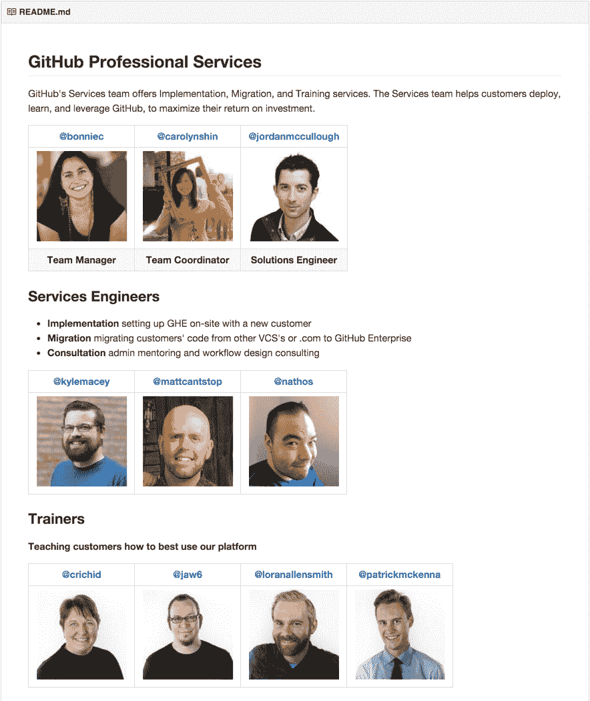

# 服务团队如何使用 GitHub | GitHub 博客

> 原文：<https://github.com/blog/2093-how-the-services-team-uses-github?utm_source=wanqu.co&utm_campaign=Wanqu+Daily&utm_medium=website>

<main role="main" id="post-30713" class="col-12 col-lg-7 post__content col-md-8 post-30713 post type-post status-publish format-standard has-post-thumbnail hentry category-company">

如果您正在编写代码，存储库显然是管理您的工作的地方。但是当团队的主要交付物不是软件的时候呢？在 GitHub，专业服务团队帮助客户设置 GitHub Enterprise，并培训人们如何使用 Git 和 GitHub。我们广泛使用 GitHub 进行高效透明的沟通、计划和优先排序。我们希望我们如何使用 GitHub 将帮助您的团队使用该平台，而不仅仅是代码。

##### 服务团队存储库作为我们的主要交互界面

GitHub 的大多数团队都有一个团队资源库，里面有一个 README.md 文件，介绍团队，解释团队的主要职责。我们服务团队的存储库展示了我们的产品，并介绍了我们团队的成员。

我们的自述文件为希望使用我们服务的团队提供了一条清晰的前进道路，列出了我们的产品，并说明了在需要帮助时可以联系谁。我们为人们提供特定的团队句柄[通过 GitHub 的@提及功能](https://github.com/blog/1121-introducing-team-mentions)提及我们。通过提及一个特定的团队，他们可以找到他们需要的团队的子集。

这样，不同的团队成员可以响应他们各自的团队句柄。GitHub 的一些团队轮流负责每周检查他们团队的提及情况。这让一些团队成员在不受干扰的情况下进行伸展运动，同时团队仍然对团队之外的 GitHubbers 做出响应。我们简化了许多流程，在 GitHub 的通知中使用@mentions，而不是仅仅依赖电子邮件通信。

在我们的自述文件中，我们还有记录我们服务的链接降价文件。我们有记录我们如何工作的文件，包括从针对新团队成员的[清单格式的](https://help.github.com/articles/writing-on-github/#task-lists)降价文件到如何在 [GitHub Enterprise](enterprise.github.com) 上为我们的客户配置 LDAP 的指南。我们的团队知识库为人们开展工作提供了充足的信息。

##### 协调客户参与

GitHub 问题、Pull 请求和通知是协调、交付和审查服务团队与客户互动的核心。我们使用一个链接，该链接将我们的雇佣问题模板作为 URL 的主体参数。这将创建一个[清单，作为新创建问题的顶部评论](https://github.com/blog/1375%0A-task-lists-in-gfm-issues-pulls-comments)。我们通过在销售、财务和法律团队各自的存储库中打开问题，与他们进行协调。

一旦约定完成并准备好交付，我们将打开一个拉式请求来跟踪交付任务和注释。我们在存储库中的`/engagements`文件夹中创建一个名为`retrospective.md`的文件来打开拉请求。然后，我们使用拉取请求的顶部注释来跟踪任何错误、项目后的后续任务，并留下备注供销售人员接管。我们将注释添加到每天笔记的拉取请求中，以便让团队中的每个人都了解情况。

当我们完成约定，我们写我们的回顾。GitHub 的许多不同团队都知道这个文件夹，并通过访问这个`/engagements`文件夹和回顾回顾文件来检查客户反馈。我们使用拉式请求注释来添加最终细节，如我们的费用，并提及完成任何未完成任务所需的团队。这个过程让我们拥有了一份伟大的历史文件，记录了我们的对话，而不是在人们的电子邮件中丢失的细节。

##### 团队决策和透明度

在 GitHub 专业服务团队，我们努力确保决策过程和我们团队的计划尽可能地协作和透明。我们开一期，讨论任何需要我们关注的话题。我们尝试默认开放对话，并使用 URL 进行[对话。](http://ben.balter.com/2015/11/12/why-urls/)

作为一个地理上分散的团队，透明的对话尤其必要。这种模式允许参与服务约定的其他人在完成约定时获得上下文，并及时收到通知。它也让人们理解一个决定的原因，即使是在这个决定发生多年之后。

我们经常就选择哪条道路进行长时间的讨论，因为我们是一个多元化的团队，我们听到了许多不同的方法。我们的内部重点是达到一个点，在这个点上我们可以向前推进一个测试选项，并在我们获得更多关于什么最有效的信息时完善前进的道路。

##### 每周雷达会议(站立会议)

每周一，我们都会创建一个议题，作为我们的*站立会议*。我们添加了本周的可用性以及我们将关注的主要项目。我们聚在一起进行 30 分钟的视频聊天，就一周的活动进行合作，并一起度过一些面对面的时间。人们在《雷达》杂志上更新他们一周的活动。这有助于我们作为一个分布式团队保持联系。

服务团队对拉请求的使用是多种多样的。我们倾向于认为拉取请求是*向我们的组织中输送*一些变化或成就。我们打开拉式请求，以更改我们的自述文件，跟踪我们正在进行的项目，并为团队提出未来计划。拉动式请求流程使我们能够从团队成员那里获得反馈，同时跟踪我们的主要成就。我们使用 GitHub 的[清单](https://github.com/blog/1375%0A-task-lists-in-gfm-issues-pulls-comments)功能来跟踪任何可交付成果(包括这篇博文)的未完成任务。

拉请求很好地展示了文档是如何发展的，并使这种发展成为一个协作过程。通过编辑拉请求中的文件，我们可以看到我们的思维是如何随着时间的推移而改变的，或者我们的组织是如何发展的。我在 OSCON 参加了一个很棒的会议，关于 New Relic 如何使用非代码交付的拉式请求，从讨论公司政策变化到记录基础设施。许多使用 GitHub 的公司发现简单的@提及和通知工具如何改变工作流程和公司文化。

##### 协作是 GitHub 的核心

GitHub 的核心是一个工具集，它通过跟踪变化和支持协作来增强开发人员的能力。GitHub 的服务团队使用这些工具作为他们工作的一个组成部分，帮助公司向前发展。GitHub 如何帮助你的团队更加协作和高效？

服务团队[正在招聘多个职位](https://github.com/about/jobs)。查看工作公告板，看看您如何帮助我们帮助公司利用 GitHub 创造伟大的事物。如果你的团队需要帮助来充分利用 GitHub，你可以[访问我们的网站](https://training.github.com/)来查看我们的产品。

</main>