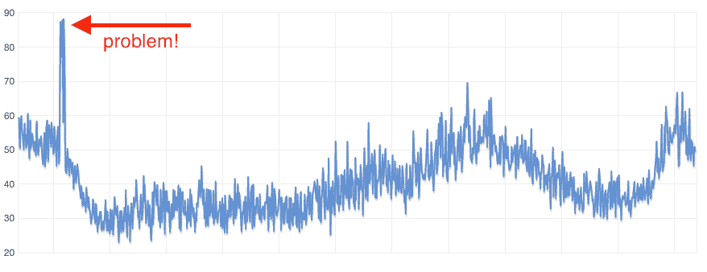
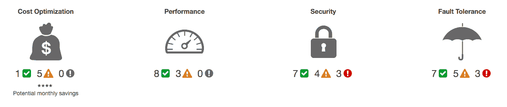

# 你应该避免的 5 个 AWS 错误

> 原文：<https://cloudonaut.io/5-aws-mistakes-you-should-avoid/?utm_source=wanqu.co&utm_campaign=Wanqu+Daily&utm_medium=website>

## 错误 3:没有在 CloudWatch 中分析指标

每个 AWS 服务都向名为 [CloudWatch](https://aws.amazon.com/cloudwatch/) 的服务报告有趣的指标。虚拟机报告 CPU 使用情况、网络使用情况和磁盘活动。数据库还报告内存使用情况和 IOPS 使用情况。你的工作是分析数据。请看下图，它显示了一天的 CPU 使用情况。

<picture class="img-fluid"><source type="image/webp" srcsetimg/2015/12/cpu_usage@730w.webp 730wimg/2015/12/cpu_usage@730w2x.webp 1460wimg/2015/12/cpu_usage@610w.webp 610wimg/2015/12/cpu_usage@610w2x.webp 1220wimg/2015/12/cpu_usage@450w.webp 450wimg/2015/12/cpu_usage@450w2x.webp 900wimg/2015/12/cpu_usage@330w.webp 330wimg/2015/12/cpu_usage@330w2x.webp 660wimg/2015/12/cpu_usage@545w.webp 545wimg/2015/12/cpu_usage@545w2x.webp 1090w" sizes="(min-width: 1200px) 730px, (min-width: 992px) 610px, (min-width: 768px) 450px, (min-width: 576px) 330px, 545px"> <source srcsetimg/2015/12/cpu_usage@730w.png 730wimg/2015/12/cpu_usage@730w2x.png 1460wimg/2015/12/cpu_usage@610w.png 610wimg/2015/12/cpu_usage@610w2x.png 1220wimg/2015/12/cpu_usage@450w.png 450wimg/2015/12/cpu_usage@450w2x.png 900wimg/2015/12/cpu_usage@330w.png 330wimg/2015/12/cpu_usage@330w2x.png 660wimg/2015/12/cpu_usage@545w.png 545wimg/2015/12/cpu_usage@545w2x.png 1090w" sizes="(min-width: 1200px) 730px, (min-width: 992px) 610px, (min-width: 768px) 450px, (min-width: 576px) 330px, 545px"> </picture>

你能看到使用高峰吗？我可以告诉你这个尖峰每天都可以看到。总是同一时间。它闻起来像克朗乔布，当然它是克朗乔布。但是这台机器运行的是网络服务器。因此，由于 cronjob，延迟每天都在增加。只需在单独的虚拟机上运行即可解决问题。这些都在 CloudWatch 中，但您需要查看它！

第二步，一旦您分析了您的指标，就要对它们定义警报。而不是相反！

*想通过 Slack 接收 [CloudWatch 警报？查看我们的聊天机器人 marbot。](https://marbot.io/amazon-cloudwatch-alarm-to-slack.html)*

## 错误 4:忽略可信任的顾问

你知道[值得信赖的顾问](https://aws.amazon.com/premiumsupport/trustedadvisor)吗？它根据 AWS 定义的最佳实践检查您的 AWS 帐户。重点领域是:

*   成本优化
*   表演
*   安全
*   容错

如果您信任的顾问仪表板如下图所示，您就有了一个很好的改进起点。

<picture class="img-fluid"><source type="image/webp" srcsetimg/2015/12/trusted_advisor@730w.webp 730wimg/2015/12/trusted_advisor@730w2x.webp 1460wimg/2015/12/trusted_advisor@610w.webp 610wimg/2015/12/trusted_advisor@610w2x.webp 1220wimg/2015/12/trusted_advisor@450w.webp 450wimg/2015/12/trusted_advisor@450w2x.webp 900wimg/2015/12/trusted_advisor@330w.webp 330wimg/2015/12/trusted_advisor@330w2x.webp 660wimg/2015/12/trusted_advisor@545w.webp 545wimg/2015/12/trusted_advisor@545w2x.webp 1090w" sizes="(min-width: 1200px) 730px, (min-width: 992px) 610px, (min-width: 768px) 450px, (min-width: 576px) 330px, 545px"> <source srcsetimg/2015/12/trusted_advisor@730w.png 730wimg/2015/12/trusted_advisor@730w2x.png 1460wimg/2015/12/trusted_advisor@610w.png 610wimg/2015/12/trusted_advisor@610w2x.png 1220wimg/2015/12/trusted_advisor@450w.png 450wimg/2015/12/trusted_advisor@450w2x.png 900wimg/2015/12/trusted_advisor@330w.png 330wimg/2015/12/trusted_advisor@330w2x.png 660wimg/2015/12/trusted_advisor@545w.png 545wimg/2015/12/trusted_advisor@545w2x.png 1090w" sizes="(min-width: 1200px) 730px, (min-width: 992px) 610px, (min-width: 768px) 450px, (min-width: 576px) 330px, 545px"> </picture>

我建议先关心安全！您可以启用 Trusted Advisor 的每周电子邮件，告诉您自上周以来发生了哪些变化(已解决的问题或新问题)。在首选项部分激活它。如果您为 AWS 支持付费，Trusted Advisor 会通过添加更多检查变得更加强大。

## 错误 5:未充分利用虚拟机

如果您意识到您的 EC2 实例没有得到充分利用，那么除了手动管理的基础设施之外，没有理由不减少实例的大小(机器的数量或`c3.xlarge`到`c3.large`)。如何知道自己是否被利用不足？检查您的 CloudWatch 指标！就这么简单。
如果您使用自动扩展组，您还应该检查您的自动扩展规则和 CloudWatch 指标，以便稍后扩展或提前缩减。

## 摘要

作为 AWS 云顾问，我看到许多 AWS 客户。在这一年中，我收集了我在每个帐户中看到的错误，并将它们汇总起来，以向您提供我最好的。事实证明，AWS 上最常见的 5 个错误是:

*   手动管理基础架构
*   不使用自动缩放组
*   不在 CloudWatch 中分析指标
*   忽略可信顾问
*   未充分利用虚拟机

现在轮到你检查你的基础设施了。

*这篇博文已经被翻译成德语:[Die 5 haufigsten Fe hler auf AWS](https://cloudonauten.de/die-5-haufigsten-fehler-auf-aws/)。*

迈克尔·维蒂希于【2015 年 12 月 26 日撰写