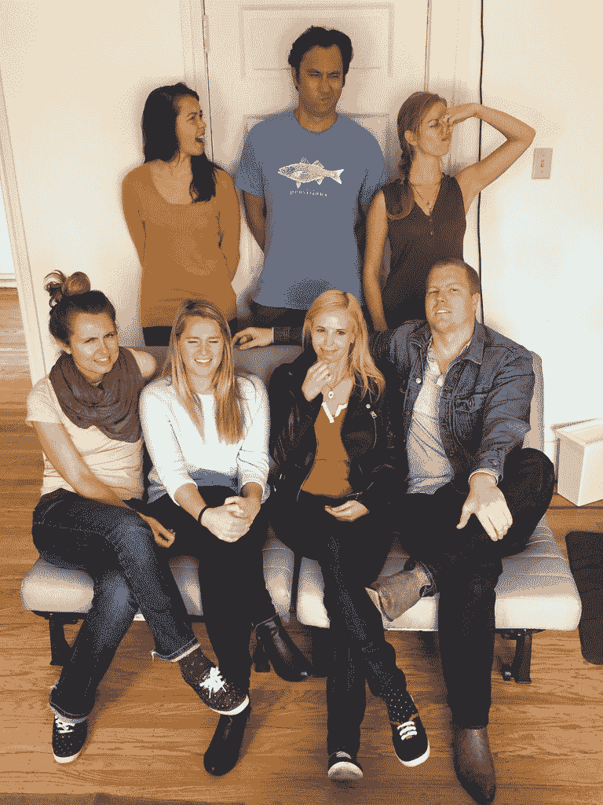
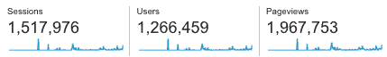
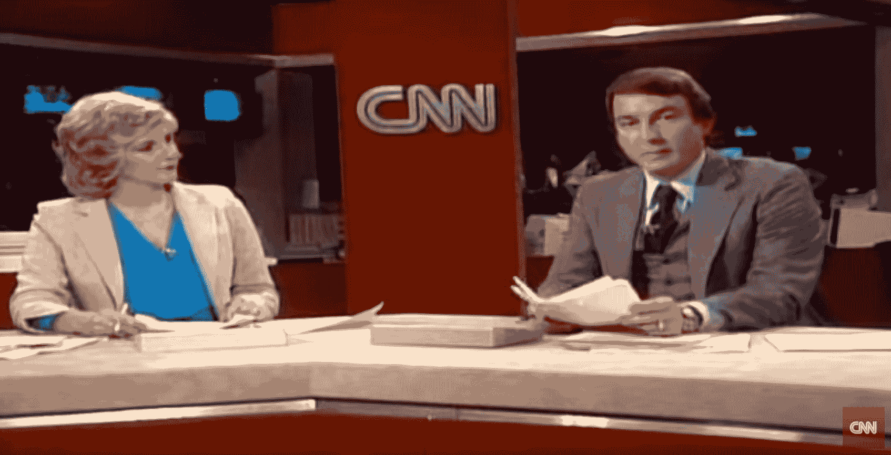

# The Hustle 的第一个 100 万读者-我们的 5 个月更新- The Hustle

> 原文：<http://thehustle.co/the-hustle-traffic?utm_source=wanqu.co&utm_campaign=Wanqu+Daily&utm_medium=website>

如果你对学习如何建立一个内容公司不感兴趣，那么你就不会喜欢这篇文章。改为读[这个](https://thehustle.co/read-these-books-instead-of-getting-mba)的。

嘿书呆子们，

几个月前，大约在推出 Hustle 后的一个月，[我写了一篇关于我们的流量、收入(或缺乏收入)的更新](https://thehustle.co/the-first-2-months-of-the-hustle),以及一些关于创办我们公司的其他披露性花絮。

令人惊讶的是，你们很多人喜欢那篇文章。也许你对建立一家媒体公司感兴趣，喜欢阅读我们的成功和失败。或者你只是好奇，喜欢看事物如何工作(或不工作)。我不确定——但我收到了大量要求再要一个的电子邮件。

正因为如此，我想我会做第二次更新，给你一个内幕的前五个月的喧嚣。

<noscript></noscript>

The Hustle team.

## 但是首先…媒体公司如何赚钱？

在我进入我们的结果之前，我想解决一个我经常被问到的问题:数字媒体公司如何赚钱？

好问题。

每个人都知道传统报纸如何赚钱:订阅、分类广告和广告。数字媒体公司有类似的商业模式，还有一些传统校报通常没有的其他收入来源。

在我们的案例中，Hustle 有三个主要的收入来源:

#### 事件

大多数人没有意识到这一点，但是事件(音乐会、会议等。)为媒体公司赚一吨钱。Pitchfork、Business Insider、TechCrunch、华尔街日报和数十家其他媒体公司都从活动中赚了大钱。ReCode [去年被](http://www.businessinsider.com/why-recode-sold-to-vox-2015-6)以 2000 万美元以上的价格收购，因为他们的会议每年能赚 1000 万美元。我们没什么不同。

我们的会议 [Hustle Con](http://hustlecon.com/) 将于 2016 年 5 月 13 日举行。保守估计，我们会赚 50 万美元。如果我们打一个本垒打，我们将净赚 100 万美元。如果做得正确(大多数公司在这方面做得很差)，大部分都是利润。虽然有很多前期成本，这是一个缺点。事实上，一天之内我们的收入减少了很多，这让我很紧张。然而，我们将会有成千上万的粉丝同时出现在一个房间里，这和钱一样重要。

但是对于所有想开一个会议的即将成为创始人的人来说，要知道:会议通常越大越糟糕。有些人建立了大规模的会议业务，但这并不常见。我不认为 Hustle Con 会成为我们未来五到十年的重要收入来源。有可能，但我表示怀疑。这可能是一个五年内 1000 万美元的业务，但我们打赌，在未来几年内，我们将通过其他收入来源赚取数千万美元，如果不是数亿美元的话。就目前而言，这是一个很好的方式来维持我们的内容业务增长，最重要的是，有一个与我们的读者见面的快乐时光。

#### 广告

这是一个大的。电视、杂志、报纸和广播广告正在悲惨地死去。这让我非常高兴。为什么？因为那些广告商现在把预算花在了数字广告上。

横幅广告、原生广告、内容赞助——数十亿美元正投向像我们这样的数字媒体公司(插入邪恶的笑声)。

更具体地说，大笔资金正流向本土广告和赞助。本土广告和赞助被南方公园和 T2 和约翰·奥利弗滑稽地嘲笑，但事实是:这很有效。品牌爱它，用户不介意。

竞争是在内容行业。为了让我们的股东变得非常富有，我们需要在网络上为千禧一代创造最好的内容，建立大量的积极参与的观众，并找到广告商。我们的目标是美国 4000 万拥有大学学位的千禧一代。因为大多数公司都不擅长吸引这些人群，大品牌会(希望)付给我们很多钱来与我们合作。这就是我们能够持续制作你们都(希望)会喜欢的内容的方式。

这是一个愚蠢的简单模型，参与其中非常有趣，但很难实现。

特别是对我们来说，我们在电子邮件中放广告。当我们这样做时，我们对每 CPM(每 1000 次发送)收取 50 到 250 美元不等的费用。这种模式非常类似于 Thrillist、theSkimm、Refinery29 以及其他一系列专注于电子邮件内容的网站。品牌付钱给我们，我们把他们介绍给我们的观众。

再说一次——理论上简单得愚蠢，但很难实现。

#### 创意服务

你可能不知道这个。

在新的大型数字媒体公司(Vice、BuzzFeed、Vox)中，创意服务是一大收入来源。当媒体公司表现得像一个营销机构时。平面设计、媒体活动、文案、视频制作等等。

以前灰鹅这样的品牌会聘请代理公司制作广告，然后代理公司会找地方放广告。随着媒体公司进入这个游戏，出版商制作广告，然后把它放在他们自己的网站上，这样它就能被看到。现在 Grey Goose 可以直接去媒体公司制作他们的广告并放在他们的网站上。这种方式效率更高。

在某些情况下，像 Vice，有些人说他们只做新闻作为他们创意服务的内容营销。而且效果非常非常好。Vice 今年将带来超过 10 亿美元的收入，其中大部分来自他们的创意服务。

我们刚刚开始创意服务。这是那些你需要变大才能让它变得有价值的事情之一，但我们正试图让它与一个小团队一起工作。

现在来看结果。

## 好人

自从我上次更新以来，我们已经迎来了第一个一百万访问者。在任何一天，我们都会有 10，000 到 50，000 人访问该网站，而这个月我们将有近 500，000 名访客。这仍然很小，但对任何媒体公司来说都是一个很好的开始。

然而，我最引以为豪的有两点:实际上我们所有的网络流量都是有机的，而且每个月都在增长。我们有望在未来四个月内达到每月 100 万用户的大关。许多资金雄厚的公司比我们更快地达到每月 100 万的 uniques，但没有多少公司是在资金很少或没有的情况下做到的。

<noscript></noscript>

Our Google Analytics since launching.

我们的电子邮件列表还在增长。我们关心这个数字胜过一切。一个庞大而忠诚的电子邮件列表是一笔巨大的资产，它让我们能够赚很多钱，并且很容易接触到我们的读者。我们有望在第一年达到 10 万封电子邮件。但我认为这将很快发生。

现在，一个上一次更新时不太好但现在也不太坏的话题:收入。

谈到初创公司，有两种主要的思想流派:筹集大量资金，专注于增长，建立大量参与的观众。然后，达到临界量后，开始赚钱。或者有自举业务和赚钱的方式。这两种方法各有利弊。

我们落在中间的某个地方。

到目前为止，我们已经筹集了大约 25 万美元，明年很可能会再筹集 200 万到 500 万美元。但是，我们现在赚钱了，不需要再多养才能生存。我们需要资金来加快发展。

除了来自我们会议的收入，我们也有电子邮件广告收入。每发送 1000 封电子邮件，我们会向品牌收取 50 至 200 美元不等的费用。如果我们的列表仍然是 10，000(现在大得多)，那么我们会收取 500 美元到 2，000 美元的费用来链接到我们电子邮件中的品牌。

## 坏事

雇佣作家是我经历过的最艰难的职业挑战。一般来说，招聘很难，但作家尤其难。他们的成功很大程度上依赖于他们自己的个性和品味。试图通过几次面试和一份写作作业来判断他们是否有好的品味是非常困难的。正因为如此，我们招人的速度非常慢。我们有预算再请一两位作家，但找不到合适的人。

我们遇到的另一个问题是我们的服务器。有时我们会有 50，000 个访问者，网站会崩溃。因为我和我的合伙人都不是技术人员，我们的网站就像一艘用胶带封住漏洞的划艇一样被拼凑起来。

它大部分时间都工作正常，但偶尔也会出故障，我们必须想办法重新安装。很有趣，但很贫民窟。

## 运气

最后，我想以保持真实来结束这篇文章。

上次我这么做的时候，我说这是盲人摸象。我和我的共同创始人已经做了大量的研究，现在听起来我们当然知道我们在谈论什么(我认为)，但是我们 100%的理解它。我们很幸运，我们的团队中有一些在媒体游戏方面更聪明、更有经验的人。但这次我想强调另外一点:50%的时候我认为我们的成功是因为运气，而不是技巧。

我知道我们的很多内容都很棒，但我承认有时它完全失败了。这种情况会发生，也是意料之中的。我们不可能每次都赢。但不知何故，我们仍然有注册和流量。这有两个原因。

首先是运气。市场渴望智能业务和千禧一代关注的内容。渴望一个产品的市场是成功的最大原因。这不是我们能控制的。这是百分之百的运气。我不是在抱怨，但如果我说我们迄今为止的少量成功完全来自技巧，那我就是一个傲慢的骗子。

在某种程度上，我认为我们的观众和 80 年代的 CNN 一样。特纳广播公司于 1980 年 6 月 1 日在亚特兰大郊区的一所房子里创办了 CNN。当时，他们是资金不足的新贵，业内很少有人认为他们会成功。然而，没有一个电台是专门报道新闻的。正因为如此，他们疯狂地工作。人们需要他们能提供的东西。我认为我们现在的处境就像当年的 CNN。年轻人渴望聪明的新闻。

<noscript></noscript>

CNN’s first broadcast in 1980.

运气似乎起了很大作用的第二个原因是，大多数创始人，无论多么伟大，通常都认为他们的产品比外人看到的要糟糕得多。这就像我小时候妈妈给我做的三明治。当我长大后，我会自己做三明治。但是从来没有我妈妈做的好吃。

这就是我对创办公司的感受。当你自己做的时候，不如别人为你做的时候令人印象深刻。

不管运气如何，我 100%相信，在五年或十年内，我们将拥有比《华尔街日报》、《彭博》和类似出版物更多、更投入的读者。

你好，男孩，

萨姆（男子名）

## 获取你将在收件箱中实际阅读的 5 分钟综述

5 分钟或更短时间内发布商业和科技新闻