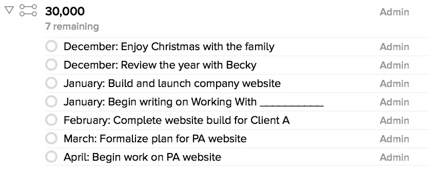
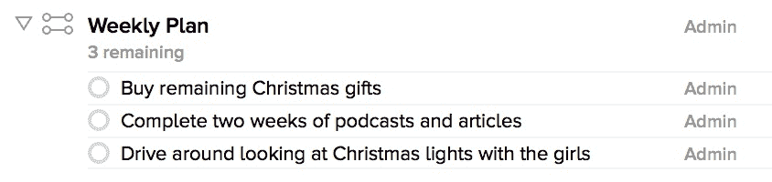

# 月度计划

> 原文：<http://joebuhlig.com/monthly-planning/?utm_source=wanqu.co&utm_campaign=Wanqu+Daily&utm_medium=website>

我们正在悄悄推进年度目标设定。坐下来，梦想自己明年想做的事情，这很令人兴奋。但是如果你的生活对于年度目标来说移动和变化太快了怎么办？

设定目标是我一直在纠结的事情。它通常是由我工作的公司发起的。当我在公司和虚拟公司工作时，我经历了典型的年度评估过程。你几乎在任何地方都能找到它。

## 年度期望

我总觉得我这样做是因为我应该这样做。我甚至亲自完成了一个类似的过程，因为我认为这是实现更多的银弹。我错了。

年度计划对我不起作用。这也是我一直纠结的一个原因。为你将如何构建新技术制定一个计划很有趣，但通常很不准确。它移动得很快，在构建过程中你会学到很多东西。这通常意味着当 12 个月过去后，我发现了一个更有益或更有优势的新领域。年终评估通常包括讨论为什么我没有达到最初的目标。

## 改为每月一次

在我的世界里，12 个月太长了。所以我把它缩小了。我仍然设定目标，但是我把它们变成项目，然后逐月计划。而那些项目大多只有两三个月的时间。

因为我通常能看到接下来的两个-有时三个-项目，所以我会提前计划好。我一次只看接下来的七八个月，即使是后面的几个月，在我完成之前也会有几次变化。

## 它看起来像什么

我保留了一份简单的每月目标清单。每个目标都是一个带有简短描述的单行项目。对于 GTD 球迷来说，这就是我 30000 米视野的代名词。它看起来是这样的:

我每个月都有多个目标。我把月份的名称放在任务的标题中，这样我就可以把它们按顺序排列，这样我就能保持在正确的轨道上。当我看到这个列表时，我知道接下来会发生什么，我可以适当地计划我的日子和星期。

## 实施计划

如果一个计划没有被审查，它就毫无价值，所以我每周阅读一次每一行，让它决定我每天的工作。我确保我在正确的轨道上，我选择的方向仍然是准确的。当我改变未来四个月的计划时，我不会变得不正常；我对自己很现实。

当我看完月计划后，我会把它转化为下周的计划——我的周计划。周计划是一个简单的两到三个项目的清单，列出了我需要在下周完成的事情，以便在月计划上取得进展。它把它分解成我那个星期能消化的碎片。

## 过度的杀伤威力

我不擅长记忆，所以我需要这些系统。即使对我来说，这听起来像是很多工作，但重点是:12 个月太远了，我需要指导。我用这个逐月计划来帮助我决定每天做什么。这是一个单一的，整齐的列表，很容易审查和更新。我不想复杂。我希望它能让我保持头脑清醒，帮助我实现目标。如果它做到了这一点，它就是成功的。