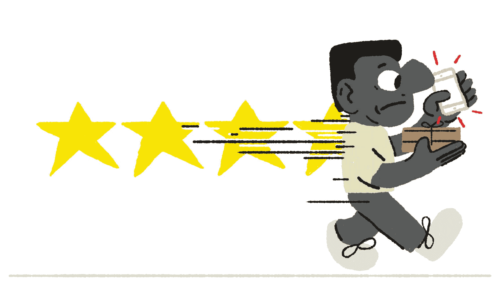
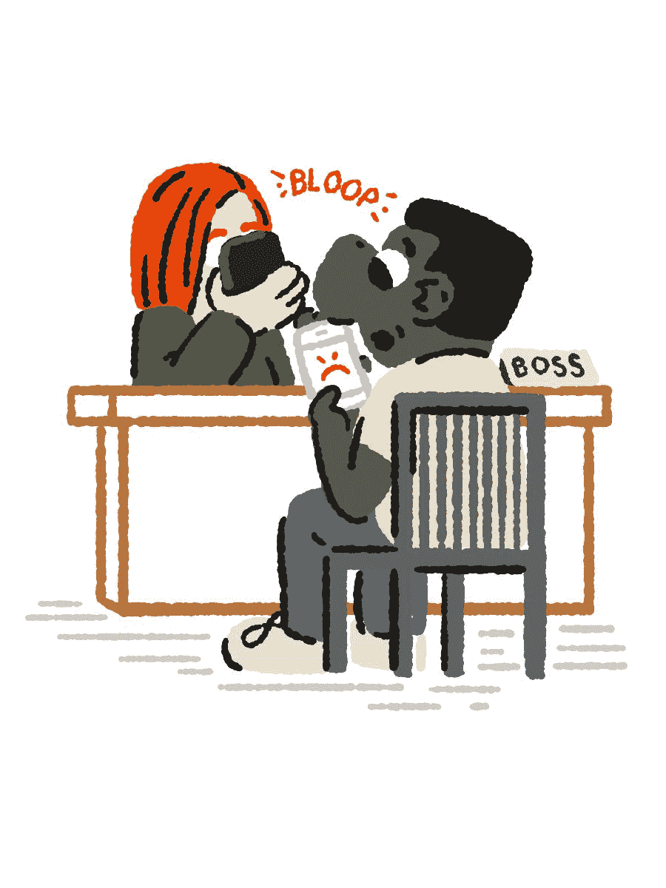
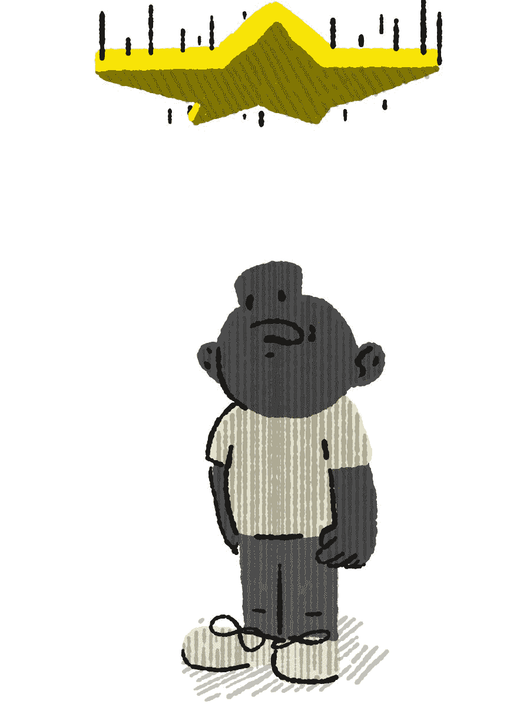

# 分级游戏| The Verge

> 原文：<https://www.theverge.com/2015/10/28/9625968/rating-system-on-demand-economy-uber-olive-garden?utm_source=wanqu.co&utm_campaign=Wanqu+Daily&utm_medium=website>

按需经济扰乱了雇主和雇员的角色，法院和监管机构才刚刚开始解析这一点。到目前为止，争论一直集中在工人应该是承包商还是雇员，这个问题有时会升华为关于谁是老板的争论:工人是他们自己的老板，正如公司[经常声称的那样](https://partners.uber.com/join/)，还是平台是他们的老板，通过算法和规则监管他们的工作？

<q class="left">Rating systems have turned customers into unwitting and sometimes unwittingly ruthless middle managers</q>

但是有一个第三方经常被忽略:顾客。这些公司使用的评级系统已经把客户变成了不知情的，有时是不知情的无情的中层管理者，比公司希望雇佣的任何老板都更有效率。他们总是在那里，免费工作，对最小的错误都非常敏感。所有的算法要做的就是总结他们的判断，并相应地停用。

评级有助于这些公司实现巨大的规模，管理大量未经培训的合同工，而不必雇用主管。对于顾客来说，这也是一个很好的安排，他们微笑着获得廉价的服务——即使是焦虑的服务。但是对于已经处于合同工危险境地的工人来说，让每个顾客都成为老板是一个可怕的前景。毕竟，他们——我们——可以被称为混蛋。

“你非常擅长拍马屁，只是因为你不得不这样做，”一名优步司机告诉我。“优步和 Lyft 已经创造了这个巨大的客户品牌，他们希望以麦当劳的价格获得丽思卡尔顿的服务。”

<aside class="float-right"><q>"Customers expect Ritz Carlton service at McDonald's prices."</q></aside>

今年 3 月，当法官 Edward Chen(T1)驳回优步对加州司机集体诉讼案进行简易判决的动议时，他抓住了这样一个观点，即评级不仅仅是一种客户反馈工具——它们代表了一种新的监控水平，远比任何警惕的老板都更加普遍。陈写道，客户评级让优步“可以说极大地控制了司机表现的‘方式和手段’”。引用米歇尔·福柯的*纪律与惩罚，*他写道“有意识的和永久可见的状态保证了权力的自动运行”。"

<noscript></noscript> 

从易趣开始，评级系统通常被描述为陌生人之间建立信任的方式。一些评论家甚至认为评级比政府监管更有效。“优步和 Airbnb 实际上是世界上监管最严格的生态系统之一，”多伦多大学的经济学家 Joshua Gans 在今年早些时候的一次联邦贸易委员会研讨会上说。在你开始工作之前，不是一个单一的认证，每个人都通过一个相互保证的判断系统不断地受到监管。

当然，客户有时会有糟糕的经历——鲁莽驾驶，令人毛骨悚然的评论——评级系统可以帮助报告这些经历。但当涉及到监管危险行为时，大多数平台不再依赖评级，而是依赖传统的安全措施——身份验证、背景调查，以及通过每个工人携带的跟踪设备调查和执行任何非法行为的知识。我们无法评估犯罪历史、训练不足或疏忽的汽车维护。

<aside class="float-left"><q>It’s a strange amount of power for customers to hold</q></aside>

那么我们的评分是多少呢？我们对司机选择的路线、他们无法控制的价格波动、缓慢的交通、拒绝超速、说话太多或太少、未能以不切实际的速度完成大型任务、交付食物时食物已经凉了、告诉我们，不，我们不能把啤酒带进车里，也不能把朋友放在后备箱里——真的，不管出于什么原因，包括对种族或性别的潜意识偏见，[这是许多众包平台上一个经证实的问题](http://www.eastbayexpress.com/oakland/racial-profiling-via-nextdoorcom/Content?oid=4526919)。如果反馈只是反馈，这将是一个麻烦，但评级已经成为决定就业的自动化系统的主要指标。如果你想象一下，在传统的工作场所，客户认为解雇决定不好的事情，它们看起来反复无常而且苛刻。对于消费者来说，这是一种奇怪的权力，尤其是考虑到许多人并不知道他们拥有这种权力。

有时候，就像在优步的系统中，员工有机会给顾客打分。优步的一位发言人告诉我，“优步优先考虑的是为您提供安全可靠的乘车服务——无论您是谁，从哪里来，要到哪里去。为我们的社区实现这一目标意味着维护一个相互负责和尊重的环境。我们希望每个人每次都玩得开心，双向反馈是我们努力实现这一目标的众多方式之一。”

一位得心应手的发言人还强调了评级系统的互惠性。“Handy 是一个透明的平台，可以满足家庭的所有需求。作为这种透明度的一部分，我们提供了一个双向评级系统，这样独立的专业人士可以就工作进展情况提供反馈，客户也可以这样做。这激励了供需双方的卓越表现，为专业人士和顾客提供了建设性的反馈，并开辟了更多的沟通渠道，以确保最佳的家居体验。”

The Verge 还联系了 TaskRabbit 和 Postmates，就他们的评级系统发表评论，但截至发稿时，他们尚未回复。

但双向反馈往往是一种不平衡的安排。首先，显而易见的是，只有一个政党的生计依赖于收视率。工人和顾客也有不同的标准。当优步司机的评级低于 4.6 时，他们就会被停用(优步表示，确切的阈值因该地区的中值评级而异)，但没有理由禁止客户评级。虽然一些司机可能会跳过低评级乘客，但他们可能会因为[跳过太多](http://uberpeople.net/threads/ride-skipping-deactivation.36582/)而被停用。还有信息不对称。Handy 和 TaskRabbit 的员工都表示，客户评分根本不会显示出来。取而代之的是，TaskRabbit 的员工必须在[私人脸书小组](https://www.facebook.com/groups/597245893624541/)中交换坏客户的信息。

<aside class="float-right"><q>"You’re in a state of neurotic anxious terror of making the tiniest slip up."</q></aside>

这种不平衡转化为对操纵评级的客户的极度警惕。我采访的十几名优步司机——他们都要求匿名——表示，他们对搭载的人感到不安，不是基于他们的客户评级，而是基于他们可能给出苛刻评级的迹象。一些人避开五星级乘客，因为这意味着他们是新来的，可能不知道任何低于五星级的都是不及格。其他人说，如果他们遇到交通堵塞或者骑手把定位销放错了，他们会取消骑行，而不是冒着一开始就被惹恼的顾客取消的风险。如果车手拿着红色的 solo 杯，或者看起来他们可能试图在车上塞太多的人，司机会取消比赛，而不是因为拒绝他们而被降级。你必须小心你搭载的人，一名司机告诉我。“一旦你开始乘坐，你就完蛋了，你把所有的权力都放在顾客手里。”

司机们开玩笑说，乘客们坐在后座上，沿着谷歌地图上的路线行驶，默默地监视着他们是否还在路上。如果他们拐错了弯，司机有时会补偿剩下的旅程——这对骑手来说是好事，但对司机来说是重大损失，他必须在免费工作或冒着被停用的风险之间做出选择。“你处于一种神经质的焦虑恐惧状态，害怕犯最微小的错误，”一名司机表示。

更微妙的是，评级导致一种强迫的友好，与未评级的出租车司机明显不同的情绪劳动。天普大学法学院教授布里申·罗杰斯说:“评级为司机创造了强烈的激励，让他们顺从、微笑、快乐，即使他们并不快乐。”。“出租车司机有脾气暴躁的自由。这是这份工作的权利。”

一位洛杉矶的司机有着特别清晰的观点，他说评级对于“在无人驾驶汽车到来之前处理薄弱环节，即司机的个性”至关重要

<aside class="float-left"><q>Several drivers said the best way to behave is like a servant</q></aside>

许多司机建议微笑和点头，转移潜在的有争议的话题，一般避免让乘客参与任何非绝对必要的事情。几名司机用瓶装水和糖果安抚乘客。另一家公司为他们提供充电 USB 和潮汐笔。一些公司提供音乐控制权，这种做法受到优步与 Spotify 合作的鼓励。几位司机说，最好的表现方式是像一个仆人。萨克拉门托的一名司机说:“仆人预见到需求，毫不费力地做好，当别人跟他说话时，他会说话，而你甚至不会注意到他们的存在。”。她在香港和仆人一起长大，她认为顾客对优步的一些焦虑源于这样一个事实，即“美国人没有主仆关系的概念，分层的社会不是美国式的”

收视率驱动的情绪劳动的蔓延也意味着男性正在学习应对女性长期以来一直在应对的事情。“长期以来，情绪劳动一直是一种性别化的东西，”前劳工组织者和 [Hack the Union](http://www.hacktheunion.org/) 的编辑卡蒂·西普说。“你看到的一件事，尤其是优步和 Lyft，是男性被期望以许多服务行业女性多年来习惯的方式从事情感劳动。我被一份大学餐厅服务员的工作解雇了，因为我对顾客笑得不够多。”

评级也赋予了顾客任何偏见以力量。坦帕的一名穆斯林司机开玩笑说，他的胡子越长，他的评分就越低。“这很奇怪，因为我的评分是 4.78，但我很友好，而且我开着一辆好车，”他说。上周，他搭乘了一名“像疯子一样开车”的优步白人司机，但他的评分为 4.9 分。“你无法真正证明这一点，但我会说，我一半的乘客问我是哪里人，我会说，美国，我出生在美国！”

在公司发布评级数据之前，我们无法确定这是否属实，但对 Airbnb 用户的一项研究发现，黑人主人在类似的房源中比白人主人获得的钱少，而 T2 的另一项研究发现，白人出租车司机比黑人司机获得的小费多。这种偏见没有理由不会影响到收视率。上周，[哈佛大学法学教授 Benjamin Sachs](http://onlabor.org/author/bsachsonlabor/) 指出，如果优步被裁定为雇主，通过客户评级进行歧视可能会违反民权法案第七章，这对于每个基于评级的平台来说都是如此。

优步表示，它不会跟踪种族数据，但鉴于普遍歧视的可能性很高，这些公司有责任解决这个问题，不管是不是雇主身份。用于确定就业的算法与进行评级的客户一样具有种族主义或性别歧视。

当收视率下降时，惩罚可能会很严厉。如果你依赖一个平台来工作，那么被停用就不像是一个独立承包商得到了一个糟糕的 Yelp 评论，而更像是被解雇了，你的生计被切断了，除非是通过匿名和不透明的评论，并且几乎没有追索权。

<q>'I won’t let them bring alcohol in my car and you’re firing me?’</q>

“有一天，我去上班，起床，穿好衣服，走向汽车，打开应用程序，它说你已经被停用了，”一位佛罗里达州的司机说，她猜测自己因为拒绝让人在她的车上带饮料而被评为低。“太恐怖了，你被解雇过吗？你感到完全无能为力。我试图引起优步的注意，说‘等等，不要解雇我，我没有做错任何事，我遵守规则，我不会让他们在我的车里带酒，你要解雇我？’我不知道这会让我有这种感觉。”她最终向优步批准的第三方支付了 100 美元，参加了一个培训课程,现在又开始开车了，尽管她现在平衡了高风险、价格飙升、酒吧常客和低收入的日间乘车服务。

其他平台上的工作也同样不稳定。一名前 Postmates 工作人员在纽约的一场暴风雪中迟到了几次投递，醒来后发现自己被停用了。(据工作人员称，邮局主管的截止日期是 4.7。)在 TaskRabbit 上，员工不会被解雇，但罚款仍然很高，尤其是对新员工。一名员工说，在看到朋友们在开始工作后不久就被分流到评级较低的炼狱后，他接了几十份低薪工作，主要是为了获得足够的评级缓冲。

“我们不仅仅是为了钱而工作，”一名优步司机告诉我。“我们为收视率而努力，但收视率没有价值。评级只是为了防止你被解雇。只有坏事会发生在你身上。我们像老鼠一样追逐这些毫无价值的东西。”

<noscript></noscript> 

<aside class="float-right"><q>In rating systems, the customer is literally always right</q></aside>

评级系统是一个连续体。NYU 斯特恩商学院(Stern School of Business)研究数字平台的教授阿伦·孙达拉扬(Arun Sundararajan)说，它们可以用来建立客户和员工之间的信任，但也可以成为强制执行服务标准的一种方式。“它不是通过提供更多信息来帮助客户做出更好的选择，而是拥有一种机制，允许自动客户反馈来识别不合格的员工。”点播平台使用的评级系统都有一个纪律元素。在 Airbnb 和 TaskRabbit 上，记录不佳的房东和员工不会被解雇，但他们会出现在选项列表的底部，因此他们的工作量和收入都较少。优步、Postmates 和 Handy 更严格，任何评分低于某个阈值的人都会被停用。其结果是，尽管分散、原子化且没有官方监督，但劳动力具有非常一致的服务水平。

多年来，企业已经将客户反馈纳入管理决策，要求来电者保持在线填写调查问卷或给酒店客人发放问卷。但是因为应用程序可以被设计成在每次互动后提示评分，现在客户实际上填写它们。高水平的反馈使公司能够自动化管理，让客户永远是正确的。

萨克斯教授说:“顾客总是有权力的，总是有反馈的，员工总是会因为顾客投诉你而受到惩罚。”。“新的是客户可以轻松地给出评论，并且客户评论几乎完全取代了管理。”

用分布式反馈取代自上而下的管理是一种非常有效的方式，可以将大量分散的、未经培训的员工组织成一个有序的、灵活的网络。但是在传统的组织中，除了监督员工，管理者还可以将他们与愤怒的顾客隔离开来。至少，经理们对他们可以解雇什么有一些法律限制。用客户判断和自动化系统取代它们会让员工处于危险境地。

<aside class="float-left"><q>Rating systems are too efficient a model not to spread</q></aside>

萨克斯说:“工会运动的很大一部分历史是反对武断的管理决策的斗争。”“你不会希望管理层因为不喜欢某人，因为他们看着他们的样子很滑稽，就解雇他们。工会做的一件事是他们强加规则，只是导致解雇条款，以削减管理权力，所以它是公平的。但对顾客能做什么没有检查，几乎无法想象你会如何实施这样的检查。”

但是评级系统是一种非常有效的模式，不能不推广。我采访过的所有经济学家、投资者甚至工人都同意这一点。根据自由职业者联盟委托进行的一项研究，大约三分之一的美国人从事自由职业，评级系统在组织和约束他们方面非常有效。评级正在以 Ziosk 平板电脑的形式扩展到更传统的环境，如食品服务，以及形成优步、TaskRabbit 和 Upwork 等新劳动平台的支柱。"否则，你怎么能确保一百万名司机尽职尽责？"经济学家甘斯问道。

一个 TaskRabbit 的工作人员告诉我一个感觉像是未来预览的经历。在他的最后一场演出中，他被叫进了 Handy，这是一家清洁初创公司，其员工必须[保持非常高的评级，否则就会面临](http://www.slate.com/articles/business/moneybox/2015/07/handy_a_hot_startup_for_home_cleaning_has_a_big_mess_of_its_own.single.html)减薪和被解雇的风险，该公司本身也一直在接受苛刻的 Yelp 评级。他的任务是研究哪些即将到来的便利客户是多产的 Yelp 评论者，以便可以发送好的清洁工，并提高公司的声誉。收视率一路下滑。

<noscript></noscript> 

尽管他们对收视率有很多抱怨，但几乎没有一个和我交谈过的员工希望他们离开。他们希望他们在各方面有所改进:对他们被降级的原因更加透明，或者有能力抗议他们认为不公平的评级，或者对客户进行更好的教育，让他们知道评级意味着什么。

当然，实现这些改变需要更多的人来做，要么是客户，以更详细的评估的形式，要么是公司，以一个大的人力资源部门的形式。

<aside class="float-left"><q>There’s also a more radical proposal: seizing the means of reputation</q></aside>

还有一个更激进的提议:抓住声誉的手段。Sipp 是 Hack the Union 的编辑，他认为员工应该能够拥有自己的评分，并把它们带到其他平台上。她不仅担心评级系统的实施不公平，还担心它们会增强使用这些系统的公司的权力。对于一个在特定平台上花费数周或数月建立持久声誉的员工来说，离开去竞争对手那里意味着从头开始。收视率是赋予这些平台垄断倾向的网络效应之一。

“这让拥有数据的公司掌握了很大的权力，”Sipp 说。“如果我是一个想在按需经济中过司机生活的人，为什么我不能把我的名声从优步转移到 Lyft？它夺走了工人的议价能力，把它交给了平台，也就是老板。”

Union Square Ventures 的合伙人阿尔伯特·温格(Albert Wenger)也认为，通过访问平台的 API，可移植的声誉是对平台力量的部分解决方案。

“我们想要这些平台。问题是我们如何应对网络效应非常强大的事实，因此其中许多将成为准垄断。我们必须让它成为个人在互动中也可以用代码来表示的东西，”他说。“现在的问题是，如果你是一名司机，你觉得受到了优步的不公平对待，你可以停止开车去优步。司机和乘客都没有任何真正的权力。只有当人们可以同时参与多个系统时，人们大规模迁移到不同系统的威胁才是可信的。”

<aside class="float-right"><q>"There’s no sense in which drivers or passengers have any real power at all."</q></aside>

这些提议目前都是高度理论化的，还不清楚它们会是什么样子。虽然某种通用的信誉 ID 或 API 密钥可以让员工更容易地在平台之间切换，并赋予他们推动更宽容的系统的权力，但这也可能使评级变得更加重要和不可避免。事实上，它听起来类似于上个月受到普遍恐惧的 [Peeple](https://www.washingtonpost.com/news/the-intersect/wp/2015/09/30/everyone-you-know-will-be-able-to-rate-you-on-the-terrifying-yelp-for-people-whether-you-want-them-to-or-not/) ,“对人的叫声”。

在短期内，像优步、汉迪或 UpWork 这样的公司似乎不太可能开放他们的 API，除非监管机构迫使他们这样做——这意味着邀请竞争对手从他们的信誉数据库中抽取。试图创建像 Karma 这样的第三方信誉库的尝试大多只是用于 Craigslist 这样的未评级市场。但随着这些公司发展到包含更多形式的工作和更大的劳动力池，他们决定谁可以留在平台上，谁被停用的方式将变得更加紧迫，这是任何严肃的监管尝试或劳工运动都需要解决的问题。

这也是客户需要考虑的事情，因为他们不能不成为正在出现的系统的同谋。他们不再仅仅是顾客。他们也是可怕的老板。