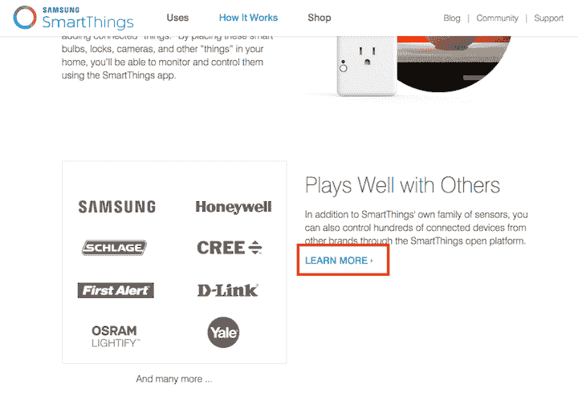
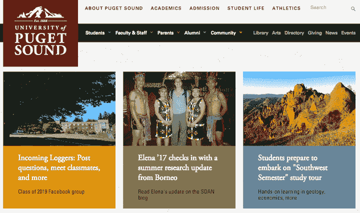
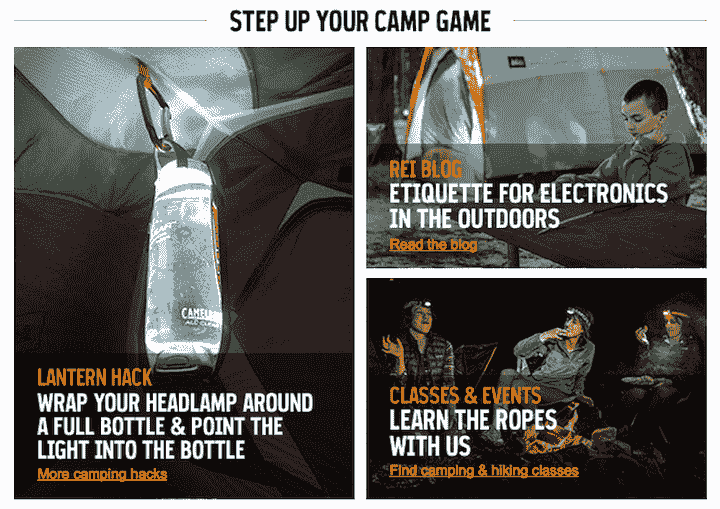
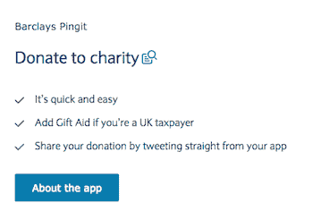
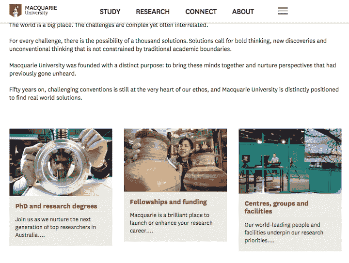

# “了解更多”链接:你可以做得更好

> 原文：<https://www.nngroup.com/articles/learn-more-links/?utm_source=wanqu.co&utm_campaign=Wanqu+Daily&utm_medium=website>

有些趋势比其他趋势更微妙。就像[低对比度文本](http://www.nngroup.com/articles/low-contrast/)，使用*了解更多*作为一个独立的链接标签已经悄然形成趋势。现在，网络上有大量带有这个通用标签的链接，大部分都是附加在第二或第三重要信息上的。(谷歌搜索发现这个词有 14 亿个实例，尽管有些不可否认可能来自于这个词在一般内容中的正确使用。)通常，这些链接放在简短介绍主题、功能或服务的一小段之后，以便*了解更多信息*将访问者引向详细页面。通常，这些链接不是页面上的主要行动号召，这部分解释了为什么这个文案细节没有像其他行动号召一样得到那么多的关注或 A/B 测试。

你们大多数人肯定见过这种模式。下面是我们讨论的一个例子:

*Smartthings.com: As a standalone label,* Learn More *lacks descriptive keywords to help users understand what to expect from the next page.*

*Learn More* 链接的激增很可能是移动驱动的:移动优化网站在[推迟次要内容](http://www.nngroup.com/articles/defer-secondary-content-for-mobile/)方面越来越好。也就是说，标题和短段落提供了一个易于浏览、易于理解的基本内容概述，而不是默认提供所有的细节。当用户决定需要更多信息时，他们可以点击一个链接或展开一个手风琴来获得不太重要的内容。这种设计模式在移动设备上肯定是有益的，我们的文章只是对链接标签的批评，而不是对推迟不太重要的内容的一般做法的批评。

我们首先来看看为什么这个短语在单独使用时会有问题，以及为什么有必要做更多的描述。然后，我们将探索如何找出应该说些什么，并给出做得好的网站的例子。你甚至有机会尝试自己重写标签。对于最后一部分，我们建议你手边准备一个写作用具，因为，是的，会有一个小测验。

## 为什么*了解更多*是个问题

让我们首先承认，如果链接前面的文字让接下来的事情变得显而易见，那么*了解更多*标签对用户体验来说并不是毁灭性的。记住，这篇文章是关于*如何做得更好*。描述性文字确实有助于阐明和设定期望。然而，即使在这种情况下，联系的范围也常常模糊不清。该链接是否指向该主题的完整页面？还是会导致用户不得不从十几个其他链接中进行选择的登陆页面？它指向外部站点还是应用商店？这些都是信息链接标签可以帮助回答的问题。

这个短语在单独使用时是最危险的，因为它含糊不清，而且信息贫乏。它**创造了不确定性，因为用户不知道点击后会发生什么**，也不知道等待新页面加载是否值得。这种不确定感会导致用户犹豫不决，并进入认知紧张状态。有些人可能会求助于[页面停车](http://www.nngroup.com/articles/multi-tab-page-parking/)来评估不清楚的链接。

如果一个网页有几个*了解更多*链接，用户可能**想知道这些链接是指向同一个页面还是不同的页面**。不确定性和认知压力再次对用户体验产生负面影响。更糟糕的是，当他们指向同一个页面时，用户可能会浪费点击，并失望地发现提供的是同一个页面。这增加了失望和困惑。

最后，作为一个独立的链接，缺乏描述性的关键词对于可访问性来说是一个严重的问题。视障人士和使用[屏幕阅读器](http://www.nngroup.com/articles/touchscreen-screen-readers/)或放大镜的人无法快速浏览前一段文字，以查看*了解更多*链接可能涉及的内容。大多数屏幕阅读器用户将会听到一个链接列表，没有视觉上下文来帮助他们理解不同的一般*学习* *更多*或*阅读* *更多*链接。

因此，如果你使用描述性标签而不是独立的*了解更多*文本，你的文案将在几个方面受益:

*   链接将更容易访问。
*   链接将对用户更有吸引力，也可能更有说服力。
*   当用户从一个页面点击到另一个页面时，他们会感到更加自信。
*   页面上更多的关键词将有助于搜索引擎优化。
*   [有意义的链接](http://www.nngroup.com/articles/link-promise/)将独立存在，帮助正在[扫描页面的用户](http://www.nngroup.com/articles/why-web-users-scan-instead-reading/)。

## 应该说什么:3 个解决方案

现在你已经开始重写那些链接标签了，让我们看看一些关于写什么的建议。下面是三种最常见的方法。

### 选项 1:使用描述链接目的地的关键字。

这是最常见的，通常也是最好的方法。要做到这一点，你必须看看目的地网页，看看它是什么。不要跳过这一步。当重写标签时，记得通过将最相关的关键词放在文本的开头来尝试[前置链接文本](http://www.nngroup.com/articles/first-2-words-a-signal-for-scanning/)。例如，不要“学习专业厨师如何烹饪南瓜”，而是尝试“像专业人士一样烹饪南瓜”前加载文本使得用户浏览页面和决定下一步做什么更快。

### 选项 2。保留*了解更多*格式，并添加描述性关键字。

有些时候，保留*了解更多*是可以接受的，如果你用要了解的信息来限定它(例如，*了解* *更多* *关于* *我们的* *服务*)。这种方法的缺点是较长标签的空间限制，以及可扫描性的降低，因为相关的关键字出现在短语的末尾而不是开头。尽管如此，一个长的链接确实会创建一个更大的目标，这比一个小的目标更容易被用户点击。在某些情况下，你可以尝试只链接描述性短语，例如:“了解更多:[链接如何是承诺](http://www.nngroup.com/articles/link-promise/)。”

### 选项 3:将前段标题转换为唯一链接。

如果前一段的标题看起来明显像一个链接，并且文本清楚地描述了链接指向的内容，那么*了解更多*链接可能是多余的。

## 有效替代方案的示例

在下面的每一个例子中，你可以看到对于设计师来说依靠*了解更多*或*阅读* *更多*是多么容易。相反，他们在副本上多花了一点功夫，这是值得的。用这些作为你自己网站的灵感。

*Pugetsound.edu: The three featured stories might otherwise all have had a* Read More *or* Learn More *link below them. Instead, descriptive links clarify what users will see if they click. For example,* Class of 2019 Facebook group*, and* Read Elena’s updates on the SOAN blog*.*

*Rei.com email: Users can scan the orange underlined links and know what to expect, even without reading the larger headings in white. Instead of* Learn More*, REI used descriptive and enticing labels:* More camping hacks, Read the blog*, and* Find camping & hiking classes*.*

*Barclays.co.uk: Users might not have expected to be able to donate to charity using an app. Or they might not know that* Barclays Pingit *is a mobile app to send and receive money. Either way, the* About the app *button helps teach users about the service.*

*Mq.edu.au: Using the 3rd approach from above, this page uses the headings as links instead of creating repetitive links to learn more about each topic.*

## 现在你试试

现在你已经看到了如何做得更好，而不仅仅是*了解更多*，是时候自己尝试一下了。(那个小测验我不是开玩笑的。毕竟，你知道，我们是做给 [UX 考试](http://www.nngroup.com/ux-certification)的生意的。抱歉，这个练习不算学分。)

下面是一些复制的例子和目标页面的描述。试着想出一个更好的链接标签。就像所有的写作一样，没有唯一的正确答案。(但我们在下面纳入了一些自己的建议；在你自己试过之前不要看。)

### 第 1 部分:首先，阅读下面的原文，猜猜*了解更多*链接可能会导致什么。

这一步应该有助于你站在用户的立场上，他们在点击之前并不知道每个页面是关于什么的。请注意，标题以粗体显示，并保留了原网站的大写形式。

### 第 2 部分:接下来，使用来自目标页面的信息，尝试重写链接标签。

|  | **原件** | **从目的地页面** | **你的选择** |
| **答** | **与他人相处融洽**除了 SmartThings 自己的传感器系列，您还可以通过 SmartThings 开放平台控制其他品牌的数百台联网设备。了解更多信息 | **一个开放的智能家居平台**…除了 SmartThings 自己的传感器系列，下面列出的产品是提供最佳客户体验的官方认证设备的示例。 |  |
| **B.** | 建造。连接。成长。**为我们的客户、社会和世界做出贡献**了解更多信息 | **职业生涯**工作，文化，道路，加入 |  |
| **C.** | **活动和工作室-场地租用**交易所一楼的活动和工作室是一个专门建造的广播和活动场所，位于市中心。位于帕特诺斯特广场的理想位置使该空间成为发布公告、会议或简单娱乐的首选场所。阅读更多 | LSEG 学院是我们集团自己的专门培训中心，服务于英国、意大利和国际客户。 |  |
| **D.** | **开启你的想象力**将日常照明变成非凡体验的可能性是无限的。有数百个应用可供选择，唯一真正的限制是你的想象力。了解更多信息 | **您的个人** **无线照明系统**提升你的日常生活。飞利浦 Hue 欢迎您回家。叫醒你。让你充满活力。让你有安全感。改善心情。增强您的娱乐体验。它甚至可以让你了解天气或来电。一旦你开始探索，可能性是无穷无尽的。 |  |

## 结论

如果你发现自己依赖*了解更多*或*阅读更多*作为独立的链接标签，请记住，它们会给用户带来不确定性，不利于访问。使用本文中的例子和方法来添加描述性的关键字，使你的链接标签对用户更具信息性和吸引力。

**改进标签的建议**

备选标签建议由竖线(|)分隔。

1.  浏览连接的设备|查看您还可以连接哪些设备
2.  职业|波士顿咨询公司的职业|加入我们的团队
3.  LSEG 学院场地租用|联系 LSEG 学院
4.  在家里，哪种色调最能发挥色彩的作用

你提出了一个更好的建议吗？我们很想听听。发微博给我们 [@nngroup.com](https://twitter.com/NNgroup) 。

