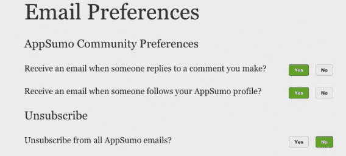

# 转换优化中默认的力量

> 原文：<http://conversionxl.com/defaults/?utm_source=wanqu.co&utm_campaign=Wanqu+Daily&utm_medium=website>

违约是强大的，往往具有欺骗性。即使你没有花太多心思，你也在引导你的用户以某种方式行动。那么，这就取决于你了，你要确保你在推动他们采取对你的公司和他们自己都是最好的行动。

 ## 什么是违约？

当一个特性有两个或多个选项时，默认选项是由公司或制造商自动分配的选项。

它们可以提高认知的便利性，并且可以将用户推向一个令人满意的方向(或者有时是令人不满意的方向)。通常，它们只是软件上的[预定设置，并且“通常旨在使设备(或控制)可用”开箱即用。“违约发生在多个领域，并对多个领域产生影响，包括但不限于软件。](https://en.wikipedia.org/wiki/Default_(computer_science))

[

<noscript></noscript>](https://cxl.com/wp-content/uploads/2015/12/Screen-Shot-2015-12-26-at-5.38.48-PM.png) 

Default settings for AppSumo emails

以器官捐献为例。

许多国家都实行“选择加入”政策，希望成为器官捐献者的人必须明确表示同意。然而，就所需的器官移植数量而言，器官捐献者严重短缺，惯性使得选择加入政策更加困难。因此，一些国家在“选择退出”政策下运作，也称为推定同意。

有用吗？研究[一致发现](http://www.medicalnewstoday.com/articles/282905.php)使用选择退出器官捐献系统的国家捐献的肾脏总数更高。正如理查德·塞勒和卡斯·桑斯坦在【T2 微移】中报道的，“在德国，使用选择加入系统，只有 12%的公民表示同意，而在奥地利，几乎所有人(99%)都同意。”

还有一种越来越流行的方法[使用强制选择](https://jama.jamanetwork.com/article.aspx?articleid=386916)来选择是否成为器官捐献者。在这种情况下，当有人申请驾照时，他们需要选择是否成为器官捐献者。这似乎也增加了捐赠人的数量(特别是结合社会影响，但稍后会有更多的讨论)。

为什么会这样呢？[默认强大](https://en.wikipedia.org/wiki/Default_effect_(psychology))。它们是微妙的因素，在很大程度上影响决策。有两个密切相关的因素在起作用:

*   惯性的力量
*   现状偏差

## 惯性的力量

惯性的力量是一种奇特的说法，表示人类在做决定时非常懒惰。他们喜欢走阻力最小的路。

理查德·塞勒和卡斯·桑斯坦在《微移》中写到了这一点。正如他们所说，“永远不要低估惯性的力量。”他们举了一个关于手机的好例子:

> “例如，当你得到一部新手机时，你有一系列的选择要做。手机越精致，你面临的选择就越多，从背景到铃声，再到电话被转到语音信箱前的响铃次数。制造商已经为这些选项中的每一个选择选择了一个选项作为默认选项。研究表明，无论默认选择是什么，许多人都会坚持使用，即使这比选择手机铃声的风险要高得多。

一个比较著名的学术例子是 401(k)计划。[一项研究发现](https://www.ssc.wisc.edu/~scholz/Teaching_742/Madrian_Shea.pdf)，在自动登记的情况下，401(k)的参与率明显更高。他们还发现，随着时间的推移，大多数自动登记员工会保持其默认的缴费率和资金分配。

研究人员是这样表述的:

> 这种“默认”行为似乎是由于参与者的惰性和雇员将默认行为视为投资建议的结果。这些发现对 401(k)储蓄计划的设计以及包括个人控制的个人账户在内的任何类型的社会保障改革都有意义。它们还更普遍地揭示了经济和非经济(行为)因素在决定个人储蓄行为中的重要性。”

## 现状偏差

[现状偏差](https://en.wikipedia.org/wiki/Status_quo_bias)是指当一个人以当前状态为基线，并认为任何改变都是损失。

举一个现实生活中的例子，考虑两个州提供一种新型的汽车保险，这种保险更贵，并且包括起诉权。另一种选择费用较低，且无权起诉。在新泽西州，更便宜的选择是默认的，所以大多数人坚持使用它。在宾夕法尼亚州，较贵的选项是默认选项，所以有微弱多数选择了较便宜的选项。

现状偏见与其他认知偏见相互作用，如损失厌恶、禀赋效应、单纯暴露和后悔回避。你可以阅读大量关于这个主题的文献，但是你要知道它会持续影响决策过程。这是泰勒和桑斯坦在《微移》中举的一个很好的例子:

> “现状偏见很容易被利用。
> 
> 许多年前，美国运通给桑斯坦写了一封令人愉快的信，告诉他可以免费订阅他选择的五种杂志，为期三个月。免费订阅似乎很划算，即使这些杂志很少有人阅读，所以桑斯坦很高兴地做出了选择。
> 
> 他没有意识到的是，除非他采取行动取消订阅，否则他将继续收到杂志，并按正常价格付费。大约十年来，他继续订阅他几乎从不阅读的杂志。"

这导致了一个启发，泰勒和桑斯坦称之为“是啊，无论如何”的启发…

### 是啊，不管是什么启发

下面是泰勒和桑斯坦如何描述“是的，无论如何”启发式:

> “现状偏见的原因之一是缺乏关注。
> 
> 许多人采用我们称之为“是啊，不管怎样”的启发式方法。一个很好的例子是看电视的遗留效应。电视网的管理人员花了很多时间在时间安排上，因为他们知道在 NBC 开始晚间节目的观众往往会一直呆在那里。由于遥控器在这个国家已经普及了几十年，在这种情况下，实际的“切换”成本实际上是一个拇指按压。
> 
> 但是，当一个节目结束，下一个节目开始时，惊人多的观众(含蓄地)说，“是啊，不管怎样”，并继续观看。Sunstein 也不是杂志订阅自动更新的唯一受害者。
> 
> 负责发行的人知道，当续订是自动的，当人们不得不打电话取消时，续订的可能性要比人们不得不表明他们实际上想继续接收杂志的可能性高得多。"

[

<noscript></noscript>](https://cxl.com/wp-content/uploads/2015/12/tv.jpg) 

Producers induce a ‘carryover’ effect to keep people watching the same channel ([source](https://www.flickr.com/photos/brucifer/3580277912/in/photolist-6snRTw-6XG9W-7ZBaGg-7hGHJz-6kVjHc-2TBUL2-aug2ai-4HDgUQ-7h36zm-6zqBWk-6kB6CM-5XaGuU-dq8HJ5-2TGjoN-7R7k1T-bGws24-8EvQw9-ayh64-8nBw3A-bmwnTz-3i2iUK-6zv4kA-6zqYne-f4ywiq-ebmNDt-5qwv5H-6zv4rU-aByCpT-fvF5G8-fnDUBY-egbh3Q-bwP6cA-q8W4D5-8mNrnK-7gYVhB-bDc77k-fAAQEo-af9Uku-6JFdj-4VNGht-9iY5h3-7nxzah-fVXTUN-oyVEch-4V79LF-4qjzsx-fTDUE8-6jUKkY-2iHNxY-dchJbE))

我自己生活中的一个例子:

我前阵子注册了 Amazon Prime，当时还是大学生，而且是免费的。为什么不接受这个提议？今天，除非我真的感到不耐烦，否则我倾向于不关心两天免费送货，我很少使用其他功能，如亚马逊 Prime Video。然而我仍然注册了，支付我的年费(顺便说一下，这比月费更容易忘记)。每次我觉得应该取消的时候，我都会说，“好吧，随便。”

所有这些潜在的力量使得默认选项变得强大。如果选择者什么都不做，或者很少努力，我们可以预期绝大多数人最终会选择默认选项，不管它对他们有没有好处。我们也可以利用社会影响力来支持这些违约…

### 社会影响如何影响违约

虽然你不需要[社会证据](https://cxl.com/is-social-proof-really-that-important/)来推动某人做出决定，但在某些默认情况下这是隐含的。以伊利诺伊州的器官捐献为例。除了在驾照申请中使用强制选择，他们还说有多少人已经是器官捐献者了。泰勒和桑斯坦在微推:

“其次，社会规范以一种建立在社会影响力基础上的方式直接发挥作用:‘伊利诺伊州 87%的成年人认为注册成为器官捐献者是正确的事情’，‘伊利诺伊州 60%的成年人已经注册了。’

回想一下，人们喜欢做大多数人认为正确的事情；回想一下，人们喜欢做大多数人实际做的事情。国家正在利用现有的准则来指导拯救生命的选择——而且这样做并没有强迫任何人。"

当设计师突出某个选项时，比如说定价计划，这通常意味着这个选项是最好的和最受欢迎的选项。

## 转换优化的注意事项

默认设置对生活的各个领域都有影响，它们肯定可以用来引导用户选择想要的选项。考虑安装软件的简单例子。有许多设置选项，但大多数都带有默认设置，以方便您获得最具吸引力的最佳用户体验。

违约会影响消费者的决定，不管你有没有花太多心思。Thaler 和 Sunstein 将违约描述为两个阵营，有时是重叠的:

> “两种不同的动机显而易见:助人为乐和自私自利。如果大多数用户在自定义安装时会遇到问题，那么将常规安装作为默认类别会很有帮助。在自助类别中，将默认设置为愿意接收有关新产品信息的电子邮件。根据我们的经验，大多数软件都提供了关于安装类型的有用默认设置，但也有许多软件提供了关于其他选择的自助默认设置。”

成功的营销者和优化者利用违约的力量来增加收入和客户满意度。[麦肯锡](http://www.mckinsey.com/insights/marketing_sales/a_marketers_guide_to_behavioral_economics)说得好:

> “当决策者过于冷漠、困惑或矛盾而无法考虑他们的选择时，违约最有效。在这个选择越来越多的世界里，这个原则尤其重要——违约消除了做出决定的必要。然而，默认也必须是大多数人的好选择。试图误导客户最终会因滋生不信任而适得其反。”

不管怎样，违约有很多不同的方式，有道德的也有不道德的。我们来看一些常见的例子。

### 定价页面默认值

定价页面是测试默认值的常见地方。这里有一个定价页面的例子，它不提供任何默认值，只列出所有的计划:

虽然许多页面会简单地在平等的基础上显示他们所有的定价计划，但有些页面会强调他们想要推动人们的一个特定计划。这里有一个来自 Adobe Creative Cloud 的例子，他们在这里(和其他页面上)推广他们的所有应用程序计划，用较暗的阴影和“最受欢迎”标签来强调它:

不仅仅是 SaaS 的定价页面可以使用默认值。亚马逊默认对他们的一些产品进行一次性购买，但允许你通过每月订阅来省钱:

### 产品的默认功能

一个最突出和可优化的默认例子是在产品特性中。购买 Macbook 时，苹果会默认基本功能:

与之密切相关的是默认软件设置，包括你可能不会注意到的软件的“开箱即用”功能。如果你不得不单独手动设置每个功能，那么使用 Adobe Photoshop 之类的软件会很麻烦。默认设置旨在立即提供更好的用户体验，并提供定制选项。

默认设置也为“黑暗模式”提供了机会这里有一个来自 The Verge 的关于苹果 iPhone 的例子。似乎苹果的广告跟踪默认设置不仅有点隐藏，而且它的标签也有点混乱(限制广告跟踪是关闭的，意味着广告跟踪是打开的。可能更清楚):

虽然他们后来改变了他们的网站，瑞安航空的网站曾经有一个默认的黑暗模式。当你向他们预订航班时，他们会提供飞行保险，但会隐藏拒绝保险的选项。

你不仅要在一个名为“保险-居住国”的列表中查找，而且免费选项“不要给我保险”根本没有被区分出来以便于访问。他们把它按字母顺序排在丹麦和芬兰之间。

### 默认订阅

我们已经在上面谈到了杂志订阅的例子；营销人员可以通过提供免费试用来吸引持续付费订阅的用户，但需要在付费订阅开始前“选择退出”。

但是你也可以在订阅频率方面提供更多的道德默认值。这里有一个慈善机构的例子，[乐施会](https://www.oxfam.org.uk/donate/)，默认为每月捐款:

我见过许多 SaaS 产品默认使用年度价格，还有稍微贵一点的按月价格。

### 电子邮件营销选择加入

Thaler 和 Sunstein 在 Nudge 中提到，在软件设置方面，公司经常使用默认设置来推动人们获得更好的用户体验，但在营销方面，他们倾向于使用更多的自助默认设置。

你会发现，在网上订购产品时，需要退出营销传播是很常见的。这不一定是一种黑暗的模式，特别是如果它非常明显而不是隐藏，但有时公司会使用狡猾的语言让人们注册他们的名单。这里有一个例子:

### 优化技巧

最后一个例子，我认为是一个操纵的例子，如果你在过去一两年里喝了一杯咖啡，你就会遇到。

你走到收银台，拿出你的卡付款，然后在 iPad POS 系统上刷卡。然后，您会看到一个提示屏幕，其中有三个选项:$1、$2 和$3。下面是“不给小费”的选项。当然，默认的选择是你给他们小费，因为[锚定效应](https://psychcentral.com/blog/archives/2013/07/27/the-anchoring-effect-how-it-impacts-your-everyday-life/)，我们经常被吸引到中间的选择。所以我们在一杯 3 美元的咖啡上付了 2 美元小费。

Nir Eyal [在](http://www.nirandfar.com/2015/02/tipping.html)之前就已经写了这方面的文章，而[来自软件咨询的研究支持默认](http://www.softwareadvice.com/resources/ipad-pos-tips-report-2015/)在小费方面的力量。他们发现数字销售终端，比如你咖啡店里的那种，增加了顾客留下小费的频率和数量。

## 通过强制选择来避免违约

如果你出于某种原因想要增加用户的认知负荷，你可以要求他们做出选择。实际上，这是当您未选中所有复选框时，需要选中其中一个复选框才能继续。泰勒和桑斯坦是这样说的:

> “我们相信，许多喜欢自由的人所支持的必要选择有时是最好的选择。但是请考虑这种方法的两点。首先，人们通常会认为必需选择是一件麻烦事或者更糟，并且更喜欢有一个好的默认。在软件示例中，了解推荐的设置确实很有帮助。大多数用户不想为了决定选择哪个奥术设置而阅读一本难以理解的手册。当选择变得复杂而困难时，人们可能会非常欣赏明智的违约。很难说他们应该被迫做出选择。”

当考虑强制选择时，想想这个决定有多难。通常，要求选择更适合简单的是或否决策。"你想收到我们的每周时事通讯吗？"是一个很好的用例，这样可以确保你的列表中充满了愿意参与的人。

另一方面，要求用户选择软件产品的每一个小功能是不可行的。泰勒和桑斯坦举了一个在餐馆点餐的例子:

> “在餐馆，默认选项是按照厨师通常准备的菜，可以选择要求添加或删除某些成分。在极端情况下，要求选择意味着就餐者必须给厨师她点的每一道菜的食谱！当选择非常复杂时，强制选择可能不是一个好主意；这甚至可能不可行。”

## 结论

违约是泰勒和桑斯坦称之为“选择架构”的广泛实践中一个看似微妙的元素。

在[转换优化](https://cxl.com/institute/certificate/cxl-conversion-optimization/)中，我们当然是在选择架构师的领域下运作，希望引导用户获得更好的体验，从而增加网站的底线。

有无数种方法可以让你执行默认选择，但是有一点要记住，无论你做什么，用户都会被推向一个特定的方向。甚至你下单的顺序也有微妙的影响，所以最好掌握你网站的选择架构，最大化你的公司和消费者的利益(通常是一样的，但不总是)。

避免误导和黑暗模式，但是引导用户选择最适合他们的方式。