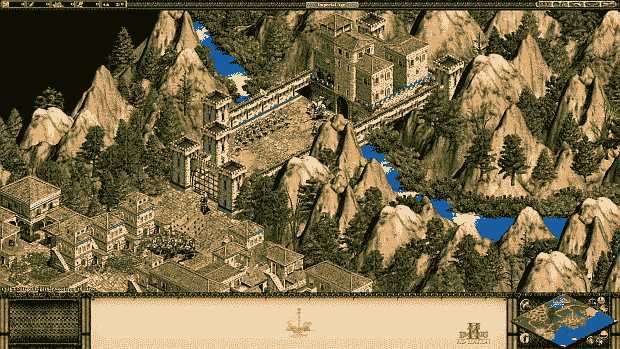
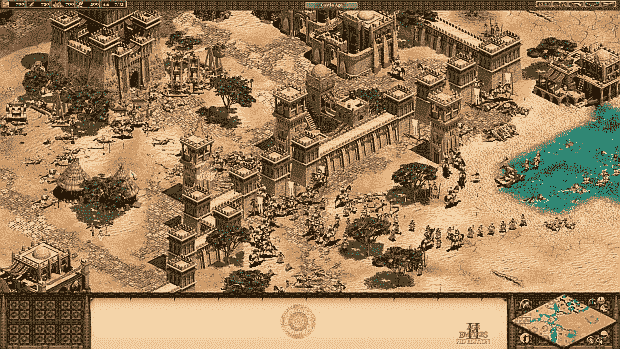
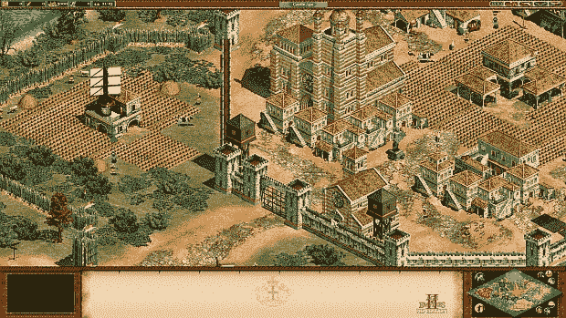
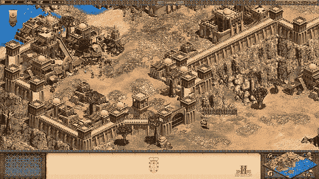
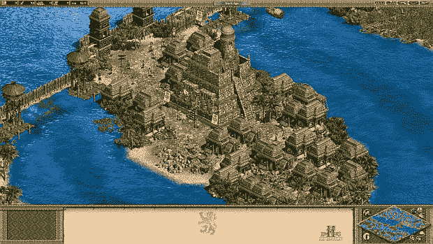
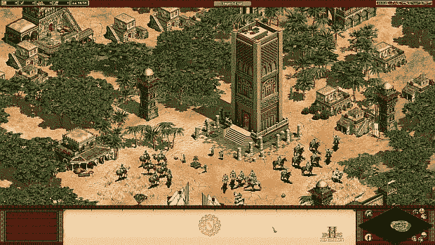
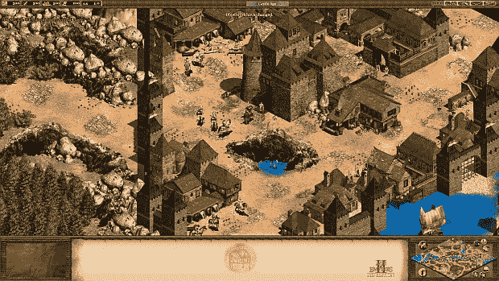

# 为什么帝国时代 2 仍在增长

> 原文：<https://www.rockpapershotgun.com/2015/12/28/age-of-empires-2-forgotten-empires/?utm_source=wanqu.co&utm_campaign=Wanqu+Daily&utm_medium=website>

很少有游戏能经受住时间的考验，并在发行 16 年后仍拥有大量活跃玩家。但是《帝国时代 II》不仅持续了下来，而且还繁荣了起来。它获得了新的动力，部分归功于官方的高清重新发布，但主要归功于一群由修改者变成开发者的乌合之众，他们使发布成为可能。被遗忘的帝国用新的东西填充了游戏，并在一个巨大的 mod 和两个 HD 资料片中重新平衡了多人游戏:[被遗忘的](https://www.rockpapershotgun.com/tag/age-of-empires-ii-hd-the-forgotten/)和最近发布的[非洲王国](https://www.rockpapershotgun.com/tag/age-of-empires-ii-hd-the-african-kingdoms/)。我与这个团队交谈，了解从 mod 团队过渡到专业开发工作室的挑战，以及继续在其古老的限制内扩展游戏的挑战。

在首席设计师 Bert Beeckman 和其他人最终想出如何给游戏添加新的文明之后，该团队在 2011 年通过 AoE2 社区走到了一起。几个专注的改装者逐渐演变成许多，被遗忘的帝国就像任何其他改装项目一样成形——一个松散的集体，随着人们获得和失去兴趣或时间而流畅地增长和收缩，通过其主要开发者的纯粹意志力量，最终成为一个有点连贯的东西。这件特别的事情比大多数实现的项目更有野心；它增加了五个新的文明，伴随着战役和独特的单位、建筑、地图和声音。这基本上是一个非官方的扩张。

比克曼告诉我，是偶然的时机让他们加入了微软。“当我们听说高清版将在 Steam 上发布时，我们才刚刚完成《被遗忘的帝国》mod 的制作，”他说。“我们想，好吧，如果你只是想振兴游戏，为什么不更进一步，加入新的文明和功能，新的战役和所有我们加入[国防部]的新东西。”

[T2】](https://www.rockpapershotgun.cimg/15/dec/ageofempires01.jpg)

他们联系了微软。等待着。“他们每个月都会收到成百上千的邮件，这些邮件来自那些想和特许经营权合作的人，”比克曼说。“比如，哦，我想卖帝国时代的杯子，或者我想卖上面有投石机的毛巾。我能做到吗？”某个可怜的笨蛋在这些信息中搜寻着他最好的老式萝拉·卡芙特印象(“不”)。但是这一次情况不同了。《被遗忘的帝国》大受欢迎。比克曼预计最多可能有 50，000 次终身下载。一小时内就有这么多(而且他们的网站在流量负荷下崩溃了)。今天，这个数字大约是 100 万次下载。

微软注意到了这一点，并开始与修改者谈判。他们同意发布一个更新的，更完善的版本作为官方资料片。因此，《被遗忘的帝国》mod 诞生了《被遗忘的帝国》公司，该公司于 2013 年 11 月发布了《被遗忘的资料片》——在高清重制版推出 7 个月后，第一款游戏推出 14 年后，上一个资料片推出 13 年后。

《被遗忘者》发行几个月后，他们请求微软批准为当时的《神话新时代》扩展版做一个扩展。答案最初是否定的，但被遗忘的帝国一直在问。“最后他们说，‘你觉得为《帝国时代》再做一部资料片怎么样？’”比克曼回忆道。“然后我们回来了，‘为什么我们不两者都做呢？’显然，微软的一个人也同意这一点。”(他们的神话扩张时代快要结束了。)

[T2】](https://www.rockpapershotgun.cimg/15/dec/ageofempires02.jpg)

对于许多修改者来说，这是一个艰难的职业发展过渡，这不仅仅是因为微软喜欢严格的截止日期。首席艺术家 Jorgito Ageitos 说:“当你在修改时，你可以做一些令人敬畏的疯狂的事情，而不需要关心它们是否适合原始游戏。”“你可以把龙放在那里，人们会喜欢它，因为它是一个模型。但是当你成为一名正式的开发者时，很多事情都会改变。你有很多以前没有面对的新限制，一切都需要有意义，并与游戏中的其他东西很好地融合。并达到一定的质量水平。”

改装纯粹是一种创造性的追求。您可以表达自己，进行实验，享受乐趣，而不用担心某件事与游戏的其余部分是否吻合，甚至不担心它有多好。正如阿吉托斯开玩笑说的那样，你可以做出一只挥舞着射香蕉猎枪的金牛。不管是在精神上还是在游戏的基调上。“我过去总是一个人工作，所以我过去做的每件事对我来说都是‘好’的，”阿吉托斯说。"它只符合我自己的口味。"

但是一个官方的资料片需要看起来，玩起来，听起来都像是原版游戏的延伸。你必须迎合粉丝们想要的，或者至少他们会接受的。你的品味变得次要于最初的设计原则和艺术风格。

[T2】](https://www.rockpapershotgun.cimg/15/dec/ageofempires03.jpg)

比克曼说，另一个艰难的调整是在法律权利方面。由于大部分工作已经完成，他们不得不与几十个贡献者中的每一个追溯性地协商条款，以获得使用他们那部分工作的权利。一些人很难对他们的时间和才能给出一个数字，而另一些人要求“绝对不合理的数字”,与他们的一小部分工作不成比例。有些人只是走开，不愿意把他们的爱好变成工作。

对比克曼个人来说，这没什么变化。他已经在任天堂法兰克福公司的游戏行业工作过(该公司从事发行和本地化，而不是开发)，所以他很熟悉事情是如何运作的。他现在是被遗忘帝国的全职员工，其他“关键”团队成员也是如此。他以竞选设计师为例，说明那些还不需要全职工作的人，因为没有足够的工作给他们。尽管如此，他还是忙于协调一个大约 50 人的团队，外加大约 25 名测试人员和本地化人员——由于工作室没有中央办公室，他们分散在世界各地的几个不同时区。

好消息是，他团队中的每个人都是《帝国时代》的忠实粉丝。他们知道这个游戏。他们正在进行多人游戏。激励他们去创造辉煌。修复它最明显和最不为人知的缺陷。就像水上战争。“如果你看到 16 年前出版的《王者时代》,水战本质上是，好吧，我做一艘船，把它放在我的码头旁边，”比克曼说。“如果有人想攻击我，我会反击他。就是这样。”在《征服者》资料片中，合奏工作室增加了海战的阵型，但只提供了一个值得建造的海军单位。“人们会建造巨大的舰队，除此之外别无其他，”比克曼继续说道。“当然，这对策略游戏来说并不太好——仅仅使用一个单位对任何创造性的游戏都是有害的。”

[T2】](https://www.rockpapershotgun.cimg/15/dec/ageofempires04.jpg)

对非洲王国来说，被遗忘的帝国增加了新的水资源单位，并设计成没有一种单位类型在所有情况下都是优越的。哪支舰队获胜取决于一个复杂的反制系统，该系统迫使玩家组合船只，并在地图上操纵它们以获得优势。

这一特殊的变化似乎很受社区欢迎，因为增加了[“特殊”多人地图](http://www.forgottenempires.net/age-of-empires-ii-hd-dev-blog-7-marco-polo-new-maps)，这些地图使用不寻常的地理位置来打破可预测的圆形(ish)团队布局——比如每个玩家一个岛屿或两个岛屿，每个岛屿有三对一的比赛。但是任何对现状的改变都有分裂玩家基础的危险。对设计或艺术的任何改变——无论多小——都可能，正如 Ageitos 所说的那样，“引起巨大的骚乱，干草叉、火和人们的尖叫。”人们会对某些策略和打法产生依赖，这通常是因为那些策略很强。在引擎盖下调整一些数字，你可能会让一些人最喜欢的策略变得不可行，这将激怒他们——特别是如果所说的策略需要多年才能发现，并且需要多年才能掌握(显然最主要的预遗忘策略只是在四五年前才被发现)。

“在这一点上，特别是对于非洲王国，我们决定忽略这一点，”比克曼说。“如果我们能坚持这样的设计原则，每种策略都需要有一个可行的反策略，那么我们就有权利改变这种情况。”每一个设计决策都是在与专业玩家保持和平、修复旧缺陷以及提高游戏的战略深度和平衡之间小心翼翼的平衡行为。

[T2】](https://www.rockpapershotgun.cimg/15/dec/ageofempires05.jpg)

尽管随着 2013 年高清重拍，新的、更年轻的玩家涌入，但他们的重点是为专业玩家平衡。“从竞技场景到休闲场景，游戏风格有很大的不同，”比克曼说。“休闲玩家通常喜欢一路建起来，慢慢的，从黑暗时代一路下来到帝国时代，然后开始战斗。竞技选手一有空就打。他们有时甚至利用村民试图把彼此围起来。”

对于专家游戏来说，平衡至关重要，因为否则一些策略将很快成为主导，但比克曼说“如果你玩的水平较低，平衡总是可以通过玩得更好来打破。如果你在游戏后期有一个超级压制的单位或者非常强大的单位，比如战象，那么你只需要确保对手没有战象就可以了。”

其他的教训只有通过犯错误才能得到。“每个人都记得扮演威廉华莱士和听到一个家伙试图模仿苏格兰口音，”比克曼说。“太搞笑了。在某种程度上，这让《帝国时代 2》变得如此有趣。这是错误的，但这是好的错误。”《被遗忘者》没有配音，这(加上一个更像 RPG 的任务结构)让它的活动显得格格不入。所以配音在非洲王国成了头等大事。其他领域的波兰语也是如此。资料片增加了新的环境，所以他们想出了新的环境声音来更强烈地区分这些声音。他们努力区分建筑和盔甲的外观。

[T2】](https://www.rockpapershotgun.cimg/15/dec/ageofempires06.jpg)

阿格伊托斯努力让事情看起来尽可能地接近真实——因为“历史太棒了。”在研究非洲王国时，他观察了数以千计的图像，以了解它们是如何以及为什么看起来是那样的。然后只要有可能，他就在游戏中重新制作。然而，这并不总是可能的，因为即使是高清版本本质上也是一个 16 年前的游戏，考虑到当时的技术限制。原始图像和美化后的高清版本都保持得很好，但它们仍然是 90 年代末尖端 2D 的遗物。

或者正如 Ageitos 所说，“这种新的‘历史精确的有趣的艺术’需要与这个游戏创造的艺术世界的其余部分相适应，这就是噩梦开始的时候。举例来说，每栋新建筑都必须有一定的大小、比例、关键形状和位置，即使它看起来非常棒，你也不能随心所欲地改变。”新的艺术必须适合现有的艺术，Ageitos 指出，这比一开始就创造所述艺术要难得多。他最终通过测量每个原始 AoE2 建筑的不同部分来完成一些非洲王国艺术，然后基本上凿出符合这些尺寸的立方体(这个过程在本开发博客中有更详细的描述)。

很难说吱吱作响的旧 AoE2 引擎还能被推动、拉动和添加到多远的地方，比克曼不确定他们是否会被要求进行第三次扩展——或者他们是否会有足够的新功能想法和合适的文明来证明一次扩展。但即使是这样——不再有新的内容，只是修补漏洞和平衡问题的补丁——比克曼相信帝国时代 II 会持续更久。

[T2】](https://www.rockpapershotgun.cimg/15/dec/ageofempires08.jpg)

“我认为现在这一代玩游戏的人会玩到厌倦为止，”他说。"伴随着《帝国时代》长大的人会一直玩《帝国时代》. "他们已经玩了 16 年了，为什么现在停下来？

至于它是如何坚持这么久的，比克曼指出了两个原因。一个是它年代久远——那个时代的大多数游戏都有难看的 3D 图形，但是 AoE2 有渲染到 2D 精灵的高多边形 3D 艺术。另一个是这个设计鼓励玩家创造他们自己的故事，改写历史，或者只是从成千上万的选项和程序生成的地图中获得乐趣。无论什么原因，帝国时代 II 是一个谜——一个关于历史战争的 16 岁游戏，拒绝在视频游戏历史的编年史中占据其应有的位置。遗忘帝国团队是它的老年伴侣。