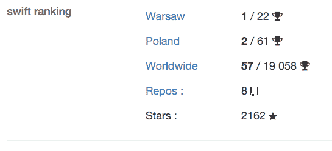

# 如何成为出色的 Swift 开发人员

> 原文：<http://blog.krzyzanowskim.com/2015/12/28/how-to-be-awesome-swift-developer/?utm_source=wanqu.co&utm_campaign=Wanqu+Daily&utm_medium=website>

我不知道，但我收到了足够多的电子邮件，来自各种各样的人问我如何成为“令人敬畏的 Swift 开发人员”来写这篇文章。

> 我想成为一名 iOS 开发者，如果你能给我建议实现这一目标的正确途径，那将是一件令人惊奇的事情。

假设这篇博文算是我的回答——我可能从来没有回答过这些——不是因为我忘记了...我延期了...

> 我想成为一名出色的 iOS 开发者，但我无法独自完成，因为每个人都需要导师。沃伦巴菲特有一位导师，我只想知道你有没有可能成为我的导师，让我的梦想成真。

我受宠若惊，尽管我的观点可能与你略有不同。我不认为自己是“了不起的 Swift 开发者”。我想我会在每一个涉及白板编程的面试过程中失败。这就是为什么我从来没有申请过我知道这是一件事的职位。换句话说，我只是个瘸子，会被讨厌的人讨厌。

以下是我发现作为开发人员最重要的事情:

### 拥抱遗产

做:

1.  实验**很多**
2.  不要害怕以非最优的方式做事——错总比没有好
3.  打开你的心扉，尝试新事物(如果这是迅速的，尝试迅速)
4.  阅读其他开发者的博客
5.  边做边学
6.  检查里面有什么，以便更好地理解它

### 不要做一个混球

不要:

1.  我的代码比你的好

*   这根本不是真的。幻想你的代码更好，只是因为你知道它真的很差，没有生产力。人是不同的-如果你觉得有必要，最好试着理解和修复一些部分。

1.  不要对已经完成的工作(你的工作或其他)抱怨太多

*   效率最低的态度是仅仅因为“我会做得更好”而抱怨结果或过程

1.  看在上帝的份上，不要因为你知道如何使用工具，就告诉别人你正在使用的工具是世界上最好的

*   工具不重要。相信我。你更喜欢 Xcode 还是 AppCode 都没关系，你更喜欢 Objective-C 还是 Swift 都没关系，一点都没关系。尽你所能，尽你所能。

1.  编程语言不重要。

*   如果你知道不止一种编程语言，你可能会意识到它们都是一样的。一年来没见过什么特别的不同。

1.  避免“我更了解”的态度

*   因为这是粗鲁的，如果你想和团队合作，这是不值得的。专注于改进事情，而不是批评别人的工作。

1.  不要做一个混球

# 说到 Swift

Swift 是一种相对较新的语言，非常容易学习。有时候我觉得关于 Swift 的东西都已经写完了，没什么好补充的。对我来说，Swift 只是一个在晚上做一些很酷的事情的工具。当然，你应该读一下关于 Swift 的 Apple book 我认为这足以让你开始做任何其他编程语言都可以做的事情。

我的观点有点不同，因为我知道的编程语言很少，随着时间的推移，我知道编程只是试图包含循环和存储值——尽管这是事情的简化...赞成...我有这种感觉。

请帮我一个忙，不要从 Swift 中的另一个 JSON 解析器开始。

# 我的工作是我的激情

我热爱我所做的事情，我希望我能尽可能长久地做下去。我也祝福你。我也认为我作为开发人员的工作是一种艺术工作——创造的行为让我兴奋。

尽管如此，为娱乐而编程是深夜奢侈品。我正努力做好我的自由职业者工作，并有两个可爱的从不睡觉的孩子。

PS。这是一年的结束，所以是的...变得有点忧郁了。

其间在野外: [Github 奖项](http://github-awards.com/users/search?login=krzyzanowskim)
